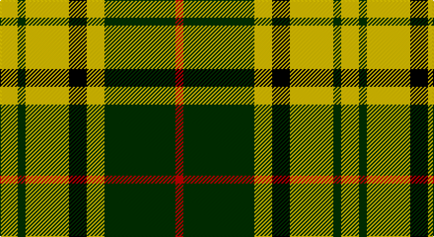

This page is one **sett** — a single exact thread-count. It belongs to the [tartan](/setts/ly9dg4ly22k9ly9dg36r4/)
(the same proportion at any scale), whose colour order is pattern [RGYKYGY](/stripes/rgykygy/).

Part of the [Harmer](/tartans/harmer/) tartan — the named design grouping this sett with its other cloths.

Sourced from weddslist.  It is a [7 stripe tartan](/stripes/stripes7/).

Original link http://www.weddslist.com/cgi-bin/tartans/pg.pl?source=sts

## Thread count
Y/18 DG8 Y44 K18 Y18 DG72 R/8

One full sett is **346 threads**.

## Palette

Palette: <strong>Ingles Buchan</strong> <small style="color:#888">(1 of 4 colours)</small>
<table><thead><tr><th>Colour</th><th>Threads</th><th>Shade</th><th>Base</th><th>OKLCh</th></tr></thead><tbody><tr><td>Y/</td><td style="text-align:right;font-variant-numeric:tabular-nums">18</td><td><code style="background-color:#F0C000;">#F0C000</code> <small style="color:#888">#F0C000</small></td><td>Y <code style="background-color:#F2BF00;">#F2BF00</code></td><td><small style="color:#888">oklch(82.7% 0.169 90.5)</small></td></tr><tr><td>DG</td><td style="text-align:right;font-variant-numeric:tabular-nums">8</td><td><code style="background-color:#003000;">#003000</code> <small style="color:#888">#003000</small></td><td>G <code style="background-color:#006100;">#006100</code></td><td><small style="color:#888">oklch(26.8% 0.091 142.5)</small></td></tr><tr><td>Y</td><td style="text-align:right;font-variant-numeric:tabular-nums">44</td><td><code style="background-color:#F0C000;">#F0C000</code> <small style="color:#888">#F0C000</small></td><td>Y <code style="background-color:#F2BF00;">#F2BF00</code></td><td><small style="color:#888">oklch(82.7% 0.169 90.5)</small></td></tr><tr><td>K</td><td style="text-align:right;font-variant-numeric:tabular-nums">18</td><td><code style="background-color:#000000;">#000000</code> <small style="color:#888">#000000</small></td><td>K <code style="background-color:#000000;">#000000</code></td><td><small style="color:#888">oklch(0.0% 0.000 0.0)</small></td></tr><tr><td>Y</td><td style="text-align:right;font-variant-numeric:tabular-nums">18</td><td><code style="background-color:#F0C000;">#F0C000</code> <small style="color:#888">#F0C000</small></td><td>Y <code style="background-color:#F2BF00;">#F2BF00</code></td><td><small style="color:#888">oklch(82.7% 0.169 90.5)</small></td></tr><tr><td>DG</td><td style="text-align:right;font-variant-numeric:tabular-nums">72</td><td><code style="background-color:#003000;">#003000</code> <small style="color:#888">#003000</small></td><td>G <code style="background-color:#006100;">#006100</code></td><td><small style="color:#888">oklch(26.8% 0.091 142.5)</small></td></tr><tr><td>R/</td><td style="text-align:right;font-variant-numeric:tabular-nums">8</td><td><code style="background-color:#C00000;">#C00000</code> <small style="color:#888">#C00000</small></td><td>R <code style="background-color:#CC0000;">#CC0000</code></td><td><small style="color:#888">oklch(50.7% 0.208 29.2)</small></td></tr></tbody></table>

# Sample pattern

## Compared to the master

This cloth is one sett of its design; the master sett (the exemplar the design is anchored on) is below for comparison.

<figure style="margin:0"><figcaption style="color:#888;font-size:smaller">this sett</figcaption></figure>
<figure style="margin:0"><figcaption style="color:#888;font-size:smaller"><a href="/setts/dg36lo8k9lo24dg4lo12dg4lo24k9lo8dg36r4/">master sett →</a></figcaption></figure>

## Nearest tartans

The nearest existing variants by ΔTartan distance, with this tartan at the top so the swatches line up against it.

ΔTartan

Tartan

Sett

—

<a href="/ttd/edit/#slug=ly9dg4ly22k9ly9dg36r4~x2">Harmer</a> <a class="nn-out" href="/variants/s7/ly9dg4ly22k9ly9dg36r4~x2/" title="open its dictionary page">↗</a>

1.29

<a href="/ttd/edit/#slug=lo12dg4lo24k9lo8dg36r4&amp;base=ly9dg4ly22k9ly9dg36r4~x2">Harmer (Corporate)</a> <a class="nn-out" href="/variants/s7/lo12dg4lo24k9lo8dg36r4/" title="open its dictionary page">↗</a>

1.34

<a href="/ttd/edit/#slug=k4r5k2ly21g8k2~x2&amp;base=ly9dg4ly22k9ly9dg36r4~x2">MacDuck (Corporate)</a> <a class="nn-out" href="/variants/s6/k4r5k2ly21g8k2~x2/" title="open its dictionary page">↗</a>

1.40

<a href="/ttd/edit/#slug=do4g25lo10g3lo18r4~x2&amp;base=ly9dg4ly22k9ly9dg36r4~x2">Unidentfied (Ligioner Highland Games</a> <a class="nn-out" href="/variants/s6/do4g25lo10g3lo18r4~x2/" title="open its dictionary page">↗</a>

1.44

<a href="/ttd/edit/#slug=k6ly1k6ly9r1ly2~x2&amp;base=ly9dg4ly22k9ly9dg36r4~x2">MacLeod #3</a> <a class="nn-out" href="/variants/s6/k6ly1k6ly9r1ly2~x2/" title="open its dictionary page">↗</a>

1.46

<a href="/ttd/edit/#slug=k4ly32k16r3k16ly4~x2&amp;base=ly9dg4ly22k9ly9dg36r4~x2">Unnamed C21st - Fashion</a> <a class="nn-out" href="/variants/s6/k4ly32k16r3k16ly4~x2/" title="open its dictionary page">↗</a>

1.48

<a href="/ttd/edit/#slug=k4r5k2lo21g8k2~x2&amp;base=ly9dg4ly22k9ly9dg36r4~x2">MacDuck #2</a> <a class="nn-out" href="/variants/s6/k4r5k2lo21g8k2~x2/" title="open its dictionary page">↗</a>

1.49

<a href="/ttd/edit/#slug=w2k11ly11t3k1r1~x2&amp;base=ly9dg4ly22k9ly9dg36r4~x2">Cornish National Small Set Tartan</a> <a class="nn-out" href="/variants/s6/w2k11ly11t3k1r1~x2/" title="open its dictionary page">↗</a>

1.50

<a href="/ttd/edit/#slug=lo9k32g6lb20lo3lb9k5~x2&amp;base=ly9dg4ly22k9ly9dg36r4~x2">Black &amp; White Golf (Corporate)</a> <a class="nn-out" href="/variants/s7/lo9k32g6lb20lo3lb9k5~x2/" title="open its dictionary page">↗</a>

1.56

<a href="/ttd/edit/#slug=g6lr2g10k3r1k3lo10lr2lo6~x4&amp;base=ly9dg4ly22k9ly9dg36r4~x2">Eire (District?)</a> <a class="nn-out" href="/variants/s9/g6lr2g10k3r1k3lo10lr2lo6~x4/" title="open its dictionary page">↗</a>

1.57

<a href="/ttd/edit/#slug=w2k11ly11db3k1r1~x2&amp;base=ly9dg4ly22k9ly9dg36r4~x2">Cornish National #2</a> <a class="nn-out" href="/variants/s6/w2k11ly11db3k1r1~x2/" title="open its dictionary page">↗</a>

## Neighbour map

Every grey dot is one of 14360 variants placed by the first two principal components of the ΔTartan feature space (44% of its variance). Red is this tartan; blue dots are its nearest — click one to open its page.

<svg viewBox="0 0 640 380" role="img" style="max-width:100%;height:auto;border:1px solid #e0e0e0;border-radius:4px;display:block" xmlns="http://www.w3.org/2000/svg"><image href="/nn/cloud.v1.png" width="640" height="380"/><a href="/variants/s7/lo12dg4lo24k9lo8dg36r4/"><circle cx="238.1" cy="208.2" r="4" fill="#3465a4"><title>Harmer (Corporate)</title></circle></a><a href="/variants/s6/k4r5k2ly21g8k2~x2/"><circle cx="226.9" cy="172.7" r="4" fill="#3465a4"><title>MacDuck (Corporate)</title></circle></a><a href="/variants/s6/do4g25lo10g3lo18r4~x2/"><circle cx="221.4" cy="206.0" r="4" fill="#3465a4"><title>Unidentfied (Ligioner Highland Games</title></circle></a><a href="/variants/s6/k6ly1k6ly9r1ly2~x2/"><circle cx="255.3" cy="217.7" r="4" fill="#3465a4"><title>MacLeod #3</title></circle></a><a href="/variants/s6/k4ly32k16r3k16ly4~x2/"><circle cx="266.6" cy="199.1" r="4" fill="#3465a4"><title>Unnamed C21st - Fashion</title></circle></a><a href="/variants/s6/k4r5k2lo21g8k2~x2/"><circle cx="246.2" cy="182.2" r="4" fill="#3465a4"><title>MacDuck #2</title></circle></a><a href="/variants/s6/w2k11ly11t3k1r1~x2/"><circle cx="172.9" cy="158.9" r="4" fill="#3465a4"><title>Cornish National Small Set Tartan</title></circle></a><a href="/variants/s7/lo9k32g6lb20lo3lb9k5~x2/"><circle cx="189.5" cy="180.7" r="4" fill="#3465a4"><title>Black &amp; White Golf (Corporate)</title></circle></a><a href="/variants/s9/g6lr2g10k3r1k3lo10lr2lo6~x4/"><circle cx="135.1" cy="176.6" r="4" fill="#3465a4"><title>Eire (District?)</title></circle></a><a href="/variants/s6/w2k11ly11db3k1r1~x2/"><circle cx="173.7" cy="159.8" r="4" fill="#3465a4"><title>Cornish National #2</title></circle></a><circle cx="195.6" cy="188.3" r="5" fill="#c00000"/></svg>

ID: /variants/s7/ly9dg4ly22k9ly9dg36r4~x2/
