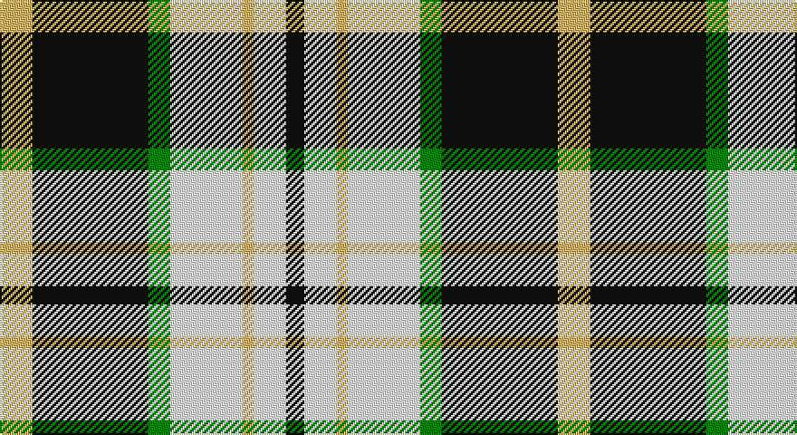

This page is one **sett** — a single exact thread-count. It belongs to the [tartan](/setts/ly9k32g6w20ly3w9k5/)
(the same proportion at any scale), whose colour order is pattern [KWYWGKY](/stripes/kwywgky/).

Sourced from register-of-tartans.  It is a [7 stripe tartan](/stripes/stripes7/).

Original link https://www.tartanregister.gov.uk/tartanDetails.aspx?ref=10782

## Register references

External register numbers recorded for this tartan.

- Scottish Register of Tartans: [10782](https://www.tartanregister.gov.uk/tartanDetails.aspx?ref=10782)

## Thread count
LG/18 K64 G12 W40 LG6 W18 K/10

One full sett is **308 threads**.

## Palette

Palette: <strong>Tartan Register</strong> <small style="color:#888">(3 of 4 colours)</small>
<table><thead><tr><th>Colour</th><th>Threads</th><th>Shade</th><th>Base</th><th>OKLCh</th></tr></thead><tbody><tr><td>LG/</td><td style="text-align:right;font-variant-numeric:tabular-nums">18</td><td><code style="background-color:#D9B666;">#D9B666</code> <small style="color:#888">#D9B666</small></td><td>Y <code style="background-color:#F2BF00;">#F2BF00</code></td><td><small style="color:#888">oklch(79.0% 0.107 86.3)</small></td></tr><tr><td>K</td><td style="text-align:right;font-variant-numeric:tabular-nums">64</td><td><code style="background-color:#101010;">#101010</code> <small style="color:#888">#101010</small></td><td>K <code style="background-color:#000000;">#000000</code></td><td><small style="color:#888">oklch(17.3% 0.000 89.9)</small></td></tr><tr><td>G</td><td style="text-align:right;font-variant-numeric:tabular-nums">12</td><td><code style="background-color:#008B00;">#008B00</code> <small style="color:#888">#008B00</small></td><td>G <code style="background-color:#006100;">#006100</code></td><td><small style="color:#888">oklch(55.2% 0.188 142.5)</small></td></tr><tr><td>W</td><td style="text-align:right;font-variant-numeric:tabular-nums">40</td><td><code style="background-color:#FFFFFF;">#FFFFFF</code> <small style="color:#888">#FFFFFF</small></td><td>W <code style="background-color:#F7F7F7;">#F7F7F7</code></td><td><small style="color:#888">oklch(100.0% 0.000 89.9)</small></td></tr><tr><td>LG</td><td style="text-align:right;font-variant-numeric:tabular-nums">6</td><td><code style="background-color:#D9B666;">#D9B666</code> <small style="color:#888">#D9B666</small></td><td>Y <code style="background-color:#F2BF00;">#F2BF00</code></td><td><small style="color:#888">oklch(79.0% 0.107 86.3)</small></td></tr><tr><td>W</td><td style="text-align:right;font-variant-numeric:tabular-nums">18</td><td><code style="background-color:#FFFFFF;">#FFFFFF</code> <small style="color:#888">#FFFFFF</small></td><td>W <code style="background-color:#F7F7F7;">#F7F7F7</code></td><td><small style="color:#888">oklch(100.0% 0.000 89.9)</small></td></tr><tr><td>K/</td><td style="text-align:right;font-variant-numeric:tabular-nums">10</td><td><code style="background-color:#101010;">#101010</code> <small style="color:#888">#101010</small></td><td>K <code style="background-color:#000000;">#000000</code></td><td><small style="color:#888">oklch(17.3% 0.000 89.9)</small></td></tr></tbody></table>

# Sample pattern

## Nearest tartans

The nearest existing variants by ΔTartan distance, with this tartan at the top so the swatches line up against it.

ΔTartan

Tartan

Sett

—

<a href="/ttd/edit/#slug=ly9k32g6w20ly3w9k5~x2">Black and White Golf</a> <a class="nn-out" href="/variants/s7/ly9k32g6w20ly3w9k5~x2/" title="open its dictionary page">↗</a>

0.76

<a href="/ttd/edit/#slug=lo9k32g6lb20lo3lb9k5~x2&amp;base=ly9k32g6w20ly3w9k5~x2">Black &amp; White Golf (Corporate)</a> <a class="nn-out" href="/variants/s7/lo9k32g6lb20lo3lb9k5~x2/" title="open its dictionary page">↗</a>

0.76

<a href="/ttd/edit/#slug=ly6k6y30k8lb18k6ly3~x2&amp;base=ly9k32g6w20ly3w9k5~x2">Cape Breton (yellow stripes)</a> <a class="nn-out" href="/variants/s7/ly6k6y30k8lb18k6ly3~x2/" title="open its dictionary page">↗</a>

0.83

<a href="/ttd/edit/#slug=r4ly30k6w13k13w3~x2&amp;base=ly9k32g6w20ly3w9k5~x2">Thomson, Camel (Fashion)</a> <a class="nn-out" href="/variants/s6/r4ly30k6w13k13w3~x2/" title="open its dictionary page">↗</a>

0.84

<a href="/ttd/edit/#slug=r2lo20k5w10k10w2~x2&amp;base=ly9k32g6w20ly3w9k5~x2">Thompson Camel Clan Tartan</a> <a class="nn-out" href="/variants/s6/r2lo20k5w10k10w2~x2/" title="open its dictionary page">↗</a>

0.84

<a href="/ttd/edit/#slug=db8ly1dg5ly12r1dg2~x6&amp;base=ly9k32g6w20ly3w9k5~x2">McCabe (2016)</a> <a class="nn-out" href="/variants/s6/db8ly1dg5ly12r1dg2~x6/" title="open its dictionary page">↗</a>

0.89

<a href="/ttd/edit/#slug=r4lo30k6w13k13w3~x2&amp;base=ly9k32g6w20ly3w9k5~x2">Thomson Camel</a> <a class="nn-out" href="/variants/s6/r4lo30k6w13k13w3~x2/" title="open its dictionary page">↗</a>

0.92

<a href="/ttd/edit/#slug=k4ly2k13ly1w8o13ly2o4~x2&amp;base=ly9k32g6w20ly3w9k5~x2">Bannockbane Grey #1</a> <a class="nn-out" href="/variants/s8/k4ly2k13ly1w8o13ly2o4~x2/" title="open its dictionary page">↗</a>

1.04

<a href="/ttd/edit/#slug=r2o20k5w10k10r2~x2&amp;base=ly9k32g6w20ly3w9k5~x2">Thompson Grey Family Tartan</a> <a class="nn-out" href="/variants/s6/r2o20k5w10k10r2~x2/" title="open its dictionary page">↗</a>

1.08

<a href="/ttd/edit/#slug=k4ly2k13ly1w8lo13ly2lo4~x2&amp;base=ly9k32g6w20ly3w9k5~x2">Bannockbane Light Tan</a> <a class="nn-out" href="/variants/s8/k4ly2k13ly1w8lo13ly2lo4~x2/" title="open its dictionary page">↗</a>

1.12

<a href="/ttd/edit/#slug=w4k2w18k11db2y18ly2~x2&amp;base=ly9k32g6w20ly3w9k5~x2">Barbour - Ancient</a> <a class="nn-out" href="/variants/s7/w4k2w18k11db2y18ly2~x2/" title="open its dictionary page">↗</a>

## Neighbour map

Every grey dot is one of 14360 variants placed by the first two principal components of the ΔTartan feature space (44% of its variance). Red is this tartan; blue dots are its nearest — click one to open its page.

<svg viewBox="0 0 640 380" role="img" style="max-width:100%;height:auto;border:1px solid #e0e0e0;border-radius:4px;display:block" xmlns="http://www.w3.org/2000/svg"><image href="/nn/cloud.v1.png" width="640" height="380"/><a href="/variants/s7/lo9k32g6lb20lo3lb9k5~x2/"><circle cx="189.5" cy="180.7" r="4" fill="#3465a4"><title>Black &amp; White Golf (Corporate)</title></circle></a><a href="/variants/s7/ly6k6y30k8lb18k6ly3~x2/"><circle cx="147.5" cy="180.5" r="4" fill="#3465a4"><title>Cape Breton (yellow stripes)</title></circle></a><a href="/variants/s6/r4ly30k6w13k13w3~x2/"><circle cx="185.0" cy="184.4" r="4" fill="#3465a4"><title>Thomson, Camel (Fashion)</title></circle></a><a href="/variants/s6/r2lo20k5w10k10w2~x2/"><circle cx="175.6" cy="191.0" r="4" fill="#3465a4"><title>Thompson Camel Clan Tartan</title></circle></a><a href="/variants/s6/db8ly1dg5ly12r1dg2~x6/"><circle cx="187.4" cy="175.9" r="4" fill="#3465a4"><title>McCabe (2016)</title></circle></a><a href="/variants/s6/r4lo30k6w13k13w3~x2/"><circle cx="189.7" cy="187.9" r="4" fill="#3465a4"><title>Thomson Camel</title></circle></a><a href="/variants/s8/k4ly2k13ly1w8o13ly2o4~x2/"><circle cx="151.5" cy="167.9" r="4" fill="#3465a4"><title>Bannockbane Grey #1</title></circle></a><a href="/variants/s6/r2o20k5w10k10r2~x2/"><circle cx="173.9" cy="193.4" r="4" fill="#3465a4"><title>Thompson Grey Family Tartan</title></circle></a><a href="/variants/s8/k4ly2k13ly1w8lo13ly2lo4~x2/"><circle cx="156.6" cy="169.1" r="4" fill="#3465a4"><title>Bannockbane Light Tan</title></circle></a><a href="/variants/s7/w4k2w18k11db2y18ly2~x2/"><circle cx="129.6" cy="159.4" r="4" fill="#3465a4"><title>Barbour - Ancient</title></circle></a><circle cx="177.1" cy="174.5" r="5" fill="#c00000"/></svg>

ID: /variants/s7/ly9k32g6w20ly3w9k5~x2/
