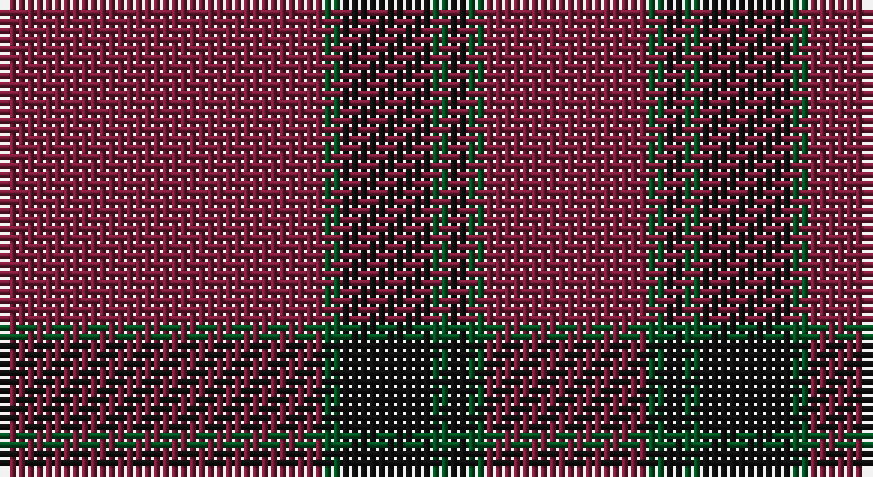

This page is one **sett** — a single exact thread-count. It belongs to the [tartan](/setts/m18dg1k5dg1k1dg1m9/)
(the same proportion at any scale), whose colour order is pattern [RGKGKGR](/stripes/rgkgkgr/).

Sourced from register-of-tartans.  It is a [7 stripe tartan](/stripes/stripes7/).

Original link https://www.tartanregister.gov.uk/tartanDetails.aspx?ref=1842

## Register references

External register numbers recorded for this tartan.

- Scottish Register of Tartans: [1842](https://www.tartanregister.gov.uk/tartanDetails.aspx?ref=1842)
- Scottish Tartans World Register: 1470

## Thread count
DR/36 G2 K10 G2 K2 G2 DR/18

One full sett is **90 threads**.

## Palette

Palette: <strong>Tartan Register</strong>
<table><thead><tr><th>Colour</th><th>Threads</th><th>Shade</th><th>Base</th><th>OKLCh</th></tr></thead><tbody><tr><td>DR/</td><td style="text-align:right;font-variant-numeric:tabular-nums">36</td><td><code style="background-color:#781C38;">#781C38</code> <small style="color:#888">#781C38</small></td><td>R <code style="background-color:#CC0000;">#CC0000</code></td><td><small style="color:#888">oklch(38.7% 0.127 7.4)</small></td></tr><tr><td>G</td><td style="text-align:right;font-variant-numeric:tabular-nums">2</td><td><code style="background-color:#005020;">#005020</code> <small style="color:#888">#005020</small></td><td>G <code style="background-color:#006100;">#006100</code></td><td><small style="color:#888">oklch(37.7% 0.105 149.6)</small></td></tr><tr><td>K</td><td style="text-align:right;font-variant-numeric:tabular-nums">10</td><td><code style="background-color:#101010;">#101010</code> <small style="color:#888">#101010</small></td><td>K <code style="background-color:#000000;">#000000</code></td><td><small style="color:#888">oklch(17.3% 0.000 89.9)</small></td></tr><tr><td>G</td><td style="text-align:right;font-variant-numeric:tabular-nums">2</td><td><code style="background-color:#005020;">#005020</code> <small style="color:#888">#005020</small></td><td>G <code style="background-color:#006100;">#006100</code></td><td><small style="color:#888">oklch(37.7% 0.105 149.6)</small></td></tr><tr><td>K</td><td style="text-align:right;font-variant-numeric:tabular-nums">2</td><td><code style="background-color:#101010;">#101010</code> <small style="color:#888">#101010</small></td><td>K <code style="background-color:#000000;">#000000</code></td><td><small style="color:#888">oklch(17.3% 0.000 89.9)</small></td></tr><tr><td>G</td><td style="text-align:right;font-variant-numeric:tabular-nums">2</td><td><code style="background-color:#005020;">#005020</code> <small style="color:#888">#005020</small></td><td>G <code style="background-color:#006100;">#006100</code></td><td><small style="color:#888">oklch(37.7% 0.105 149.6)</small></td></tr><tr><td>DR/</td><td style="text-align:right;font-variant-numeric:tabular-nums">18</td><td><code style="background-color:#781C38;">#781C38</code> <small style="color:#888">#781C38</small></td><td>R <code style="background-color:#CC0000;">#CC0000</code></td><td><small style="color:#888">oklch(38.7% 0.127 7.4)</small></td></tr></tbody></table>

# Sample pattern

## Nearest tartans

The nearest existing variants by ΔTartan distance, with this tartan at the top so the swatches line up against it.

ΔTartan

Tartan

Sett

—

<a href="/ttd/edit/#slug=m18dg1k5dg1k1dg1m9~x2">Inverness Augustus</a> <a class="nn-out" href="/variants/s7/m18dg1k5dg1k1dg1m9~x2/" title="open its dictionary page">↗</a>

1.76

<a href="/ttd/edit/#slug=r2k1ri6r1ri2g2ri24k6ri2~x2&amp;base=m18dg1k5dg1k1dg1m9~x2">Fitzgibbon Red (Name)</a> <a class="nn-out" href="/variants/s9/r2k1ri6r1ri2g2ri24k6ri2~x2/" title="open its dictionary page">↗</a>

1.80

<a href="/variants/s8/r100dg4r8dg18r3~x2/">KaDeWe</a>

1.91

<a href="/ttd/edit/#slug=m37dy9m3g9dy3~x2&amp;base=m18dg1k5dg1k1dg1m9~x2">Glen Shee Trade Tartan</a> <a class="nn-out" href="/variants/s5/m37dy9m3g9dy3~x2/" title="open its dictionary page">↗</a>

1.98

<a href="/variants/s8/r9y2r45y20lo3~x2/">Hunt (Personal)</a>

1.99

<a href="/ttd/edit/#slug=r37o9r3g9o3~x2&amp;base=m18dg1k5dg1k1dg1m9~x2">Glen Shee</a> <a class="nn-out" href="/variants/s5/r37o9r3g9o3~x2/" title="open its dictionary page">↗</a>

2.01

<a href="/ttd/edit/#slug=r9y2r45y20lo3~x2&amp;base=m18dg1k5dg1k1dg1m9~x2">Hunt (Personal)</a> <a class="nn-out" href="/variants/s5/r9y2r45y20lo3~x2/" title="open its dictionary page">↗</a>

2.05

<a href="/ttd/edit/#slug=o5k2o28k10o26k4o4~x2&amp;base=m18dg1k5dg1k1dg1m9~x2">Dunbar, John Telfer (Personal)</a> <a class="nn-out" href="/variants/s7/o5k2o28k10o26k4o4~x2/" title="open its dictionary page">↗</a>

2.11

<a href="/ttd/edit/#slug=n3k2n19r3k1n3r4n3k1n2k1n2~x4&amp;base=m18dg1k5dg1k1dg1m9~x2">Balmoral (Pendleton)</a> <a class="nn-out" href="/variants/s12/n3k2n19r3k1n3r4n3k1n2k1n2~x4/" title="open its dictionary page">↗</a>

2.12

<a href="/ttd/edit/#slug=r2dt1ri6r1ri2dg2ri24dt6ri2~x2&amp;base=m18dg1k5dg1k1dg1m9~x2">Fitzgibbon Red</a> <a class="nn-out" href="/variants/s9/r2dt1ri6r1ri2dg2ri24dt6ri2~x2/" title="open its dictionary page">↗</a>

2.15

<a href="/ttd/edit/#slug=r37do9r3g9do3~x2&amp;base=m18dg1k5dg1k1dg1m9~x2">Glen Shee #1 (Fashion)</a> <a class="nn-out" href="/variants/s5/r37do9r3g9do3~x2/" title="open its dictionary page">↗</a>

## Neighbour map

Every grey dot is one of 14360 variants placed by the first two principal components of the ΔTartan feature space (44% of its variance). Red is this tartan; blue dots are its nearest — click one to open its page.

<svg viewBox="0 0 640 380" role="img" style="max-width:100%;height:auto;border:1px solid #e0e0e0;border-radius:4px;display:block" xmlns="http://www.w3.org/2000/svg"><image href="/nn/cloud.v1.png" width="640" height="380"/><a href="/variants/s9/r2k1ri6r1ri2g2ri24k6ri2~x2/"><circle cx="563.3" cy="160.6" r="4" fill="#3465a4"><title>Fitzgibbon Red (Name)</title></circle></a><a href="/variants/s8/r100dg4r8dg18r3~x2/"><circle cx="626.0" cy="192.7" r="4" fill="#3465a4"><title>KaDeWe</title></circle></a><a href="/variants/s5/m37dy9m3g9dy3~x2/"><circle cx="494.1" cy="241.8" r="4" fill="#3465a4"><title>Glen Shee Trade Tartan</title></circle></a><a href="/variants/s8/r9y2r45y20lo3~x2/"><circle cx="499.3" cy="196.0" r="4" fill="#3465a4"><title>Hunt (Personal)</title></circle></a><a href="/variants/s5/r37o9r3g9o3~x2/"><circle cx="487.3" cy="240.2" r="4" fill="#3465a4"><title>Glen Shee</title></circle></a><a href="/variants/s5/r9y2r45y20lo3~x2/"><circle cx="515.3" cy="209.3" r="4" fill="#3465a4"><title>Hunt (Personal)</title></circle></a><a href="/variants/s7/o5k2o28k10o26k4o4~x2/"><circle cx="601.1" cy="251.2" r="4" fill="#3465a4"><title>Dunbar, John Telfer (Personal)</title></circle></a><a href="/variants/s12/n3k2n19r3k1n3r4n3k1n2k1n2~x4/"><circle cx="528.1" cy="176.0" r="4" fill="#3465a4"><title>Balmoral (Pendleton)</title></circle></a><a href="/variants/s9/r2dt1ri6r1ri2dg2ri24dt6ri2~x2/"><circle cx="600.7" cy="178.4" r="4" fill="#3465a4"><title>Fitzgibbon Red</title></circle></a><a href="/variants/s5/r37do9r3g9do3~x2/"><circle cx="514.3" cy="257.5" r="4" fill="#3465a4"><title>Glen Shee #1 (Fashion)</title></circle></a><circle cx="587.3" cy="221.7" r="5" fill="#c00000"/></svg>

ID: /variants/s7/m18dg1k5dg1k1dg1m9~x2/
