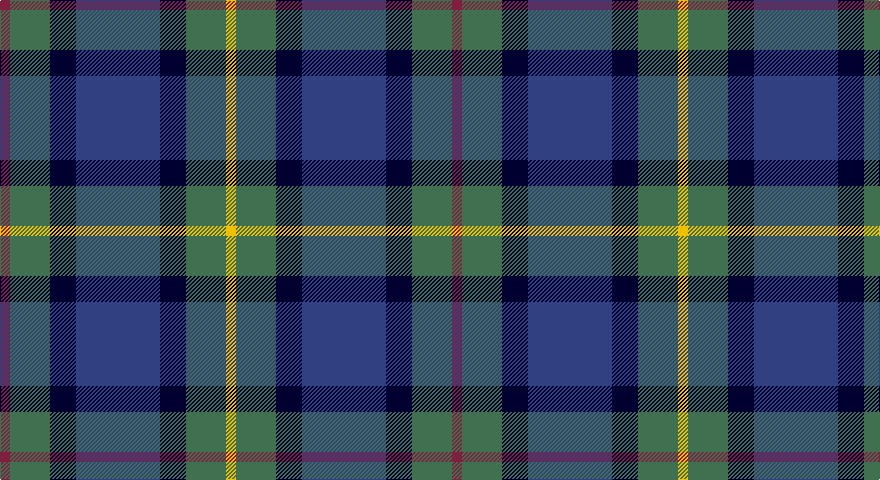

This page is one **sett** — a single exact thread-count. It belongs to the [tartan](/setts/m5g20k13db42k13g20ly5/)
(the same proportion at any scale), whose colour order is pattern [RGKBKGY](/stripes/rgkbkgy/).

Part of the [Newmill](/tartans/newmill/) tartan — the named design grouping this sett with its other cloths.

Sourced from weddslist.  It is a [7 stripe tartan](/stripes/stripes7/).

Original link http://www.weddslist.com/cgi-bin/tartans/pg.pl?source=sts

## Thread count
DR/10 G40 DB26 B84 DB26 G40 Y/10

One full sett is **452 threads**.

## Palette

Palette: <strong>custom</strong>
<table><thead><tr><th>Colour</th><th>Threads</th><th>Shade</th><th>Base</th><th>OKLCh</th></tr></thead><tbody><tr><td>DR/</td><td style="text-align:right;font-variant-numeric:tabular-nums">10</td><td><code style="background-color:#802040;">#802040</code> <small style="color:#888">#802040</small></td><td>R <code style="background-color:#CC0000;">#CC0000</code></td><td><small style="color:#888">oklch(40.8% 0.132 5.2)</small></td></tr><tr><td>G</td><td style="text-align:right;font-variant-numeric:tabular-nums">40</td><td><code style="background-color:#407050;">#407050</code> <small style="color:#888">#407050</small></td><td>G <code style="background-color:#006100;">#006100</code></td><td><small style="color:#888">oklch(50.1% 0.074 153.7)</small></td></tr><tr><td>DB</td><td style="text-align:right;font-variant-numeric:tabular-nums">26</td><td><code style="background-color:#000030;">#000030</code> <small style="color:#888">#000030</small></td><td>K <code style="background-color:#000000;">#000000</code></td><td><small style="color:#888">oklch(14.0% 0.097 264.1)</small></td></tr><tr><td>B</td><td style="text-align:right;font-variant-numeric:tabular-nums">84</td><td><code style="background-color:#304080;">#304080</code> <small style="color:#888">#304080</small></td><td>B <code style="background-color:#2A418A;">#2A418A</code></td><td><small style="color:#888">oklch(39.4% 0.109 270.2)</small></td></tr><tr><td>DB</td><td style="text-align:right;font-variant-numeric:tabular-nums">26</td><td><code style="background-color:#000030;">#000030</code> <small style="color:#888">#000030</small></td><td>K <code style="background-color:#000000;">#000000</code></td><td><small style="color:#888">oklch(14.0% 0.097 264.1)</small></td></tr><tr><td>G</td><td style="text-align:right;font-variant-numeric:tabular-nums">40</td><td><code style="background-color:#407050;">#407050</code> <small style="color:#888">#407050</small></td><td>G <code style="background-color:#006100;">#006100</code></td><td><small style="color:#888">oklch(50.1% 0.074 153.7)</small></td></tr><tr><td>Y/</td><td style="text-align:right;font-variant-numeric:tabular-nums">10</td><td><code style="background-color:#F0C000;">#F0C000</code> <small style="color:#888">#F0C000</small></td><td>Y <code style="background-color:#F2BF00;">#F2BF00</code></td><td><small style="color:#888">oklch(82.7% 0.169 90.5)</small></td></tr></tbody></table>

# Sample pattern

## Compared to the master

This cloth is one sett of its design; the master sett (the exemplar the design is anchored on) is below for comparison.

<figure style="margin:0"><figcaption style="color:#888;font-size:smaller">this sett</figcaption></figure>
<figure style="margin:0"><figcaption style="color:#888;font-size:smaller"><a href="/setts/r1o5dt3dti11dt3o5lo1/">master sett →</a></figcaption></figure>

## Nearest tartans

The nearest existing variants by ΔTartan distance, with this tartan at the top so the swatches line up against it.

ΔTartan

Tartan

Sett

—

<a href="/ttd/edit/#slug=m5g20k13db42k13g20ly5~x2">Newmill</a> <a class="nn-out" href="/variants/s7/m5g20k13db42k13g20ly5~x2/" title="open its dictionary page">↗</a>

0.71

<a href="/ttd/edit/#slug=db20k6o4db3k16g20w2~x2&amp;base=m5g20k13db42k13g20ly5~x2">Deloughery, Paul</a> <a class="nn-out" href="/variants/s7/db20k6o4db3k16g20w2~x2/" title="open its dictionary page">↗</a>

0.71

<a href="/ttd/edit/#slug=r4db24k12g14k4lb3~x2&amp;base=m5g20k13db42k13g20ly5~x2">MacPhail Hunting #2</a> <a class="nn-out" href="/variants/s6/r4db24k12g14k4lb3~x2/" title="open its dictionary page">↗</a>

0.77

<a href="/ttd/edit/#slug=t4g14ly2k14db14k2db3~x2&amp;base=m5g20k13db42k13g20ly5~x2">Hogarth of Firhill (Clan)</a> <a class="nn-out" href="/variants/s7/t4g14ly2k14db14k2db3~x2/" title="open its dictionary page">↗</a>

0.77

<a href="/ttd/edit/#slug=dg17ly2k14r2db9r2db10~x2&amp;base=m5g20k13db42k13g20ly5~x2">MacDonald (Flora.. )</a> <a class="nn-out" href="/variants/s7/dg17ly2k14r2db9r2db10~x2/" title="open its dictionary page">↗</a>

0.82

<a href="/ttd/edit/#slug=g16lb3g3k10db12r2db3~x2&amp;base=m5g20k13db42k13g20ly5~x2">MacLean, Donald (Personal)</a> <a class="nn-out" href="/variants/s7/g16lb3g3k10db12r2db3~x2/" title="open its dictionary page">↗</a>

0.83

<a href="/ttd/edit/#slug=k4db8k4db8r2g10k1w2~x2&amp;base=m5g20k13db42k13g20ly5~x2">MacKean Green (Personal)</a> <a class="nn-out" href="/variants/s8/k4db8k4db8r2g10k1w2~x2/" title="open its dictionary page">↗</a>

0.83

<a href="/ttd/edit/#slug=r5g19w3k19db19k3db2~x2&amp;base=m5g20k13db42k13g20ly5~x2">Fruin Colquhoun (Commemorative?)</a> <a class="nn-out" href="/variants/s7/r5g19w3k19db19k3db2~x2/" title="open its dictionary page">↗</a>

0.85

<a href="/ttd/edit/#slug=r2k1db8k8g8k1t2~x2&amp;base=m5g20k13db42k13g20ly5~x2">Argyll</a> <a class="nn-out" href="/variants/s7/r2k1db8k8g8k1t2~x2/" title="open its dictionary page">↗</a>

0.85

<a href="/ttd/edit/#slug=r2k1db8k8g8k1t2~x4&amp;base=m5g20k13db42k13g20ly5~x2">Campbell of Cawdor</a> <a class="nn-out" href="/variants/s7/r2k1db8k8g8k1t2~x4/" title="open its dictionary page">↗</a>

0.86

<a href="/ttd/edit/#slug=b2dg6ly1k6db6k1db1~x2&amp;base=m5g20k13db42k13g20ly5~x2">Hogarth of Firhill #2</a> <a class="nn-out" href="/variants/s7/b2dg6ly1k6db6k1db1~x2/" title="open its dictionary page">↗</a>

## Neighbour map

Every grey dot is one of 14360 variants placed by the first two principal components of the ΔTartan feature space (44% of its variance). Red is this tartan; blue dots are its nearest — click one to open its page.

<svg viewBox="0 0 640 380" role="img" style="max-width:100%;height:auto;border:1px solid #e0e0e0;border-radius:4px;display:block" xmlns="http://www.w3.org/2000/svg"><image href="/nn/cloud.v1.png" width="640" height="380"/><a href="/variants/s7/db20k6o4db3k16g20w2~x2/"><circle cx="167.3" cy="216.9" r="4" fill="#3465a4"><title>Deloughery, Paul</title></circle></a><a href="/variants/s6/r4db24k12g14k4lb3~x2/"><circle cx="172.4" cy="221.9" r="4" fill="#3465a4"><title>MacPhail Hunting #2</title></circle></a><a href="/variants/s7/t4g14ly2k14db14k2db3~x2/"><circle cx="134.9" cy="222.1" r="4" fill="#3465a4"><title>Hogarth of Firhill (Clan)</title></circle></a><a href="/variants/s7/dg17ly2k14r2db9r2db10~x2/"><circle cx="160.9" cy="221.6" r="4" fill="#3465a4"><title>MacDonald (Flora.. )</title></circle></a><a href="/variants/s7/g16lb3g3k10db12r2db3~x2/"><circle cx="164.3" cy="216.4" r="4" fill="#3465a4"><title>MacLean, Donald (Personal)</title></circle></a><a href="/variants/s8/k4db8k4db8r2g10k1w2~x2/"><circle cx="167.4" cy="208.6" r="4" fill="#3465a4"><title>MacKean Green (Personal)</title></circle></a><a href="/variants/s7/r5g19w3k19db19k3db2~x2/"><circle cx="148.1" cy="204.2" r="4" fill="#3465a4"><title>Fruin Colquhoun (Commemorative?)</title></circle></a><a href="/variants/s7/r2k1db8k8g8k1t2~x2/"><circle cx="151.0" cy="217.9" r="4" fill="#3465a4"><title>Argyll</title></circle></a><a href="/variants/s7/r2k1db8k8g8k1t2~x4/"><circle cx="151.0" cy="217.9" r="4" fill="#3465a4"><title>Campbell of Cawdor</title></circle></a><a href="/variants/s7/b2dg6ly1k6db6k1db1~x2/"><circle cx="120.1" cy="230.3" r="4" fill="#3465a4"><title>Hogarth of Firhill #2</title></circle></a><circle cx="163.1" cy="221.8" r="5" fill="#c00000"/></svg>

ID: /variants/s7/m5g20k13db42k13g20ly5~x2/
