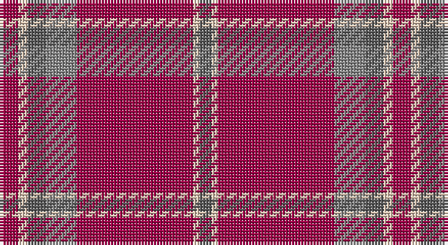

This page is one **sett** — a single exact thread-count. It belongs to the [tartan](/setts/m6lb3n6o10m38lb2n4/)
(the same proportion at any scale), whose colour order is pattern [BWRRBWR](/stripes/bwrrbwr/).

Part of the [Washington State University Cougar](/tartans/washington-state-university-cougar/) tartan — the named design grouping this sett with its other cloths.

Sourced from tartans-authority.  It is a [7 stripe tartan](/stripes/stripes7/).

Original link http://www.tartansauthority.com/tartan-ferret/display/10831/

## Register references

External register numbers recorded for this tartan.

- Scottish Register of Tartans: [10831](https://www.tartanregister.gov.uk/tartanDetails?ref=10831)
- Scottish Tartans Authority (ITI): 10831

## Thread count
R/6 LR3 N6 Na10 R38 LR2 N/4

One full sett is **128 threads**.

## Palette

Palette: <strong>Tartan Register</strong> <small style="color:#888">(3 of 4 colours)</small>
<table><thead><tr><th>Colour</th><th>Threads</th><th>Shade</th><th>Base</th><th>OKLCh</th></tr></thead><tbody><tr><td>R/</td><td style="text-align:right;font-variant-numeric:tabular-nums">6</td><td><code style="background-color:#A00048;">#A00048</code> <small style="color:#888">#A00048</small></td><td>R <code style="background-color:#CC0000;">#CC0000</code></td><td><small style="color:#888">oklch(45.4% 0.182 5.3)</small></td></tr><tr><td>LR</td><td style="text-align:right;font-variant-numeric:tabular-nums">3</td><td><code style="background-color:#E8CCB8;">#E8CCB8</code> <small style="color:#888">#E8CCB8</small></td><td>W <code style="background-color:#F7F7F7;">#F7F7F7</code></td><td><small style="color:#888">oklch(86.3% 0.042 57.7)</small></td></tr><tr><td>N</td><td style="text-align:right;font-variant-numeric:tabular-nums">6</td><td><code style="background-color:#5C5C5C;">#5C5C5C</code> <small style="color:#888">#5C5C5C</small></td><td>B <code style="background-color:#2A418A;">#2A418A</code></td><td><small style="color:#888">oklch(47.5% 0.000 89.9)</small></td></tr><tr><td>Na</td><td style="text-align:right;font-variant-numeric:tabular-nums">10</td><td><code style="background-color:#888888;">#888888</code> <small style="color:#888">#888888</small></td><td>R <code style="background-color:#CC0000;">#CC0000</code></td><td><small style="color:#888">oklch(62.7% 0.000 89.9)</small></td></tr><tr><td>R</td><td style="text-align:right;font-variant-numeric:tabular-nums">38</td><td><code style="background-color:#A00048;">#A00048</code> <small style="color:#888">#A00048</small></td><td>R <code style="background-color:#CC0000;">#CC0000</code></td><td><small style="color:#888">oklch(45.4% 0.182 5.3)</small></td></tr><tr><td>LR</td><td style="text-align:right;font-variant-numeric:tabular-nums">2</td><td><code style="background-color:#E8CCB8;">#E8CCB8</code> <small style="color:#888">#E8CCB8</small></td><td>W <code style="background-color:#F7F7F7;">#F7F7F7</code></td><td><small style="color:#888">oklch(86.3% 0.042 57.7)</small></td></tr><tr><td>N/</td><td style="text-align:right;font-variant-numeric:tabular-nums">4</td><td><code style="background-color:#5C5C5C;">#5C5C5C</code> <small style="color:#888">#5C5C5C</small></td><td>B <code style="background-color:#2A418A;">#2A418A</code></td><td><small style="color:#888">oklch(47.5% 0.000 89.9)</small></td></tr></tbody></table>

# Sample pattern

## Compared to the master

This cloth is one sett of its design; the master sett (the exemplar the design is anchored on) is below for comparison.

<figure style="margin:0"><figcaption style="color:#888;font-size:smaller">this sett</figcaption></figure>
<figure style="margin:0"><figcaption style="color:#888;font-size:smaller"><a href="/setts/r6w3n6lb10r38w2n4/">master sett →</a></figcaption></figure>

## Nearest tartans

The nearest existing variants by ΔTartan distance, with this tartan at the top so the swatches line up against it.

ΔTartan

Tartan

Sett

—

<a href="/ttd/edit/#slug=m6lb3n6o10m38lb2n4">Washington State University Cougar</a> <a class="nn-out" href="/variants/s7/m6lb3n6o10m38lb2n4/" title="open its dictionary page">↗</a>

1.57

<a href="/ttd/edit/#slug=r6w3n6lb10r38w2n4&amp;base=m6lb3n6o10m38lb2n4">Washington State University Cougar</a> <a class="nn-out" href="/variants/s7/r6w3n6lb10r38w2n4/" title="open its dictionary page">↗</a>

1.61

<a href="/ttd/edit/#slug=m5y20m5y3m4y5m36y1w4~x2&amp;base=m6lb3n6o10m38lb2n4">Baluchistan Fitzgerald Regimental Tartan</a> <a class="nn-out" href="/variants/s9/m5y20m5y3m4y5m36y1w4~x2/" title="open its dictionary page">↗</a>

1.62

<a href="/ttd/edit/#slug=m96g42m16g17k4lb6&amp;base=m6lb3n6o10m38lb2n4">MacGregor Hunting Glengyle Clan Tartan</a> <a class="nn-out" href="/variants/s6/m96g42m16g17k4lb6/" title="open its dictionary page">↗</a>

1.63

<a href="/ttd/edit/#slug=r4dg13r3dp4r3dp3r40dp3r2lo4~x2&amp;base=m6lb3n6o10m38lb2n4">Galway, County</a> <a class="nn-out" href="/variants/s10/r4dg13r3dp4r3dp3r40dp3r2lo4~x2/" title="open its dictionary page">↗</a>

1.68

<a href="/ttd/edit/#slug=lo4r37db17r4db8r6do2r5db2r3lo4&amp;base=m6lb3n6o10m38lb2n4">Griffiths (Welsh Name)</a> <a class="nn-out" href="/variants/s11/lo4r37db17r4db8r6do2r5db2r3lo4/" title="open its dictionary page">↗</a>

1.69

<a href="/ttd/edit/#slug=r3o10r3o4r20lb1~x4&amp;base=m6lb3n6o10m38lb2n4">Monica</a> <a class="nn-out" href="/variants/s6/r3o10r3o4r20lb1~x4/" title="open its dictionary page">↗</a>

1.72

<a href="/ttd/edit/#slug=o4y13o3db4o3db3o40db3o2lo4~x2&amp;base=m6lb3n6o10m38lb2n4">Galway Irish County Tartan</a> <a class="nn-out" href="/variants/s10/o4y13o3db4o3db3o40db3o2lo4~x2/" title="open its dictionary page">↗</a>

1.73

<a href="/ttd/edit/#slug=dg2r2db1r24t1db6r3dg12r4db1~x2&amp;base=m6lb3n6o10m38lb2n4">MacDonell of Keppoch</a> <a class="nn-out" href="/variants/s10/dg2r2db1r24t1db6r3dg12r4db1~x2/" title="open its dictionary page">↗</a>

1.74

<a href="/variants/s8/r9y2r45y20lo3~x2/">Hunt (Personal)</a>

1.75

<a href="/ttd/edit/#slug=r9y2r45y20lo3~x2&amp;base=m6lb3n6o10m38lb2n4">Hunt (Personal)</a> <a class="nn-out" href="/variants/s5/r9y2r45y20lo3~x2/" title="open its dictionary page">↗</a>

## Neighbour map

Every grey dot is one of 14360 variants placed by the first two principal components of the ΔTartan feature space (44% of its variance). Red is this tartan; blue dots are its nearest — click one to open its page.

<svg viewBox="0 0 640 380" role="img" style="max-width:100%;height:auto;border:1px solid #e0e0e0;border-radius:4px;display:block" xmlns="http://www.w3.org/2000/svg"><image href="/nn/cloud.v1.png" width="640" height="380"/><a href="/variants/s7/r6w3n6lb10r38w2n4/"><circle cx="411.7" cy="141.5" r="4" fill="#3465a4"><title>Washington State University Cougar</title></circle></a><a href="/variants/s9/m5y20m5y3m4y5m36y1w4~x2/"><circle cx="473.4" cy="151.2" r="4" fill="#3465a4"><title>Baluchistan Fitzgerald Regimental Tartan</title></circle></a><a href="/variants/s6/m96g42m16g17k4lb6/"><circle cx="428.6" cy="168.2" r="4" fill="#3465a4"><title>MacGregor Hunting Glengyle Clan Tartan</title></circle></a><a href="/variants/s10/r4dg13r3dp4r3dp3r40dp3r2lo4~x2/"><circle cx="473.2" cy="145.4" r="4" fill="#3465a4"><title>Galway, County</title></circle></a><a href="/variants/s11/lo4r37db17r4db8r6do2r5db2r3lo4/"><circle cx="388.6" cy="132.5" r="4" fill="#3465a4"><title>Griffiths (Welsh Name)</title></circle></a><a href="/variants/s6/r3o10r3o4r20lb1~x4/"><circle cx="460.8" cy="199.5" r="4" fill="#3465a4"><title>Monica</title></circle></a><a href="/variants/s10/o4y13o3db4o3db3o40db3o2lo4~x2/"><circle cx="461.7" cy="142.6" r="4" fill="#3465a4"><title>Galway Irish County Tartan</title></circle></a><a href="/variants/s10/dg2r2db1r24t1db6r3dg12r4db1~x2/"><circle cx="399.3" cy="130.7" r="4" fill="#3465a4"><title>MacDonell of Keppoch</title></circle></a><a href="/variants/s8/r9y2r45y20lo3~x2/"><circle cx="499.3" cy="196.0" r="4" fill="#3465a4"><title>Hunt (Personal)</title></circle></a><a href="/variants/s5/r9y2r45y20lo3~x2/"><circle cx="515.3" cy="209.3" r="4" fill="#3465a4"><title>Hunt (Personal)</title></circle></a><circle cx="442.5" cy="165.3" r="5" fill="#c00000"/></svg>

ID: /variants/s7/m6lb3n6o10m38lb2n4/
