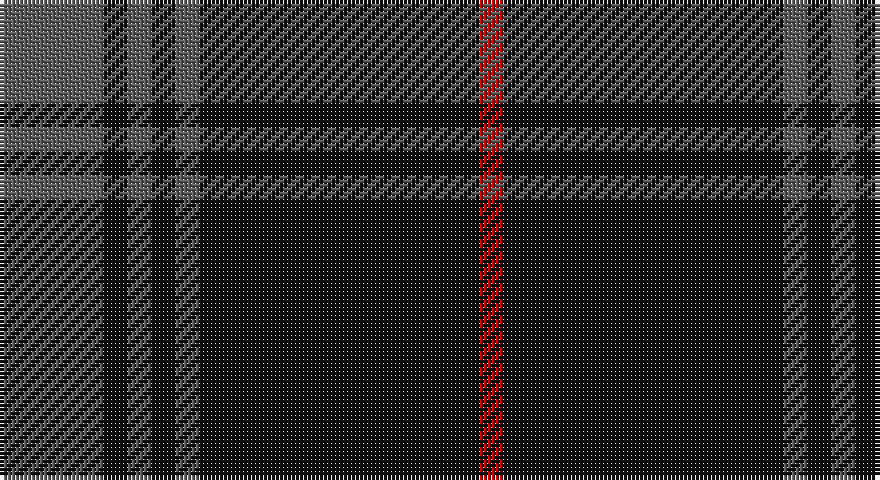

This page is one **sett** — a single exact thread-count. It belongs to the [tartan](/setts/n13k3n3k3n3k35r3/)
(the same proportion at any scale), whose colour order is pattern [BKBKBKR](/stripes/bkbkbkr/).

Part of the [Holden](/tartans/holden/) tartan — the named design grouping this sett with its other cloths.

Sourced from tartans-authority.  It is a [7 stripe tartan](/stripes/stripes7/).

Original link http://www.tartansauthority.com/tartan-ferret/display/8552/

## Also known as

This cloth is also recorded under:

- Holden Beige
- Holden Black
- Holden Brown

## Register references

External register numbers recorded for this tartan.

- Scottish Tartans Authority (ITI): 8552

## Thread count
N/26 K6 N6 K6 N6 K70 R/6

One full sett is **220 threads**.

## Palette

Palette: <strong>Tartan Register</strong> <small style="color:#888">(2 of 3 colours)</small>
<table><thead><tr><th>Colour</th><th>Threads</th><th>Shade</th><th>Base</th><th>OKLCh</th></tr></thead><tbody><tr><td>N/</td><td style="text-align:right;font-variant-numeric:tabular-nums">26</td><td><code style="background-color:#5C5C5C;">#5C5C5C</code> <small style="color:#888">#5C5C5C</small></td><td>B <code style="background-color:#2A418A;">#2A418A</code></td><td><small style="color:#888">oklch(47.5% 0.000 89.9)</small></td></tr><tr><td>K</td><td style="text-align:right;font-variant-numeric:tabular-nums">6</td><td><code style="background-color:#101010;">#101010</code> <small style="color:#888">#101010</small></td><td>K <code style="background-color:#000000;">#000000</code></td><td><small style="color:#888">oklch(17.3% 0.000 89.9)</small></td></tr><tr><td>N</td><td style="text-align:right;font-variant-numeric:tabular-nums">6</td><td><code style="background-color:#5C5C5C;">#5C5C5C</code> <small style="color:#888">#5C5C5C</small></td><td>B <code style="background-color:#2A418A;">#2A418A</code></td><td><small style="color:#888">oklch(47.5% 0.000 89.9)</small></td></tr><tr><td>K</td><td style="text-align:right;font-variant-numeric:tabular-nums">6</td><td><code style="background-color:#101010;">#101010</code> <small style="color:#888">#101010</small></td><td>K <code style="background-color:#000000;">#000000</code></td><td><small style="color:#888">oklch(17.3% 0.000 89.9)</small></td></tr><tr><td>N</td><td style="text-align:right;font-variant-numeric:tabular-nums">6</td><td><code style="background-color:#5C5C5C;">#5C5C5C</code> <small style="color:#888">#5C5C5C</small></td><td>B <code style="background-color:#2A418A;">#2A418A</code></td><td><small style="color:#888">oklch(47.5% 0.000 89.9)</small></td></tr><tr><td>K</td><td style="text-align:right;font-variant-numeric:tabular-nums">70</td><td><code style="background-color:#101010;">#101010</code> <small style="color:#888">#101010</small></td><td>K <code style="background-color:#000000;">#000000</code></td><td><small style="color:#888">oklch(17.3% 0.000 89.9)</small></td></tr><tr><td>R/</td><td style="text-align:right;font-variant-numeric:tabular-nums">6</td><td><code style="background-color:#C80000;">#C80000</code> <small style="color:#888">#C80000</small></td><td>R <code style="background-color:#CC0000;">#CC0000</code></td><td><small style="color:#888">oklch(52.3% 0.215 29.2)</small></td></tr></tbody></table>

# Sample pattern

## Compared to the master

This cloth is one sett of its design; the master sett (the exemplar the design is anchored on) is below for comparison.

<figure style="margin:0"><figcaption style="color:#888;font-size:smaller">this sett</figcaption></figure>
<figure style="margin:0"><figcaption style="color:#888;font-size:smaller"><a href="/setts/lb13k3lb3k3lb3k15dy18r3/">master sett →</a></figcaption></figure>

## Nearest tartans

The nearest existing variants by ΔTartan distance, with this tartan at the top so the swatches line up against it.

ΔTartan

Tartan

Sett

—

<a href="/ttd/edit/#slug=n13k3n3k3n3k35r3~x2">Holden Black (Corporate)</a> <a class="nn-out" href="/variants/s7/n13k3n3k3n3k35r3~x2/" title="open its dictionary page">↗</a>

0.93

<a href="/ttd/edit/#slug=k1g1k8n1k1n2k1n1~x8&amp;base=n13k3n3k3n3k35r3~x2">Nightstalker (Corporate)</a> <a class="nn-out" href="/variants/s8/k1g1k8n1k1n2k1n1~x8/" title="open its dictionary page">↗</a>

1.31

<a href="/ttd/edit/#slug=k3n6k8lr2k8n3k5n36k2n3~x2&amp;base=n13k3n3k3n3k35r3~x2">City Building (Glasgow) LLP</a> <a class="nn-out" href="/variants/s10/k3n6k8lr2k8n3k5n36k2n3~x2/" title="open its dictionary page">↗</a>

1.32

<a href="/ttd/edit/#slug=k24n18k11n4k11n18k53lo4&amp;base=n13k3n3k3n3k35r3~x2">Spirit of Glyndwr Gold Welsh Fashion Tartan</a> <a class="nn-out" href="/variants/s8/k24n18k11n4k11n18k53lo4/" title="open its dictionary page">↗</a>

1.33

<a href="/ttd/edit/#slug=k24n18k11n4k11n18k53r4&amp;base=n13k3n3k3n3k35r3~x2">Spirit of Glyndwr Gold (Fashion)</a> <a class="nn-out" href="/variants/s8/k24n18k11n4k11n18k53r4/" title="open its dictionary page">↗</a>

1.50

<a href="/ttd/edit/#slug=n5r3n35k28n4k11n2~x2&amp;base=n13k3n3k3n3k35r3~x2">Korner-MacPherson (Personal)</a> <a class="nn-out" href="/variants/s7/n5r3n35k28n4k11n2~x2/" title="open its dictionary page">↗</a>

1.53

<a href="/ttd/edit/#slug=n6k17n6k17n45k4~x2&amp;base=n13k3n3k3n3k35r3~x2">Grey Spirit (Fashion)</a> <a class="nn-out" href="/variants/s6/n6k17n6k17n45k4~x2/" title="open its dictionary page">↗</a>

1.54

<a href="/ttd/edit/#slug=n34k7n12k40n3k4t3~x2&amp;base=n13k3n3k3n3k35r3~x2">TACC (Corporate)</a> <a class="nn-out" href="/variants/s7/n34k7n12k40n3k4t3~x2/" title="open its dictionary page">↗</a>

1.57

<a href="/ttd/edit/#slug=k22n17k2n4k2n2k37n4k2r3~x2&amp;base=n13k3n3k3n3k35r3~x2">Witches' Blood, The</a> <a class="nn-out" href="/variants/s10/k22n17k2n4k2n2k37n4k2r3~x2/" title="open its dictionary page">↗</a>

1.58

<a href="/ttd/edit/#slug=k7n2lr2n2k13n2k2lr2n13k26lp2~x2&amp;base=n13k3n3k3n3k35r3~x2">Pride of Scotland Platinum Fashion Tartan</a> <a class="nn-out" href="/variants/s11/k7n2lr2n2k13n2k2lr2n13k26lp2~x2/" title="open its dictionary page">↗</a>

1.58

<a href="/ttd/edit/#slug=k32b2k6b2k13n30w2~x2&amp;base=n13k3n3k3n3k35r3~x2">Mountain Rescue Association Honor Guard</a> <a class="nn-out" href="/variants/s7/k32b2k6b2k13n30w2~x2/" title="open its dictionary page">↗</a>

## Neighbour map

Every grey dot is one of 14360 variants placed by the first two principal components of the ΔTartan feature space (44% of its variance). Red is this tartan; blue dots are its nearest — click one to open its page.

<svg viewBox="0 0 640 380" role="img" style="max-width:100%;height:auto;border:1px solid #e0e0e0;border-radius:4px;display:block" xmlns="http://www.w3.org/2000/svg"><image href="/nn/cloud.v1.png" width="640" height="380"/><a href="/variants/s8/k1g1k8n1k1n2k1n1~x8/"><circle cx="459.4" cy="238.5" r="4" fill="#3465a4"><title>Nightstalker (Corporate)</title></circle></a><a href="/variants/s10/k3n6k8lr2k8n3k5n36k2n3~x2/"><circle cx="452.2" cy="179.6" r="4" fill="#3465a4"><title>City Building (Glasgow) LLP</title></circle></a><a href="/variants/s8/k24n18k11n4k11n18k53lo4/"><circle cx="453.9" cy="237.4" r="4" fill="#3465a4"><title>Spirit of Glyndwr Gold Welsh Fashion Tartan</title></circle></a><a href="/variants/s8/k24n18k11n4k11n18k53r4/"><circle cx="460.6" cy="240.0" r="4" fill="#3465a4"><title>Spirit of Glyndwr Gold (Fashion)</title></circle></a><a href="/variants/s7/n5r3n35k28n4k11n2~x2/"><circle cx="388.8" cy="212.5" r="4" fill="#3465a4"><title>Korner-MacPherson (Personal)</title></circle></a><a href="/variants/s6/n6k17n6k17n45k4~x2/"><circle cx="433.2" cy="261.7" r="4" fill="#3465a4"><title>Grey Spirit (Fashion)</title></circle></a><a href="/variants/s7/n34k7n12k40n3k4t3~x2/"><circle cx="369.6" cy="224.2" r="4" fill="#3465a4"><title>TACC (Corporate)</title></circle></a><a href="/variants/s10/k22n17k2n4k2n2k37n4k2r3~x2/"><circle cx="514.3" cy="206.8" r="4" fill="#3465a4"><title>Witches' Blood, The</title></circle></a><a href="/variants/s11/k7n2lr2n2k13n2k2lr2n13k26lp2~x2/"><circle cx="391.6" cy="171.9" r="4" fill="#3465a4"><title>Pride of Scotland Platinum Fashion Tartan</title></circle></a><a href="/variants/s7/k32b2k6b2k13n30w2~x2/"><circle cx="376.9" cy="203.3" r="4" fill="#3465a4"><title>Mountain Rescue Association Honor Guard</title></circle></a><circle cx="451.0" cy="215.6" r="5" fill="#c00000"/></svg>

ID: /variants/s7/n13k3n3k3n3k35r3~x2/
