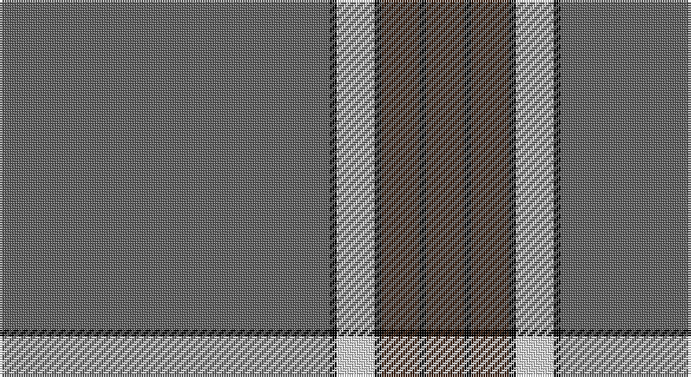

This page is one **sett** — a single exact thread-count. It belongs to the [tartan](/setts/n140k3w16k3do16k3do16/)
(the same proportion at any scale), whose colour order is pattern [BKBKWKB](/stripes/bkbkwkb/).

Sourced from register-of-tartans.  It is a [7 stripe tartan](/stripes/stripes7/).

Original link https://www.tartanregister.gov.uk/tartanDetails.aspx?ref=790

## Register references

External register numbers recorded for this tartan.

- Scottish Register of Tartans: [790](https://www.tartanregister.gov.uk/tartanDetails.aspx?ref=790)
- Scottish Tartans Authority (ITI): 4604

## Thread count
N/140 Ka3 LN16 Ka3 K16 Ka3 K/16

One full sett is **238 threads**.

## Palette

Palette: <strong>Tartan Register</strong> <small style="color:#888">(2 of 4 colours)</small>
<table><thead><tr><th>Colour</th><th>Threads</th><th>Shade</th><th>Base</th><th>OKLCh</th></tr></thead><tbody><tr><td>N/</td><td style="text-align:right;font-variant-numeric:tabular-nums">140</td><td><code style="background-color:#606060;">#606060</code> <small style="color:#888">#606060</small></td><td>B <code style="background-color:#2A418A;">#2A418A</code></td><td><small style="color:#888">oklch(48.9% 0.000 89.9)</small></td></tr><tr><td>Ka</td><td style="text-align:right;font-variant-numeric:tabular-nums">3</td><td><code style="background-color:#000000;">#000000</code> <small style="color:#888">#000000</small></td><td>K <code style="background-color:#000000;">#000000</code></td><td><small style="color:#888">oklch(0.0% 0.000 0.0)</small></td></tr><tr><td>LN</td><td style="text-align:right;font-variant-numeric:tabular-nums">16</td><td><code style="background-color:#E0E0E0;">#E0E0E0</code> <small style="color:#888">#E0E0E0</small></td><td>W <code style="background-color:#F7F7F7;">#F7F7F7</code></td><td><small style="color:#888">oklch(90.7% 0.000 89.9)</small></td></tr><tr><td>Ka</td><td style="text-align:right;font-variant-numeric:tabular-nums">3</td><td><code style="background-color:#000000;">#000000</code> <small style="color:#888">#000000</small></td><td>K <code style="background-color:#000000;">#000000</code></td><td><small style="color:#888">oklch(0.0% 0.000 0.0)</small></td></tr><tr><td>K</td><td style="text-align:right;font-variant-numeric:tabular-nums">16</td><td><code style="background-color:#381C0C;">#381C0C</code> <small style="color:#888">#381C0C</small></td><td>B <code style="background-color:#2A418A;">#2A418A</code></td><td><small style="color:#888">oklch(26.2% 0.051 48.9)</small></td></tr><tr><td>Ka</td><td style="text-align:right;font-variant-numeric:tabular-nums">3</td><td><code style="background-color:#000000;">#000000</code> <small style="color:#888">#000000</small></td><td>K <code style="background-color:#000000;">#000000</code></td><td><small style="color:#888">oklch(0.0% 0.000 0.0)</small></td></tr><tr><td>K/</td><td style="text-align:right;font-variant-numeric:tabular-nums">16</td><td><code style="background-color:#381C0C;">#381C0C</code> <small style="color:#888">#381C0C</small></td><td>B <code style="background-color:#2A418A;">#2A418A</code></td><td><small style="color:#888">oklch(26.2% 0.051 48.9)</small></td></tr></tbody></table>

# Sample pattern

## Nearest tartans

The nearest existing variants by ΔTartan distance, with this tartan at the top so the swatches line up against it.

ΔTartan

Tartan

Sett

—

<a href="/ttd/edit/#slug=n140k3w16k3do16k3do16">Crail</a> <a class="nn-out" href="/variants/s7/n140k3w16k3do16k3do16/" title="open its dictionary page">↗</a>

1.14

<a href="/ttd/edit/#slug=dt5ly1g7r1dt45r5ly3dt4ly3~x2&amp;base=n140k3w16k3do16k3do16">Brooks Brothers Signature Corporate Tartan</a> <a class="nn-out" href="/variants/s9/dt5ly1g7r1dt45r5ly3dt4ly3~x2/" title="open its dictionary page">↗</a>

1.30

<a href="/ttd/edit/#slug=n83k7w6n10r7k3r20w3~x2&amp;base=n140k3w16k3do16k3do16">President High School</a> <a class="nn-out" href="/variants/s8/n83k7w6n10r7k3r20w3~x2/" title="open its dictionary page">↗</a>

1.46

<a href="/ttd/edit/#slug=n1k6n35k6n2dp3n1k6n2w1~x2&amp;base=n140k3w16k3do16k3do16">Melrose Newbigging Grey (Name)</a> <a class="nn-out" href="/variants/s10/n1k6n35k6n2dp3n1k6n2w1~x2/" title="open its dictionary page">↗</a>

1.47

<a href="/ttd/edit/#slug=r4dp12g2dp2g46w1~x2&amp;base=n140k3w16k3do16k3do16">Kinfauns Castle (Corporate)</a> <a class="nn-out" href="/variants/s6/r4dp12g2dp2g46w1~x2/" title="open its dictionary page">↗</a>

1.51

<a href="/ttd/edit/#slug=y5k1y33dp1y9k9dp5k1r2k4~x2&amp;base=n140k3w16k3do16k3do16">Lochnagar Dress (Fashion)</a> <a class="nn-out" href="/variants/s10/y5k1y33dp1y9k9dp5k1r2k4~x2/" title="open its dictionary page">↗</a>

1.52

<a href="/ttd/edit/#slug=dt40lo1dt1r9dt1lo1dt6lo1dt1r9~x2&amp;base=n140k3w16k3do16k3do16">Miyuki</a> <a class="nn-out" href="/variants/s10/dt40lo1dt1r9dt1lo1dt6lo1dt1r9~x2/" title="open its dictionary page">↗</a>

1.54

<a href="/ttd/edit/#slug=db40g8k1ly2k1g8db5~x4&amp;base=n140k3w16k3do16k3do16">Salvation Army, Hunting</a> <a class="nn-out" href="/variants/s7/db40g8k1ly2k1g8db5~x4/" title="open its dictionary page">↗</a>

1.58

<a href="/ttd/edit/#slug=y24y1k9y1y9y2w2db2~x2&amp;base=n140k3w16k3do16k3do16">Gairloch</a> <a class="nn-out" href="/variants/s8/y24y1k9y1y9y2w2db2~x2/" title="open its dictionary page">↗</a>

1.59

<a href="/ttd/edit/#slug=db80r21k2ly4k2r16db10~x2&amp;base=n140k3w16k3do16k3do16">Salvation Army, dress</a> <a class="nn-out" href="/variants/s7/db80r21k2ly4k2r16db10~x2/" title="open its dictionary page">↗</a>

1.66

<a href="/ttd/edit/#slug=dt8y74k8dt42y11k2y16dt4&amp;base=n140k3w16k3do16k3do16">Orkney Slate</a> <a class="nn-out" href="/variants/s8/dt8y74k8dt42y11k2y16dt4/" title="open its dictionary page">↗</a>

## Neighbour map

Every grey dot is one of 14360 variants placed by the first two principal components of the ΔTartan feature space (44% of its variance). Red is this tartan; blue dots are its nearest — click one to open its page.

<svg viewBox="0 0 640 380" role="img" style="max-width:100%;height:auto;border:1px solid #e0e0e0;border-radius:4px;display:block" xmlns="http://www.w3.org/2000/svg"><image href="/nn/cloud.v1.png" width="640" height="380"/><a href="/variants/s9/dt5ly1g7r1dt45r5ly3dt4ly3~x2/"><circle cx="507.0" cy="114.0" r="4" fill="#3465a4"><title>Brooks Brothers Signature Corporate Tartan</title></circle></a><a href="/variants/s8/n83k7w6n10r7k3r20w3~x2/"><circle cx="453.5" cy="130.4" r="4" fill="#3465a4"><title>President High School</title></circle></a><a href="/variants/s10/n1k6n35k6n2dp3n1k6n2w1~x2/"><circle cx="475.0" cy="126.2" r="4" fill="#3465a4"><title>Melrose Newbigging Grey (Name)</title></circle></a><a href="/variants/s6/r4dp12g2dp2g46w1~x2/"><circle cx="517.4" cy="140.8" r="4" fill="#3465a4"><title>Kinfauns Castle (Corporate)</title></circle></a><a href="/variants/s10/y5k1y33dp1y9k9dp5k1r2k4~x2/"><circle cx="467.3" cy="137.4" r="4" fill="#3465a4"><title>Lochnagar Dress (Fashion)</title></circle></a><a href="/variants/s10/dt40lo1dt1r9dt1lo1dt6lo1dt1r9~x2/"><circle cx="526.0" cy="126.5" r="4" fill="#3465a4"><title>Miyuki</title></circle></a><a href="/variants/s7/db40g8k1ly2k1g8db5~x4/"><circle cx="486.5" cy="143.3" r="4" fill="#3465a4"><title>Salvation Army, Hunting</title></circle></a><a href="/variants/s8/y24y1k9y1y9y2w2db2~x2/"><circle cx="470.3" cy="147.3" r="4" fill="#3465a4"><title>Gairloch</title></circle></a><a href="/variants/s7/db80r21k2ly4k2r16db10~x2/"><circle cx="474.7" cy="132.6" r="4" fill="#3465a4"><title>Salvation Army, dress</title></circle></a><a href="/variants/s8/dt8y74k8dt42y11k2y16dt4/"><circle cx="431.5" cy="151.0" r="4" fill="#3465a4"><title>Orkney Slate</title></circle></a><circle cx="501.4" cy="111.6" r="5" fill="#c00000"/></svg>

ID: /variants/s7/n140k3w16k3do16k3do16/
