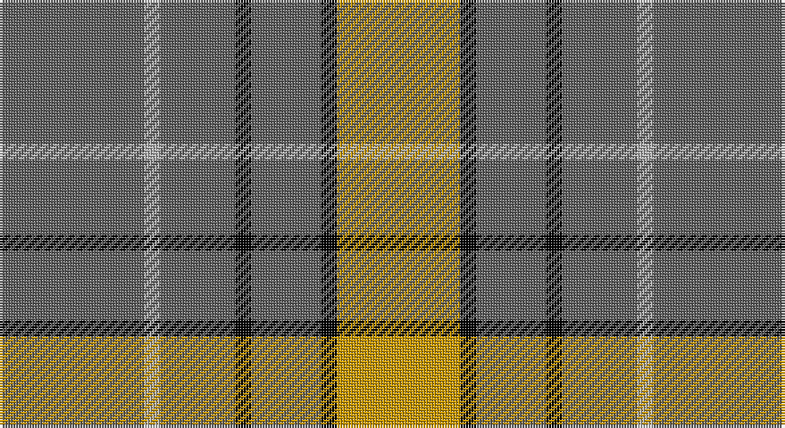

This page is one **sett** — a single exact thread-count. It belongs to the [tartan](/setts/n27lr3n14k3n13k3ly23/)
(the same proportion at any scale), whose colour order is pattern [BYBKBKY](/stripes/bybkbky/).

Sourced from register-of-tartans.  It is a [7 stripe tartan](/stripes/stripes7/).

Original link https://www.tartanregister.gov.uk/tartanDetails.aspx?ref=1494

2 attestations — the source records this cloth was collapsed from (oldest owns this page)

<ul>
<li>01/03/1988 — Grange School (register-of-tartans, <a href="https://www.tartanregister.gov.uk/tartanDetails.aspx?ref=1494">record</a>)</li>
<li>pre 2002 — Grange School (School) (tartans-authority, <a href="http://www.tartansauthority.com/tartan-ferret/display/5094/">record</a>)</li>
</ul>

## Register references

External register numbers recorded for this tartan.

- Scottish Register of Tartans: [1494](https://www.tartanregister.gov.uk/tartanDetails.aspx?ref=1494)
- Scottish Tartans Authority (ITI): 5094
- Scottish Tartans World Register: 2945

## Thread count
N/54 Na6 N28 K6 N26 K6 DY/46

One full sett is **244 threads**.

## Palette

Palette: <strong>Tartan Register</strong> <small style="color:#888">(3 of 4 colours)</small>
<table><thead><tr><th>Colour</th><th>Threads</th><th>Shade</th><th>Base</th><th>OKLCh</th></tr></thead><tbody><tr><td>N/</td><td style="text-align:right;font-variant-numeric:tabular-nums">54</td><td><code style="background-color:#606060;">#606060</code> <small style="color:#888">#606060</small></td><td>B <code style="background-color:#2A418A;">#2A418A</code></td><td><small style="color:#888">oklch(48.9% 0.000 89.9)</small></td></tr><tr><td>Na</td><td style="text-align:right;font-variant-numeric:tabular-nums">6</td><td><code style="background-color:#B0B0B0;">#B0B0B0</code> <small style="color:#888">#B0B0B0</small></td><td>Y <code style="background-color:#F2BF00;">#F2BF00</code></td><td><small style="color:#888">oklch(75.7% 0.000 89.9)</small></td></tr><tr><td>N</td><td style="text-align:right;font-variant-numeric:tabular-nums">28</td><td><code style="background-color:#606060;">#606060</code> <small style="color:#888">#606060</small></td><td>B <code style="background-color:#2A418A;">#2A418A</code></td><td><small style="color:#888">oklch(48.9% 0.000 89.9)</small></td></tr><tr><td>K</td><td style="text-align:right;font-variant-numeric:tabular-nums">6</td><td><code style="background-color:#000000;">#000000</code> <small style="color:#888">#000000</small></td><td>K <code style="background-color:#000000;">#000000</code></td><td><small style="color:#888">oklch(0.0% 0.000 0.0)</small></td></tr><tr><td>N</td><td style="text-align:right;font-variant-numeric:tabular-nums">26</td><td><code style="background-color:#606060;">#606060</code> <small style="color:#888">#606060</small></td><td>B <code style="background-color:#2A418A;">#2A418A</code></td><td><small style="color:#888">oklch(48.9% 0.000 89.9)</small></td></tr><tr><td>K</td><td style="text-align:right;font-variant-numeric:tabular-nums">6</td><td><code style="background-color:#000000;">#000000</code> <small style="color:#888">#000000</small></td><td>K <code style="background-color:#000000;">#000000</code></td><td><small style="color:#888">oklch(0.0% 0.000 0.0)</small></td></tr><tr><td>DY/</td><td style="text-align:right;font-variant-numeric:tabular-nums">46</td><td><code style="background-color:#C89800;">#C89800</code> <small style="color:#888">#C89800</small></td><td>Y <code style="background-color:#F2BF00;">#F2BF00</code></td><td><small style="color:#888">oklch(70.6% 0.144 85.9)</small></td></tr></tbody></table>

# Sample pattern

## Nearest tartans

The nearest existing variants by ΔTartan distance, with this tartan at the top so the swatches line up against it.

ΔTartan

Tartan

Sett

—

<a href="/ttd/edit/#slug=n27lr3n14k3n13k3ly23~x2">Grange School</a> <a class="nn-out" href="/variants/s7/n27lr3n14k3n13k3ly23~x2/" title="open its dictionary page">↗</a>

1.09

<a href="/ttd/edit/#slug=k5lo25k10r3k10lo25w5~x2&amp;base=n27lr3n14k3n13k3ly23~x2">Richmond de Ellel (Personal)</a> <a class="nn-out" href="/variants/s7/k5lo25k10r3k10lo25w5~x2/" title="open its dictionary page">↗</a>

1.18

<a href="/ttd/edit/#slug=lo24do2lo3dy6lo3do2dg15lo20do4~x2&amp;base=n27lr3n14k3n13k3ly23~x2">Land's End Camel</a> <a class="nn-out" href="/variants/s9/lo24do2lo3dy6lo3do2dg15lo20do4~x2/" title="open its dictionary page">↗</a>

1.22

<a href="/ttd/edit/#slug=ly2g12db6r3g12r4db1~x2&amp;base=n27lr3n14k3n13k3ly23~x2">MacKintosh Hunting</a> <a class="nn-out" href="/variants/s7/ly2g12db6r3g12r4db1~x2/" title="open its dictionary page">↗</a>

1.39

<a href="/ttd/edit/#slug=g3w1g12r6g3k3g2~x4&amp;base=n27lr3n14k3n13k3ly23~x2">Arkansas</a> <a class="nn-out" href="/variants/s7/g3w1g12r6g3k3g2~x4/" title="open its dictionary page">↗</a>

1.39

<a href="/ttd/edit/#slug=g9m2g2m2g2m8g11w2~x4&amp;base=n27lr3n14k3n13k3ly23~x2">Leeds University Corporate Tartan</a> <a class="nn-out" href="/variants/s8/g9m2g2m2g2m8g11w2~x4/" title="open its dictionary page">↗</a>

1.43

<a href="/ttd/edit/#slug=g8k2g13r4g12dp22g5ly3~x2&amp;base=n27lr3n14k3n13k3ly23~x2">Taylor Family Tartan</a> <a class="nn-out" href="/variants/s8/g8k2g13r4g12dp22g5ly3~x2/" title="open its dictionary page">↗</a>

1.43

<a href="/ttd/edit/#slug=r1o6k1o1k2o1k1o6lo1~x8&amp;base=n27lr3n14k3n13k3ly23~x2">Mowdowny (Fashion)</a> <a class="nn-out" href="/variants/s9/r1o6k1o1k2o1k1o6lo1~x8/" title="open its dictionary page">↗</a>

1.46

<a href="/ttd/edit/#slug=lo10w1lo12k7w2k7lo12w1r4w1lo12k2~x2&amp;base=n27lr3n14k3n13k3ly23~x2">Unidentified (GMG 2002)</a> <a class="nn-out" href="/variants/s12/lo10w1lo12k7w2k7lo12w1r4w1lo12k2~x2/" title="open its dictionary page">↗</a>

1.49

<a href="/ttd/edit/#slug=ly5dg14o4db4o27dg3o4ly5~x2&amp;base=n27lr3n14k3n13k3ly23~x2">Invertere</a> <a class="nn-out" href="/variants/s8/ly5dg14o4db4o27dg3o4ly5~x2/" title="open its dictionary page">↗</a>

1.56

<a href="/ttd/edit/#slug=ly2dg12db6r3dg12r4db1&amp;base=n27lr3n14k3n13k3ly23~x2">MacKintosh Hunting</a> <a class="nn-out" href="/variants/s7/ly2dg12db6r3dg12r4db1/" title="open its dictionary page">↗</a>

## Neighbour map

Every grey dot is one of 14360 variants placed by the first two principal components of the ΔTartan feature space (44% of its variance). Red is this tartan; blue dots are its nearest — click one to open its page.

<svg viewBox="0 0 640 380" role="img" style="max-width:100%;height:auto;border:1px solid #e0e0e0;border-radius:4px;display:block" xmlns="http://www.w3.org/2000/svg"><image href="/nn/cloud.v1.png" width="640" height="380"/><a href="/variants/s7/k5lo25k10r3k10lo25w5~x2/"><circle cx="287.4" cy="205.0" r="4" fill="#3465a4"><title>Richmond de Ellel (Personal)</title></circle></a><a href="/variants/s9/lo24do2lo3dy6lo3do2dg15lo20do4~x2/"><circle cx="364.2" cy="189.6" r="4" fill="#3465a4"><title>Land's End Camel</title></circle></a><a href="/variants/s7/ly2g12db6r3g12r4db1~x2/"><circle cx="322.1" cy="217.6" r="4" fill="#3465a4"><title>MacKintosh Hunting</title></circle></a><a href="/variants/s7/g3w1g12r6g3k3g2~x4/"><circle cx="366.3" cy="209.2" r="4" fill="#3465a4"><title>Arkansas</title></circle></a><a href="/variants/s8/g9m2g2m2g2m8g11w2~x4/"><circle cx="349.6" cy="250.8" r="4" fill="#3465a4"><title>Leeds University Corporate Tartan</title></circle></a><a href="/variants/s8/g8k2g13r4g12dp22g5ly3~x2/"><circle cx="274.1" cy="194.5" r="4" fill="#3465a4"><title>Taylor Family Tartan</title></circle></a><a href="/variants/s9/r1o6k1o1k2o1k1o6lo1~x8/"><circle cx="368.9" cy="204.9" r="4" fill="#3465a4"><title>Mowdowny (Fashion)</title></circle></a><a href="/variants/s12/lo10w1lo12k7w2k7lo12w1r4w1lo12k2~x2/"><circle cx="322.4" cy="170.3" r="4" fill="#3465a4"><title>Unidentified (GMG 2002)</title></circle></a><a href="/variants/s8/ly5dg14o4db4o27dg3o4ly5~x2/"><circle cx="270.4" cy="189.7" r="4" fill="#3465a4"><title>Invertere</title></circle></a><a href="/variants/s7/ly2dg12db6r3dg12r4db1/"><circle cx="301.7" cy="210.3" r="4" fill="#3465a4"><title>MacKintosh Hunting</title></circle></a><circle cx="333.5" cy="217.0" r="5" fill="#c00000"/></svg>

ID: /variants/s7/n27lr3n14k3n13k3ly23~x2/
