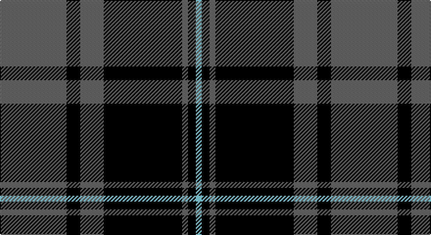

This page is one **sett** — a single exact thread-count. It belongs to the [tartan](/setts/n34k7n12k40n3k4lt3/)
(the same proportion at any scale), whose colour order is pattern [BKBKBKW](/stripes/bkbkbkw/).

Part of the [TACC](/tartans/tacc/) tartan — the named design grouping this sett with its other cloths.

Sourced from register-of-tartans.  It is a [7 stripe tartan](/stripes/stripes7/).

Original link https://www.tartanregister.gov.uk/tartanDetails.aspx?ref=10578

## Register references

External register numbers recorded for this tartan.

- Scottish Register of Tartans: [10578](https://www.tartanregister.gov.uk/tartanDetails.aspx?ref=10578)

## Thread count
N/68 K14 N24 K80 N6 K8 LB/6

One full sett is **338 threads**.

## Palette

Palette: <strong>Tartan Register</strong> <small style="color:#888">(2 of 3 colours)</small>
<table><thead><tr><th>Colour</th><th>Threads</th><th>Shade</th><th>Base</th><th>OKLCh</th></tr></thead><tbody><tr><td>N/</td><td style="text-align:right;font-variant-numeric:tabular-nums">68</td><td><code style="background-color:#666666;">#666666</code> <small style="color:#888">#666666</small></td><td>B <code style="background-color:#2A418A;">#2A418A</code></td><td><small style="color:#888">oklch(51.0% 0.000 89.9)</small></td></tr><tr><td>K</td><td style="text-align:right;font-variant-numeric:tabular-nums">14</td><td><code style="background-color:#000000;">#000000</code> <small style="color:#888">#000000</small></td><td>K <code style="background-color:#000000;">#000000</code></td><td><small style="color:#888">oklch(0.0% 0.000 0.0)</small></td></tr><tr><td>N</td><td style="text-align:right;font-variant-numeric:tabular-nums">24</td><td><code style="background-color:#666666;">#666666</code> <small style="color:#888">#666666</small></td><td>B <code style="background-color:#2A418A;">#2A418A</code></td><td><small style="color:#888">oklch(51.0% 0.000 89.9)</small></td></tr><tr><td>K</td><td style="text-align:right;font-variant-numeric:tabular-nums">80</td><td><code style="background-color:#000000;">#000000</code> <small style="color:#888">#000000</small></td><td>K <code style="background-color:#000000;">#000000</code></td><td><small style="color:#888">oklch(0.0% 0.000 0.0)</small></td></tr><tr><td>N</td><td style="text-align:right;font-variant-numeric:tabular-nums">6</td><td><code style="background-color:#666666;">#666666</code> <small style="color:#888">#666666</small></td><td>B <code style="background-color:#2A418A;">#2A418A</code></td><td><small style="color:#888">oklch(51.0% 0.000 89.9)</small></td></tr><tr><td>K</td><td style="text-align:right;font-variant-numeric:tabular-nums">8</td><td><code style="background-color:#000000;">#000000</code> <small style="color:#888">#000000</small></td><td>K <code style="background-color:#000000;">#000000</code></td><td><small style="color:#888">oklch(0.0% 0.000 0.0)</small></td></tr><tr><td>LB/</td><td style="text-align:right;font-variant-numeric:tabular-nums">6</td><td><code style="background-color:#82CFFD;">#82CFFD</code> <small style="color:#888">#82CFFD</small></td><td>W <code style="background-color:#F7F7F7;">#F7F7F7</code></td><td><small style="color:#888">oklch(82.2% 0.100 236.0)</small></td></tr></tbody></table>

# Sample pattern

## Nearest tartans

The nearest existing variants by ΔTartan distance, with this tartan at the top so the swatches line up against it.

ΔTartan

Tartan

Sett

—

<a href="/ttd/edit/#slug=n34k7n12k40n3k4lt3~x2">TACC</a> <a class="nn-out" href="/variants/s7/n34k7n12k40n3k4lt3~x2/" title="open its dictionary page">↗</a>

0.78

<a href="/ttd/edit/#slug=k13y1k1y1k4y10ly1y1~x6&amp;base=n34k7n12k40n3k4lt3~x2">West Point</a> <a class="nn-out" href="/variants/s8/k13y1k1y1k4y10ly1y1~x6/" title="open its dictionary page">↗</a>

0.95

<a href="/ttd/edit/#slug=k39y3k3y3k14y28r3~x2&amp;base=n34k7n12k40n3k4lt3~x2">Moffat</a> <a class="nn-out" href="/variants/s7/k39y3k3y3k14y28r3~x2/" title="open its dictionary page">↗</a>

1.20

<a href="/ttd/edit/#slug=k16y1k1y1k8y16k1y2~x2&amp;base=n34k7n12k40n3k4lt3~x2">Douglas VS</a> <a class="nn-out" href="/variants/s8/k16y1k1y1k8y16k1y2~x2/" title="open its dictionary page">↗</a>

1.24

<a href="/ttd/edit/#slug=k13o1k1o1k4o10ly1o1~x6&amp;base=n34k7n12k40n3k4lt3~x2">West Point</a> <a class="nn-out" href="/variants/s8/k13o1k1o1k4o10ly1o1~x6/" title="open its dictionary page">↗</a>

1.26

<a href="/ttd/edit/#slug=k39o3k3o3k14o28r3~x2&amp;base=n34k7n12k40n3k4lt3~x2">Moffat (1984)</a> <a class="nn-out" href="/variants/s7/k39o3k3o3k14o28r3~x2/" title="open its dictionary page">↗</a>

1.30

<a href="/ttd/edit/#slug=k10o1k2o1k4o10ly1o2~x4&amp;base=n34k7n12k40n3k4lt3~x2">West Point Military Academy (Mil.)</a> <a class="nn-out" href="/variants/s8/k10o1k2o1k4o10ly1o2~x4/" title="open its dictionary page">↗</a>

1.30

<a href="/ttd/edit/#slug=k9lr1k2lr1k4lr9k1lr2~x4&amp;base=n34k7n12k40n3k4lt3~x2">Douglas, Grey Clan/Family Tartan</a> <a class="nn-out" href="/variants/s8/k9lr1k2lr1k4lr9k1lr2~x4/" title="open its dictionary page">↗</a>

1.36

<a href="/ttd/edit/#slug=k2o6k2o6k12r1~x4&amp;base=n34k7n12k40n3k4lt3~x2">MacSween, Black (Personal)</a> <a class="nn-out" href="/variants/s6/k2o6k2o6k12r1~x4/" title="open its dictionary page">↗</a>

1.37

<a href="/ttd/edit/#slug=k51g5r15g37k17r6g7~x2&amp;base=n34k7n12k40n3k4lt3~x2">Cadence Design Systems (Corporate)</a> <a class="nn-out" href="/variants/s7/k51g5r15g37k17r6g7~x2/" title="open its dictionary page">↗</a>

1.38

<a href="/ttd/edit/#slug=k10t1k2t1k4t10g1t2~x4&amp;base=n34k7n12k40n3k4lt3~x2">Martin's Own</a> <a class="nn-out" href="/variants/s8/k10t1k2t1k4t10g1t2~x4/" title="open its dictionary page">↗</a>

## Neighbour map

Every grey dot is one of 14360 variants placed by the first two principal components of the ΔTartan feature space (44% of its variance). Red is this tartan; blue dots are its nearest — click one to open its page.

<svg viewBox="0 0 640 380" role="img" style="max-width:100%;height:auto;border:1px solid #e0e0e0;border-radius:4px;display:block" xmlns="http://www.w3.org/2000/svg"><image href="/nn/cloud.v1.png" width="640" height="380"/><a href="/variants/s8/k13y1k1y1k4y10ly1y1~x6/"><circle cx="337.2" cy="181.5" r="4" fill="#3465a4"><title>West Point</title></circle></a><a href="/variants/s7/k39y3k3y3k14y28r3~x2/"><circle cx="356.9" cy="196.9" r="4" fill="#3465a4"><title>Moffat</title></circle></a><a href="/variants/s8/k16y1k1y1k8y16k1y2~x2/"><circle cx="379.8" cy="197.8" r="4" fill="#3465a4"><title>Douglas VS</title></circle></a><a href="/variants/s8/k13o1k1o1k4o10ly1o1~x6/"><circle cx="350.9" cy="183.3" r="4" fill="#3465a4"><title>West Point</title></circle></a><a href="/variants/s7/k39o3k3o3k14o28r3~x2/"><circle cx="372.2" cy="198.8" r="4" fill="#3465a4"><title>Moffat (1984)</title></circle></a><a href="/variants/s8/k10o1k2o1k4o10ly1o2~x4/"><circle cx="309.0" cy="203.1" r="4" fill="#3465a4"><title>West Point Military Academy (Mil.)</title></circle></a><a href="/variants/s8/k9lr1k2lr1k4lr9k1lr2~x4/"><circle cx="326.6" cy="224.5" r="4" fill="#3465a4"><title>Douglas, Grey Clan/Family Tartan</title></circle></a><a href="/variants/s6/k2o6k2o6k12r1~x4/"><circle cx="327.4" cy="224.9" r="4" fill="#3465a4"><title>MacSween, Black (Personal)</title></circle></a><a href="/variants/s7/k51g5r15g37k17r6g7~x2/"><circle cx="278.9" cy="227.9" r="4" fill="#3465a4"><title>Cadence Design Systems (Corporate)</title></circle></a><a href="/variants/s8/k10t1k2t1k4t10g1t2~x4/"><circle cx="309.6" cy="209.0" r="4" fill="#3465a4"><title>Martin's Own</title></circle></a><circle cx="314.4" cy="199.8" r="5" fill="#c00000"/></svg>

ID: /variants/s7/n34k7n12k40n3k4lt3~x2/
