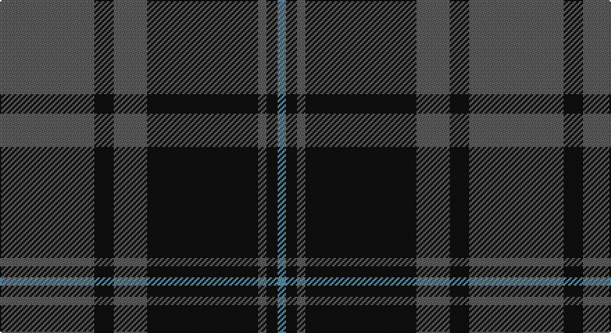

This page is one **sett** — a single exact thread-count. It belongs to the [tartan](/setts/n34k7n12k40n3k4t3/)
(the same proportion at any scale), whose colour order is pattern [BKBKBKB](/stripes/bkbkbkb/).

Part of the [TACC](/tartans/tacc/) tartan — the named design grouping this sett with its other cloths.

Sourced from tartans-authority.  It is a [7 stripe tartan](/stripes/stripes7/).

Original link http://www.tartansauthority.com/tartan-ferret/display/10578/

## Register references

External register numbers recorded for this tartan.

- Scottish Register of Tartans: [10578](https://www.tartanregister.gov.uk/tartanDetails?ref=10578)
- Scottish Tartans Authority (ITI): 10578

## Thread count
N/68 K14 N24 K80 N6 K8 B/6

One full sett is **338 threads**.

## Palette

Palette: <strong>Tartan Register</strong> <small style="color:#888">(2 of 3 colours)</small>
<table><thead><tr><th>Colour</th><th>Threads</th><th>Shade</th><th>Base</th><th>OKLCh</th></tr></thead><tbody><tr><td>N/</td><td style="text-align:right;font-variant-numeric:tabular-nums">68</td><td><code style="background-color:#5C5C5C;">#5C5C5C</code> <small style="color:#888">#5C5C5C</small></td><td>B <code style="background-color:#2A418A;">#2A418A</code></td><td><small style="color:#888">oklch(47.5% 0.000 89.9)</small></td></tr><tr><td>K</td><td style="text-align:right;font-variant-numeric:tabular-nums">14</td><td><code style="background-color:#101010;">#101010</code> <small style="color:#888">#101010</small></td><td>K <code style="background-color:#000000;">#000000</code></td><td><small style="color:#888">oklch(17.3% 0.000 89.9)</small></td></tr><tr><td>N</td><td style="text-align:right;font-variant-numeric:tabular-nums">24</td><td><code style="background-color:#5C5C5C;">#5C5C5C</code> <small style="color:#888">#5C5C5C</small></td><td>B <code style="background-color:#2A418A;">#2A418A</code></td><td><small style="color:#888">oklch(47.5% 0.000 89.9)</small></td></tr><tr><td>K</td><td style="text-align:right;font-variant-numeric:tabular-nums">80</td><td><code style="background-color:#101010;">#101010</code> <small style="color:#888">#101010</small></td><td>K <code style="background-color:#000000;">#000000</code></td><td><small style="color:#888">oklch(17.3% 0.000 89.9)</small></td></tr><tr><td>N</td><td style="text-align:right;font-variant-numeric:tabular-nums">6</td><td><code style="background-color:#5C5C5C;">#5C5C5C</code> <small style="color:#888">#5C5C5C</small></td><td>B <code style="background-color:#2A418A;">#2A418A</code></td><td><small style="color:#888">oklch(47.5% 0.000 89.9)</small></td></tr><tr><td>K</td><td style="text-align:right;font-variant-numeric:tabular-nums">8</td><td><code style="background-color:#101010;">#101010</code> <small style="color:#888">#101010</small></td><td>K <code style="background-color:#000000;">#000000</code></td><td><small style="color:#888">oklch(17.3% 0.000 89.9)</small></td></tr><tr><td>B/</td><td style="text-align:right;font-variant-numeric:tabular-nums">6</td><td><code style="background-color:#5C8CA8;">#5C8CA8</code> <small style="color:#888">#5C8CA8</small></td><td>B <code style="background-color:#2A418A;">#2A418A</code></td><td><small style="color:#888">oklch(61.7% 0.067 235.0)</small></td></tr></tbody></table>

# Sample pattern

## Compared to the master

This cloth is one sett of its design; the master sett (the exemplar the design is anchored on) is below for comparison.

<figure style="margin:0"><figcaption style="color:#888;font-size:smaller">this sett</figcaption></figure>
<figure style="margin:0"><figcaption style="color:#888;font-size:smaller"><a href="/setts/n34k7n12k40n3k4lt3/">master sett →</a></figcaption></figure>

## Nearest tartans

The nearest existing variants by ΔTartan distance, with this tartan at the top so the swatches line up against it.

ΔTartan

Tartan

Sett

—

<a href="/ttd/edit/#slug=n34k7n12k40n3k4t3~x2">TACC (Corporate)</a> <a class="nn-out" href="/variants/s7/n34k7n12k40n3k4t3~x2/" title="open its dictionary page">↗</a>

0.14

<a href="/ttd/edit/#slug=n34k7n12k39n3k4lg3~x2&amp;base=n34k7n12k40n3k4t3~x2">Tartan Army Children's Charity (Corp</a> <a class="nn-out" href="/variants/s7/n34k7n12k39n3k4lg3~x2/" title="open its dictionary page">↗</a>

0.51

<a href="/ttd/edit/#slug=n5r3n35k28n4k11n2~x2&amp;base=n34k7n12k40n3k4t3~x2">Korner-MacPherson (Personal)</a> <a class="nn-out" href="/variants/s7/n5r3n35k28n4k11n2~x2/" title="open its dictionary page">↗</a>

0.87

<a href="/ttd/edit/#slug=k3n31k3n3k27ly3~x2&amp;base=n34k7n12k40n3k4t3~x2">Scottish National Party (Corporate)</a> <a class="nn-out" href="/variants/s6/k3n31k3n3k27ly3~x2/" title="open its dictionary page">↗</a>

0.94

<a href="/ttd/edit/#slug=k3n23k3n3k20t3~x2&amp;base=n34k7n12k40n3k4t3~x2">Pride of the Forth</a> <a class="nn-out" href="/variants/s6/k3n23k3n3k20t3~x2/" title="open its dictionary page">↗</a>

0.99

<a href="/ttd/edit/#slug=k3n23k3n3k20lg3~x2&amp;base=n34k7n12k40n3k4t3~x2">Pride of the Forth</a> <a class="nn-out" href="/variants/s6/k3n23k3n3k20lg3~x2/" title="open its dictionary page">↗</a>

1.05

<a href="/ttd/edit/#slug=db26r6g16db8g3r2~x2&amp;base=n34k7n12k40n3k4t3~x2">Perthshire (New) District Tartan</a> <a class="nn-out" href="/variants/s6/db26r6g16db8g3r2~x2/" title="open its dictionary page">↗</a>

1.08

<a href="/ttd/edit/#slug=r2db10g1db2g1db2g8r1g2~x4&amp;base=n34k7n12k40n3k4t3~x2">Brown, Barnaby (Personal)</a> <a class="nn-out" href="/variants/s9/r2db10g1db2g1db2g8r1g2~x4/" title="open its dictionary page">↗</a>

1.23

<a href="/ttd/edit/#slug=k3n25k3n3k21n3~x2&amp;base=n34k7n12k40n3k4t3~x2">Slanj, Grey (Corporate)</a> <a class="nn-out" href="/variants/s6/k3n25k3n3k21n3~x2/" title="open its dictionary page">↗</a>

1.23

<a href="/ttd/edit/#slug=n15k14t1ly2t1k14n15k2~x4&amp;base=n34k7n12k40n3k4t3~x2">South African Air Force</a> <a class="nn-out" href="/variants/s8/n15k14t1ly2t1k14n15k2~x4/" title="open its dictionary page">↗</a>

1.25

<a href="/ttd/edit/#slug=r3db1r1db11g10r2db2~x4&amp;base=n34k7n12k40n3k4t3~x2">Robertson of Struan 1816</a> <a class="nn-out" href="/variants/s7/r3db1r1db11g10r2db2~x4/" title="open its dictionary page">↗</a>

## Neighbour map

Every grey dot is one of 14360 variants placed by the first two principal components of the ΔTartan feature space (44% of its variance). Red is this tartan; blue dots are its nearest — click one to open its page.

<svg viewBox="0 0 640 380" role="img" style="max-width:100%;height:auto;border:1px solid #e0e0e0;border-radius:4px;display:block" xmlns="http://www.w3.org/2000/svg"><image href="/nn/cloud.v1.png" width="640" height="380"/><a href="/variants/s7/n34k7n12k39n3k4lg3~x2/"><circle cx="362.7" cy="223.8" r="4" fill="#3465a4"><title>Tartan Army Children's Charity (Corp</title></circle></a><a href="/variants/s7/n5r3n35k28n4k11n2~x2/"><circle cx="388.8" cy="212.5" r="4" fill="#3465a4"><title>Korner-MacPherson (Personal)</title></circle></a><a href="/variants/s6/k3n31k3n3k27ly3~x2/"><circle cx="341.5" cy="223.4" r="4" fill="#3465a4"><title>Scottish National Party (Corporate)</title></circle></a><a href="/variants/s6/k3n23k3n3k20t3~x2/"><circle cx="333.1" cy="250.8" r="4" fill="#3465a4"><title>Pride of the Forth</title></circle></a><a href="/variants/s6/k3n23k3n3k20lg3~x2/"><circle cx="325.0" cy="246.6" r="4" fill="#3465a4"><title>Pride of the Forth</title></circle></a><a href="/variants/s6/db26r6g16db8g3r2~x2/"><circle cx="352.7" cy="237.5" r="4" fill="#3465a4"><title>Perthshire (New) District Tartan</title></circle></a><a href="/variants/s9/r2db10g1db2g1db2g8r1g2~x4/"><circle cx="319.2" cy="220.1" r="4" fill="#3465a4"><title>Brown, Barnaby (Personal)</title></circle></a><a href="/variants/s6/k3n25k3n3k21n3~x2/"><circle cx="400.7" cy="265.0" r="4" fill="#3465a4"><title>Slanj, Grey (Corporate)</title></circle></a><a href="/variants/s8/n15k14t1ly2t1k14n15k2~x4/"><circle cx="310.9" cy="209.2" r="4" fill="#3465a4"><title>South African Air Force</title></circle></a><a href="/variants/s7/r3db1r1db11g10r2db2~x4/"><circle cx="295.1" cy="220.1" r="4" fill="#3465a4"><title>Robertson of Struan 1816</title></circle></a><circle cx="369.6" cy="224.2" r="5" fill="#c00000"/></svg>

ID: /variants/s7/n34k7n12k40n3k4t3~x2/
