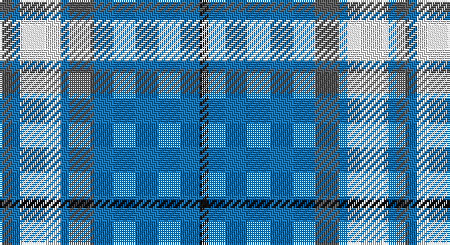

This page is one **sett** — a single exact thread-count. It belongs to the [tartan](/setts/n3b2w10b2n6b26k2/)
(the same proportion at any scale), whose colour order is pattern [BBWBBBK](/stripes/bbwbbbk/).

Part of the [MacLintock](/tartans/maclintock/) tartan — the named design grouping this sett with its other cloths.

Sourced from register-of-tartans.  It is a [7 stripe tartan](/stripes/stripes7/).

Original link https://www.tartanregister.gov.uk/tartanDetails.aspx?ref=5162

## Also known as

This cloth is also recorded under:

- MacLintock #2

## Register references

External register numbers recorded for this tartan.

- Scottish Register of Tartans: [5162](https://www.tartanregister.gov.uk/tartanDetails.aspx?ref=5162)
- Scottish Tartans Authority (ITI): 3329

## Thread count
N/6 B4 W20 B4 N12 B52 K/4

One full sett is **194 threads**.

## Palette

Palette: <strong>Tartan Register</strong> <small style="color:#888">(3 of 4 colours)</small>
<table><thead><tr><th>Colour</th><th>Threads</th><th>Shade</th><th>Base</th><th>OKLCh</th></tr></thead><tbody><tr><td>N/</td><td style="text-align:right;font-variant-numeric:tabular-nums">6</td><td><code style="background-color:#5C5C5C;">#5C5C5C</code> <small style="color:#888">#5C5C5C</small></td><td>B <code style="background-color:#2A418A;">#2A418A</code></td><td><small style="color:#888">oklch(47.5% 0.000 89.9)</small></td></tr><tr><td>B</td><td style="text-align:right;font-variant-numeric:tabular-nums">4</td><td><code style="background-color:#1474B4;">#1474B4</code> <small style="color:#888">#1474B4</small></td><td>B <code style="background-color:#2A418A;">#2A418A</code></td><td><small style="color:#888">oklch(54.0% 0.129 245.1)</small></td></tr><tr><td>W</td><td style="text-align:right;font-variant-numeric:tabular-nums">20</td><td><code style="background-color:#FCFCFC;">#FCFCFC</code> <small style="color:#888">#FCFCFC</small></td><td>W <code style="background-color:#F7F7F7;">#F7F7F7</code></td><td><small style="color:#888">oklch(99.1% 0.000 89.9)</small></td></tr><tr><td>B</td><td style="text-align:right;font-variant-numeric:tabular-nums">4</td><td><code style="background-color:#1474B4;">#1474B4</code> <small style="color:#888">#1474B4</small></td><td>B <code style="background-color:#2A418A;">#2A418A</code></td><td><small style="color:#888">oklch(54.0% 0.129 245.1)</small></td></tr><tr><td>N</td><td style="text-align:right;font-variant-numeric:tabular-nums">12</td><td><code style="background-color:#5C5C5C;">#5C5C5C</code> <small style="color:#888">#5C5C5C</small></td><td>B <code style="background-color:#2A418A;">#2A418A</code></td><td><small style="color:#888">oklch(47.5% 0.000 89.9)</small></td></tr><tr><td>B</td><td style="text-align:right;font-variant-numeric:tabular-nums">52</td><td><code style="background-color:#1474B4;">#1474B4</code> <small style="color:#888">#1474B4</small></td><td>B <code style="background-color:#2A418A;">#2A418A</code></td><td><small style="color:#888">oklch(54.0% 0.129 245.1)</small></td></tr><tr><td>K/</td><td style="text-align:right;font-variant-numeric:tabular-nums">4</td><td><code style="background-color:#101010;">#101010</code> <small style="color:#888">#101010</small></td><td>K <code style="background-color:#000000;">#000000</code></td><td><small style="color:#888">oklch(17.3% 0.000 89.9)</small></td></tr></tbody></table>

# Sample pattern

## Compared to the master

This cloth is one sett of its design; the master sett (the exemplar the design is anchored on) is below for comparison.

<figure style="margin:0"><figcaption style="color:#888;font-size:smaller">this sett</figcaption></figure>
<figure style="margin:0"><figcaption style="color:#888;font-size:smaller"><a href="/setts/g38r3g3r3db9r3t2r40db3r3db2r6/">master sett →</a></figcaption></figure>

## Nearest tartans

The nearest existing variants by ΔTartan distance, with this tartan at the top so the swatches line up against it.

ΔTartan

Tartan

Sett

—

<a href="/ttd/edit/#slug=n3b2w10b2n6b26k2~x2">MacLintock #2</a> <a class="nn-out" href="/variants/s7/n3b2w10b2n6b26k2~x2/" title="open its dictionary page">↗</a>

1.12

<a href="/ttd/edit/#slug=db9lb27db2k4db2lb10db2w3~x2&amp;base=n3b2w10b2n6b26k2~x2">Alaska Highlanders Pipes &amp; Drums Corporate Tartan</a> <a class="nn-out" href="/variants/s8/db9lb27db2k4db2lb10db2w3~x2/" title="open its dictionary page">↗</a>

1.16

<a href="/ttd/edit/#slug=db9lb27db2ly4db2lb10db2w3~x2&amp;base=n3b2w10b2n6b26k2~x2">Alaska Highlanders P &amp; D (Corporate)</a> <a class="nn-out" href="/variants/s8/db9lb27db2ly4db2lb10db2w3~x2/" title="open its dictionary page">↗</a>

1.22

<a href="/ttd/edit/#slug=ly8w3b40k12w3ly3~x2&amp;base=n3b2w10b2n6b26k2~x2">Wolverine (Corporate)</a> <a class="nn-out" href="/variants/s6/ly8w3b40k12w3ly3~x2/" title="open its dictionary page">↗</a>

1.24

<a href="/ttd/edit/#slug=b120g9r7ly12g33ly33b26&amp;base=n3b2w10b2n6b26k2~x2">Supporter.com</a> <a class="nn-out" href="/variants/s7/b120g9r7ly12g33ly33b26/" title="open its dictionary page">↗</a>

1.28

<a href="/ttd/edit/#slug=b30r2b2k5b3dy2b3dy22b3k2b3~x2&amp;base=n3b2w10b2n6b26k2~x2">Dunbarton Weft</a> <a class="nn-out" href="/variants/s11/b30r2b2k5b3dy2b3dy22b3k2b3~x2/" title="open its dictionary page">↗</a>

1.29

<a href="/ttd/edit/#slug=y8ly4y35db2lt8db2y4db21y4~x2&amp;base=n3b2w10b2n6b26k2~x2">Bedford Academy</a> <a class="nn-out" href="/variants/s9/y8ly4y35db2lt8db2y4db21y4~x2/" title="open its dictionary page">↗</a>

1.32

<a href="/ttd/edit/#slug=t42k2w2k2t5n12w32t4~x2&amp;base=n3b2w10b2n6b26k2~x2">Longniddry, dress (Turquoise)</a> <a class="nn-out" href="/variants/s8/t42k2w2k2t5n12w32t4~x2/" title="open its dictionary page">↗</a>

1.32

<a href="/ttd/edit/#slug=db41t2w2t2db5b12w31db4~x2&amp;base=n3b2w10b2n6b26k2~x2">Harmony, Eildon</a> <a class="nn-out" href="/variants/s8/db41t2w2t2db5b12w31db4~x2/" title="open its dictionary page">↗</a>

1.38

<a href="/ttd/edit/#slug=t45w4db4w2ly14db2w2db2~x4&amp;base=n3b2w10b2n6b26k2~x2">Madras 1 (Fashion)</a> <a class="nn-out" href="/variants/s8/t45w4db4w2ly14db2w2db2~x4/" title="open its dictionary page">↗</a>

1.42

<a href="/ttd/edit/#slug=lb1lg11k6lg3lb1lg1lb1~x4&amp;base=n3b2w10b2n6b26k2~x2">Angle, Blue (Fashion)</a> <a class="nn-out" href="/variants/s7/lb1lg11k6lg3lb1lg1lb1~x4/" title="open its dictionary page">↗</a>

## Neighbour map

Every grey dot is one of 14360 variants placed by the first two principal components of the ΔTartan feature space (44% of its variance). Red is this tartan; blue dots are its nearest — click one to open its page.

<svg viewBox="0 0 640 380" role="img" style="max-width:100%;height:auto;border:1px solid #e0e0e0;border-radius:4px;display:block" xmlns="http://www.w3.org/2000/svg"><image href="/nn/cloud.v1.png" width="640" height="380"/><a href="/variants/s8/db9lb27db2k4db2lb10db2w3~x2/"><circle cx="319.0" cy="150.7" r="4" fill="#3465a4"><title>Alaska Highlanders Pipes &amp; Drums Corporate Tartan</title></circle></a><a href="/variants/s8/db9lb27db2ly4db2lb10db2w3~x2/"><circle cx="332.5" cy="153.9" r="4" fill="#3465a4"><title>Alaska Highlanders P &amp; D (Corporate)</title></circle></a><a href="/variants/s6/ly8w3b40k12w3ly3~x2/"><circle cx="302.0" cy="171.7" r="4" fill="#3465a4"><title>Wolverine (Corporate)</title></circle></a><a href="/variants/s7/b120g9r7ly12g33ly33b26/"><circle cx="340.2" cy="166.3" r="4" fill="#3465a4"><title>Supporter.com</title></circle></a><a href="/variants/s11/b30r2b2k5b3dy2b3dy22b3k2b3~x2/"><circle cx="326.4" cy="140.0" r="4" fill="#3465a4"><title>Dunbarton Weft</title></circle></a><a href="/variants/s9/y8ly4y35db2lt8db2y4db21y4~x2/"><circle cx="336.5" cy="159.7" r="4" fill="#3465a4"><title>Bedford Academy</title></circle></a><a href="/variants/s8/t42k2w2k2t5n12w32t4~x2/"><circle cx="296.5" cy="138.3" r="4" fill="#3465a4"><title>Longniddry, dress (Turquoise)</title></circle></a><a href="/variants/s8/db41t2w2t2db5b12w31db4~x2/"><circle cx="285.9" cy="135.9" r="4" fill="#3465a4"><title>Harmony, Eildon</title></circle></a><a href="/variants/s8/t45w4db4w2ly14db2w2db2~x4/"><circle cx="352.4" cy="119.4" r="4" fill="#3465a4"><title>Madras 1 (Fashion)</title></circle></a><a href="/variants/s7/lb1lg11k6lg3lb1lg1lb1~x4/"><circle cx="337.9" cy="192.6" r="4" fill="#3465a4"><title>Angle, Blue (Fashion)</title></circle></a><circle cx="315.1" cy="170.1" r="5" fill="#c00000"/></svg>

ID: /variants/s7/n3b2w10b2n6b26k2~x2/
