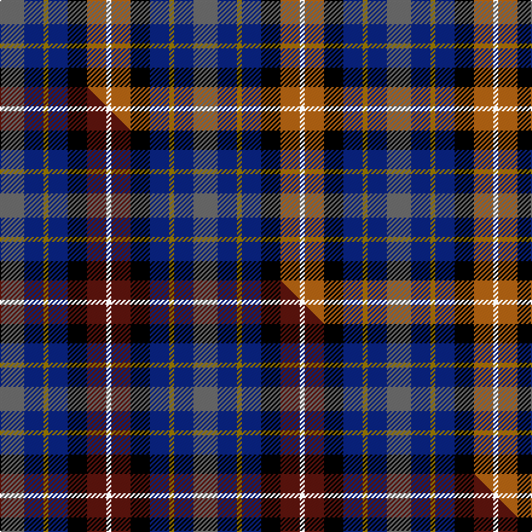

This page is one **sett** — a single exact thread-count. It belongs to the [tartan](/setts/n5db4y1db4k4o4w1/)
(the same proportion at any scale), whose colour order is pattern [BBGBKRW](/stripes/bbgbkrw/).

Part of the [Devon Companion](/tartans/devon-companion/) tartan — the named design grouping this sett with its other cloths.

Sourced from weddslist.  It is a [7 stripe tartan](/stripes/stripes7/).

Original link http://www.weddslist.com/cgi-bin/tartans/pg.pl?source=sts

## Thread count
N/20 DB16 Y4 DB16 K16 O16 W/4

One full sett is **160 threads**.

## Palette
<table><thead><tr><th>Colour</th><th>Shade</th><th>OKLCh</th></tr></thead><tbody><tr><td>DB</td><td><code style="background-color:#082077;">#082077</code> <small style="color:#888">#082077</small></td><td><small style="color:#888">oklch(30.0% 0.149 265.1)</small></td></tr><tr><td>K</td><td><code style="background-color:#000000;">#000000</code> <small style="color:#888">#000000</small></td><td><small style="color:#888">oklch(0.0% 0.000 0.0)</small></td></tr><tr><td>W</td><td><code style="background-color:#F7F7F7;">#F7F7F7</code> <small style="color:#888">#F7F7F7</small></td><td><small style="color:#888">oklch(97.6% 0.000 89.9)</small></td></tr><tr><td>N</td><td><code style="background-color:#636363;">#636363</code> <small style="color:#888">#636363</small></td><td><small style="color:#888">oklch(50.0% 0.000 89.9)</small></td></tr><tr><td>O</td><td><code style="background-color:#A65C11;">#A65C11</code> <small style="color:#888">#A65C11</small></td><td><small style="color:#888">oklch(55.0% 0.125 58.3)</small></td></tr><tr><td>Y</td><td><code style="background-color:#8B6E00;">#8B6E00</code> <small style="color:#888">#8B6E00</small></td><td><small style="color:#888">oklch(55.1% 0.113 90.4)</small></td></tr></tbody></table>

# Sample pattern

## Compared to the master

This cloth is one sett of its design; the master sett (the exemplar the design is anchored on) is below for comparison.

Its **ΔTartan distance** from the master is **1.00** — the same measure the nearest-tartans table ranks by (0 is identical; a re-scale of the same cloth is near 0, a recolour or a different proportion further).

<figure class="master-compare" style="margin:0">

this sett
master sett ★

<figcaption style="color:#888;font-size:smaller">One weave of this sett against the <a href="/setts/n5db4y1db4k4dr4w1/">master sett ★</a>, split on the diagonal: a shared proportion runs seamlessly across it with only the shades shifting; a different proportion breaks on it.</figcaption>
</figure>

## Nearest tartan variants

The nearest existing variants by ΔTartan distance, with this cloth at the top so the swatches line up against it.

ΔTartan

Threads

Variant

Sett

—

160

<a href="/variants/s7/n5db4y1db4k4o4w1~x4/">Devon, Companion</a>

<a href="/ttd/edit/#slug=n5db4y1db4k4dr4w1~x4&amp;base=n5db4y1db4k4o4w1~x4" title="compare in the TTD">1.00</a>

160

<a href="/variants/s7/n5db4y1db4k4dr4w1~x4/">Devon Companion District Tartan</a>

<a href="/ttd/edit/#slug=n5db4y1db4k4dy4w1~x4&amp;base=n5db4y1db4k4o4w1~x4" title="compare in the TTD">1.30</a>

160

<a href="/variants/s7/n5db4y1db4k4dy4w1~x4/">Devon Companion</a>

<a href="/ttd/edit/#slug=k4n4lo1n4r4db4w1~x8~r2406019&amp;base=n5db4y1db4k4o4w1~x4" title="compare in the TTD">2.22</a>

312

<a href="/variants/s7/k4n4lo1n4r4db4w1~x8~r2406019/">Blackdown Hills Corporate Tartan</a>

<a href="/ttd/edit/#slug=g7w4k21n16db16r5~x2&amp;base=n5db4y1db4k4o4w1~x4" title="compare in the TTD">2.47</a>

252

<a href="/variants/s6/g7w4k21n16db16r5~x2/">Hawkes, Norman (Personal)</a>

<a href="/ttd/edit/#slug=db5dp3w2g3k1ly1~x10&amp;base=n5db4y1db4k4o4w1~x4" title="compare in the TTD">2.47</a>

240

<a href="/variants/s6/db5dp3w2g3k1ly1~x10/">MacBlain (2016)</a>

<a href="/ttd/edit/#slug=db20k3g18r12lb4r12db15y4~x2&amp;base=n5db4y1db4k4o4w1~x4" title="compare in the TTD">2.57</a>

304

<a href="/variants/s8/db20k3g18r12lb4r12db15y4~x2/">Sustainability (Fashion)</a>

<a href="/ttd/edit/#slug=k10r3y4db12g4r4w2~x4&amp;base=n5db4y1db4k4o4w1~x4" title="compare in the TTD">2.67</a>

264

<a href="/variants/s7/k10r3y4db12g4r4w2~x4/">Eichelberger Family, Jörg (Personal)</a>

<a href="/ttd/edit/#slug=k8r12w8g15db30y5~x2&amp;base=n5db4y1db4k4o4w1~x4" title="compare in the TTD">2.76</a>

286

<a href="/variants/s6/k8r12w8g15db30y5~x2/">Reekie (Edmonton)</a>

<a href="/ttd/edit/#slug=db4t8k2t5ly2t5dg8dr7dg2dr7dg3~x2~t2704230-ly3402083&amp;base=n5db4y1db4k4o4w1~x4" title="compare in the TTD">2.78</a>

198

<a href="/variants/s11/db4t8k2t5w2t5dg8dr7dg2dr7dg3~x2~t2704230-w3402083/">DunBroch</a>

<a href="/ttd/edit/#slug=r2b3n12k11dg11y2~x2~n2003284-dg1304144&amp;base=n5db4y1db4k4o4w1~x4" title="compare in the TTD">2.83</a>

156

<a href="/variants/s6/r2b3n12k11dg11y2~x2~n2003284-dg1304144/">Huntly Gordon</a>

## Neighbour map

Every grey dot is one of 13620 variants placed by the first two principal components of the ΔTartan feature space (42% of its variance). Red is this tartan; blue dots are its nearest — click one to open its page.

<svg viewBox="0 0 640 380" role="img" style="max-width:100%;height:auto;border:1px solid #e0e0e0;border-radius:4px;display:block" xmlns="http://www.w3.org/2000/svg"><image href="/nn/cloud.v1.png" width="640" height="380"/><a href="/variants/s7/n5db4y1db4k4dr4w1~x4/"><circle cx="69.6" cy="237.8" r="4" fill="#3465a4"><title>Devon Companion District Tartan</title></circle></a><a href="/variants/s7/n5db4y1db4k4dy4w1~x4/"><circle cx="68.8" cy="238.8" r="4" fill="#3465a4"><title>Devon Companion</title></circle></a><a href="/variants/s7/k4n4lo1n4r4db4w1~x8~r2406019/"><circle cx="50.2" cy="242.3" r="4" fill="#3465a4"><title>Blackdown Hills Corporate Tartan</title></circle></a><a href="/variants/s6/g7w4k21n16db16r5~x2/"><circle cx="40.2" cy="221.1" r="4" fill="#3465a4"><title>Hawkes, Norman (Personal)</title></circle></a><a href="/variants/s6/db5dp3w2g3k1ly1~x10/"><circle cx="40.8" cy="223.2" r="4" fill="#3465a4"><title>MacBlain (2016)</title></circle></a><a href="/variants/s8/db20k3g18r12lb4r12db15y4~x2/"><circle cx="108.2" cy="201.1" r="4" fill="#3465a4"><title>Sustainability (Fashion)</title></circle></a><a href="/variants/s7/k10r3y4db12g4r4w2~x4/"><circle cx="39.6" cy="194.3" r="4" fill="#3465a4"><title>Eichelberger Family, Jörg (Personal)</title></circle></a><a href="/variants/s6/k8r12w8g15db30y5~x2/"><circle cx="72.9" cy="202.6" r="4" fill="#3465a4"><title>Reekie (Edmonton)</title></circle></a><a href="/variants/s11/db4t8k2t5w2t5dg8dr7dg2dr7dg3~x2~t2704230-w3402083/"><circle cx="60.6" cy="229.8" r="4" fill="#3465a4"><title>DunBroch</title></circle></a><a href="/variants/s6/r2b3n12k11dg11y2~x2~n2003284-dg1304144/"><circle cx="76.2" cy="210.9" r="4" fill="#3465a4"><title>Huntly Gordon</title></circle></a><circle cx="54.3" cy="231.8" r="5" fill="#c00000"/><text x="320" y="376" text-anchor="middle" font-size="11" fill="#999">ground</text><text x="11" y="190" text-anchor="middle" font-size="11" fill="#999" transform="rotate(-90 11 190)">complexity</text></svg>

ID: /variants/s7/n5db4y1db4k4o4w1~x4/
