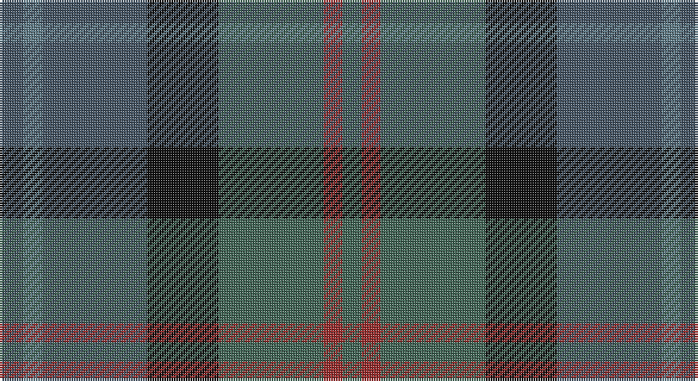

This page is one **sett** — a single exact thread-count. It belongs to the [tartan](/setts/n5t4n22k15y22o4y4/)
(the same proportion at any scale), whose colour order is pattern [BBBKGRG](/stripes/bbbkgrg/).

Part of the [Cairngorm](/tartans/cairngorm/) tartan — the named design grouping this sett with its other cloths.

Sourced from register-of-tartans.  It is a [7 stripe tartan](/stripes/stripes7/).

Original link https://www.tartanregister.gov.uk/tartanDetails.aspx?ref=463

## Also known as

This cloth is also recorded under:

- Cairngorm #2

2 attestations — the source records this cloth was collapsed from (oldest owns this page)

<ul>
<li>01/01/2006 — Cairngorm #2 (register-of-tartans, <a href="https://www.tartanregister.gov.uk/tartanDetails.aspx?ref=463">record</a>)</li>
<li>pre 2006 — Cairngorm #2 (tartans-authority, <a href="http://www.tartansauthority.com/tartan-ferret/display/7071/">record</a>)</li>
</ul>

## Register references

External register numbers recorded for this tartan.

- Scottish Register of Tartans: [463](https://www.tartanregister.gov.uk/tartanDetails.aspx?ref=463)
- Scottish Tartans Authority (ITI): 7071

## Thread count
Na/10 B8 Na44 K30 N44 DR8 N/8

One full sett is **286 threads**.

## Palette

Palette: <strong>Logan (The Scottish Gael, 1831)</strong> <small style="color:#888">(1 of 5 colours)</small>
<table><thead><tr><th>Colour</th><th>Threads</th><th>Shade</th><th>Base</th><th>OKLCh</th></tr></thead><tbody><tr><td>Na/</td><td style="text-align:right;font-variant-numeric:tabular-nums">10</td><td><code style="background-color:#445464;">#445464</code> <small style="color:#888">#445464</small></td><td>B <code style="background-color:#2A418A;">#2A418A</code></td><td><small style="color:#888">oklch(43.9% 0.033 248.6)</small></td></tr><tr><td>B</td><td style="text-align:right;font-variant-numeric:tabular-nums">8</td><td><code style="background-color:#607C88;">#607C88</code> <small style="color:#888">#607C88</small></td><td>B <code style="background-color:#2A418A;">#2A418A</code></td><td><small style="color:#888">oklch(56.9% 0.037 226.0)</small></td></tr><tr><td>Na</td><td style="text-align:right;font-variant-numeric:tabular-nums">44</td><td><code style="background-color:#445464;">#445464</code> <small style="color:#888">#445464</small></td><td>B <code style="background-color:#2A418A;">#2A418A</code></td><td><small style="color:#888">oklch(43.9% 0.033 248.6)</small></td></tr><tr><td>K</td><td style="text-align:right;font-variant-numeric:tabular-nums">30</td><td><code style="background-color:#101010;">#101010</code> <small style="color:#888">#101010</small></td><td>K <code style="background-color:#000000;">#000000</code></td><td><small style="color:#888">oklch(17.3% 0.000 89.9)</small></td></tr><tr><td>N</td><td style="text-align:right;font-variant-numeric:tabular-nums">44</td><td><code style="background-color:#406454;">#406454</code> <small style="color:#888">#406454</small></td><td>G <code style="background-color:#006100;">#006100</code></td><td><small style="color:#888">oklch(47.1% 0.049 164.8)</small></td></tr><tr><td>DR</td><td style="text-align:right;font-variant-numeric:tabular-nums">8</td><td><code style="background-color:#982C2C;">#982C2C</code> <small style="color:#888">#982C2C</small></td><td>R <code style="background-color:#CC0000;">#CC0000</code></td><td><small style="color:#888">oklch(46.0% 0.144 24.8)</small></td></tr><tr><td>N/</td><td style="text-align:right;font-variant-numeric:tabular-nums">8</td><td><code style="background-color:#406454;">#406454</code> <small style="color:#888">#406454</small></td><td>G <code style="background-color:#006100;">#006100</code></td><td><small style="color:#888">oklch(47.1% 0.049 164.8)</small></td></tr></tbody></table>

# Sample pattern

## Compared to the master

This cloth is one sett of its design; the master sett (the exemplar the design is anchored on) is below for comparison.

<figure style="margin:0"><figcaption style="color:#888;font-size:smaller">this sett</figcaption></figure>
<figure style="margin:0"><figcaption style="color:#888;font-size:smaller"><a href="/setts/n2w2ly7o14n2w2/">master sett →</a></figcaption></figure>

## Nearest tartans

The nearest existing variants by ΔTartan distance, with this tartan at the top so the swatches line up against it.

ΔTartan

Tartan

Sett

—

<a href="/ttd/edit/#slug=n5t4n22k15y22o4y4~x2">Cairngorm #2</a> <a class="nn-out" href="/variants/s7/n5t4n22k15y22o4y4~x2/" title="open its dictionary page">↗</a>

1.24

<a href="/ttd/edit/#slug=dr6do26dt28g26dt8y3~x2&amp;base=n5t4n22k15y22o4y4~x2">House of Bruar (Corporate)</a> <a class="nn-out" href="/variants/s6/dr6do26dt28g26dt8y3~x2/" title="open its dictionary page">↗</a>

1.30

<a href="/ttd/edit/#slug=dg3dt22dr10o5dg21r6dt3~x2&amp;base=n5t4n22k15y22o4y4~x2">Swankie</a> <a class="nn-out" href="/variants/s7/dg3dt22dr10o5dg21r6dt3~x2/" title="open its dictionary page">↗</a>

1.37

<a href="/ttd/edit/#slug=dt14k5dp5k5dt14dg32r4~x2&amp;base=n5t4n22k15y22o4y4~x2">Bennachie (Whisky)</a> <a class="nn-out" href="/variants/s7/dt14k5dp5k5dt14dg32r4~x2/" title="open its dictionary page">↗</a>

1.39

<a href="/ttd/edit/#slug=db11g15k2n5dbi3n11~x2&amp;base=n5t4n22k15y22o4y4~x2">Saorsa (Corporate)</a> <a class="nn-out" href="/variants/s6/db11g15k2n5dbi3n11~x2/" title="open its dictionary page">↗</a>

1.41

<a href="/variants/s9/db30dt4dy6ni4dy6n6dy12n13dr4~x2/">Sound of Mull</a>

1.43

<a href="/ttd/edit/#slug=do6lo4do3dt2do5dt2do3dt2y14r3dt2~x2&amp;base=n5t4n22k15y22o4y4~x2">Limerick, County</a> <a class="nn-out" href="/variants/s11/do6lo4do3dt2do5dt2do3dt2y14r3dt2~x2/" title="open its dictionary page">↗</a>

1.49

<a href="/ttd/edit/#slug=dt8db10dt22dg7g10dg22dp3~x2&amp;base=n5t4n22k15y22o4y4~x2">Baron of Crawfordjohn (Personal)</a> <a class="nn-out" href="/variants/s7/dt8db10dt22dg7g10dg22dp3~x2/" title="open its dictionary page">↗</a>

1.51

<a href="/ttd/edit/#slug=ly4dg17k10dt3k3dt17r3dt3~x2&amp;base=n5t4n22k15y22o4y4~x2">Royal Highland Society (Corporate)</a> <a class="nn-out" href="/variants/s8/ly4dg17k10dt3k3dt17r3dt3~x2/" title="open its dictionary page">↗</a>

1.52

<a href="/ttd/edit/#slug=dt1dy1dt7dy5y7lr1~x4&amp;base=n5t4n22k15y22o4y4~x2">Dewar (WCWM)</a> <a class="nn-out" href="/variants/s6/dt1dy1dt7dy5y7lr1~x4/" title="open its dictionary page">↗</a>

1.52

<a href="/ttd/edit/#slug=k4dg16k13db16t3db3~x2&amp;base=n5t4n22k15y22o4y4~x2">I Y</a> <a class="nn-out" href="/variants/s6/k4dg16k13db16t3db3~x2/" title="open its dictionary page">↗</a>

## Neighbour map

Every grey dot is one of 14360 variants placed by the first two principal components of the ΔTartan feature space (44% of its variance). Red is this tartan; blue dots are its nearest — click one to open its page.

<svg viewBox="0 0 640 380" role="img" style="max-width:100%;height:auto;border:1px solid #e0e0e0;border-radius:4px;display:block" xmlns="http://www.w3.org/2000/svg"><image href="/nn/cloud.v1.png" width="640" height="380"/><a href="/variants/s6/dr6do26dt28g26dt8y3~x2/"><circle cx="252.0" cy="273.6" r="4" fill="#3465a4"><title>House of Bruar (Corporate)</title></circle></a><a href="/variants/s7/dg3dt22dr10o5dg21r6dt3~x2/"><circle cx="217.5" cy="249.3" r="4" fill="#3465a4"><title>Swankie</title></circle></a><a href="/variants/s7/dt14k5dp5k5dt14dg32r4~x2/"><circle cx="252.8" cy="243.6" r="4" fill="#3465a4"><title>Bennachie (Whisky)</title></circle></a><a href="/variants/s6/db11g15k2n5dbi3n11~x2/"><circle cx="186.2" cy="262.8" r="4" fill="#3465a4"><title>Saorsa (Corporate)</title></circle></a><a href="/variants/s9/db30dt4dy6ni4dy6n6dy12n13dr4~x2/"><circle cx="224.1" cy="229.3" r="4" fill="#3465a4"><title>Sound of Mull</title></circle></a><a href="/variants/s11/do6lo4do3dt2do5dt2do3dt2y14r3dt2~x2/"><circle cx="224.7" cy="228.9" r="4" fill="#3465a4"><title>Limerick, County</title></circle></a><a href="/variants/s7/dt8db10dt22dg7g10dg22dp3~x2/"><circle cx="242.7" cy="295.1" r="4" fill="#3465a4"><title>Baron of Crawfordjohn (Personal)</title></circle></a><a href="/variants/s8/ly4dg17k10dt3k3dt17r3dt3~x2/"><circle cx="197.7" cy="246.0" r="4" fill="#3465a4"><title>Royal Highland Society (Corporate)</title></circle></a><a href="/variants/s6/dt1dy1dt7dy5y7lr1~x4/"><circle cx="256.3" cy="273.3" r="4" fill="#3465a4"><title>Dewar (WCWM)</title></circle></a><a href="/variants/s6/k4dg16k13db16t3db3~x2/"><circle cx="239.2" cy="311.5" r="4" fill="#3465a4"><title>I Y</title></circle></a><circle cx="218.8" cy="269.7" r="5" fill="#c00000"/></svg>

ID: /variants/s7/n5t4n22k15y22o4y4~x2/
