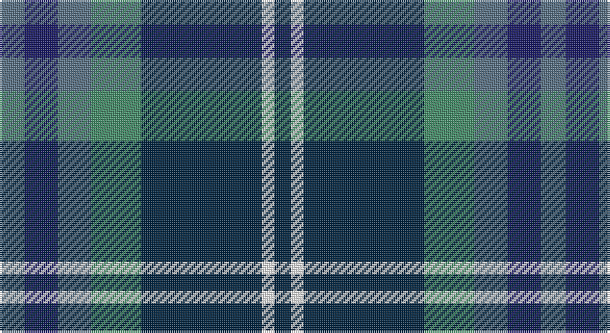

This page is one **sett** — a single exact thread-count. It belongs to the [tartan](/setts/n6db8n8g12dt29w3dt4/)
(the same proportion at any scale), whose colour order is pattern [BBBGBWB](/stripes/bbbgbwb/).

Part of the [Dickson](/tartans/dickson/) tartan — the named design grouping this sett with its other cloths.

Sourced from tartans-authority.  It is a [7 stripe tartan](/stripes/stripes7/).

Original link http://www.tartansauthority.com/tartan-ferret/display/10140/

## Register references

External register numbers recorded for this tartan.

- Scottish Register of Tartans: [10140](https://www.tartanregister.gov.uk/tartanDetails?ref=10140)
- Scottish Tartans Authority (ITI): 10140

## Thread count
B/12 DB16 B16 G24 DN58 W6 DN/8

One full sett is **260 threads**.

## Palette

Palette: <strong>Tartan Register</strong> <small style="color:#888">(1 of 5 colours)</small>
<table><thead><tr><th>Colour</th><th>Threads</th><th>Shade</th><th>Base</th><th>OKLCh</th></tr></thead><tbody><tr><td>B/</td><td style="text-align:right;font-variant-numeric:tabular-nums">12</td><td><code style="background-color:#587084;">#587084</code> <small style="color:#888">#587084</small></td><td>B <code style="background-color:#2A418A;">#2A418A</code></td><td><small style="color:#888">oklch(53.4% 0.042 243.8)</small></td></tr><tr><td>DB</td><td style="text-align:right;font-variant-numeric:tabular-nums">16</td><td><code style="background-color:#181864;">#181864</code> <small style="color:#888">#181864</small></td><td>B <code style="background-color:#2A418A;">#2A418A</code></td><td><small style="color:#888">oklch(27.2% 0.129 273.8)</small></td></tr><tr><td>B</td><td style="text-align:right;font-variant-numeric:tabular-nums">16</td><td><code style="background-color:#587084;">#587084</code> <small style="color:#888">#587084</small></td><td>B <code style="background-color:#2A418A;">#2A418A</code></td><td><small style="color:#888">oklch(53.4% 0.042 243.8)</small></td></tr><tr><td>G</td><td style="text-align:right;font-variant-numeric:tabular-nums">24</td><td><code style="background-color:#448C68;">#448C68</code> <small style="color:#888">#448C68</small></td><td>G <code style="background-color:#006100;">#006100</code></td><td><small style="color:#888">oklch(58.3% 0.092 159.8)</small></td></tr><tr><td>DN</td><td style="text-align:right;font-variant-numeric:tabular-nums">58</td><td><code style="background-color:#002440;">#002440</code> <small style="color:#888">#002440</small></td><td>B <code style="background-color:#2A418A;">#2A418A</code></td><td><small style="color:#888">oklch(25.3% 0.066 246.8)</small></td></tr><tr><td>W</td><td style="text-align:right;font-variant-numeric:tabular-nums">6</td><td><code style="background-color:#F8F8F8;">#F8F8F8</code> <small style="color:#888">#F8F8F8</small></td><td>W <code style="background-color:#F7F7F7;">#F7F7F7</code></td><td><small style="color:#888">oklch(97.9% 0.000 89.9)</small></td></tr><tr><td>DN/</td><td style="text-align:right;font-variant-numeric:tabular-nums">8</td><td><code style="background-color:#002440;">#002440</code> <small style="color:#888">#002440</small></td><td>B <code style="background-color:#2A418A;">#2A418A</code></td><td><small style="color:#888">oklch(25.3% 0.066 246.8)</small></td></tr></tbody></table>

# Sample pattern

## Compared to the master

This cloth is one sett of its design; the master sett (the exemplar the design is anchored on) is below for comparison.

<figure style="margin:0"><figcaption style="color:#888;font-size:smaller">this sett</figcaption></figure>
<figure style="margin:0"><figcaption style="color:#888;font-size:smaller"><a href="/setts/b6k8b6g12db29w3db4/">master sett →</a></figcaption></figure>

## Nearest tartans

The nearest existing variants by ΔTartan distance, with this tartan at the top so the swatches line up against it.

ΔTartan

Tartan

Sett

—

<a href="/ttd/edit/#slug=n6db8n8g12dt29w3dt4~x2">Dickson (Kirkcudbrightshire) (Name)</a> <a class="nn-out" href="/variants/s7/n6db8n8g12dt29w3dt4~x2/" title="open its dictionary page">↗</a>

0.68

<a href="/ttd/edit/#slug=k6g15w2db22r2k4~x2&amp;base=n6db8n8g12dt29w3dt4~x2">Leslie, Hebridean</a> <a class="nn-out" href="/variants/s6/k6g15w2db22r2k4~x2/" title="open its dictionary page">↗</a>

0.77

<a href="/ttd/edit/#slug=db22w2k10g11r3g4~x2&amp;base=n6db8n8g12dt29w3dt4~x2">Paterson Blue (Personal)</a> <a class="nn-out" href="/variants/s6/db22w2k10g11r3g4~x2/" title="open its dictionary page">↗</a>

0.79

<a href="/ttd/edit/#slug=db12k4g4r1g4k1lo1~x4&amp;base=n6db8n8g12dt29w3dt4~x2">MacLaren</a> <a class="nn-out" href="/variants/s7/db12k4g4r1g4k1lo1~x4/" title="open its dictionary page">↗</a>

0.81

<a href="/ttd/edit/#slug=db20k6lo4db3g20w2~x2&amp;base=n6db8n8g12dt29w3dt4~x2">DeLoughery (Personal)</a> <a class="nn-out" href="/variants/s6/db20k6lo4db3g20w2~x2/" title="open its dictionary page">↗</a>

0.90

<a href="/ttd/edit/#slug=dg5lp3dg32k16b32m3b5~x2&amp;base=n6db8n8g12dt29w3dt4~x2">MacThomas (Clan)</a> <a class="nn-out" href="/variants/s7/dg5lp3dg32k16b32m3b5~x2/" title="open its dictionary page">↗</a>

0.90

<a href="/ttd/edit/#slug=db12k4g4dp1g4k1w1~x4&amp;base=n6db8n8g12dt29w3dt4~x2">Alexander - 2000 (Name)</a> <a class="nn-out" href="/variants/s7/db12k4g4dp1g4k1w1~x4/" title="open its dictionary page">↗</a>

0.91

<a href="/ttd/edit/#slug=b11k4g4m1g4k1r1~x4&amp;base=n6db8n8g12dt29w3dt4~x2">Ednie (Personal)</a> <a class="nn-out" href="/variants/s7/b11k4g4m1g4k1r1~x4/" title="open its dictionary page">↗</a>

0.94

<a href="/ttd/edit/#slug=db31b4db5k19g20lo4~x2&amp;base=n6db8n8g12dt29w3dt4~x2">Midlothian</a> <a class="nn-out" href="/variants/s6/db31b4db5k19g20lo4~x2/" title="open its dictionary page">↗</a>

0.96

<a href="/ttd/edit/#slug=db2o10db1o1db10r1db10g10w2~x2&amp;base=n6db8n8g12dt29w3dt4~x2">American Soc.of Travel Agents (Corp)</a> <a class="nn-out" href="/variants/s9/db2o10db1o1db10r1db10g10w2~x2/" title="open its dictionary page">↗</a>

0.98

<a href="/ttd/edit/#slug=g3db12w1k12g13r2g2~x4&amp;base=n6db8n8g12dt29w3dt4~x2">MacFadzean/MacPhedran</a> <a class="nn-out" href="/variants/s7/g3db12w1k12g13r2g2~x4/" title="open its dictionary page">↗</a>

## Neighbour map

Every grey dot is one of 14360 variants placed by the first two principal components of the ΔTartan feature space (44% of its variance). Red is this tartan; blue dots are its nearest — click one to open its page.

<svg viewBox="0 0 640 380" role="img" style="max-width:100%;height:auto;border:1px solid #e0e0e0;border-radius:4px;display:block" xmlns="http://www.w3.org/2000/svg"><image href="/nn/cloud.v1.png" width="640" height="380"/><a href="/variants/s6/k6g15w2db22r2k4~x2/"><circle cx="214.4" cy="198.6" r="4" fill="#3465a4"><title>Leslie, Hebridean</title></circle></a><a href="/variants/s6/db22w2k10g11r3g4~x2/"><circle cx="203.8" cy="205.8" r="4" fill="#3465a4"><title>Paterson Blue (Personal)</title></circle></a><a href="/variants/s7/db12k4g4r1g4k1lo1~x4/"><circle cx="236.6" cy="187.8" r="4" fill="#3465a4"><title>MacLaren</title></circle></a><a href="/variants/s6/db20k6lo4db3g20w2~x2/"><circle cx="206.5" cy="204.1" r="4" fill="#3465a4"><title>DeLoughery (Personal)</title></circle></a><a href="/variants/s7/dg5lp3dg32k16b32m3b5~x2/"><circle cx="213.8" cy="201.7" r="4" fill="#3465a4"><title>MacThomas (Clan)</title></circle></a><a href="/variants/s7/db12k4g4dp1g4k1w1~x4/"><circle cx="223.0" cy="186.9" r="4" fill="#3465a4"><title>Alexander - 2000 (Name)</title></circle></a><a href="/variants/s7/b11k4g4m1g4k1r1~x4/"><circle cx="212.9" cy="195.3" r="4" fill="#3465a4"><title>Ednie (Personal)</title></circle></a><a href="/variants/s6/db31b4db5k19g20lo4~x2/"><circle cx="191.0" cy="227.8" r="4" fill="#3465a4"><title>Midlothian</title></circle></a><a href="/variants/s9/db2o10db1o1db10r1db10g10w2~x2/"><circle cx="231.9" cy="188.6" r="4" fill="#3465a4"><title>American Soc.of Travel Agents (Corp)</title></circle></a><a href="/variants/s7/g3db12w1k12g13r2g2~x4/"><circle cx="193.7" cy="188.3" r="4" fill="#3465a4"><title>MacFadzean/MacPhedran</title></circle></a><circle cx="212.6" cy="203.7" r="5" fill="#c00000"/></svg>

ID: /variants/s7/n6db8n8g12dt29w3dt4~x2/
