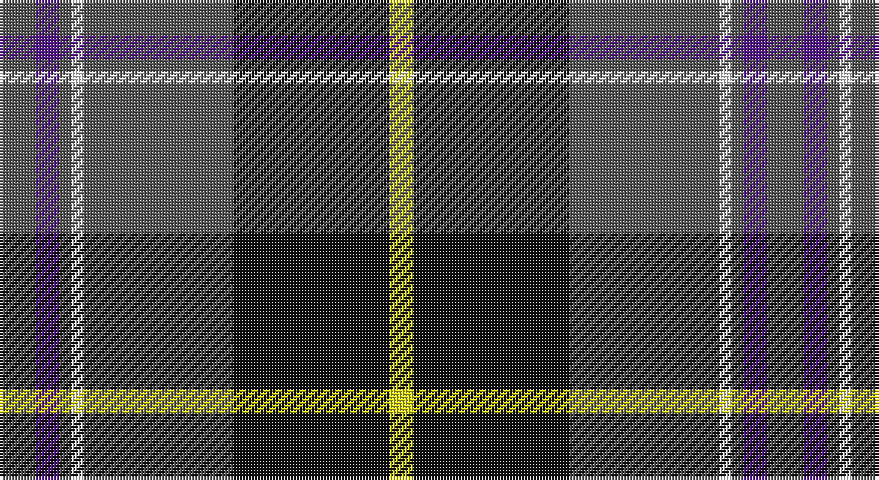

This page is one **sett** — a single exact thread-count. It belongs to the [tartan](/setts/n6dp4n2w2n25k26ly4/)
(the same proportion at any scale), whose colour order is pattern [BBBWBKY](/stripes/bbbwbky/).

Part of the [New York State Troopers](/tartans/new-york-state-troopers/) tartan — the named design grouping this sett with its other cloths.

Sourced from register-of-tartans.  It is a [7 stripe tartan](/stripes/stripes7/).

Original link https://www.tartanregister.gov.uk/tartanDetails.aspx?ref=3123

## Register references

External register numbers recorded for this tartan.

- Scottish Register of Tartans: [3123](https://www.tartanregister.gov.uk/tartanDetails.aspx?ref=3123)
- Scottish Tartans Authority (ITI): 6899

## Thread count
N/12 P8 N4 W4 N50 K52 Y/8

One full sett is **256 threads**.

## Palette

Palette: <strong>Tartan Register</strong> <small style="color:#888">(2 of 5 colours)</small>
<table><thead><tr><th>Colour</th><th>Threads</th><th>Shade</th><th>Base</th><th>OKLCh</th></tr></thead><tbody><tr><td>N/</td><td style="text-align:right;font-variant-numeric:tabular-nums">12</td><td><code style="background-color:#575757;">#575757</code> <small style="color:#888">#575757</small></td><td>B <code style="background-color:#2A418A;">#2A418A</code></td><td><small style="color:#888">oklch(45.7% 0.000 89.9)</small></td></tr><tr><td>P</td><td style="text-align:right;font-variant-numeric:tabular-nums">8</td><td><code style="background-color:#551A8B;">#551A8B</code> <small style="color:#888">#551A8B</small></td><td>B <code style="background-color:#2A418A;">#2A418A</code></td><td><small style="color:#888">oklch(37.8% 0.172 302.2)</small></td></tr><tr><td>N</td><td style="text-align:right;font-variant-numeric:tabular-nums">4</td><td><code style="background-color:#575757;">#575757</code> <small style="color:#888">#575757</small></td><td>B <code style="background-color:#2A418A;">#2A418A</code></td><td><small style="color:#888">oklch(45.7% 0.000 89.9)</small></td></tr><tr><td>W</td><td style="text-align:right;font-variant-numeric:tabular-nums">4</td><td><code style="background-color:#FFFFFF;">#FFFFFF</code> <small style="color:#888">#FFFFFF</small></td><td>W <code style="background-color:#F7F7F7;">#F7F7F7</code></td><td><small style="color:#888">oklch(100.0% 0.000 89.9)</small></td></tr><tr><td>N</td><td style="text-align:right;font-variant-numeric:tabular-nums">50</td><td><code style="background-color:#575757;">#575757</code> <small style="color:#888">#575757</small></td><td>B <code style="background-color:#2A418A;">#2A418A</code></td><td><small style="color:#888">oklch(45.7% 0.000 89.9)</small></td></tr><tr><td>K</td><td style="text-align:right;font-variant-numeric:tabular-nums">52</td><td><code style="background-color:#101010;">#101010</code> <small style="color:#888">#101010</small></td><td>K <code style="background-color:#000000;">#000000</code></td><td><small style="color:#888">oklch(17.3% 0.000 89.9)</small></td></tr><tr><td>Y/</td><td style="text-align:right;font-variant-numeric:tabular-nums">8</td><td><code style="background-color:#D9D919;">#D9D919</code> <small style="color:#888">#D9D919</small></td><td>Y <code style="background-color:#F2BF00;">#F2BF00</code></td><td><small style="color:#888">oklch(85.7% 0.183 109.7)</small></td></tr></tbody></table>

# Sample pattern

## Nearest tartans

The nearest existing variants by ΔTartan distance, with this tartan at the top so the swatches line up against it.

ΔTartan

Tartan

Sett

—

<a href="/ttd/edit/#slug=n6dp4n2w2n25k26ly4~x2">New York State Troopers</a> <a class="nn-out" href="/variants/s7/n6dp4n2w2n25k26ly4~x2/" title="open its dictionary page">↗</a>

0.73

<a href="/ttd/edit/#slug=o6dp4o2w2o24k25lo4~x2&amp;base=n6dp4n2w2n25k26ly4~x2">New York State Troopers (Corporate)</a> <a class="nn-out" href="/variants/s7/o6dp4o2w2o24k25lo4~x2/" title="open its dictionary page">↗</a>

0.81

<a href="/ttd/edit/#slug=n10k7lt2lb2k27b7lt2b7~x2&amp;base=n6dp4n2w2n25k26ly4~x2">Croy, Jake (Personal)</a> <a class="nn-out" href="/variants/s8/n10k7lt2lb2k27b7lt2b7~x2/" title="open its dictionary page">↗</a>

0.92

<a href="/ttd/edit/#slug=dy30ly5b10k10w2k2~x2&amp;base=n6dp4n2w2n25k26ly4~x2">Bryan Wedding (Personal)</a> <a class="nn-out" href="/variants/s6/dy30ly5b10k10w2k2~x2/" title="open its dictionary page">↗</a>

0.92

<a href="/ttd/edit/#slug=k17dg48ly4r10lb12dg4&amp;base=n6dp4n2w2n25k26ly4~x2">Asheville Firefighters, The</a> <a class="nn-out" href="/variants/s6/k17dg48ly4r10lb12dg4/" title="open its dictionary page">↗</a>

0.95

<a href="/ttd/edit/#slug=r6dt4w2g27dt37ly2~x2&amp;base=n6dp4n2w2n25k26ly4~x2">Highlands of Durham (Corporate)</a> <a class="nn-out" href="/variants/s6/r6dt4w2g27dt37ly2~x2/" title="open its dictionary page">↗</a>

0.95

<a href="/ttd/edit/#slug=b9w2dg30o6r2o2r2o6~x2&amp;base=n6dp4n2w2n25k26ly4~x2">Ware/Warr (Name)</a> <a class="nn-out" href="/variants/s8/b9w2dg30o6r2o2r2o6~x2/" title="open its dictionary page">↗</a>

1.02

<a href="/ttd/edit/#slug=w6dy36k48r4k5ly6&amp;base=n6dp4n2w2n25k26ly4~x2">Drambuie Dress</a> <a class="nn-out" href="/variants/s6/w6dy36k48r4k5ly6/" title="open its dictionary page">↗</a>

1.03

<a href="/ttd/edit/#slug=r4db24w2g13db2k3~x4&amp;base=n6dp4n2w2n25k26ly4~x2">Vance (Family Association)</a> <a class="nn-out" href="/variants/s6/r4db24w2g13db2k3~x4/" title="open its dictionary page">↗</a>

1.06

<a href="/ttd/edit/#slug=k35m2k3dp13g8w4g8dp8~x2&amp;base=n6dp4n2w2n25k26ly4~x2">Sheboom</a> <a class="nn-out" href="/variants/s8/k35m2k3dp13g8w4g8dp8~x2/" title="open its dictionary page">↗</a>

1.06

<a href="/ttd/edit/#slug=k5g32db32r3db3ly3~x2&amp;base=n6dp4n2w2n25k26ly4~x2">Carmichael</a> <a class="nn-out" href="/variants/s6/k5g32db32r3db3ly3~x2/" title="open its dictionary page">↗</a>

## Neighbour map

Every grey dot is one of 14360 variants placed by the first two principal components of the ΔTartan feature space (44% of its variance). Red is this tartan; blue dots are its nearest — click one to open its page.

<svg viewBox="0 0 640 380" role="img" style="max-width:100%;height:auto;border:1px solid #e0e0e0;border-radius:4px;display:block" xmlns="http://www.w3.org/2000/svg"><image href="/nn/cloud.v1.png" width="640" height="380"/><a href="/variants/s7/o6dp4o2w2o24k25lo4~x2/"><circle cx="241.7" cy="159.1" r="4" fill="#3465a4"><title>New York State Troopers (Corporate)</title></circle></a><a href="/variants/s8/n10k7lt2lb2k27b7lt2b7~x2/"><circle cx="266.5" cy="169.9" r="4" fill="#3465a4"><title>Croy, Jake (Personal)</title></circle></a><a href="/variants/s6/dy30ly5b10k10w2k2~x2/"><circle cx="267.3" cy="172.5" r="4" fill="#3465a4"><title>Bryan Wedding (Personal)</title></circle></a><a href="/variants/s6/k17dg48ly4r10lb12dg4/"><circle cx="261.5" cy="178.8" r="4" fill="#3465a4"><title>Asheville Firefighters, The</title></circle></a><a href="/variants/s6/r6dt4w2g27dt37ly2~x2/"><circle cx="301.0" cy="159.8" r="4" fill="#3465a4"><title>Highlands of Durham (Corporate)</title></circle></a><a href="/variants/s8/b9w2dg30o6r2o2r2o6~x2/"><circle cx="276.6" cy="145.4" r="4" fill="#3465a4"><title>Ware/Warr (Name)</title></circle></a><a href="/variants/s6/w6dy36k48r4k5ly6/"><circle cx="266.3" cy="174.6" r="4" fill="#3465a4"><title>Drambuie Dress</title></circle></a><a href="/variants/s6/r4db24w2g13db2k3~x4/"><circle cx="276.8" cy="179.4" r="4" fill="#3465a4"><title>Vance (Family Association)</title></circle></a><a href="/variants/s8/k35m2k3dp13g8w4g8dp8~x2/"><circle cx="239.1" cy="147.6" r="4" fill="#3465a4"><title>Sheboom</title></circle></a><a href="/variants/s6/k5g32db32r3db3ly3~x2/"><circle cx="250.5" cy="189.2" r="4" fill="#3465a4"><title>Carmichael</title></circle></a><circle cx="257.6" cy="167.8" r="5" fill="#c00000"/></svg>

ID: /variants/s7/n6dp4n2w2n25k26ly4~x2/
