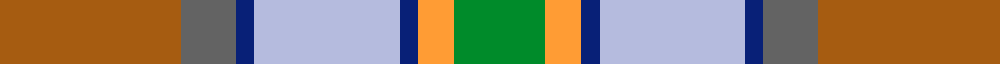

This page is one **sett** — a single exact thread-count. It belongs to the [tartan](/setts/o10n3db1lb8db1lo2g5/)
(the same proportion at any scale), whose colour order is pattern [GYBWBBR](/stripes/gybwbbr/).

Sourced from register-of-tartans.  It is a [7 stripe tartan](/stripes/stripes7/).

Original link https://www.tartanregister.gov.uk/tartanDetails.aspx?ref=3356

2 attestations — the source records this cloth was collapsed from (oldest owns this page)

<ul>
<li>01/01/1980 — Porcupine City of (register-of-tartans, <a href="https://www.tartanregister.gov.uk/tartanDetails.aspx?ref=3356">record</a>)  <em>According to Alec Lumsden (a tartan collector from Canada), this was designed as the 'City of Porcupine' but is also known as Northern Ontario. Porcupine is in north eastern Ontario about 75 miles north of Sudbury.</em></li>
<li>1980 — Porcupine City of (District) (tartans-authority, <a href="http://www.tartansauthority.com/tartan-ferret/display/5493/">record</a>)  <em>According to Alec Lumsden, this was designed as the 'City of Porcupine' but is also known as Northern Ontario. Porcupine is in north eastern Ontario about 75 miles north of Sudbury.</em></li>
</ul>

## Register references

External register numbers recorded for this tartan.

- Scottish Register of Tartans: [3356](https://www.tartanregister.gov.uk/tartanDetails.aspx?ref=3356)
- Scottish Tartans Authority (ITI): 5493

## Thread count
O/40 N12 DB4 LB32 DB4 LO8 G/20

One full sett is **180 threads**.

## Palette
<table><thead><tr><th>Colour</th><th>Shade</th><th>OKLCh</th></tr></thead><tbody><tr><td>DB</td><td><code style="background-color:#082077;">#082077</code> <small style="color:#888">#082077</small></td><td><small style="color:#888">oklch(30.0% 0.149 265.1)</small></td></tr><tr><td>LO</td><td><code style="background-color:#FF9C34;">#FF9C34</code> <small style="color:#888">#FF9C34</small></td><td><small style="color:#888">oklch(77.9% 0.161 61.8)</small></td></tr><tr><td>G</td><td><code style="background-color:#008B2A;">#008B2A</code> <small style="color:#888">#008B2A</small></td><td><small style="color:#888">oklch(55.4% 0.170 145.9)</small></td></tr><tr><td>N</td><td><code style="background-color:#636363;">#636363</code> <small style="color:#888">#636363</small></td><td><small style="color:#888">oklch(50.0% 0.000 89.9)</small></td></tr><tr><td>LB</td><td><code style="background-color:#B5BBDE;">#B5BBDE</code> <small style="color:#888">#B5BBDE</small></td><td><small style="color:#888">oklch(79.9% 0.050 277.6)</small></td></tr><tr><td>O</td><td><code style="background-color:#A65C11;">#A65C11</code> <small style="color:#888">#A65C11</small></td><td><small style="color:#888">oklch(55.0% 0.125 58.3)</small></td></tr></tbody></table>

# Sample pattern

## Nearest variants

The nearest existing variants by ΔTartan distance, with this cloth at the top so the swatches line up against it.

ΔTartan

Threads

Variant

Sett

—

180

<a href="/variants/s7/o10n3db1lb8db1lo2g5~x4/">Porcupine City of</a>

1.91

—

<a href="/variants/s6/w3dbi17o16db2dg17y2~x2~dbi1604274-db0805267/">Atlantic, Ancient</a>

<a href="/ttd/edit/#slug=o17n5db2w12db2y4g7~x2&amp;base=o10n3db1lb8db1lo2g5~x4" title="compare in the TTD">1.93</a>

148

<a href="/variants/s7/o17n5db2w12db2y4g7~x2/">Ontario, Northern</a>

## Neighbour map

Every grey dot is one of 13620 variants placed by the first two principal components of the ΔTartan feature space (42% of its variance). Red is this tartan; blue dots are its nearest — click one to open its page.

<svg viewBox="0 0 640 380" role="img" style="max-width:100%;height:auto;border:1px solid #e0e0e0;border-radius:4px;display:block" xmlns="http://www.w3.org/2000/svg"><image href="/nn/cloud.v1.png" width="640" height="380"/><a href="/variants/s6/w3dbi17o16db2dg17y2~x2~dbi1604274-db0805267/"><circle cx="159.9" cy="216.3" r="4" fill="#3465a4"><title>Atlantic, Ancient</title></circle></a><a href="/variants/s7/o17n5db2w12db2y4g7~x2/"><circle cx="125.4" cy="200.2" r="4" fill="#3465a4"><title>Ontario, Northern</title></circle></a><circle cx="170.1" cy="205.8" r="5" fill="#c00000"/><text x="320" y="376" text-anchor="middle" font-size="11" fill="#999">ground</text><text x="11" y="190" text-anchor="middle" font-size="11" fill="#999" transform="rotate(-90 11 190)">complexity</text></svg>

ID: /variants/s7/o10n3db1lb8db1lo2g5~x4/
