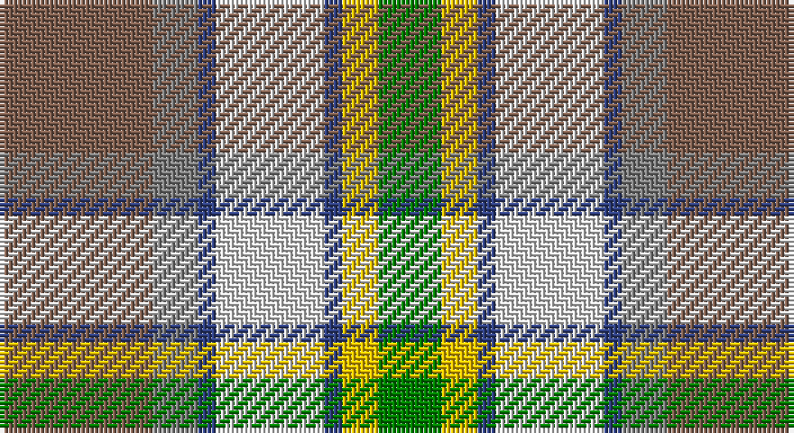

This page is one **sett** — a single exact thread-count. It belongs to the [tartan](/setts/o17y5db2w12db2ly4g7/)
(the same proportion at any scale), whose colour order is pattern [GYBWBGR](/stripes/gybwbgr/).

Sourced from weddslist.  It is a [7 stripe tartan](/stripes/stripes7/).

Original link http://www.weddslist.com/cgi-bin/tartans/pg.pl?source=sts

## Thread count
LT/34 N10 B4 LN24 B4 Y8 G/14

One full sett is **148 threads**.

## Palette

Palette: <strong>Tartan Register</strong> <small style="color:#888">(2 of 6 colours)</small>
<table><thead><tr><th>Colour</th><th>Threads</th><th>Shade</th><th>Base</th><th>OKLCh</th></tr></thead><tbody><tr><td>LT/</td><td style="text-align:right;font-variant-numeric:tabular-nums">34</td><td><code style="background-color:#806050;">#806050</code> <small style="color:#888">#806050</small></td><td>R <code style="background-color:#CC0000;">#CC0000</code></td><td><small style="color:#888">oklch(51.7% 0.049 47.8)</small></td></tr><tr><td>N</td><td style="text-align:right;font-variant-numeric:tabular-nums">10</td><td><code style="background-color:#808080;">#808080</code> <small style="color:#888">#808080</small></td><td>G <code style="background-color:#006100;">#006100</code></td><td><small style="color:#888">oklch(60.0% 0.000 89.9)</small></td></tr><tr><td>B</td><td style="text-align:right;font-variant-numeric:tabular-nums">4</td><td><code style="background-color:#304080;">#304080</code> <small style="color:#888">#304080</small></td><td>B <code style="background-color:#2A418A;">#2A418A</code></td><td><small style="color:#888">oklch(39.4% 0.109 270.2)</small></td></tr><tr><td>LN</td><td style="text-align:right;font-variant-numeric:tabular-nums">24</td><td><code style="background-color:#E0E0E0;">#E0E0E0</code> <small style="color:#888">#E0E0E0</small></td><td>W <code style="background-color:#F7F7F7;">#F7F7F7</code></td><td><small style="color:#888">oklch(90.7% 0.000 89.9)</small></td></tr><tr><td>B</td><td style="text-align:right;font-variant-numeric:tabular-nums">4</td><td><code style="background-color:#304080;">#304080</code> <small style="color:#888">#304080</small></td><td>B <code style="background-color:#2A418A;">#2A418A</code></td><td><small style="color:#888">oklch(39.4% 0.109 270.2)</small></td></tr><tr><td>Y</td><td style="text-align:right;font-variant-numeric:tabular-nums">8</td><td><code style="background-color:#F0C000;">#F0C000</code> <small style="color:#888">#F0C000</small></td><td>Y <code style="background-color:#F2BF00;">#F2BF00</code></td><td><small style="color:#888">oklch(82.7% 0.169 90.5)</small></td></tr><tr><td>G/</td><td style="text-align:right;font-variant-numeric:tabular-nums">14</td><td><code style="background-color:#008000;">#008000</code> <small style="color:#888">#008000</small></td><td>G <code style="background-color:#006100;">#006100</code></td><td><small style="color:#888">oklch(52.0% 0.177 142.5)</small></td></tr></tbody></table>

# Sample pattern

## Nearest tartans

The nearest existing variants by ΔTartan distance, with this tartan at the top so the swatches line up against it.

ΔTartan

Tartan

Sett

—

<a href="/ttd/edit/#slug=o17y5db2w12db2ly4g7~x2">Ontario, Northern</a> <a class="nn-out" href="/variants/s7/o17y5db2w12db2ly4g7~x2/" title="open its dictionary page">↗</a>

0.85

<a href="/ttd/edit/#slug=dy17o5db2w12db2ly4g7~x2&amp;base=o17y5db2w12db2ly4g7~x2">Ontario Northern Canadian District Tartan</a> <a class="nn-out" href="/variants/s7/dy17o5db2w12db2ly4g7~x2/" title="open its dictionary page">↗</a>

0.89

<a href="/ttd/edit/#slug=w6t36lo12g19gi6r6gi6r28gi4&amp;base=o17y5db2w12db2ly4g7~x2">Derry Family (Personal)</a> <a class="nn-out" href="/variants/s9/w6t36lo12g19gi6r6gi6r28gi4/" title="open its dictionary page">↗</a>

1.08

<a href="/ttd/edit/#slug=r6w20g12o3g8t20k2t3~x2&amp;base=o17y5db2w12db2ly4g7~x2">Coulter Dress (Personal)</a> <a class="nn-out" href="/variants/s8/r6w20g12o3g8t20k2t3~x2/" title="open its dictionary page">↗</a>

1.08

<a href="/ttd/edit/#slug=r10n3db1lb8db1lo2g5~x4&amp;base=o17y5db2w12db2ly4g7~x2">Porcupine City of</a> <a class="nn-out" href="/variants/s7/r10n3db1lb8db1lo2g5~x4/" title="open its dictionary page">↗</a>

1.21

<a href="/ttd/edit/#slug=dg2o13dg12w3lb10w3lb12g13r2~x2&amp;base=o17y5db2w12db2ly4g7~x2">Mounth The.. Corporate Tartan</a> <a class="nn-out" href="/variants/s9/dg2o13dg12w3lb10w3lb12g13r2~x2/" title="open its dictionary page">↗</a>

1.23

<a href="/ttd/edit/#slug=o30r3dg14w10r3b30~x2&amp;base=o17y5db2w12db2ly4g7~x2">Cercle de Fermières Varennes</a> <a class="nn-out" href="/variants/s6/o30r3dg14w10r3b30~x2/" title="open its dictionary page">↗</a>

1.24

<a href="/ttd/edit/#slug=dg12g24t48r23w8r23t24ly4g12dg12&amp;base=o17y5db2w12db2ly4g7~x2">Swiss Highlander (Corporate)</a> <a class="nn-out" href="/variants/s10/dg12g24t48r23w8r23t24ly4g12dg12/" title="open its dictionary page">↗</a>

1.26

<a href="/ttd/edit/#slug=r22t6db10ly4r4w4g22db8ly3&amp;base=o17y5db2w12db2ly4g7~x2">Unnamed No 14</a> <a class="nn-out" href="/variants/s9/r22t6db10ly4r4w4g22db8ly3/" title="open its dictionary page">↗</a>

1.30

<a href="/ttd/edit/#slug=m5g2m2g26k9lr9lb13w5~x2&amp;base=o17y5db2w12db2ly4g7~x2">Alexander of Menstry Hunting</a> <a class="nn-out" href="/variants/s8/m5g2m2g26k9lr9lb13w5~x2/" title="open its dictionary page">↗</a>

1.31

<a href="/ttd/edit/#slug=lo13g8k5lb3w2r1~x4&amp;base=o17y5db2w12db2ly4g7~x2">Ball Hunting</a> <a class="nn-out" href="/variants/s6/lo13g8k5lb3w2r1~x4/" title="open its dictionary page">↗</a>

## Neighbour map

Every grey dot is one of 14360 variants placed by the first two principal components of the ΔTartan feature space (44% of its variance). Red is this tartan; blue dots are its nearest — click one to open its page.

<svg viewBox="0 0 640 380" role="img" style="max-width:100%;height:auto;border:1px solid #e0e0e0;border-radius:4px;display:block" xmlns="http://www.w3.org/2000/svg"><image href="/nn/cloud.v1.png" width="640" height="380"/><a href="/variants/s7/dy17o5db2w12db2ly4g7~x2/"><circle cx="87.2" cy="167.3" r="4" fill="#3465a4"><title>Ontario Northern Canadian District Tartan</title></circle></a><a href="/variants/s9/w6t36lo12g19gi6r6gi6r28gi4/"><circle cx="95.9" cy="162.6" r="4" fill="#3465a4"><title>Derry Family (Personal)</title></circle></a><a href="/variants/s8/r6w20g12o3g8t20k2t3~x2/"><circle cx="81.8" cy="153.8" r="4" fill="#3465a4"><title>Coulter Dress (Personal)</title></circle></a><a href="/variants/s7/r10n3db1lb8db1lo2g5~x4/"><circle cx="115.9" cy="164.2" r="4" fill="#3465a4"><title>Porcupine City of</title></circle></a><a href="/variants/s9/dg2o13dg12w3lb10w3lb12g13r2~x2/"><circle cx="54.2" cy="187.1" r="4" fill="#3465a4"><title>Mounth The.. Corporate Tartan</title></circle></a><a href="/variants/s6/o30r3dg14w10r3b30~x2/"><circle cx="146.5" cy="195.2" r="4" fill="#3465a4"><title>Cercle de Fermières Varennes</title></circle></a><a href="/variants/s10/dg12g24t48r23w8r23t24ly4g12dg12/"><circle cx="118.8" cy="160.9" r="4" fill="#3465a4"><title>Swiss Highlander (Corporate)</title></circle></a><a href="/variants/s9/r22t6db10ly4r4w4g22db8ly3/"><circle cx="89.1" cy="164.6" r="4" fill="#3465a4"><title>Unnamed No 14</title></circle></a><a href="/variants/s8/m5g2m2g26k9lr9lb13w5~x2/"><circle cx="131.8" cy="146.5" r="4" fill="#3465a4"><title>Alexander of Menstry Hunting</title></circle></a><a href="/variants/s6/lo13g8k5lb3w2r1~x4/"><circle cx="140.7" cy="153.5" r="4" fill="#3465a4"><title>Ball Hunting</title></circle></a><circle cx="104.5" cy="174.6" r="5" fill="#c00000"/></svg>

ID: /variants/s7/o17y5db2w12db2ly4g7~x2/
