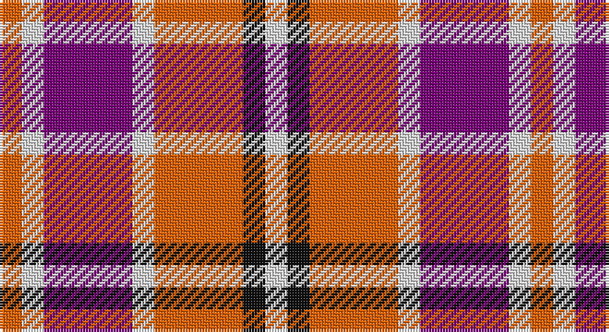

This page is one **sett** — a single exact thread-count. It belongs to the [tartan](/setts/o1w1dp4w1o4k1w1/)
(the same proportion at any scale), whose colour order is pattern [RWBWRKW](/stripes/rwbwrkw/).

Sourced from register-of-tartans.  It is a [7 stripe tartan](/stripes/stripes7/).

Original link https://www.tartanregister.gov.uk/tartanDetails.aspx?ref=4075

2 attestations — the source records this cloth was collapsed from (oldest owns this page)

<ul>
<li>01/09/2000 — Tartan Tangerine (register-of-tartans, <a href="https://www.tartanregister.gov.uk/tartanDetails.aspx?ref=4075">record</a>)</li>
<li>2000 — Tartan Tangerine (Corporate) (tartans-authority, <a href="http://www.tartansauthority.com/tartan-ferret/display/4014/">record</a>)</li>
</ul>

## Register references

External register numbers recorded for this tartan.

- Scottish Register of Tartans: [4075](https://www.tartanregister.gov.uk/tartanDetails.aspx?ref=4075)
- Scottish Tartans Authority (ITI): 4014
- Scottish Tartans World Register: 2731

## Thread count
O/8 LN8 P32 LN8 O32 K8 LN/8

One full sett is **192 threads**.

## Palette

Palette: <strong>Tartan Register</strong>
<table><thead><tr><th>Colour</th><th>Threads</th><th>Shade</th><th>Base</th><th>OKLCh</th></tr></thead><tbody><tr><td>O/</td><td style="text-align:right;font-variant-numeric:tabular-nums">8</td><td><code style="background-color:#E86000;">#E86000</code> <small style="color:#888">#E86000</small></td><td>R <code style="background-color:#CC0000;">#CC0000</code></td><td><small style="color:#888">oklch(65.3% 0.187 44.9)</small></td></tr><tr><td>LN</td><td style="text-align:right;font-variant-numeric:tabular-nums">8</td><td><code style="background-color:#E0E0E0;">#E0E0E0</code> <small style="color:#888">#E0E0E0</small></td><td>W <code style="background-color:#F7F7F7;">#F7F7F7</code></td><td><small style="color:#888">oklch(90.7% 0.000 89.9)</small></td></tr><tr><td>P</td><td style="text-align:right;font-variant-numeric:tabular-nums">32</td><td><code style="background-color:#780078;">#780078</code> <small style="color:#888">#780078</small></td><td>B <code style="background-color:#2A418A;">#2A418A</code></td><td><small style="color:#888">oklch(40.2% 0.185 328.4)</small></td></tr><tr><td>LN</td><td style="text-align:right;font-variant-numeric:tabular-nums">8</td><td><code style="background-color:#E0E0E0;">#E0E0E0</code> <small style="color:#888">#E0E0E0</small></td><td>W <code style="background-color:#F7F7F7;">#F7F7F7</code></td><td><small style="color:#888">oklch(90.7% 0.000 89.9)</small></td></tr><tr><td>O</td><td style="text-align:right;font-variant-numeric:tabular-nums">32</td><td><code style="background-color:#E86000;">#E86000</code> <small style="color:#888">#E86000</small></td><td>R <code style="background-color:#CC0000;">#CC0000</code></td><td><small style="color:#888">oklch(65.3% 0.187 44.9)</small></td></tr><tr><td>K</td><td style="text-align:right;font-variant-numeric:tabular-nums">8</td><td><code style="background-color:#101010;">#101010</code> <small style="color:#888">#101010</small></td><td>K <code style="background-color:#000000;">#000000</code></td><td><small style="color:#888">oklch(17.3% 0.000 89.9)</small></td></tr><tr><td>LN/</td><td style="text-align:right;font-variant-numeric:tabular-nums">8</td><td><code style="background-color:#E0E0E0;">#E0E0E0</code> <small style="color:#888">#E0E0E0</small></td><td>W <code style="background-color:#F7F7F7;">#F7F7F7</code></td><td><small style="color:#888">oklch(90.7% 0.000 89.9)</small></td></tr></tbody></table>

# Sample pattern

## Nearest tartans

The nearest existing variants by ΔTartan distance, with this tartan at the top so the swatches line up against it.

ΔTartan

Tartan

Sett

—

<a href="/ttd/edit/#slug=o1w1dp4w1o4k1w1~x8">Tartan Tangerine</a> <a class="nn-out" href="/variants/s7/o1w1dp4w1o4k1w1~x8/" title="open its dictionary page">↗</a>

1.17

<a href="/ttd/edit/#slug=g16p8r45w6p45w44p6w12&amp;base=o1w1dp4w1o4k1w1~x8">Culloden, Red (dress)</a> <a class="nn-out" href="/variants/s8/g16p8r45w6p45w44p6w12/" title="open its dictionary page">↗</a>

1.42

<a href="/ttd/edit/#slug=k6r33k18w20db6~x2&amp;base=o1w1dp4w1o4k1w1~x8">Brodie Dress</a> <a class="nn-out" href="/variants/s5/k6r33k18w20db6~x2/" title="open its dictionary page">↗</a>

1.54

<a href="/ttd/edit/#slug=r15w7r10db7w3k3w3r8db5w3k3w3~x2&amp;base=o1w1dp4w1o4k1w1~x8">Westgaard of Kileughterco (Personal)</a> <a class="nn-out" href="/variants/s12/r15w7r10db7w3k3w3r8db5w3k3w3~x2/" title="open its dictionary page">↗</a>

1.60

<a href="/ttd/edit/#slug=dp2r4g12r3dp6r10w2~x2&amp;base=o1w1dp4w1o4k1w1~x8">MacKintosh-Geddes (Personal?)</a> <a class="nn-out" href="/variants/s7/dp2r4g12r3dp6r10w2~x2/" title="open its dictionary page">↗</a>

1.63

<a href="/ttd/edit/#slug=k4db2lr13m13lb2~x4&amp;base=o1w1dp4w1o4k1w1~x8">Think Pink (ICF)</a> <a class="nn-out" href="/variants/s5/k4db2lr13m13lb2~x4/" title="open its dictionary page">↗</a>

1.67

<a href="/ttd/edit/#slug=r12dt2ly2lb2dt4lb3~x2&amp;base=o1w1dp4w1o4k1w1~x8">Winnipeg Embroiders' Guild (Corp.)</a> <a class="nn-out" href="/variants/s6/r12dt2ly2lb2dt4lb3~x2/" title="open its dictionary page">↗</a>

1.67

<a href="/ttd/edit/#slug=w6o1r4w1db4o1r8w1r2~x2&amp;base=o1w1dp4w1o4k1w1~x8">Unidentified #41</a> <a class="nn-out" href="/variants/s9/w6o1r4w1db4o1r8w1r2~x2/" title="open its dictionary page">↗</a>

1.69

<a href="/ttd/edit/#slug=ly4r27k12db15ly4~x2&amp;base=o1w1dp4w1o4k1w1~x8">Aberdeen University (1992)</a> <a class="nn-out" href="/variants/s5/ly4r27k12db15ly4~x2/" title="open its dictionary page">↗</a>

1.71

<a href="/ttd/edit/#slug=k3r28k10w28t3~x2&amp;base=o1w1dp4w1o4k1w1~x8">Wallace Dress, Red (Dance)</a> <a class="nn-out" href="/variants/s5/k3r28k10w28t3~x2/" title="open its dictionary page">↗</a>

1.75

<a href="/ttd/edit/#slug=oi6ly3oi20o20oi3o3lb6~x2&amp;base=o1w1dp4w1o4k1w1~x8">Banff</a> <a class="nn-out" href="/variants/s7/oi6ly3oi20o20oi3o3lb6~x2/" title="open its dictionary page">↗</a>

## Neighbour map

Every grey dot is one of 14360 variants placed by the first two principal components of the ΔTartan feature space (44% of its variance). Red is this tartan; blue dots are its nearest — click one to open its page.

<svg viewBox="0 0 640 380" role="img" style="max-width:100%;height:auto;border:1px solid #e0e0e0;border-radius:4px;display:block" xmlns="http://www.w3.org/2000/svg"><image href="/nn/cloud.v1.png" width="640" height="380"/><a href="/variants/s8/g16p8r45w6p45w44p6w12/"><circle cx="141.1" cy="181.0" r="4" fill="#3465a4"><title>Culloden, Red (dress)</title></circle></a><a href="/variants/s5/k6r33k18w20db6~x2/"><circle cx="135.1" cy="225.3" r="4" fill="#3465a4"><title>Brodie Dress</title></circle></a><a href="/variants/s12/r15w7r10db7w3k3w3r8db5w3k3w3~x2/"><circle cx="151.3" cy="187.7" r="4" fill="#3465a4"><title>Westgaard of Kileughterco (Personal)</title></circle></a><a href="/variants/s7/dp2r4g12r3dp6r10w2~x2/"><circle cx="200.6" cy="223.5" r="4" fill="#3465a4"><title>MacKintosh-Geddes (Personal?)</title></circle></a><a href="/variants/s5/k4db2lr13m13lb2~x4/"><circle cx="166.5" cy="203.1" r="4" fill="#3465a4"><title>Think Pink (ICF)</title></circle></a><a href="/variants/s6/r12dt2ly2lb2dt4lb3~x2/"><circle cx="220.6" cy="202.6" r="4" fill="#3465a4"><title>Winnipeg Embroiders' Guild (Corp.)</title></circle></a><a href="/variants/s9/w6o1r4w1db4o1r8w1r2~x2/"><circle cx="219.8" cy="168.9" r="4" fill="#3465a4"><title>Unidentified #41</title></circle></a><a href="/variants/s5/ly4r27k12db15ly4~x2/"><circle cx="187.3" cy="223.5" r="4" fill="#3465a4"><title>Aberdeen University (1992)</title></circle></a><a href="/variants/s5/k3r28k10w28t3~x2/"><circle cx="182.5" cy="187.0" r="4" fill="#3465a4"><title>Wallace Dress, Red (Dance)</title></circle></a><a href="/variants/s7/oi6ly3oi20o20oi3o3lb6~x2/"><circle cx="247.2" cy="200.1" r="4" fill="#3465a4"><title>Banff</title></circle></a><circle cx="139.9" cy="210.6" r="5" fill="#c00000"/></svg>

ID: /variants/s7/o1w1dp4w1o4k1w1~x8/
