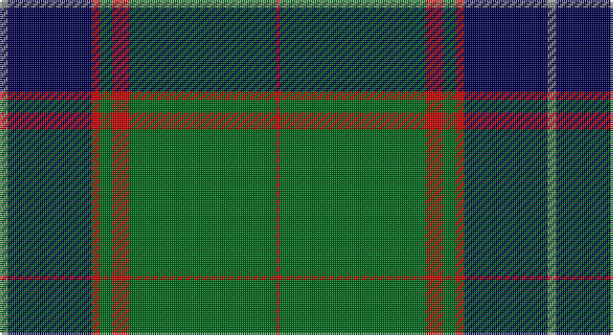

This page is one **sett** — a single exact thread-count. It belongs to the [tartan](/setts/o2db20r2g3r4g35r1/)
(the same proportion at any scale), whose colour order is pattern [RBRGRGR](/stripes/rbrgrgr/).

Sourced from tartans-authority.  It is a [7 stripe tartan](/stripes/stripes7/).

Original link http://www.tartansauthority.com/tartan-ferret/display/10110/

## Register references

External register numbers recorded for this tartan.

- Scottish Register of Tartans: [10110](https://www.tartanregister.gov.uk/tartanDetails?ref=10110)
- Scottish Tartans Authority (ITI): 10110

## Thread count
N/4 DB40 R4 G6 R8 G70 R/2

One full sett is **262 threads**.

## Palette

Palette: <strong>Tartan Register</strong> <small style="color:#888">(3 of 4 colours)</small>
<table><thead><tr><th>Colour</th><th>Threads</th><th>Shade</th><th>Base</th><th>OKLCh</th></tr></thead><tbody><tr><td>N/</td><td style="text-align:right;font-variant-numeric:tabular-nums">4</td><td><code style="background-color:#888888;">#888888</code> <small style="color:#888">#888888</small></td><td>R <code style="background-color:#CC0000;">#CC0000</code></td><td><small style="color:#888">oklch(62.7% 0.000 89.9)</small></td></tr><tr><td>DB</td><td style="text-align:right;font-variant-numeric:tabular-nums">40</td><td><code style="background-color:#00004C;">#00004C</code> <small style="color:#888">#00004C</small></td><td>B <code style="background-color:#2A418A;">#2A418A</code></td><td><small style="color:#888">oklch(18.8% 0.130 264.1)</small></td></tr><tr><td>R</td><td style="text-align:right;font-variant-numeric:tabular-nums">4</td><td><code style="background-color:#C80000;">#C80000</code> <small style="color:#888">#C80000</small></td><td>R <code style="background-color:#CC0000;">#CC0000</code></td><td><small style="color:#888">oklch(52.3% 0.215 29.2)</small></td></tr><tr><td>G</td><td style="text-align:right;font-variant-numeric:tabular-nums">6</td><td><code style="background-color:#006818;">#006818</code> <small style="color:#888">#006818</small></td><td>G <code style="background-color:#006100;">#006100</code></td><td><small style="color:#888">oklch(45.0% 0.142 145.0)</small></td></tr><tr><td>R</td><td style="text-align:right;font-variant-numeric:tabular-nums">8</td><td><code style="background-color:#C80000;">#C80000</code> <small style="color:#888">#C80000</small></td><td>R <code style="background-color:#CC0000;">#CC0000</code></td><td><small style="color:#888">oklch(52.3% 0.215 29.2)</small></td></tr><tr><td>G</td><td style="text-align:right;font-variant-numeric:tabular-nums">70</td><td><code style="background-color:#006818;">#006818</code> <small style="color:#888">#006818</small></td><td>G <code style="background-color:#006100;">#006100</code></td><td><small style="color:#888">oklch(45.0% 0.142 145.0)</small></td></tr><tr><td>R/</td><td style="text-align:right;font-variant-numeric:tabular-nums">2</td><td><code style="background-color:#C80000;">#C80000</code> <small style="color:#888">#C80000</small></td><td>R <code style="background-color:#CC0000;">#CC0000</code></td><td><small style="color:#888">oklch(52.3% 0.215 29.2)</small></td></tr></tbody></table>

# Sample pattern

## Nearest tartans

The nearest existing variants by ΔTartan distance, with this tartan at the top so the swatches line up against it.

ΔTartan

Tartan

Sett

—

<a href="/ttd/edit/#slug=o2db20r2g3r4g35r1~x2">Williams, Jodi (Personal)</a> <a class="nn-out" href="/variants/s7/o2db20r2g3r4g35r1~x2/" title="open its dictionary page">↗</a>

0.85

<a href="/ttd/edit/#slug=db2g2ly1g30db20r2db2r2~x2&amp;base=o2db20r2g3r4g35r1~x2">Gretna Green</a> <a class="nn-out" href="/variants/s8/db2g2ly1g30db20r2db2r2~x2/" title="open its dictionary page">↗</a>

0.88

<a href="/ttd/edit/#slug=g2k1db6k11g26k1g1lo2~x2&amp;base=o2db20r2g3r4g35r1~x2">Mackie (2016)</a> <a class="nn-out" href="/variants/s8/g2k1db6k11g26k1g1lo2~x2/" title="open its dictionary page">↗</a>

0.89

<a href="/ttd/edit/#slug=db2g2k1g30db20r2db2r2~x2&amp;base=o2db20r2g3r4g35r1~x2">Gretna Green Fashion Tartan</a> <a class="nn-out" href="/variants/s8/db2g2k1g30db20r2db2r2~x2/" title="open its dictionary page">↗</a>

0.97

<a href="/ttd/edit/#slug=k6gi55g6k85g4k4gi12k2w5&amp;base=o2db20r2g3r4g35r1~x2">Dropkick Murphys</a> <a class="nn-out" href="/variants/s9/k6gi55g6k85g4k4gi12k2w5/" title="open its dictionary page">↗</a>

1.00

<a href="/ttd/edit/#slug=db4k4db24g32w1g2~x2&amp;base=o2db20r2g3r4g35r1~x2">Oliphant</a> <a class="nn-out" href="/variants/s6/db4k4db24g32w1g2~x2/" title="open its dictionary page">↗</a>

1.02

<a href="/ttd/edit/#slug=g55k17r9k11ly2k4~x2&amp;base=o2db20r2g3r4g35r1~x2">Moran (Name)</a> <a class="nn-out" href="/variants/s6/g55k17r9k11ly2k4~x2/" title="open its dictionary page">↗</a>

1.04

<a href="/ttd/edit/#slug=ly3g2k1g30db24k2db2k2~x2&amp;base=o2db20r2g3r4g35r1~x2">Johnston / Johnstone</a> <a class="nn-out" href="/variants/s8/ly3g2k1g30db24k2db2k2~x2/" title="open its dictionary page">↗</a>

1.17

<a href="/ttd/edit/#slug=b10k6g42k2g1k2r1k24r2~x2&amp;base=o2db20r2g3r4g35r1~x2">Black Thistle</a> <a class="nn-out" href="/variants/s9/b10k6g42k2g1k2r1k24r2~x2/" title="open its dictionary page">↗</a>

1.25

<a href="/ttd/edit/#slug=k83r16dg56k2w5k2dg56r5~x2&amp;base=o2db20r2g3r4g35r1~x2">MacDiarmid #2</a> <a class="nn-out" href="/variants/s8/k83r16dg56k2w5k2dg56r5~x2/" title="open its dictionary page">↗</a>

1.29

<a href="/ttd/edit/#slug=g55k17r9k11ly2db4~x2&amp;base=o2db20r2g3r4g35r1~x2">Moran Family Tartan</a> <a class="nn-out" href="/variants/s6/g55k17r9k11ly2db4~x2/" title="open its dictionary page">↗</a>

## Neighbour map

Every grey dot is one of 14360 variants placed by the first two principal components of the ΔTartan feature space (44% of its variance). Red is this tartan; blue dots are its nearest — click one to open its page.

<svg viewBox="0 0 640 380" role="img" style="max-width:100%;height:auto;border:1px solid #e0e0e0;border-radius:4px;display:block" xmlns="http://www.w3.org/2000/svg"><image href="/nn/cloud.v1.png" width="640" height="380"/><a href="/variants/s8/db2g2ly1g30db20r2db2r2~x2/"><circle cx="367.0" cy="141.5" r="4" fill="#3465a4"><title>Gretna Green</title></circle></a><a href="/variants/s8/g2k1db6k11g26k1g1lo2~x2/"><circle cx="380.2" cy="157.7" r="4" fill="#3465a4"><title>Mackie (2016)</title></circle></a><a href="/variants/s8/db2g2k1g30db20r2db2r2~x2/"><circle cx="368.6" cy="142.9" r="4" fill="#3465a4"><title>Gretna Green Fashion Tartan</title></circle></a><a href="/variants/s9/k6gi55g6k85g4k4gi12k2w5/"><circle cx="384.4" cy="124.2" r="4" fill="#3465a4"><title>Dropkick Murphys</title></circle></a><a href="/variants/s6/db4k4db24g32w1g2~x2/"><circle cx="349.8" cy="166.4" r="4" fill="#3465a4"><title>Oliphant</title></circle></a><a href="/variants/s6/g55k17r9k11ly2k4~x2/"><circle cx="369.3" cy="171.5" r="4" fill="#3465a4"><title>Moran (Name)</title></circle></a><a href="/variants/s8/ly3g2k1g30db24k2db2k2~x2/"><circle cx="323.9" cy="135.8" r="4" fill="#3465a4"><title>Johnston / Johnstone</title></circle></a><a href="/variants/s9/b10k6g42k2g1k2r1k24r2~x2/"><circle cx="336.0" cy="119.1" r="4" fill="#3465a4"><title>Black Thistle</title></circle></a><a href="/variants/s8/k83r16dg56k2w5k2dg56r5~x2/"><circle cx="358.1" cy="152.0" r="4" fill="#3465a4"><title>MacDiarmid #2</title></circle></a><a href="/variants/s6/g55k17r9k11ly2db4~x2/"><circle cx="344.8" cy="156.2" r="4" fill="#3465a4"><title>Moran Family Tartan</title></circle></a><circle cx="376.0" cy="145.1" r="5" fill="#c00000"/></svg>

ID: /variants/s7/o2db20r2g3r4g35r1~x2/
