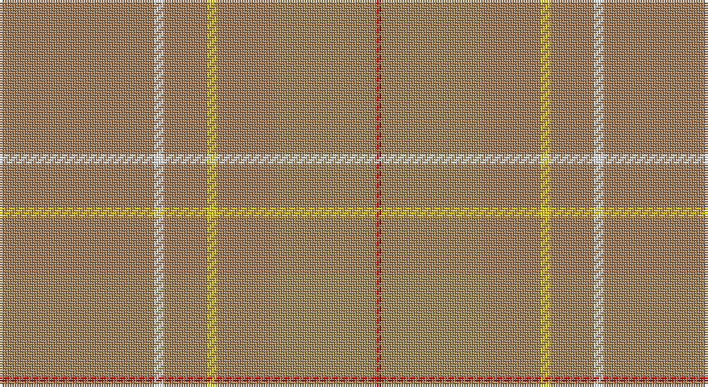

This page is one **sett** — a single exact thread-count. It belongs to the [tartan](/setts/o32w2o9ly2o12lo21r1/)
(the same proportion at any scale), whose colour order is pattern [RWRYRYR](/stripes/rwryryr/).

Part of the [Weathered Cyclist](/tartans/weathered-cyclist/) tartan — the named design grouping this sett with its other cloths.

Sourced from tartans-authority.  It is a [7 stripe tartan](/stripes/stripes7/).

Original link http://www.tartansauthority.com/tartan-ferret/display/10732/

## Also known as

This cloth is also recorded under:

- Weathered Cyclist Commemorative

## Register references

External register numbers recorded for this tartan.

- Scottish Register of Tartans: [10732](https://www.tartanregister.gov.uk/tartanDetails?ref=10732)
- Scottish Tartans Authority (ITI): 10732

## Thread count
LTa/64 W4 LTa18 Y4 LTa24 LT42 R/2

One full sett is **250 threads**.

## Palette

Palette: <strong>Tartan Register</strong>
<table><thead><tr><th>Colour</th><th>Threads</th><th>Shade</th><th>Base</th><th>OKLCh</th></tr></thead><tbody><tr><td>LTa/</td><td style="text-align:right;font-variant-numeric:tabular-nums">64</td><td><code style="background-color:#A07C58;">#A07C58</code> <small style="color:#888">#A07C58</small></td><td>R <code style="background-color:#CC0000;">#CC0000</code></td><td><small style="color:#888">oklch(61.2% 0.067 66.0)</small></td></tr><tr><td>W</td><td style="text-align:right;font-variant-numeric:tabular-nums">4</td><td><code style="background-color:#FCFCFC;">#FCFCFC</code> <small style="color:#888">#FCFCFC</small></td><td>W <code style="background-color:#F7F7F7;">#F7F7F7</code></td><td><small style="color:#888">oklch(99.1% 0.000 89.9)</small></td></tr><tr><td>LTa</td><td style="text-align:right;font-variant-numeric:tabular-nums">18</td><td><code style="background-color:#A07C58;">#A07C58</code> <small style="color:#888">#A07C58</small></td><td>R <code style="background-color:#CC0000;">#CC0000</code></td><td><small style="color:#888">oklch(61.2% 0.067 66.0)</small></td></tr><tr><td>Y</td><td style="text-align:right;font-variant-numeric:tabular-nums">4</td><td><code style="background-color:#FCCC00;">#FCCC00</code> <small style="color:#888">#FCCC00</small></td><td>Y <code style="background-color:#F2BF00;">#F2BF00</code></td><td><small style="color:#888">oklch(86.2% 0.176 91.5)</small></td></tr><tr><td>LTa</td><td style="text-align:right;font-variant-numeric:tabular-nums">24</td><td><code style="background-color:#A07C58;">#A07C58</code> <small style="color:#888">#A07C58</small></td><td>R <code style="background-color:#CC0000;">#CC0000</code></td><td><small style="color:#888">oklch(61.2% 0.067 66.0)</small></td></tr><tr><td>LT</td><td style="text-align:right;font-variant-numeric:tabular-nums">42</td><td><code style="background-color:#A08858;">#A08858</code> <small style="color:#888">#A08858</small></td><td>Y <code style="background-color:#F2BF00;">#F2BF00</code></td><td><small style="color:#888">oklch(63.7% 0.071 84.0)</small></td></tr><tr><td>R/</td><td style="text-align:right;font-variant-numeric:tabular-nums">2</td><td><code style="background-color:#C80000;">#C80000</code> <small style="color:#888">#C80000</small></td><td>R <code style="background-color:#CC0000;">#CC0000</code></td><td><small style="color:#888">oklch(52.3% 0.215 29.2)</small></td></tr></tbody></table>

# Sample pattern

## Compared to the master

This cloth is one sett of its design; the master sett (the exemplar the design is anchored on) is below for comparison.

<figure style="margin:0"><figcaption style="color:#888;font-size:smaller">this sett</figcaption></figure>
<figure style="margin:0"><figcaption style="color:#888;font-size:smaller"><a href="/setts/y32w2y9ly2y12o21r1/">master sett →</a></figcaption></figure>

## Nearest tartans

The nearest existing variants by ΔTartan distance, with this tartan at the top so the swatches line up against it.

ΔTartan

Tartan

Sett

—

<a href="/ttd/edit/#slug=o32w2o9ly2o12lo21r1~x2">Weathered Cyclist (Corporate)</a> <a class="nn-out" href="/variants/s7/o32w2o9ly2o12lo21r1~x2/" title="open its dictionary page">↗</a>

2.57

<a href="/ttd/edit/#slug=lo5n2y8n1y8n4y4n6y18lr1lo5~x2&amp;base=o32w2o9ly2o12lo21r1~x2">Bute Heather, Ancient Wth'd (Fashion</a> <a class="nn-out" href="/variants/s11/lo5n2y8n1y8n4y4n6y18lr1lo5~x2/" title="open its dictionary page">↗</a>

2.58

<a href="/ttd/edit/#slug=y32w2y9ly2y12o21r1~x2&amp;base=o32w2o9ly2o12lo21r1~x2">Weathered Cyclist</a> <a class="nn-out" href="/variants/s7/y32w2y9ly2y12o21r1~x2/" title="open its dictionary page">↗</a>

2.70

<a href="/ttd/edit/#slug=oi12o6oi2ly1~x4&amp;base=o32w2o9ly2o12lo21r1~x2">Loch Garth</a> <a class="nn-out" href="/variants/s4/oi12o6oi2ly1~x4/" title="open its dictionary page">↗</a>

2.91

<a href="/ttd/edit/#slug=t48o28w4o28t48ly3~x2&amp;base=o32w2o9ly2o12lo21r1~x2">McKerrell of Hillhouse Dress</a> <a class="nn-out" href="/variants/s6/t48o28w4o28t48ly3~x2/" title="open its dictionary page">↗</a>

3.01

<a href="/ttd/edit/#slug=lo56db2lo19db1lo2db1lo2~x2&amp;base=o32w2o9ly2o12lo21r1~x2">Lewis (Welsh Name)</a> <a class="nn-out" href="/variants/s7/lo56db2lo19db1lo2db1lo2~x2/" title="open its dictionary page">↗</a>

3.17

<a href="/ttd/edit/#slug=y34n27r3n27y34w3~x2&amp;base=o32w2o9ly2o12lo21r1~x2">London Regiment (Military)</a> <a class="nn-out" href="/variants/s6/y34n27r3n27y34w3~x2/" title="open its dictionary page">↗</a>

3.40

<a href="/ttd/edit/#slug=oii39oi4oii6o2oii2w2oii2oi12oii6oii2oii6o2~x2&amp;base=o32w2o9ly2o12lo21r1~x2">Glen Clova</a> <a class="nn-out" href="/variants/s12/oii39oi4oii6o2oii2w2oii2oi12oii6oii2oii6o2~x2/" title="open its dictionary page">↗</a>

3.56

<a href="/ttd/edit/#slug=y22dp1yi22r4~x4&amp;base=o32w2o9ly2o12lo21r1~x2">McWilliams (2014)</a> <a class="nn-out" href="/variants/s4/y22dp1yi22r4~x4/" title="open its dictionary page">↗</a>

3.58

<a href="/ttd/edit/#slug=dy2n4y12n3dy6t2n24dy2n2y2~x2&amp;base=o32w2o9ly2o12lo21r1~x2">Wicklow Irish County Tartan</a> <a class="nn-out" href="/variants/s10/dy2n4y12n3dy6t2n24dy2n2y2~x2/" title="open its dictionary page">↗</a>

3.66

<a href="/ttd/edit/#slug=y52ly2n24r3lo26n4~x2&amp;base=o32w2o9ly2o12lo21r1~x2">Outlander #1</a> <a class="nn-out" href="/variants/s6/y52ly2n24r3lo26n4~x2/" title="open its dictionary page">↗</a>

## Neighbour map

Every grey dot is one of 14360 variants placed by the first two principal components of the ΔTartan feature space (44% of its variance). Red is this tartan; blue dots are its nearest — click one to open its page.

<svg viewBox="0 0 640 380" role="img" style="max-width:100%;height:auto;border:1px solid #e0e0e0;border-radius:4px;display:block" xmlns="http://www.w3.org/2000/svg"><image href="/nn/cloud.v1.png" width="640" height="380"/><a href="/variants/s11/lo5n2y8n1y8n4y4n6y18lr1lo5~x2/"><circle cx="560.0" cy="292.2" r="4" fill="#3465a4"><title>Bute Heather, Ancient Wth'd (Fashion</title></circle></a><a href="/variants/s7/y32w2y9ly2y12o21r1~x2/"><circle cx="560.6" cy="225.1" r="4" fill="#3465a4"><title>Weathered Cyclist</title></circle></a><a href="/variants/s4/oi12o6oi2ly1~x4/"><circle cx="620.0" cy="354.7" r="4" fill="#3465a4"><title>Loch Garth</title></circle></a><a href="/variants/s6/t48o28w4o28t48ly3~x2/"><circle cx="550.9" cy="328.9" r="4" fill="#3465a4"><title>McKerrell of Hillhouse Dress</title></circle></a><a href="/variants/s7/lo56db2lo19db1lo2db1lo2~x2/"><circle cx="626.0" cy="245.1" r="4" fill="#3465a4"><title>Lewis (Welsh Name)</title></circle></a><a href="/variants/s6/y34n27r3n27y34w3~x2/"><circle cx="468.5" cy="328.4" r="4" fill="#3465a4"><title>London Regiment (Military)</title></circle></a><a href="/variants/s12/oii39oi4oii6o2oii2w2oii2oi12oii6oii2oii6o2~x2/"><circle cx="511.4" cy="192.2" r="4" fill="#3465a4"><title>Glen Clova</title></circle></a><a href="/variants/s4/y22dp1yi22r4~x4/"><circle cx="469.0" cy="293.3" r="4" fill="#3465a4"><title>McWilliams (2014)</title></circle></a><a href="/variants/s10/dy2n4y12n3dy6t2n24dy2n2y2~x2/"><circle cx="552.4" cy="298.8" r="4" fill="#3465a4"><title>Wicklow Irish County Tartan</title></circle></a><a href="/variants/s6/y52ly2n24r3lo26n4~x2/"><circle cx="424.2" cy="230.2" r="4" fill="#3465a4"><title>Outlander #1</title></circle></a><circle cx="609.4" cy="248.6" r="5" fill="#c00000"/></svg>

ID: /variants/s7/o32w2o9ly2o12lo21r1~x2/
