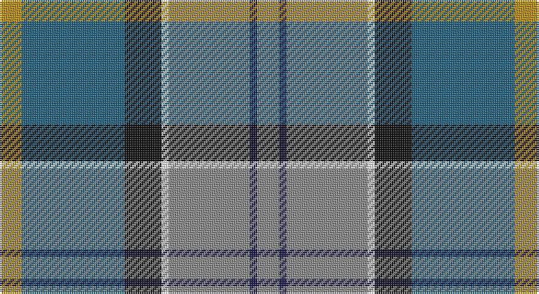

This page is one **sett** — a single exact thread-count. It belongs to the [tartan](/setts/o3db1o11w1k5n14lo3/)
(the same proportion at any scale), whose colour order is pattern [RBRWKBY](/stripes/rbrwkby/).

Part of the [Glen Lyon](/tartans/glen-lyon-2/) tartan — the named design grouping this sett with its other cloths.

Sourced from register-of-tartans.  It is a [7 stripe tartan](/stripes/stripes7/).

Original link https://www.tartanregister.gov.uk/tartanDetails.aspx?ref=1384

## Also known as

This cloth is also recorded under:

- Glen Lyon #1
- Glen Lyon #2
- Wilson's No.053

2 attestations — the source records this cloth was collapsed from (oldest owns this page)

<ul>
<li>01/01/1984 — Glen Lyon (Fashion) (register-of-tartans, <a href="https://www.tartanregister.gov.uk/tartanDetails.aspx?ref=1384">record</a>)</li>
<li>pre 1984 — Glen Lyon (Fashion) (tartans-authority, <a href="http://www.tartansauthority.com/tartan-ferret/display/5013/">record</a>)</li>
</ul>

## Register references

External register numbers recorded for this tartan.

- Scottish Register of Tartans: [1384](https://www.tartanregister.gov.uk/tartanDetails.aspx?ref=1384)
- Scottish Tartans Authority (ITI): 5013

## Thread count
DY/12 B56 K20 W4 N44 DB4 N/12

One full sett is **280 threads**.

## Palette

Palette: <strong>Tartan Register</strong> <small style="color:#888">(5 of 6 colours)</small>
<table><thead><tr><th>Colour</th><th>Threads</th><th>Shade</th><th>Base</th><th>OKLCh</th></tr></thead><tbody><tr><td>DY/</td><td style="text-align:right;font-variant-numeric:tabular-nums">12</td><td><code style="background-color:#BC8C00;">#BC8C00</code> <small style="color:#888">#BC8C00</small></td><td>Y <code style="background-color:#F2BF00;">#F2BF00</code></td><td><small style="color:#888">oklch(66.8% 0.137 84.1)</small></td></tr><tr><td>B</td><td style="text-align:right;font-variant-numeric:tabular-nums">56</td><td><code style="background-color:#206084;">#206084</code> <small style="color:#888">#206084</small></td><td>B <code style="background-color:#2A418A;">#2A418A</code></td><td><small style="color:#888">oklch(46.6% 0.086 237.7)</small></td></tr><tr><td>K</td><td style="text-align:right;font-variant-numeric:tabular-nums">20</td><td><code style="background-color:#101010;">#101010</code> <small style="color:#888">#101010</small></td><td>K <code style="background-color:#000000;">#000000</code></td><td><small style="color:#888">oklch(17.3% 0.000 89.9)</small></td></tr><tr><td>W</td><td style="text-align:right;font-variant-numeric:tabular-nums">4</td><td><code style="background-color:#FCFCFC;">#FCFCFC</code> <small style="color:#888">#FCFCFC</small></td><td>W <code style="background-color:#F7F7F7;">#F7F7F7</code></td><td><small style="color:#888">oklch(99.1% 0.000 89.9)</small></td></tr><tr><td>N</td><td style="text-align:right;font-variant-numeric:tabular-nums">44</td><td><code style="background-color:#888888;">#888888</code> <small style="color:#888">#888888</small></td><td>R <code style="background-color:#CC0000;">#CC0000</code></td><td><small style="color:#888">oklch(62.7% 0.000 89.9)</small></td></tr><tr><td>DB</td><td style="text-align:right;font-variant-numeric:tabular-nums">4</td><td><code style="background-color:#1C1C50;">#1C1C50</code> <small style="color:#888">#1C1C50</small></td><td>B <code style="background-color:#2A418A;">#2A418A</code></td><td><small style="color:#888">oklch(26.2% 0.093 277.9)</small></td></tr><tr><td>N/</td><td style="text-align:right;font-variant-numeric:tabular-nums">12</td><td><code style="background-color:#888888;">#888888</code> <small style="color:#888">#888888</small></td><td>R <code style="background-color:#CC0000;">#CC0000</code></td><td><small style="color:#888">oklch(62.7% 0.000 89.9)</small></td></tr></tbody></table>

# Sample pattern

## Compared to the master

This cloth is one sett of its design; the master sett (the exemplar the design is anchored on) is below for comparison.

<figure style="margin:0"><figcaption style="color:#888;font-size:smaller">this sett</figcaption></figure>
<figure style="margin:0"><figcaption style="color:#888;font-size:smaller"><a href="/setts/k6g5r2/">master sett →</a></figcaption></figure>

## Nearest tartans

The nearest existing variants by ΔTartan distance, with this tartan at the top so the swatches line up against it.

ΔTartan

Tartan

Sett

—

<a href="/ttd/edit/#slug=o3db1o11w1k5n14lo3~x4">Glen Lyon (Fashion)</a> <a class="nn-out" href="/variants/s7/o3db1o11w1k5n14lo3~x4/" title="open its dictionary page">↗</a>

0.83

<a href="/ttd/edit/#slug=r3w2o7n25k8o15dg2~x2&amp;base=o3db1o11w1k5n14lo3~x4">Allman-Jones (Personal)</a> <a class="nn-out" href="/variants/s7/r3w2o7n25k8o15dg2~x2/" title="open its dictionary page">↗</a>

0.97

<a href="/ttd/edit/#slug=r3w2y7n25k8y15dg2~x2&amp;base=o3db1o11w1k5n14lo3~x4">Allman-Jones (Personal)</a> <a class="nn-out" href="/variants/s7/r3w2y7n25k8y15dg2~x2/" title="open its dictionary page">↗</a>

0.98

<a href="/ttd/edit/#slug=r4do27lo6n19b38lb4~x2&amp;base=o3db1o11w1k5n14lo3~x4">State Seal of Michigan (Fashion)</a> <a class="nn-out" href="/variants/s6/r4do27lo6n19b38lb4~x2/" title="open its dictionary page">↗</a>

1.02

<a href="/ttd/edit/#slug=db2r1db10w1dy4g8ly1g2~x4&amp;base=o3db1o11w1k5n14lo3~x4">Ayrshire District Tartan</a> <a class="nn-out" href="/variants/s8/db2r1db10w1dy4g8ly1g2~x4/" title="open its dictionary page">↗</a>

1.02

<a href="/ttd/edit/#slug=db2r1db10w1o4g8ly1g2~x4&amp;base=o3db1o11w1k5n14lo3~x4">Ayrshire</a> <a class="nn-out" href="/variants/s8/db2r1db10w1o4g8ly1g2~x4/" title="open its dictionary page">↗</a>

1.07

<a href="/ttd/edit/#slug=ly1lt2n15k2lt2k2g12w2lt1~x2&amp;base=o3db1o11w1k5n14lo3~x4">Hek Family (Sunningdale, Berwick on Tweed)</a> <a class="nn-out" href="/variants/s9/ly1lt2n15k2lt2k2g12w2lt1~x2/" title="open its dictionary page">↗</a>

1.09

<a href="/ttd/edit/#slug=r16ly2dy7ly2b24k2g2~x2&amp;base=o3db1o11w1k5n14lo3~x4">Traill Clan/Family Weavers Tartan</a> <a class="nn-out" href="/variants/s7/r16ly2dy7ly2b24k2g2~x2/" title="open its dictionary page">↗</a>

1.12

<a href="/ttd/edit/#slug=db20t8lo5k6t4r3t3y30r2t3~x2&amp;base=o3db1o11w1k5n14lo3~x4">Thousand Islands</a> <a class="nn-out" href="/variants/s10/db20t8lo5k6t4r3t3y30r2t3~x2/" title="open its dictionary page">↗</a>

1.16

<a href="/ttd/edit/#slug=g5db15t11w2t1w1dg4~x4&amp;base=o3db1o11w1k5n14lo3~x4">Highlands Country Club</a> <a class="nn-out" href="/variants/s7/g5db15t11w2t1w1dg4~x4/" title="open its dictionary page">↗</a>

1.18

<a href="/ttd/edit/#slug=k1ly1db8g10t7w1~x2&amp;base=o3db1o11w1k5n14lo3~x4">Porteous</a> <a class="nn-out" href="/variants/s6/k1ly1db8g10t7w1~x2/" title="open its dictionary page">↗</a>

## Neighbour map

Every grey dot is one of 14360 variants placed by the first two principal components of the ΔTartan feature space (44% of its variance). Red is this tartan; blue dots are its nearest — click one to open its page.

<svg viewBox="0 0 640 380" role="img" style="max-width:100%;height:auto;border:1px solid #e0e0e0;border-radius:4px;display:block" xmlns="http://www.w3.org/2000/svg"><image href="/nn/cloud.v1.png" width="640" height="380"/><a href="/variants/s7/r3w2o7n25k8o15dg2~x2/"><circle cx="205.8" cy="168.8" r="4" fill="#3465a4"><title>Allman-Jones (Personal)</title></circle></a><a href="/variants/s7/r3w2y7n25k8y15dg2~x2/"><circle cx="213.8" cy="174.7" r="4" fill="#3465a4"><title>Allman-Jones (Personal)</title></circle></a><a href="/variants/s6/r4do27lo6n19b38lb4~x2/"><circle cx="173.6" cy="196.3" r="4" fill="#3465a4"><title>State Seal of Michigan (Fashion)</title></circle></a><a href="/variants/s8/db2r1db10w1dy4g8ly1g2~x4/"><circle cx="190.9" cy="173.6" r="4" fill="#3465a4"><title>Ayrshire District Tartan</title></circle></a><a href="/variants/s8/db2r1db10w1o4g8ly1g2~x4/"><circle cx="191.7" cy="173.1" r="4" fill="#3465a4"><title>Ayrshire</title></circle></a><a href="/variants/s9/ly1lt2n15k2lt2k2g12w2lt1~x2/"><circle cx="181.9" cy="124.4" r="4" fill="#3465a4"><title>Hek Family (Sunningdale, Berwick on Tweed)</title></circle></a><a href="/variants/s7/r16ly2dy7ly2b24k2g2~x2/"><circle cx="211.7" cy="152.9" r="4" fill="#3465a4"><title>Traill Clan/Family Weavers Tartan</title></circle></a><a href="/variants/s10/db20t8lo5k6t4r3t3y30r2t3~x2/"><circle cx="171.9" cy="134.7" r="4" fill="#3465a4"><title>Thousand Islands</title></circle></a><a href="/variants/s7/g5db15t11w2t1w1dg4~x4/"><circle cx="198.6" cy="178.9" r="4" fill="#3465a4"><title>Highlands Country Club</title></circle></a><a href="/variants/s6/k1ly1db8g10t7w1~x2/"><circle cx="142.3" cy="187.7" r="4" fill="#3465a4"><title>Porteous</title></circle></a><circle cx="181.2" cy="164.7" r="5" fill="#c00000"/></svg>

ID: /variants/s7/o3db1o11w1k5n14lo3~x4/
