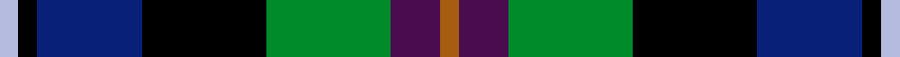

This is one **variant** — a specific cloth: this exact thread count and colourway, with its own
provenance below. It is one weaving of the [sett](/setts/o3dp8g20k20db17k3lb3/) (the scale-free proportion — the
same cloth at any scale or shade), whose colour order is pattern [RBGKBKW](/stripes/rbgkbkw/).

Part of the [Gracey](/tartans/g/gr/gracey/) tartan — the named design grouping this sett with its other cloths.

Sourced from register-of-tartans.  It is a [7 stripe tartan](/stripes/stripes7/).

Original link [https://www.tartanregister.gov.uk/tartanDetails.aspx?ref=10874](https://www.tartanregister.gov.uk/tartanDetails.aspx?ref=10874)

Dataset <small>— provenance for this record, inherited from the source manifest</small>

<dl class="dataset-prov">
<dt>source</dt><dd><a href="/sources/register-of-tartans/">Scottish Register of Tartans</a></dd>
<dt>data captured from</dt><dd><a href="https://github.com/thetartan/tartan-database/blob/master/data/register-of-tartans/data.csv">https://github.com/thetartan/tartan-database/blob/master/data/register-of-tartans/data.csv</a></dd>
<dt>data date</dt><dd>16/01/2013 <small>(this record)</small></dd>
<dt>licence</dt><dd><a href="https://www.tartanregister.gov.uk/copyright">Crown copyright</a></dd>
</dl>

Capture chain <small>— the hands this data passed through, oldest first; each capture carries its own licence</small>

<ol class="capture-chain">
<li><a href="https://www.tartanregister.gov.uk/">Scottish Register of Tartans</a> · <a href="https://www.tartanregister.gov.uk/copyright">Crown copyright</a> <small>the living register — still published by National Records of Scotland</small></li>
<li><a href="https://github.com/thetartan/tartan-database">thetartan/tartan-database</a> <small>2016-2017</small> · <a href="https://creativecommons.org/licenses/by-nc-nd/4.0/">CC BY-NC-ND 4.0</a> <small>Levko Kravets's frozen compilation — the capture we vendored, and where its CC licence text came from</small></li>
<li>this dictionary <small>captured 2026-06-10 · commit 5bf86c7566</small> <small>each re-capture is a git commit to data/sources</small></li>
</ol>

## Register references

External register numbers recorded for this tartan.

- Scottish Register of Tartans: [10874](https://www.tartanregister.gov.uk/tartanDetails.aspx?ref=10874)

## Thread count
LB/6 K6 DB34 K40 G40 DP16 O/6

One full sett is **284 threads**.

## Palette
<table><thead><tr><th>Colour</th><th>Shade</th><th>OKLCh</th></tr></thead><tbody><tr><td>LB</td><td><code style="background-color:#B5BBDE;">#B5BBDE</code> <small style="color:#888">#B5BBDE</small></td><td><small style="color:#888">oklch(79.9% 0.050 277.6)</small></td></tr><tr><td>DB</td><td><code style="background-color:#082077;">#082077</code> <small style="color:#888">#082077</small></td><td><small style="color:#888">oklch(30.0% 0.149 265.1)</small></td></tr><tr><td>DP</td><td><code style="background-color:#4B0B4F;">#4B0B4F</code> <small style="color:#888">#4B0B4F</small></td><td><small style="color:#888">oklch(30.1% 0.125 325.4)</small></td></tr><tr><td>G</td><td><code style="background-color:#008B2A;">#008B2A</code> <small style="color:#888">#008B2A</small></td><td><small style="color:#888">oklch(55.4% 0.170 145.9)</small></td></tr><tr><td>K</td><td><code style="background-color:#000000;">#000000</code> <small style="color:#888">#000000</small></td><td><small style="color:#888">oklch(0.0% 0.000 0.0)</small></td></tr><tr><td>O</td><td><code style="background-color:#A65C11;">#A65C11</code> <small style="color:#888">#A65C11</small></td><td><small style="color:#888">oklch(55.0% 0.125 58.3)</small></td></tr></tbody></table>

# Sample pattern

## Nearest tartan variants

The nearest existing variants by ΔTartan distance, with this cloth at the top so the swatches line up against it.

ΔTartan

Threads

Variant

Sett

—

284

<a href="/variants/s7/o3dp8g20k20db17k3lb3~x2/">Gracey (2013)</a>

<a href="/ttd/edit/#slug=r3dp8g20k20db17k3lg3~x2&amp;base=o3dp8g20k20db17k3lb3~x2" title="compare in the TTD">0.60</a>

284

<a href="/variants/s7/r3dp8g20k20db17k3lg3~x2/">Gracey (2013)</a>

<a href="/ttd/edit/#slug=dr2k1db6k2g6o2~x4&amp;base=o3dp8g20k20db17k3lb3~x2" title="compare in the TTD">1.20</a>

136

<a href="/variants/s6/dr2k1db6k2g6o2~x4/">MacEachain (Clan)</a>

<a href="/ttd/edit/#slug=r2k1db6k2g6o2~x4&amp;base=o3dp8g20k20db17k3lb3~x2" title="compare in the TTD">1.20</a>

136

<a href="/variants/s6/r2k1db6k2g6o2~x4/">MacCaughan or MacEachain Clan Tartan</a>

<a href="/ttd/edit/#slug=k2y1g6k6db6w1~x4&amp;base=o3dp8g20k20db17k3lb3~x2" title="compare in the TTD">1.45</a>

164

<a href="/variants/s6/k2y1g6k6db6w1~x4/">Dyce Family Tartan</a>

<a href="/ttd/edit/#slug=r2k1db6k2g6b2~x4&amp;base=o3dp8g20k20db17k3lb3~x2" title="compare in the TTD">1.47</a>

136

<a href="/variants/s6/r2k1db6k2g6b2~x4/">MacCaughan, or MacEachain</a>

<a href="/ttd/edit/#slug=k1g8w1k8db8r1~x4&amp;base=o3dp8g20k20db17k3lb3~x2" title="compare in the TTD">1.75</a>

208

<a href="/variants/s6/k1g8w1k8db8r1~x4/">Leslie Hunting</a>

<a href="/ttd/edit/#slug=k1g8w1k8db8r1~x4~db1004274&amp;base=o3dp8g20k20db17k3lb3~x2" title="compare in the TTD">1.75</a>

208

<a href="/variants/s6/k1g8w1k8db8r1~x4~db1004274/">Syme</a>

<a href="/ttd/edit/#slug=y3k2g12k12db14w3&amp;base=o3dp8g20k20db17k3lb3~x2" title="compare in the TTD">1.75</a>

86

<a href="/variants/s6/y3k2g12k12db14w3/">MacNeil of Barra</a>

<a href="/ttd/edit/#slug=r2db8k8w1g8k1&amp;base=o3dp8g20k20db17k3lb3~x2" title="compare in the TTD">1.79</a>

53

<a href="/variants/s6/r2db8k8w1g8k1/">Leslie Hunting</a>

<a href="/ttd/edit/#slug=r2db8k8w1g8k1~x2&amp;base=o3dp8g20k20db17k3lb3~x2" title="compare in the TTD">1.79</a>

106

<a href="/variants/s6/r2db8k8w1g8k1~x2/">Leslie Hunting Clan Tartan</a>

## Neighbour map

Every grey dot is one of 13621 variants placed by the first two principal components of the ΔTartan feature space (42% of its variance). Red is this tartan; blue dots are its nearest — click one to open its page.

<svg viewBox="0 0 640 380" role="img" style="max-width:100%;height:auto;border:1px solid #e0e0e0;border-radius:4px;display:block" xmlns="http://www.w3.org/2000/svg"><image href="/nn/cloud.v1.png" width="640" height="380"/><a href="/variants/s7/r3dp8g20k20db17k3lg3~x2/"><circle cx="64.7" cy="191.2" r="4" fill="#3465a4"><title>Gracey (2013)</title></circle></a><a href="/variants/s6/dr2k1db6k2g6o2~x4/"><circle cx="96.3" cy="227.9" r="4" fill="#3465a4"><title>MacEachain (Clan)</title></circle></a><a href="/variants/s6/r2k1db6k2g6o2~x4/"><circle cx="85.2" cy="221.9" r="4" fill="#3465a4"><title>MacCaughan or MacEachain Clan Tartan</title></circle></a><a href="/variants/s6/k2y1g6k6db6w1~x4/"><circle cx="98.6" cy="219.1" r="4" fill="#3465a4"><title>Dyce Family Tartan</title></circle></a><a href="/variants/s6/r2k1db6k2g6b2~x4/"><circle cx="85.7" cy="223.5" r="4" fill="#3465a4"><title>MacCaughan, or MacEachain</title></circle></a><a href="/variants/s6/k1g8w1k8db8r1~x4/"><circle cx="109.4" cy="194.1" r="4" fill="#3465a4"><title>Leslie Hunting</title></circle></a><a href="/variants/s6/k1g8w1k8db8r1~x4~db1004274/"><circle cx="111.9" cy="193.8" r="4" fill="#3465a4"><title>Syme</title></circle></a><a href="/variants/s6/y3k2g12k12db14w3/"><circle cx="77.0" cy="212.4" r="4" fill="#3465a4"><title>MacNeil of Barra</title></circle></a><a href="/variants/s6/r2db8k8w1g8k1/"><circle cx="95.7" cy="199.1" r="4" fill="#3465a4"><title>Leslie Hunting</title></circle></a><a href="/variants/s6/r2db8k8w1g8k1~x2/"><circle cx="95.7" cy="199.1" r="4" fill="#3465a4"><title>Leslie Hunting Clan Tartan</title></circle></a><circle cx="66.5" cy="191.9" r="5" fill="#c00000"/><text x="320" y="376" text-anchor="middle" font-size="11" fill="#999">ground</text><text x="11" y="190" text-anchor="middle" font-size="11" fill="#999" transform="rotate(-90 11 190)">complexity</text></svg>

ID: /variants/s7/o3dp8g20k20db17k3lb3~x2/
