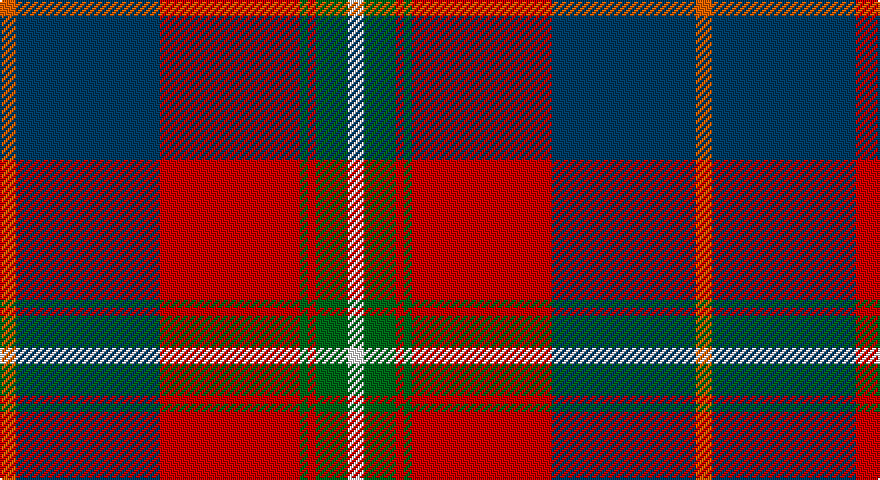

This page is one **sett** — a single exact thread-count. It belongs to the [tartan](/setts/o4dt36r35g2r2g8w4/)
(the same proportion at any scale), whose colour order is pattern [RBRGRGW](/stripes/rbrgrgw/).

Sourced from tartans-authority.  It is a [7 stripe tartan](/stripes/stripes7/).

Original link http://www.tartansauthority.com/tartan-ferret/display/10341/

## Also known as

This cloth is also recorded under:

- Cherry, John S.

## Register references

External register numbers recorded for this tartan.

- Scottish Register of Tartans: [10341](https://www.tartanregister.gov.uk/tartanDetails?ref=10341)
- Scottish Tartans Authority (ITI): 10341

## Thread count
O/8 DB72 R70 G4 R4 G16 W/8

One full sett is **348 threads**.

## Palette

Palette: <strong>Tartan Register</strong>
<table><thead><tr><th>Colour</th><th>Threads</th><th>Shade</th><th>Base</th><th>OKLCh</th></tr></thead><tbody><tr><td>O/</td><td style="text-align:right;font-variant-numeric:tabular-nums">8</td><td><code style="background-color:#E86000;">#E86000</code> <small style="color:#888">#E86000</small></td><td>R <code style="background-color:#CC0000;">#CC0000</code></td><td><small style="color:#888">oklch(65.3% 0.187 44.9)</small></td></tr><tr><td>DB</td><td style="text-align:right;font-variant-numeric:tabular-nums">72</td><td><code style="background-color:#003C64;">#003C64</code> <small style="color:#888">#003C64</small></td><td>B <code style="background-color:#2A418A;">#2A418A</code></td><td><small style="color:#888">oklch(34.5% 0.089 246.0)</small></td></tr><tr><td>R</td><td style="text-align:right;font-variant-numeric:tabular-nums">70</td><td><code style="background-color:#C80000;">#C80000</code> <small style="color:#888">#C80000</small></td><td>R <code style="background-color:#CC0000;">#CC0000</code></td><td><small style="color:#888">oklch(52.3% 0.215 29.2)</small></td></tr><tr><td>G</td><td style="text-align:right;font-variant-numeric:tabular-nums">4</td><td><code style="background-color:#006818;">#006818</code> <small style="color:#888">#006818</small></td><td>G <code style="background-color:#006100;">#006100</code></td><td><small style="color:#888">oklch(45.0% 0.142 145.0)</small></td></tr><tr><td>R</td><td style="text-align:right;font-variant-numeric:tabular-nums">4</td><td><code style="background-color:#C80000;">#C80000</code> <small style="color:#888">#C80000</small></td><td>R <code style="background-color:#CC0000;">#CC0000</code></td><td><small style="color:#888">oklch(52.3% 0.215 29.2)</small></td></tr><tr><td>G</td><td style="text-align:right;font-variant-numeric:tabular-nums">16</td><td><code style="background-color:#006818;">#006818</code> <small style="color:#888">#006818</small></td><td>G <code style="background-color:#006100;">#006100</code></td><td><small style="color:#888">oklch(45.0% 0.142 145.0)</small></td></tr><tr><td>W/</td><td style="text-align:right;font-variant-numeric:tabular-nums">8</td><td><code style="background-color:#FCFCFC;">#FCFCFC</code> <small style="color:#888">#FCFCFC</small></td><td>W <code style="background-color:#F7F7F7;">#F7F7F7</code></td><td><small style="color:#888">oklch(99.1% 0.000 89.9)</small></td></tr></tbody></table>

# Sample pattern

## Nearest tartans

The nearest existing variants by ΔTartan distance, with this tartan at the top so the swatches line up against it.

ΔTartan

Tartan

Sett

—

<a href="/ttd/edit/#slug=o4dt36r35g2r2g8w4~x2">Cherry, John S. (Personal)</a> <a class="nn-out" href="/variants/s7/o4dt36r35g2r2g8w4~x2/" title="open its dictionary page">↗</a>

0.69

<a href="/ttd/edit/#slug=n8w3n25k3n4k8r31ly2r5~x2&amp;base=o4dt36r35g2r2g8w4~x2">Caledon (Corporate)</a> <a class="nn-out" href="/variants/s9/n8w3n25k3n4k8r31ly2r5~x2/" title="open its dictionary page">↗</a>

0.94

<a href="/ttd/edit/#slug=db26dg11r8k2r2w2r4w1r15~x2&amp;base=o4dt36r35g2r2g8w4~x2">Royal Scottish Assurance</a> <a class="nn-out" href="/variants/s9/db26dg11r8k2r2w2r4w1r15~x2/" title="open its dictionary page">↗</a>

0.95

<a href="/ttd/edit/#slug=db26g11r8k2r2w2r4w1r15~x2&amp;base=o4dt36r35g2r2g8w4~x2">Royal Scottish Assurance (Corporate)</a> <a class="nn-out" href="/variants/s9/db26g11r8k2r2w2r4w1r15~x2/" title="open its dictionary page">↗</a>

1.11

<a href="/ttd/edit/#slug=w4dg20dgi10r25b2r2dgi2~x2&amp;base=o4dt36r35g2r2g8w4~x2">Caledonian Brewery (Corporate)</a> <a class="nn-out" href="/variants/s7/w4dg20dgi10r25b2r2dgi2~x2/" title="open its dictionary page">↗</a>

1.12

<a href="/ttd/edit/#slug=lo1dg14r1y14r28db14lo1~x2&amp;base=o4dt36r35g2r2g8w4~x2">Abernethy (Colerain, USA)</a> <a class="nn-out" href="/variants/s7/lo1dg14r1y14r28db14lo1~x2/" title="open its dictionary page">↗</a>

1.14

<a href="/ttd/edit/#slug=ly3n8w3n34r34g4r4w2~x2&amp;base=o4dt36r35g2r2g8w4~x2">Manitoba Masonic</a> <a class="nn-out" href="/variants/s8/ly3n8w3n34r34g4r4w2~x2/" title="open its dictionary page">↗</a>

1.16

<a href="/ttd/edit/#slug=db8k4db31lo5r26k5ly10lo5k2&amp;base=o4dt36r35g2r2g8w4~x2">McGurk (Personal)</a> <a class="nn-out" href="/variants/s9/db8k4db31lo5r26k5ly10lo5k2/" title="open its dictionary page">↗</a>

1.16

<a href="/ttd/edit/#slug=dt50r26k9r4w2lo2r10~x2&amp;base=o4dt36r35g2r2g8w4~x2">Java Saint Andrew Society Dress</a> <a class="nn-out" href="/variants/s7/dt50r26k9r4w2lo2r10~x2/" title="open its dictionary page">↗</a>

1.16

<a href="/ttd/edit/#slug=r30db12k3g12ly2g3w2~x2&amp;base=o4dt36r35g2r2g8w4~x2">Hewitt (Name)</a> <a class="nn-out" href="/variants/s7/r30db12k3g12ly2g3w2~x2/" title="open its dictionary page">↗</a>

1.18

<a href="/ttd/edit/#slug=ly3db8w3db34r34g4r4w2~x2&amp;base=o4dt36r35g2r2g8w4~x2">Manitoba Masonic (Corporate)</a> <a class="nn-out" href="/variants/s8/ly3db8w3db34r34g4r4w2~x2/" title="open its dictionary page">↗</a>

## Neighbour map

Every grey dot is one of 14360 variants placed by the first two principal components of the ΔTartan feature space (44% of its variance). Red is this tartan; blue dots are its nearest — click one to open its page.

<svg viewBox="0 0 640 380" role="img" style="max-width:100%;height:auto;border:1px solid #e0e0e0;border-radius:4px;display:block" xmlns="http://www.w3.org/2000/svg"><image href="/nn/cloud.v1.png" width="640" height="380"/><a href="/variants/s9/n8w3n25k3n4k8r31ly2r5~x2/"><circle cx="245.9" cy="142.2" r="4" fill="#3465a4"><title>Caledon (Corporate)</title></circle></a><a href="/variants/s9/db26dg11r8k2r2w2r4w1r15~x2/"><circle cx="251.6" cy="126.3" r="4" fill="#3465a4"><title>Royal Scottish Assurance</title></circle></a><a href="/variants/s9/db26g11r8k2r2w2r4w1r15~x2/"><circle cx="242.2" cy="120.3" r="4" fill="#3465a4"><title>Royal Scottish Assurance (Corporate)</title></circle></a><a href="/variants/s7/w4dg20dgi10r25b2r2dgi2~x2/"><circle cx="202.2" cy="154.6" r="4" fill="#3465a4"><title>Caledonian Brewery (Corporate)</title></circle></a><a href="/variants/s7/lo1dg14r1y14r28db14lo1~x2/"><circle cx="220.6" cy="134.2" r="4" fill="#3465a4"><title>Abernethy (Colerain, USA)</title></circle></a><a href="/variants/s8/ly3n8w3n34r34g4r4w2~x2/"><circle cx="288.1" cy="130.8" r="4" fill="#3465a4"><title>Manitoba Masonic</title></circle></a><a href="/variants/s9/db8k4db31lo5r26k5ly10lo5k2/"><circle cx="187.2" cy="137.3" r="4" fill="#3465a4"><title>McGurk (Personal)</title></circle></a><a href="/variants/s7/dt50r26k9r4w2lo2r10~x2/"><circle cx="312.9" cy="135.0" r="4" fill="#3465a4"><title>Java Saint Andrew Society Dress</title></circle></a><a href="/variants/s7/r30db12k3g12ly2g3w2~x2/"><circle cx="230.1" cy="130.1" r="4" fill="#3465a4"><title>Hewitt (Name)</title></circle></a><a href="/variants/s8/ly3db8w3db34r34g4r4w2~x2/"><circle cx="268.7" cy="126.3" r="4" fill="#3465a4"><title>Manitoba Masonic (Corporate)</title></circle></a><circle cx="246.2" cy="138.1" r="5" fill="#c00000"/></svg>

ID: /variants/s7/o4dt36r35g2r2g8w4~x2/
