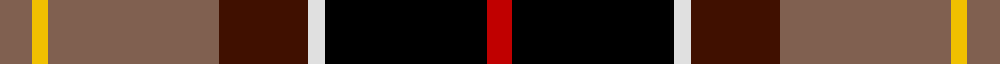
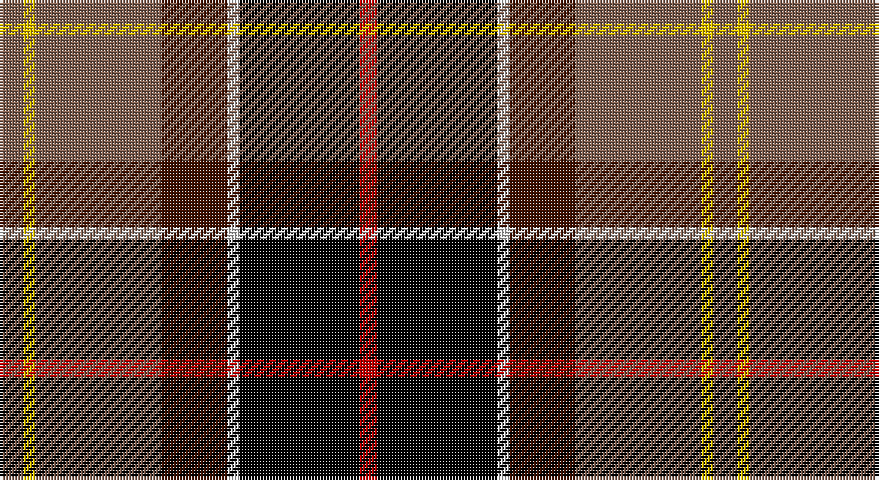

This page is one **sett** — a single exact thread-count. It belongs to the [tartan](/setts/o4ly2o21dr11w2k20r3/)
(the same proportion at any scale), whose colour order is pattern [RKWBRYR](/stripes/rkwbryr/).

Part of the [Barbour](/tartans/barbour/) tartan — the named design grouping this sett with its other cloths.

Sourced from weddslist.  It is a [7 stripe tartan](/stripes/stripes7/).

Original link http://www.weddslist.com/cgi-bin/tartans/pg.pl?source=sts

## Thread count
LT/8 Y4 LT42 DR22 LN4 K40 R/6

One full sett is **238 threads**.

## Palette

Palette: <strong>Tartan Register</strong> <small style="color:#888">(2 of 6 colours)</small>
<table><thead><tr><th>Colour</th><th>Threads</th><th>Shade</th><th>Base</th><th>OKLCh</th></tr></thead><tbody><tr><td>LT/</td><td style="text-align:right;font-variant-numeric:tabular-nums">8</td><td><code style="background-color:#806050;">#806050</code> <small style="color:#888">#806050</small></td><td>R <code style="background-color:#CC0000;">#CC0000</code></td><td><small style="color:#888">oklch(51.7% 0.049 47.8)</small></td></tr><tr><td>Y</td><td style="text-align:right;font-variant-numeric:tabular-nums">4</td><td><code style="background-color:#F0C000;">#F0C000</code> <small style="color:#888">#F0C000</small></td><td>Y <code style="background-color:#F2BF00;">#F2BF00</code></td><td><small style="color:#888">oklch(82.7% 0.169 90.5)</small></td></tr><tr><td>LT</td><td style="text-align:right;font-variant-numeric:tabular-nums">42</td><td><code style="background-color:#806050;">#806050</code> <small style="color:#888">#806050</small></td><td>R <code style="background-color:#CC0000;">#CC0000</code></td><td><small style="color:#888">oklch(51.7% 0.049 47.8)</small></td></tr><tr><td>DR</td><td style="text-align:right;font-variant-numeric:tabular-nums">22</td><td><code style="background-color:#401000;">#401000</code> <small style="color:#888">#401000</small></td><td>B <code style="background-color:#2A418A;">#2A418A</code></td><td><small style="color:#888">oklch(25.3% 0.079 39.9)</small></td></tr><tr><td>LN</td><td style="text-align:right;font-variant-numeric:tabular-nums">4</td><td><code style="background-color:#E0E0E0;">#E0E0E0</code> <small style="color:#888">#E0E0E0</small></td><td>W <code style="background-color:#F7F7F7;">#F7F7F7</code></td><td><small style="color:#888">oklch(90.7% 0.000 89.9)</small></td></tr><tr><td>K</td><td style="text-align:right;font-variant-numeric:tabular-nums">40</td><td><code style="background-color:#000000;">#000000</code> <small style="color:#888">#000000</small></td><td>K <code style="background-color:#000000;">#000000</code></td><td><small style="color:#888">oklch(0.0% 0.000 0.0)</small></td></tr><tr><td>R/</td><td style="text-align:right;font-variant-numeric:tabular-nums">6</td><td><code style="background-color:#C00000;">#C00000</code> <small style="color:#888">#C00000</small></td><td>R <code style="background-color:#CC0000;">#CC0000</code></td><td><small style="color:#888">oklch(50.7% 0.208 29.2)</small></td></tr></tbody></table>

# Sample pattern

## Compared to the master

This cloth is one sett of its design; the master sett (the exemplar the design is anchored on) is below for comparison.

<figure style="margin:0"><figcaption style="color:#888;font-size:smaller">this sett</figcaption></figure>
<figure style="margin:0"><figcaption style="color:#888;font-size:smaller"><a href="/setts/r3k20w2dy11o21ly2o2/">master sett →</a></figcaption></figure>

## Nearest tartans

The nearest existing variants by ΔTartan distance, with this tartan at the top so the swatches line up against it.

ΔTartan

Tartan

Sett

—

<a href="/ttd/edit/#slug=o4ly2o21dr11w2k20r3~x2">Barbour</a> <a class="nn-out" href="/variants/s7/o4ly2o21dr11w2k20r3~x2/" title="open its dictionary page">↗</a>

0.73

<a href="/variants/s6/dg3g3r22k5ki22ly2~x2/">Clan MacLeod Society of Scotland, Centenary</a>

1.03

<a href="/ttd/edit/#slug=dg22w3k2ly3k19r18g4~x2&amp;base=o4ly2o21dr11w2k20r3~x2">Scotch House 2000, dress</a> <a class="nn-out" href="/variants/s7/dg22w3k2ly3k19r18g4~x2/" title="open its dictionary page">↗</a>

1.08

<a href="/ttd/edit/#slug=do8w8k16dg32dp3lo5w5~x2&amp;base=o4ly2o21dr11w2k20r3~x2">Mellor, Phillip (Oldham)</a> <a class="nn-out" href="/variants/s7/do8w8k16dg32dp3lo5w5~x2/" title="open its dictionary page">↗</a>

1.11

<a href="/ttd/edit/#slug=y4ly2y21do11w2k20r3~x2&amp;base=o4ly2o21dr11w2k20r3~x2">Barbour Corporate Tartan</a> <a class="nn-out" href="/variants/s7/y4ly2y21do11w2k20r3~x2/" title="open its dictionary page">↗</a>

1.12

<a href="/ttd/edit/#slug=k10ly2dg11r11w1r1w1k9~x2&amp;base=o4ly2o21dr11w2k20r3~x2">Unidentified No 5</a> <a class="nn-out" href="/variants/s8/k10ly2dg11r11w1r1w1k9~x2/" title="open its dictionary page">↗</a>

1.12

<a href="/ttd/edit/#slug=w3g2r21k26db18k2db3ly3~x2&amp;base=o4ly2o21dr11w2k20r3~x2">Loch Etive</a> <a class="nn-out" href="/variants/s8/w3g2r21k26db18k2db3ly3~x2/" title="open its dictionary page">↗</a>

1.12

<a href="/ttd/edit/#slug=g19k18r18w2ly2dp2ly2w2r8dp3~x2&amp;base=o4ly2o21dr11w2k20r3~x2">McMuldroch (2014)</a> <a class="nn-out" href="/variants/s10/g19k18r18w2ly2dp2ly2w2r8dp3~x2/" title="open its dictionary page">↗</a>

1.13

<a href="/ttd/edit/#slug=r3k20w2dy11o21ly2o2~x2&amp;base=o4ly2o21dr11w2k20r3~x2">Barbour</a> <a class="nn-out" href="/variants/s7/r3k20w2dy11o21ly2o2~x2/" title="open its dictionary page">↗</a>

1.14

<a href="/ttd/edit/#slug=ly3db3k2db18k26r21g2lb3~x2&amp;base=o4ly2o21dr11w2k20r3~x2">Loch Etive</a> <a class="nn-out" href="/variants/s8/ly3db3k2db18k26r21g2lb3~x2/" title="open its dictionary page">↗</a>

1.16

<a href="/ttd/edit/#slug=o4ly2o21dy11w2k20r3~x2&amp;base=o4ly2o21dr11w2k20r3~x2">Barbour - Classic</a> <a class="nn-out" href="/variants/s7/o4ly2o21dy11w2k20r3~x2/" title="open its dictionary page">↗</a>

## Neighbour map

Every grey dot is one of 14360 variants placed by the first two principal components of the ΔTartan feature space (44% of its variance). Red is this tartan; blue dots are its nearest — click one to open its page.

<svg viewBox="0 0 640 380" role="img" style="max-width:100%;height:auto;border:1px solid #e0e0e0;border-radius:4px;display:block" xmlns="http://www.w3.org/2000/svg"><image href="/nn/cloud.v1.png" width="640" height="380"/><a href="/variants/s6/dg3g3r22k5ki22ly2~x2/"><circle cx="169.6" cy="155.5" r="4" fill="#3465a4"><title>Clan MacLeod Society of Scotland, Centenary</title></circle></a><a href="/variants/s7/dg22w3k2ly3k19r18g4~x2/"><circle cx="100.6" cy="156.2" r="4" fill="#3465a4"><title>Scotch House 2000, dress</title></circle></a><a href="/variants/s7/do8w8k16dg32dp3lo5w5~x2/"><circle cx="127.2" cy="152.9" r="4" fill="#3465a4"><title>Mellor, Phillip (Oldham)</title></circle></a><a href="/variants/s7/y4ly2y21do11w2k20r3~x2/"><circle cx="175.8" cy="169.4" r="4" fill="#3465a4"><title>Barbour Corporate Tartan</title></circle></a><a href="/variants/s8/k10ly2dg11r11w1r1w1k9~x2/"><circle cx="173.7" cy="170.9" r="4" fill="#3465a4"><title>Unidentified No 5</title></circle></a><a href="/variants/s8/w3g2r21k26db18k2db3ly3~x2/"><circle cx="152.9" cy="133.1" r="4" fill="#3465a4"><title>Loch Etive</title></circle></a><a href="/variants/s10/g19k18r18w2ly2dp2ly2w2r8dp3~x2/"><circle cx="106.0" cy="130.5" r="4" fill="#3465a4"><title>McMuldroch (2014)</title></circle></a><a href="/variants/s7/r3k20w2dy11o21ly2o2~x2/"><circle cx="166.7" cy="156.9" r="4" fill="#3465a4"><title>Barbour</title></circle></a><a href="/variants/s8/ly3db3k2db18k26r21g2lb3~x2/"><circle cx="157.9" cy="136.8" r="4" fill="#3465a4"><title>Loch Etive</title></circle></a><a href="/variants/s7/o4ly2o21dy11w2k20r3~x2/"><circle cx="172.0" cy="161.4" r="4" fill="#3465a4"><title>Barbour - Classic</title></circle></a><circle cx="152.3" cy="156.8" r="5" fill="#c00000"/></svg>

ID: /variants/s7/o4ly2o21dr11w2k20r3~x2/
