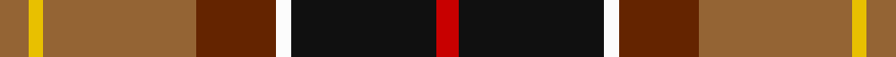
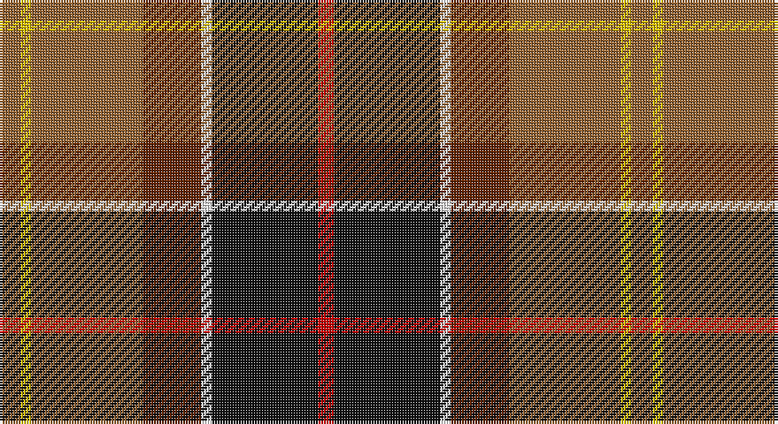

This page is one **sett** — a single exact thread-count. It belongs to the [tartan](/setts/o4ly2o21dy11w2k20r3/)
(the same proportion at any scale), whose colour order is pattern [RKWGRYR](/stripes/rkwgryr/).

Part of the [Barbour](/tartans/barbour/) tartan — the named design grouping this sett with its other cloths.

Sourced from tartans-authority.  It is a [7 stripe tartan](/stripes/stripes7/).

Original link http://www.tartansauthority.com/tartan-ferret/display/2489/

## Register references

External register numbers recorded for this tartan.

- Scottish Tartans Authority (ITI): 2489

## Thread count
LT/8 Y4 LT42 T22 W4 K40 R/6

One full sett is **238 threads**.

## Palette

Palette: <strong>Tartan Register</strong> <small style="color:#888">(4 of 6 colours)</small>
<table><thead><tr><th>Colour</th><th>Threads</th><th>Shade</th><th>Base</th><th>OKLCh</th></tr></thead><tbody><tr><td>LT/</td><td style="text-align:right;font-variant-numeric:tabular-nums">8</td><td><code style="background-color:#946434;">#946434</code> <small style="color:#888">#946434</small></td><td>R <code style="background-color:#CC0000;">#CC0000</code></td><td><small style="color:#888">oklch(54.4% 0.089 64.0)</small></td></tr><tr><td>Y</td><td style="text-align:right;font-variant-numeric:tabular-nums">4</td><td><code style="background-color:#E8C000;">#E8C000</code> <small style="color:#888">#E8C000</small></td><td>Y <code style="background-color:#F2BF00;">#F2BF00</code></td><td><small style="color:#888">oklch(81.9% 0.168 93.7)</small></td></tr><tr><td>LT</td><td style="text-align:right;font-variant-numeric:tabular-nums">42</td><td><code style="background-color:#946434;">#946434</code> <small style="color:#888">#946434</small></td><td>R <code style="background-color:#CC0000;">#CC0000</code></td><td><small style="color:#888">oklch(54.4% 0.089 64.0)</small></td></tr><tr><td>T</td><td style="text-align:right;font-variant-numeric:tabular-nums">22</td><td><code style="background-color:#642400;">#642400</code> <small style="color:#888">#642400</small></td><td>G <code style="background-color:#006100;">#006100</code></td><td><small style="color:#888">oklch(35.1% 0.102 44.1)</small></td></tr><tr><td>W</td><td style="text-align:right;font-variant-numeric:tabular-nums">4</td><td><code style="background-color:#FCFCFC;">#FCFCFC</code> <small style="color:#888">#FCFCFC</small></td><td>W <code style="background-color:#F7F7F7;">#F7F7F7</code></td><td><small style="color:#888">oklch(99.1% 0.000 89.9)</small></td></tr><tr><td>K</td><td style="text-align:right;font-variant-numeric:tabular-nums">40</td><td><code style="background-color:#101010;">#101010</code> <small style="color:#888">#101010</small></td><td>K <code style="background-color:#000000;">#000000</code></td><td><small style="color:#888">oklch(17.3% 0.000 89.9)</small></td></tr><tr><td>R/</td><td style="text-align:right;font-variant-numeric:tabular-nums">6</td><td><code style="background-color:#C80000;">#C80000</code> <small style="color:#888">#C80000</small></td><td>R <code style="background-color:#CC0000;">#CC0000</code></td><td><small style="color:#888">oklch(52.3% 0.215 29.2)</small></td></tr></tbody></table>

# Sample pattern

## Compared to the master

This cloth is one sett of its design; the master sett (the exemplar the design is anchored on) is below for comparison.

<figure style="margin:0"><figcaption style="color:#888;font-size:smaller">this sett</figcaption></figure>
<figure style="margin:0"><figcaption style="color:#888;font-size:smaller"><a href="/setts/r3k20w2dy11o21ly2o2/">master sett →</a></figcaption></figure>

## Nearest tartans

The nearest existing variants by ΔTartan distance, with this tartan at the top so the swatches line up against it.

ΔTartan

Tartan

Sett

—

<a href="/ttd/edit/#slug=o4ly2o21dy11w2k20r3~x2">Barbour - Classic</a> <a class="nn-out" href="/variants/s7/o4ly2o21dy11w2k20r3~x2/" title="open its dictionary page">↗</a>

0.24

<a href="/ttd/edit/#slug=r3k20w2dy11o21ly2o2~x2&amp;base=o4ly2o21dy11w2k20r3~x2">Barbour</a> <a class="nn-out" href="/variants/s7/r3k20w2dy11o21ly2o2~x2/" title="open its dictionary page">↗</a>

0.63

<a href="/ttd/edit/#slug=y4ly2y21do11w2k20r3~x2&amp;base=o4ly2o21dy11w2k20r3~x2">Barbour Corporate Tartan</a> <a class="nn-out" href="/variants/s7/y4ly2y21do11w2k20r3~x2/" title="open its dictionary page">↗</a>

0.84

<a href="/ttd/edit/#slug=r2lb1r8k4db1g10lr1g2~x4&amp;base=o4ly2o21dy11w2k20r3~x2">Sawyer</a> <a class="nn-out" href="/variants/s8/r2lb1r8k4db1g10lr1g2~x4/" title="open its dictionary page">↗</a>

1.01

<a href="/ttd/edit/#slug=r1g4w1g4ly1ri8t1~x6&amp;base=o4ly2o21dy11w2k20r3~x2">George Watson's College</a> <a class="nn-out" href="/variants/s7/r1g4w1g4ly1ri8t1~x6/" title="open its dictionary page">↗</a>

1.01

<a href="/ttd/edit/#slug=lb4k13g6r16lbi2r2g2~x2&amp;base=o4ly2o21dy11w2k20r3~x2">Caledonian Brewery Corporate Tartan</a> <a class="nn-out" href="/variants/s7/lb4k13g6r16lbi2r2g2~x2/" title="open its dictionary page">↗</a>

1.05

<a href="/ttd/edit/#slug=g22w3k2ly3k19r18db4~x2&amp;base=o4ly2o21dy11w2k20r3~x2">Scotch House 2000 Dress</a> <a class="nn-out" href="/variants/s7/g22w3k2ly3k19r18db4~x2/" title="open its dictionary page">↗</a>

1.08

<a href="/ttd/edit/#slug=r3n2r25o12k25w2lb2~x2&amp;base=o4ly2o21dy11w2k20r3~x2">Bombeiros Voluntarios De Galicia (Co</a> <a class="nn-out" href="/variants/s7/r3n2r25o12k25w2lb2~x2/" title="open its dictionary page">↗</a>

1.09

<a href="/ttd/edit/#slug=g19k18r18ly2w2dp2ly2w2r8dp3~x2&amp;base=o4ly2o21dy11w2k20r3~x2">McMuldroch (2014)</a> <a class="nn-out" href="/variants/s10/g19k18r18ly2w2dp2ly2w2r8dp3~x2/" title="open its dictionary page">↗</a>

1.10

<a href="/ttd/edit/#slug=db3t1k1ri12r1g9ri1t1db3~x4&amp;base=o4ly2o21dy11w2k20r3~x2">Moray of Abercairney</a> <a class="nn-out" href="/variants/s9/db3t1k1ri12r1g9ri1t1db3~x4/" title="open its dictionary page">↗</a>

1.10

<a href="/ttd/edit/#slug=w4dg20dgi10r25b2r2dgi2~x2&amp;base=o4ly2o21dy11w2k20r3~x2">Caledonian Brewery (Corporate)</a> <a class="nn-out" href="/variants/s7/w4dg20dgi10r25b2r2dgi2~x2/" title="open its dictionary page">↗</a>

## Neighbour map

Every grey dot is one of 14360 variants placed by the first two principal components of the ΔTartan feature space (44% of its variance). Red is this tartan; blue dots are its nearest — click one to open its page.

<svg viewBox="0 0 640 380" role="img" style="max-width:100%;height:auto;border:1px solid #e0e0e0;border-radius:4px;display:block" xmlns="http://www.w3.org/2000/svg"><image href="/nn/cloud.v1.png" width="640" height="380"/><a href="/variants/s7/r3k20w2dy11o21ly2o2~x2/"><circle cx="166.7" cy="156.9" r="4" fill="#3465a4"><title>Barbour</title></circle></a><a href="/variants/s7/y4ly2y21do11w2k20r3~x2/"><circle cx="175.8" cy="169.4" r="4" fill="#3465a4"><title>Barbour Corporate Tartan</title></circle></a><a href="/variants/s8/r2lb1r8k4db1g10lr1g2~x4/"><circle cx="190.6" cy="163.7" r="4" fill="#3465a4"><title>Sawyer</title></circle></a><a href="/variants/s7/r1g4w1g4ly1ri8t1~x6/"><circle cx="177.2" cy="172.5" r="4" fill="#3465a4"><title>George Watson's College</title></circle></a><a href="/variants/s7/lb4k13g6r16lbi2r2g2~x2/"><circle cx="171.7" cy="189.2" r="4" fill="#3465a4"><title>Caledonian Brewery Corporate Tartan</title></circle></a><a href="/variants/s7/g22w3k2ly3k19r18db4~x2/"><circle cx="112.3" cy="159.2" r="4" fill="#3465a4"><title>Scotch House 2000 Dress</title></circle></a><a href="/variants/s7/r3n2r25o12k25w2lb2~x2/"><circle cx="185.7" cy="136.1" r="4" fill="#3465a4"><title>Bombeiros Voluntarios De Galicia (Co</title></circle></a><a href="/variants/s10/g19k18r18ly2w2dp2ly2w2r8dp3~x2/"><circle cx="118.7" cy="134.5" r="4" fill="#3465a4"><title>McMuldroch (2014)</title></circle></a><a href="/variants/s9/db3t1k1ri12r1g9ri1t1db3~x4/"><circle cx="196.0" cy="131.6" r="4" fill="#3465a4"><title>Moray of Abercairney</title></circle></a><a href="/variants/s7/w4dg20dgi10r25b2r2dgi2~x2/"><circle cx="202.2" cy="154.6" r="4" fill="#3465a4"><title>Caledonian Brewery (Corporate)</title></circle></a><circle cx="172.0" cy="161.4" r="5" fill="#c00000"/></svg>

ID: /variants/s7/o4ly2o21dy11w2k20r3~x2/
