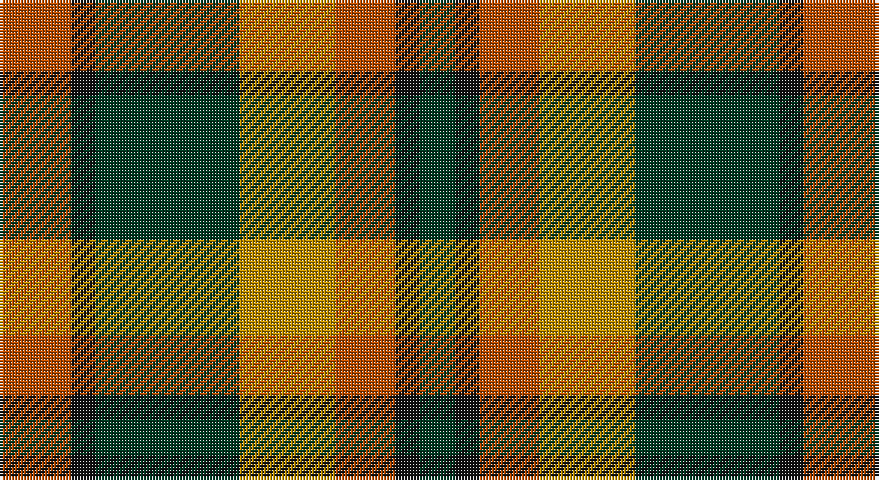

This page is one **sett** — a single exact thread-count. It belongs to the [tartan](/setts/o6k2dg12lo8o5k2dg3/)
(the same proportion at any scale), whose colour order is pattern [GKRYGKR](/stripes/gkrygkr/).

Sourced from register-of-tartans.  It is a [7 stripe tartan](/stripes/stripes7/).

Original link https://www.tartanregister.gov.uk/tartanDetails.aspx?ref=2200

## Register references

External register numbers recorded for this tartan.

- Scottish Register of Tartans: [2200](https://www.tartanregister.gov.uk/tartanDetails.aspx?ref=2200)
- Scottish Tartans Authority (ITI): 2279
- Scottish Tartans World Register: 2279

## Thread count
DO/24 K8 DG48 DY32 DO20 K8 DG/12

One full sett is **268 threads**.

## Palette

Palette: <strong>Tartan Register</strong> <small style="color:#888">(3 of 4 colours)</small>
<table><thead><tr><th>Colour</th><th>Threads</th><th>Shade</th><th>Base</th><th>OKLCh</th></tr></thead><tbody><tr><td>DO/</td><td style="text-align:right;font-variant-numeric:tabular-nums">24</td><td><code style="background-color:#B84C00;">#B84C00</code> <small style="color:#888">#B84C00</small></td><td>R <code style="background-color:#CC0000;">#CC0000</code></td><td><small style="color:#888">oklch(55.1% 0.156 45.5)</small></td></tr><tr><td>K</td><td style="text-align:right;font-variant-numeric:tabular-nums">8</td><td><code style="background-color:#101010;">#101010</code> <small style="color:#888">#101010</small></td><td>K <code style="background-color:#000000;">#000000</code></td><td><small style="color:#888">oklch(17.3% 0.000 89.9)</small></td></tr><tr><td>DG</td><td style="text-align:right;font-variant-numeric:tabular-nums">48</td><td><code style="background-color:#003820;">#003820</code> <small style="color:#888">#003820</small></td><td>G <code style="background-color:#006100;">#006100</code></td><td><small style="color:#888">oklch(30.0% 0.070 158.3)</small></td></tr><tr><td>DY</td><td style="text-align:right;font-variant-numeric:tabular-nums">32</td><td><code style="background-color:#BC8C00;">#BC8C00</code> <small style="color:#888">#BC8C00</small></td><td>Y <code style="background-color:#F2BF00;">#F2BF00</code></td><td><small style="color:#888">oklch(66.8% 0.137 84.1)</small></td></tr><tr><td>DO</td><td style="text-align:right;font-variant-numeric:tabular-nums">20</td><td><code style="background-color:#B84C00;">#B84C00</code> <small style="color:#888">#B84C00</small></td><td>R <code style="background-color:#CC0000;">#CC0000</code></td><td><small style="color:#888">oklch(55.1% 0.156 45.5)</small></td></tr><tr><td>K</td><td style="text-align:right;font-variant-numeric:tabular-nums">8</td><td><code style="background-color:#101010;">#101010</code> <small style="color:#888">#101010</small></td><td>K <code style="background-color:#000000;">#000000</code></td><td><small style="color:#888">oklch(17.3% 0.000 89.9)</small></td></tr><tr><td>DG/</td><td style="text-align:right;font-variant-numeric:tabular-nums">12</td><td><code style="background-color:#003820;">#003820</code> <small style="color:#888">#003820</small></td><td>G <code style="background-color:#006100;">#006100</code></td><td><small style="color:#888">oklch(30.0% 0.070 158.3)</small></td></tr></tbody></table>

# Sample pattern

## Nearest tartans

The nearest existing variants by ΔTartan distance, with this tartan at the top so the swatches line up against it.

ΔTartan

Tartan

Sett

—

<a href="/ttd/edit/#slug=o6k2dg12lo8o5k2dg3~x4">Londonderry, County</a> <a class="nn-out" href="/variants/s7/o6k2dg12lo8o5k2dg3~x4/" title="open its dictionary page">↗</a>

0.79

<a href="/ttd/edit/#slug=r2g4db8r9g9k2r2~x2&amp;base=o6k2dg12lo8o5k2dg3~x4">Stewart, Plaid</a> <a class="nn-out" href="/variants/s7/r2g4db8r9g9k2r2~x2/" title="open its dictionary page">↗</a>

0.89

<a href="/ttd/edit/#slug=o6k2g12lo8o5k2g3~x4&amp;base=o6k2dg12lo8o5k2dg3~x4">Londonderry, County (District)</a> <a class="nn-out" href="/variants/s7/o6k2g12lo8o5k2g3~x4/" title="open its dictionary page">↗</a>

1.01

<a href="/ttd/edit/#slug=r2g4db8r9g9k2r2~x4&amp;base=o6k2dg12lo8o5k2dg3~x4">Stewart (Artefact)</a> <a class="nn-out" href="/variants/s7/r2g4db8r9g9k2r2~x4/" title="open its dictionary page">↗</a>

1.07

<a href="/ttd/edit/#slug=r33g17db50g17r11g17r9k7&amp;base=o6k2dg12lo8o5k2dg3~x4">Carnegie</a> <a class="nn-out" href="/variants/s8/r33g17db50g17r11g17r9k7/" title="open its dictionary page">↗</a>

1.09

<a href="/ttd/edit/#slug=r6k2g12lo8r5k2g3~x4&amp;base=o6k2dg12lo8o5k2dg3~x4">Londonderry</a> <a class="nn-out" href="/variants/s7/r6k2g12lo8r5k2g3~x4/" title="open its dictionary page">↗</a>

1.18

<a href="/ttd/edit/#slug=r4k6t1g7k2g7t1k6r4g2~x4&amp;base=o6k2dg12lo8o5k2dg3~x4">Walker James</a> <a class="nn-out" href="/variants/s10/r4k6t1g7k2g7t1k6r4g2~x4/" title="open its dictionary page">↗</a>

1.19

<a href="/ttd/edit/#slug=dg20r8lr2r8dg5ly8dg2ly8~x2&amp;base=o6k2dg12lo8o5k2dg3~x4">Unidentified #57</a> <a class="nn-out" href="/variants/s8/dg20r8lr2r8dg5ly8dg2ly8~x2/" title="open its dictionary page">↗</a>

1.22

<a href="/ttd/edit/#slug=r3db12r4g18r6k2~x2&amp;base=o6k2dg12lo8o5k2dg3~x4">Eyre (Personal)</a> <a class="nn-out" href="/variants/s6/r3db12r4g18r6k2~x2/" title="open its dictionary page">↗</a>

1.24

<a href="/ttd/edit/#slug=lr10dt3lr3dt3lr3dt11dy11o3~x2&amp;base=o6k2dg12lo8o5k2dg3~x4">Holden Monaro Corporate Tartan</a> <a class="nn-out" href="/variants/s8/lr10dt3lr3dt3lr3dt11dy11o3~x2/" title="open its dictionary page">↗</a>

1.27

<a href="/ttd/edit/#slug=lo3dr2o14g17dr14lo8o14dr2lo3~x2&amp;base=o6k2dg12lo8o5k2dg3~x4">Monaghan</a> <a class="nn-out" href="/variants/s9/lo3dr2o14g17dr14lo8o14dr2lo3~x2/" title="open its dictionary page">↗</a>

## Neighbour map

Every grey dot is one of 14360 variants placed by the first two principal components of the ΔTartan feature space (44% of its variance). Red is this tartan; blue dots are its nearest — click one to open its page.

<svg viewBox="0 0 640 380" role="img" style="max-width:100%;height:auto;border:1px solid #e0e0e0;border-radius:4px;display:block" xmlns="http://www.w3.org/2000/svg"><image href="/nn/cloud.v1.png" width="640" height="380"/><a href="/variants/s7/r2g4db8r9g9k2r2~x2/"><circle cx="145.6" cy="247.8" r="4" fill="#3465a4"><title>Stewart, Plaid</title></circle></a><a href="/variants/s7/o6k2g12lo8o5k2g3~x4/"><circle cx="184.6" cy="249.3" r="4" fill="#3465a4"><title>Londonderry, County (District)</title></circle></a><a href="/variants/s7/r2g4db8r9g9k2r2~x4/"><circle cx="159.8" cy="253.8" r="4" fill="#3465a4"><title>Stewart (Artefact)</title></circle></a><a href="/variants/s8/r33g17db50g17r11g17r9k7/"><circle cx="157.8" cy="222.2" r="4" fill="#3465a4"><title>Carnegie</title></circle></a><a href="/variants/s7/r6k2g12lo8r5k2g3~x4/"><circle cx="148.3" cy="225.5" r="4" fill="#3465a4"><title>Londonderry</title></circle></a><a href="/variants/s10/r4k6t1g7k2g7t1k6r4g2~x4/"><circle cx="171.1" cy="232.6" r="4" fill="#3465a4"><title>Walker James</title></circle></a><a href="/variants/s8/dg20r8lr2r8dg5ly8dg2ly8~x2/"><circle cx="223.3" cy="211.1" r="4" fill="#3465a4"><title>Unidentified #57</title></circle></a><a href="/variants/s6/r3db12r4g18r6k2~x2/"><circle cx="215.3" cy="224.8" r="4" fill="#3465a4"><title>Eyre (Personal)</title></circle></a><a href="/variants/s8/lr10dt3lr3dt3lr3dt11dy11o3~x2/"><circle cx="141.2" cy="251.5" r="4" fill="#3465a4"><title>Holden Monaro Corporate Tartan</title></circle></a><a href="/variants/s9/lo3dr2o14g17dr14lo8o14dr2lo3~x2/"><circle cx="185.3" cy="221.4" r="4" fill="#3465a4"><title>Monaghan</title></circle></a><circle cx="170.0" cy="241.7" r="5" fill="#c00000"/></svg>

ID: /variants/s7/o6k2dg12lo8o5k2dg3~x4/
