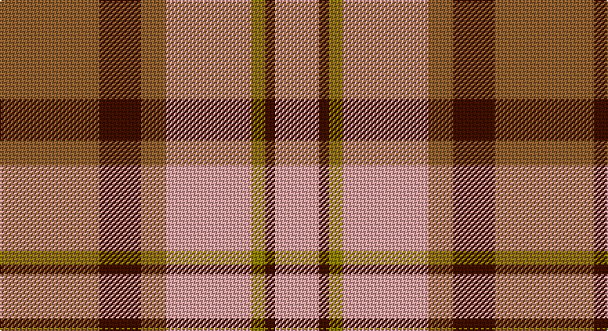

This page is one **sett** — a single exact thread-count. It belongs to the [tartan](/setts/o72dr30o18lr62y10dr7lr32/)
(the same proportion at any scale), whose colour order is pattern [RBRYGBY](/stripes/rbrygby/).

Part of the [Manhattan Ethnic](/tartans/manhattan-ethnic/) tartan — the named design grouping this sett with its other cloths.

Sourced from weddslist.  It is a [7 stripe tartan](/stripes/stripes7/).

Original link http://www.weddslist.com/cgi-bin/tartans/pg.pl?source=sts

## Thread count
LT/72 DR30 LT18 LR62 LG10 DR7 LR/32

One full sett is **358 threads**.

## Palette

Palette: <strong>custom</strong>
<table><thead><tr><th>Colour</th><th>Threads</th><th>Shade</th><th>Base</th><th>OKLCh</th></tr></thead><tbody><tr><td>LT/</td><td style="text-align:right;font-variant-numeric:tabular-nums">72</td><td><code style="background-color:#906030;">#906030</code> <small style="color:#888">#906030</small></td><td>R <code style="background-color:#CC0000;">#CC0000</code></td><td><small style="color:#888">oklch(53.1% 0.089 63.7)</small></td></tr><tr><td>DR</td><td style="text-align:right;font-variant-numeric:tabular-nums">30</td><td><code style="background-color:#401000;">#401000</code> <small style="color:#888">#401000</small></td><td>B <code style="background-color:#2A418A;">#2A418A</code></td><td><small style="color:#888">oklch(25.3% 0.079 39.9)</small></td></tr><tr><td>LT</td><td style="text-align:right;font-variant-numeric:tabular-nums">18</td><td><code style="background-color:#906030;">#906030</code> <small style="color:#888">#906030</small></td><td>R <code style="background-color:#CC0000;">#CC0000</code></td><td><small style="color:#888">oklch(53.1% 0.089 63.7)</small></td></tr><tr><td>LR</td><td style="text-align:right;font-variant-numeric:tabular-nums">62</td><td><code style="background-color:#E0A0A0;">#E0A0A0</code> <small style="color:#888">#E0A0A0</small></td><td>Y <code style="background-color:#F2BF00;">#F2BF00</code></td><td><small style="color:#888">oklch(76.7% 0.077 19.0)</small></td></tr><tr><td>LG</td><td style="text-align:right;font-variant-numeric:tabular-nums">10</td><td><code style="background-color:#908000;">#908000</code> <small style="color:#888">#908000</small></td><td>G <code style="background-color:#006100;">#006100</code></td><td><small style="color:#888">oklch(59.6% 0.124 100.6)</small></td></tr><tr><td>DR</td><td style="text-align:right;font-variant-numeric:tabular-nums">7</td><td><code style="background-color:#401000;">#401000</code> <small style="color:#888">#401000</small></td><td>B <code style="background-color:#2A418A;">#2A418A</code></td><td><small style="color:#888">oklch(25.3% 0.079 39.9)</small></td></tr><tr><td>LR/</td><td style="text-align:right;font-variant-numeric:tabular-nums">32</td><td><code style="background-color:#E0A0A0;">#E0A0A0</code> <small style="color:#888">#E0A0A0</small></td><td>Y <code style="background-color:#F2BF00;">#F2BF00</code></td><td><small style="color:#888">oklch(76.7% 0.077 19.0)</small></td></tr></tbody></table>

# Sample pattern

## Compared to the master

This cloth is one sett of its design; the master sett (the exemplar the design is anchored on) is below for comparison.

<figure style="margin:0"><figcaption style="color:#888;font-size:smaller">this sett</figcaption></figure>
<figure style="margin:0"><figcaption style="color:#888;font-size:smaller"><a href="/setts/loi36do15loi9r31lo5do4r16/">master sett →</a></figcaption></figure>

## Nearest tartans

The nearest existing variants by ΔTartan distance, with this tartan at the top so the swatches line up against it.

ΔTartan

Tartan

Sett

—

<a href="/ttd/edit/#slug=o72dr30o18lr62y10dr7lr32">Manhattan Ethnic</a> <a class="nn-out" href="/variants/s7/o72dr30o18lr62y10dr7lr32/" title="open its dictionary page">↗</a>

0.74

<a href="/ttd/edit/#slug=o16oi2o11oi6k4w2k4oi16~x2&amp;base=o72dr30o18lr62y10dr7lr32">Sydney (Nova Scotia) (District)</a> <a class="nn-out" href="/variants/s8/o16oi2o11oi6k4w2k4oi16~x2/" title="open its dictionary page">↗</a>

0.77

<a href="/ttd/edit/#slug=r11db1r11db1w10o11db1o11~x2&amp;base=o72dr30o18lr62y10dr7lr32">St Andrews</a> <a class="nn-out" href="/variants/s8/r11db1r11db1w10o11db1o11~x2/" title="open its dictionary page">↗</a>

0.78

<a href="/ttd/edit/#slug=r24n5o9n2o9lb9~x4&amp;base=o72dr30o18lr62y10dr7lr32">Plaid Wine</a> <a class="nn-out" href="/variants/s6/r24n5o9n2o9lb9~x4/" title="open its dictionary page">↗</a>

1.03

<a href="/ttd/edit/#slug=loi36do15loi9r31lo5do4r16~x2&amp;base=o72dr30o18lr62y10dr7lr32">Manhattan Ethnic</a> <a class="nn-out" href="/variants/s7/loi36do15loi9r31lo5do4r16~x2/" title="open its dictionary page">↗</a>

1.04

<a href="/ttd/edit/#slug=dy11db1dy11w10db1r11db1r11~x2&amp;base=o72dr30o18lr62y10dr7lr32">St. Andrews (Queens University) (Cor</a> <a class="nn-out" href="/variants/s8/dy11db1dy11w10db1r11db1r11~x2/" title="open its dictionary page">↗</a>

1.04

<a href="/ttd/edit/#slug=r16o2r11o6k4w2k4o16~x2&amp;base=o72dr30o18lr62y10dr7lr32">Sidney (Nova Scotia) Canadian Tartan</a> <a class="nn-out" href="/variants/s8/r16o2r11o6k4w2k4o16~x2/" title="open its dictionary page">↗</a>

1.11

<a href="/ttd/edit/#slug=p9r4p1r4g15ri4p1~x2&amp;base=o72dr30o18lr62y10dr7lr32">Logan, Light</a> <a class="nn-out" href="/variants/s7/p9r4p1r4g15ri4p1~x2/" title="open its dictionary page">↗</a>

1.14

<a href="/ttd/edit/#slug=do4r3do21r2w14o22r3o4~x2&amp;base=o72dr30o18lr62y10dr7lr32">Bannock Bane M.405</a> <a class="nn-out" href="/variants/s8/do4r3do21r2w14o22r3o4~x2/" title="open its dictionary page">↗</a>

1.25

<a href="/ttd/edit/#slug=db6lo25o16k2db3~x2&amp;base=o72dr30o18lr62y10dr7lr32">Prince of Orange</a> <a class="nn-out" href="/variants/s5/db6lo25o16k2db3~x2/" title="open its dictionary page">↗</a>

1.28

<a href="/ttd/edit/#slug=r12w2lo3w2r3k5r2lo18w2~x2&amp;base=o72dr30o18lr62y10dr7lr32">Ballater Trade or 'Fancy' Tartan</a> <a class="nn-out" href="/variants/s9/r12w2lo3w2r3k5r2lo18w2~x2/" title="open its dictionary page">↗</a>

## Neighbour map

Every grey dot is one of 14360 variants placed by the first two principal components of the ΔTartan feature space (44% of its variance). Red is this tartan; blue dots are its nearest — click one to open its page.

<svg viewBox="0 0 640 380" role="img" style="max-width:100%;height:auto;border:1px solid #e0e0e0;border-radius:4px;display:block" xmlns="http://www.w3.org/2000/svg"><image href="/nn/cloud.v1.png" width="640" height="380"/><a href="/variants/s8/o16oi2o11oi6k4w2k4oi16~x2/"><circle cx="243.6" cy="214.0" r="4" fill="#3465a4"><title>Sydney (Nova Scotia) (District)</title></circle></a><a href="/variants/s8/r11db1r11db1w10o11db1o11~x2/"><circle cx="216.9" cy="199.0" r="4" fill="#3465a4"><title>St Andrews</title></circle></a><a href="/variants/s6/r24n5o9n2o9lb9~x4/"><circle cx="233.5" cy="207.3" r="4" fill="#3465a4"><title>Plaid Wine</title></circle></a><a href="/variants/s7/loi36do15loi9r31lo5do4r16~x2/"><circle cx="244.3" cy="220.8" r="4" fill="#3465a4"><title>Manhattan Ethnic</title></circle></a><a href="/variants/s8/dy11db1dy11w10db1r11db1r11~x2/"><circle cx="199.7" cy="191.1" r="4" fill="#3465a4"><title>St. Andrews (Queens University) (Cor</title></circle></a><a href="/variants/s8/r16o2r11o6k4w2k4o16~x2/"><circle cx="235.6" cy="203.4" r="4" fill="#3465a4"><title>Sidney (Nova Scotia) Canadian Tartan</title></circle></a><a href="/variants/s7/p9r4p1r4g15ri4p1~x2/"><circle cx="218.0" cy="174.3" r="4" fill="#3465a4"><title>Logan, Light</title></circle></a><a href="/variants/s8/do4r3do21r2w14o22r3o4~x2/"><circle cx="184.6" cy="172.0" r="4" fill="#3465a4"><title>Bannock Bane M.405</title></circle></a><a href="/variants/s5/db6lo25o16k2db3~x2/"><circle cx="265.5" cy="189.8" r="4" fill="#3465a4"><title>Prince of Orange</title></circle></a><a href="/variants/s9/r12w2lo3w2r3k5r2lo18w2~x2/"><circle cx="229.0" cy="165.7" r="4" fill="#3465a4"><title>Ballater Trade or 'Fancy' Tartan</title></circle></a><circle cx="226.3" cy="204.7" r="5" fill="#c00000"/></svg>

ID: /variants/s7/o72dr30o18lr62y10dr7lr32/
