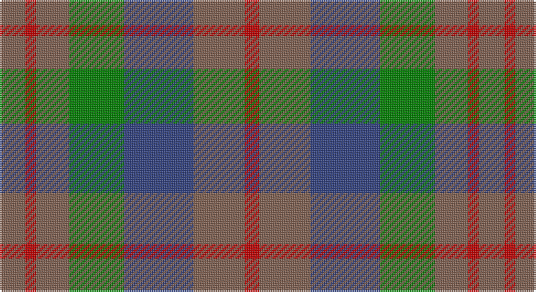

This page is one **sett** — a single exact thread-count. It belongs to the [tartan](/setts/o7r3o9g15db19o14r4/)
(the same proportion at any scale), whose colour order is pattern [RRBGRRR](/stripes/rrbgrrr/).

Sourced from weddslist.  It is a [7 stripe tartan](/stripes/stripes7/).

Original link http://www.weddslist.com/cgi-bin/tartans/pg.pl?source=sts

## Thread count
LT/14 R6 LT18 G30 B38 LT28 R/8

One full sett is **262 threads**.

## Palette

Palette: <strong>custom</strong>
<table><thead><tr><th>Colour</th><th>Threads</th><th>Shade</th><th>Base</th><th>OKLCh</th></tr></thead><tbody><tr><td>LT/</td><td style="text-align:right;font-variant-numeric:tabular-nums">14</td><td><code style="background-color:#806050;">#806050</code> <small style="color:#888">#806050</small></td><td>R <code style="background-color:#CC0000;">#CC0000</code></td><td><small style="color:#888">oklch(51.7% 0.049 47.8)</small></td></tr><tr><td>R</td><td style="text-align:right;font-variant-numeric:tabular-nums">6</td><td><code style="background-color:#C00000;">#C00000</code> <small style="color:#888">#C00000</small></td><td>R <code style="background-color:#CC0000;">#CC0000</code></td><td><small style="color:#888">oklch(50.7% 0.208 29.2)</small></td></tr><tr><td>LT</td><td style="text-align:right;font-variant-numeric:tabular-nums">18</td><td><code style="background-color:#806050;">#806050</code> <small style="color:#888">#806050</small></td><td>R <code style="background-color:#CC0000;">#CC0000</code></td><td><small style="color:#888">oklch(51.7% 0.049 47.8)</small></td></tr><tr><td>G</td><td style="text-align:right;font-variant-numeric:tabular-nums">30</td><td><code style="background-color:#008000;">#008000</code> <small style="color:#888">#008000</small></td><td>G <code style="background-color:#006100;">#006100</code></td><td><small style="color:#888">oklch(52.0% 0.177 142.5)</small></td></tr><tr><td>B</td><td style="text-align:right;font-variant-numeric:tabular-nums">38</td><td><code style="background-color:#304080;">#304080</code> <small style="color:#888">#304080</small></td><td>B <code style="background-color:#2A418A;">#2A418A</code></td><td><small style="color:#888">oklch(39.4% 0.109 270.2)</small></td></tr><tr><td>LT</td><td style="text-align:right;font-variant-numeric:tabular-nums">28</td><td><code style="background-color:#806050;">#806050</code> <small style="color:#888">#806050</small></td><td>R <code style="background-color:#CC0000;">#CC0000</code></td><td><small style="color:#888">oklch(51.7% 0.049 47.8)</small></td></tr><tr><td>R/</td><td style="text-align:right;font-variant-numeric:tabular-nums">8</td><td><code style="background-color:#C00000;">#C00000</code> <small style="color:#888">#C00000</small></td><td>R <code style="background-color:#CC0000;">#CC0000</code></td><td><small style="color:#888">oklch(50.7% 0.208 29.2)</small></td></tr></tbody></table>

# Sample pattern

## Nearest tartans

The nearest existing variants by ΔTartan distance, with this tartan at the top so the swatches line up against it.

ΔTartan

Tartan

Sett

—

<a href="/ttd/edit/#slug=o7r3o9g15db19o14r4~x2">Dorward</a> <a class="nn-out" href="/variants/s7/o7r3o9g15db19o14r4~x2/" title="open its dictionary page">↗</a>

0.68

<a href="/ttd/edit/#slug=dy7r3dy9g15db19dy14r4~x2&amp;base=o7r3o9g15db19o14r4~x2">Dorward/Dogwood</a> <a class="nn-out" href="/variants/s7/dy7r3dy9g15db19dy14r4~x2/" title="open its dictionary page">↗</a>

0.88

<a href="/ttd/edit/#slug=r1o4g3o1db3o1~x2&amp;base=o7r3o9g15db19o14r4~x2">Fraser Hunting</a> <a class="nn-out" href="/variants/s6/r1o4g3o1db3o1~x2/" title="open its dictionary page">↗</a>

1.20

<a href="/ttd/edit/#slug=r1dy7g7db7g7db7r1~x8&amp;base=o7r3o9g15db19o14r4~x2">Tennant (Yules)</a> <a class="nn-out" href="/variants/s7/r1dy7g7db7g7db7r1~x8/" title="open its dictionary page">↗</a>

1.20

<a href="/ttd/edit/#slug=dy9g9ly2g9dy9b9dy3~x2&amp;base=o7r3o9g15db19o14r4~x2">MacKay - 1800 (Reay Coat) (Artefact)</a> <a class="nn-out" href="/variants/s7/dy9g9ly2g9dy9b9dy3~x2/" title="open its dictionary page">↗</a>

1.21

<a href="/ttd/edit/#slug=dr5g6dy1g6dr5db6dr1~x2&amp;base=o7r3o9g15db19o14r4~x2">Gleneagles Group Corporate Tartan</a> <a class="nn-out" href="/variants/s7/dr5g6dy1g6dr5db6dr1~x2/" title="open its dictionary page">↗</a>

1.29

<a href="/ttd/edit/#slug=o16dg29n19g8n19dg29o16r4~x2&amp;base=o7r3o9g15db19o14r4~x2">Styrian</a> <a class="nn-out" href="/variants/s8/o16dg29n19g8n19dg29o16r4~x2/" title="open its dictionary page">↗</a>

1.33

<a href="/ttd/edit/#slug=db3o14g14o2db14o2db14o2g14o14r3~x2&amp;base=o7r3o9g15db19o14r4~x2">Buchanan, hunting</a> <a class="nn-out" href="/variants/s11/db3o14g14o2db14o2db14o2g14o14r3~x2/" title="open its dictionary page">↗</a>

1.37

<a href="/ttd/edit/#slug=dt1dy1dt7dy5y7lr1~x4&amp;base=o7r3o9g15db19o14r4~x2">Dewar (WCWM)</a> <a class="nn-out" href="/variants/s6/dt1dy1dt7dy5y7lr1~x4/" title="open its dictionary page">↗</a>

1.43

<a href="/variants/s6/r4ni3n12db8ni2r4/">Bristol Gramar School Check (School)</a>

1.47

<a href="/ttd/edit/#slug=g8n19dg29o16r4~x2&amp;base=o7r3o9g15db19o14r4~x2">Styrian (Fashion)</a> <a class="nn-out" href="/variants/s5/g8n19dg29o16r4~x2/" title="open its dictionary page">↗</a>

## Neighbour map

Every grey dot is one of 14360 variants placed by the first two principal components of the ΔTartan feature space (44% of its variance). Red is this tartan; blue dots are its nearest — click one to open its page.

<svg viewBox="0 0 640 380" role="img" style="max-width:100%;height:auto;border:1px solid #e0e0e0;border-radius:4px;display:block" xmlns="http://www.w3.org/2000/svg"><image href="/nn/cloud.v1.png" width="640" height="380"/><a href="/variants/s7/dy7r3dy9g15db19dy14r4~x2/"><circle cx="229.6" cy="280.8" r="4" fill="#3465a4"><title>Dorward/Dogwood</title></circle></a><a href="/variants/s6/r1o4g3o1db3o1~x2/"><circle cx="242.5" cy="303.9" r="4" fill="#3465a4"><title>Fraser Hunting</title></circle></a><a href="/variants/s7/r1dy7g7db7g7db7r1~x8/"><circle cx="208.4" cy="281.6" r="4" fill="#3465a4"><title>Tennant (Yules)</title></circle></a><a href="/variants/s7/dy9g9ly2g9dy9b9dy3~x2/"><circle cx="211.2" cy="314.3" r="4" fill="#3465a4"><title>MacKay - 1800 (Reay Coat) (Artefact)</title></circle></a><a href="/variants/s7/dr5g6dy1g6dr5db6dr1~x2/"><circle cx="212.9" cy="284.6" r="4" fill="#3465a4"><title>Gleneagles Group Corporate Tartan</title></circle></a><a href="/variants/s8/o16dg29n19g8n19dg29o16r4~x2/"><circle cx="195.1" cy="267.6" r="4" fill="#3465a4"><title>Styrian</title></circle></a><a href="/variants/s11/db3o14g14o2db14o2db14o2g14o14r3~x2/"><circle cx="214.8" cy="247.5" r="4" fill="#3465a4"><title>Buchanan, hunting</title></circle></a><a href="/variants/s6/dt1dy1dt7dy5y7lr1~x4/"><circle cx="256.3" cy="273.3" r="4" fill="#3465a4"><title>Dewar (WCWM)</title></circle></a><a href="/variants/s6/r4ni3n12db8ni2r4/"><circle cx="197.3" cy="266.6" r="4" fill="#3465a4"><title>Bristol Gramar School Check (School)</title></circle></a><a href="/variants/s5/g8n19dg29o16r4~x2/"><circle cx="194.9" cy="274.2" r="4" fill="#3465a4"><title>Styrian (Fashion)</title></circle></a><circle cx="230.3" cy="279.1" r="5" fill="#c00000"/></svg>

ID: /variants/s7/o7r3o9g15db19o14r4~x2/
