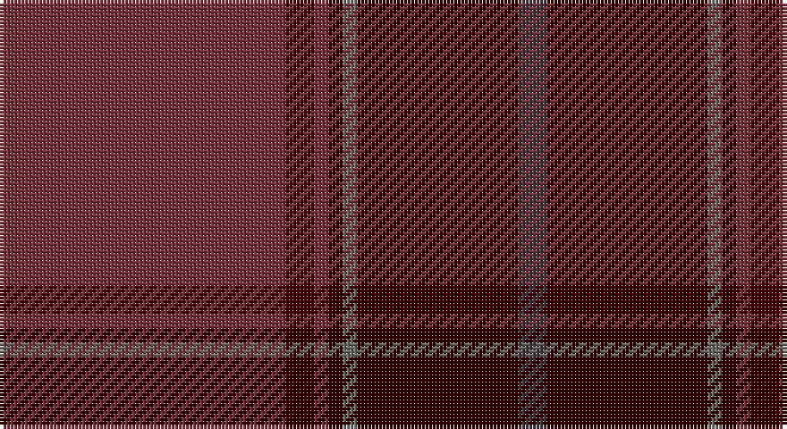

This page is one **sett** — a single exact thread-count. It belongs to the [tartan](/setts/o80dr8o4k4y4k45do8/)
(the same proportion at any scale), whose colour order is pattern [BKGKRBR](/stripes/bkgkrbr/).

Part of the [Isaia](/tartans/isaia/) tartan — the named design grouping this sett with its other cloths.

Sourced from register-of-tartans.  It is a [7 stripe tartan](/stripes/stripes7/).

Original link https://www.tartanregister.gov.uk/tartanDetails.aspx?ref=10330

## Register references

External register numbers recorded for this tartan.

- Scottish Register of Tartans: [10330](https://www.tartanregister.gov.uk/tartanDetails.aspx?ref=10330)

## Thread count
DR/80 DRa8 DR4 DRb4 N4 DRb45 Na/8

One full sett is **218 threads**.

## Palette

Palette: <strong>custom</strong>
<table><thead><tr><th>Colour</th><th>Threads</th><th>Shade</th><th>Base</th><th>OKLCh</th></tr></thead><tbody><tr><td>DR/</td><td style="text-align:right;font-variant-numeric:tabular-nums">80</td><td><code style="background-color:#76333A;">#76333A</code> <small style="color:#888">#76333A</small></td><td>R <code style="background-color:#CC0000;">#CC0000</code></td><td><small style="color:#888">oklch(41.4% 0.094 15.7)</small></td></tr><tr><td>DRa</td><td style="text-align:right;font-variant-numeric:tabular-nums">8</td><td><code style="background-color:#430506;">#430506</code> <small style="color:#888">#430506</small></td><td>B <code style="background-color:#2A418A;">#2A418A</code></td><td><small style="color:#888">oklch(24.7% 0.092 26.5)</small></td></tr><tr><td>DR</td><td style="text-align:right;font-variant-numeric:tabular-nums">4</td><td><code style="background-color:#76333A;">#76333A</code> <small style="color:#888">#76333A</small></td><td>R <code style="background-color:#CC0000;">#CC0000</code></td><td><small style="color:#888">oklch(41.4% 0.094 15.7)</small></td></tr><tr><td>DRb</td><td style="text-align:right;font-variant-numeric:tabular-nums">4</td><td><code style="background-color:#2F0200;">#2F0200</code> <small style="color:#888">#2F0200</small></td><td>K <code style="background-color:#000000;">#000000</code></td><td><small style="color:#888">oklch(19.5% 0.075 31.4)</small></td></tr><tr><td>N</td><td style="text-align:right;font-variant-numeric:tabular-nums">4</td><td><code style="background-color:#6C6964;">#6C6964</code> <small style="color:#888">#6C6964</small></td><td>G <code style="background-color:#006100;">#006100</code></td><td><small style="color:#888">oklch(52.2% 0.009 80.7)</small></td></tr><tr><td>DRb</td><td style="text-align:right;font-variant-numeric:tabular-nums">45</td><td><code style="background-color:#2F0200;">#2F0200</code> <small style="color:#888">#2F0200</small></td><td>K <code style="background-color:#000000;">#000000</code></td><td><small style="color:#888">oklch(19.5% 0.075 31.4)</small></td></tr><tr><td>Na/</td><td style="text-align:right;font-variant-numeric:tabular-nums">8</td><td><code style="background-color:#42333A;">#42333A</code> <small style="color:#888">#42333A</small></td><td>B <code style="background-color:#2A418A;">#2A418A</code></td><td><small style="color:#888">oklch(34.0% 0.024 348.7)</small></td></tr></tbody></table>

# Sample pattern

## Nearest tartans

The nearest existing variants by ΔTartan distance, with this tartan at the top so the swatches line up against it.

ΔTartan

Tartan

Sett

—

<a href="/ttd/edit/#slug=o80dr8o4k4y4k45do8">Isaia</a> <a class="nn-out" href="/variants/s7/o80dr8o4k4y4k45do8/" title="open its dictionary page">↗</a>

1.44

<a href="/ttd/edit/#slug=dr12dg4dr8dt3dg3dt3dg8dt12dr38lo2~x2&amp;base=o80dr8o4k4y4k45do8">Wanstall</a> <a class="nn-out" href="/variants/s10/dr12dg4dr8dt3dg3dt3dg8dt12dr38lo2~x2/" title="open its dictionary page">↗</a>

1.55

<a href="/ttd/edit/#slug=y4dr52k20do9y2lo1~x2&amp;base=o80dr8o4k4y4k45do8">Jack, John (Fife) (Personal)</a> <a class="nn-out" href="/variants/s6/y4dr52k20do9y2lo1~x2/" title="open its dictionary page">↗</a>

1.61

<a href="/ttd/edit/#slug=dt5n5dt2r47dt18o2dt5dy9n7o3~x2&amp;base=o80dr8o4k4y4k45do8">Rikaco Red</a> <a class="nn-out" href="/variants/s10/dt5n5dt2r47dt18o2dt5dy9n7o3~x2/" title="open its dictionary page">↗</a>

1.75

<a href="/ttd/edit/#slug=r8lr2o30dg12o3dg12o3~x2&amp;base=o80dr8o4k4y4k45do8">Wasko (Personal)</a> <a class="nn-out" href="/variants/s7/r8lr2o30dg12o3dg12o3~x2/" title="open its dictionary page">↗</a>

1.76

<a href="/ttd/edit/#slug=dri39dy4dr6lo2dr2w2dr2dy12dri6dr2dri6lo2~x2&amp;base=o80dr8o4k4y4k45do8">Glen Clova #2 (Fashion)</a> <a class="nn-out" href="/variants/s12/dri39dy4dr6lo2dr2w2dr2dy12dri6dr2dri6lo2~x2/" title="open its dictionary page">↗</a>

1.77

<a href="/ttd/edit/#slug=m50o6dr7g2dr2w2dr2o16m8dr2m9g3~x2&amp;base=o80dr8o4k4y4k45do8">Tyrone</a> <a class="nn-out" href="/variants/s12/m50o6dr7g2dr2w2dr2o16m8dr2m9g3~x2/" title="open its dictionary page">↗</a>

1.78

<a href="/ttd/edit/#slug=oi80o8oi4dy4lr4dy45n8&amp;base=o80dr8o4k4y4k45do8">Isaia (Fashion)</a> <a class="nn-out" href="/variants/s7/oi80o8oi4dy4lr4dy45n8/" title="open its dictionary page">↗</a>

1.82

<a href="/ttd/edit/#slug=dr7m4dr4m25p1dy32p4dy2w2dy5~x2&amp;base=o80dr8o4k4y4k45do8">Bell, John</a> <a class="nn-out" href="/variants/s10/dr7m4dr4m25p1dy32p4dy2w2dy5~x2/" title="open its dictionary page">↗</a>

1.87

<a href="/ttd/edit/#slug=dr24dg1b1dg2r24~x2&amp;base=o80dr8o4k4y4k45do8">MacNab WI 1</a> <a class="nn-out" href="/variants/s5/dr24dg1b1dg2r24~x2/" title="open its dictionary page">↗</a>

1.88

<a href="/ttd/edit/#slug=dy36k3o6k3do10o5do3lo4k1dy2~x2&amp;base=o80dr8o4k4y4k45do8">Mead (Tennessee) Hunting (Personal)</a> <a class="nn-out" href="/variants/s10/dy36k3o6k3do10o5do3lo4k1dy2~x2/" title="open its dictionary page">↗</a>

## Neighbour map

Every grey dot is one of 14360 variants placed by the first two principal components of the ΔTartan feature space (44% of its variance). Red is this tartan; blue dots are its nearest — click one to open its page.

<svg viewBox="0 0 640 380" role="img" style="max-width:100%;height:auto;border:1px solid #e0e0e0;border-radius:4px;display:block" xmlns="http://www.w3.org/2000/svg"><image href="/nn/cloud.v1.png" width="640" height="380"/><a href="/variants/s10/dr12dg4dr8dt3dg3dt3dg8dt12dr38lo2~x2/"><circle cx="485.9" cy="207.1" r="4" fill="#3465a4"><title>Wanstall</title></circle></a><a href="/variants/s6/y4dr52k20do9y2lo1~x2/"><circle cx="491.0" cy="169.6" r="4" fill="#3465a4"><title>Jack, John (Fife) (Personal)</title></circle></a><a href="/variants/s10/dt5n5dt2r47dt18o2dt5dy9n7o3~x2/"><circle cx="353.1" cy="154.2" r="4" fill="#3465a4"><title>Rikaco Red</title></circle></a><a href="/variants/s7/r8lr2o30dg12o3dg12o3~x2/"><circle cx="385.4" cy="226.6" r="4" fill="#3465a4"><title>Wasko (Personal)</title></circle></a><a href="/variants/s12/dri39dy4dr6lo2dr2w2dr2dy12dri6dr2dri6lo2~x2/"><circle cx="463.0" cy="166.7" r="4" fill="#3465a4"><title>Glen Clova #2 (Fashion)</title></circle></a><a href="/variants/s12/m50o6dr7g2dr2w2dr2o16m8dr2m9g3~x2/"><circle cx="455.0" cy="131.4" r="4" fill="#3465a4"><title>Tyrone</title></circle></a><a href="/variants/s7/oi80o8oi4dy4lr4dy45n8/"><circle cx="441.7" cy="184.3" r="4" fill="#3465a4"><title>Isaia (Fashion)</title></circle></a><a href="/variants/s10/dr7m4dr4m25p1dy32p4dy2w2dy5~x2/"><circle cx="363.7" cy="146.4" r="4" fill="#3465a4"><title>Bell, John</title></circle></a><a href="/variants/s5/dr24dg1b1dg2r24~x2/"><circle cx="447.5" cy="214.8" r="4" fill="#3465a4"><title>MacNab WI 1</title></circle></a><a href="/variants/s10/dy36k3o6k3do10o5do3lo4k1dy2~x2/"><circle cx="412.8" cy="146.6" r="4" fill="#3465a4"><title>Mead (Tennessee) Hunting (Personal)</title></circle></a><circle cx="444.3" cy="189.8" r="5" fill="#c00000"/></svg>

ID: /variants/s7/o80dr8o4k4y4k45do8/
