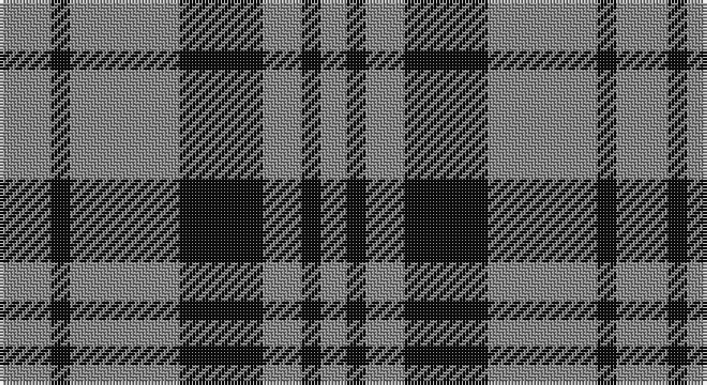

This page is one **sett** — a single exact thread-count. It belongs to the [tartan](/setts/o8k3o17k13o6k3o4/)
(the same proportion at any scale), whose colour order is pattern [RKRKRKR](/stripes/rkrkrkr/).

Sourced from tartans-authority.  It is a [7 stripe tartan](/stripes/stripes7/).

Original link http://www.tartansauthority.com/tartan-ferret/display/1287/

## Also known as

This cloth is also recorded under:

- Scott Black & Grey
- Scott Black and Grey

## Register references

External register numbers recorded for this tartan.

- Scottish Tartans Authority (ITI): 1287

## Thread count
N/16 K6 N34 K26 N12 K6 N/8

One full sett is **192 threads**.

## Palette

Palette: <strong>Tartan Register</strong>
<table><thead><tr><th>Colour</th><th>Threads</th><th>Shade</th><th>Base</th><th>OKLCh</th></tr></thead><tbody><tr><td>N/</td><td style="text-align:right;font-variant-numeric:tabular-nums">16</td><td><code style="background-color:#888888;">#888888</code> <small style="color:#888">#888888</small></td><td>R <code style="background-color:#CC0000;">#CC0000</code></td><td><small style="color:#888">oklch(62.7% 0.000 89.9)</small></td></tr><tr><td>K</td><td style="text-align:right;font-variant-numeric:tabular-nums">6</td><td><code style="background-color:#101010;">#101010</code> <small style="color:#888">#101010</small></td><td>K <code style="background-color:#000000;">#000000</code></td><td><small style="color:#888">oklch(17.3% 0.000 89.9)</small></td></tr><tr><td>N</td><td style="text-align:right;font-variant-numeric:tabular-nums">34</td><td><code style="background-color:#888888;">#888888</code> <small style="color:#888">#888888</small></td><td>R <code style="background-color:#CC0000;">#CC0000</code></td><td><small style="color:#888">oklch(62.7% 0.000 89.9)</small></td></tr><tr><td>K</td><td style="text-align:right;font-variant-numeric:tabular-nums">26</td><td><code style="background-color:#101010;">#101010</code> <small style="color:#888">#101010</small></td><td>K <code style="background-color:#000000;">#000000</code></td><td><small style="color:#888">oklch(17.3% 0.000 89.9)</small></td></tr><tr><td>N</td><td style="text-align:right;font-variant-numeric:tabular-nums">12</td><td><code style="background-color:#888888;">#888888</code> <small style="color:#888">#888888</small></td><td>R <code style="background-color:#CC0000;">#CC0000</code></td><td><small style="color:#888">oklch(62.7% 0.000 89.9)</small></td></tr><tr><td>K</td><td style="text-align:right;font-variant-numeric:tabular-nums">6</td><td><code style="background-color:#101010;">#101010</code> <small style="color:#888">#101010</small></td><td>K <code style="background-color:#000000;">#000000</code></td><td><small style="color:#888">oklch(17.3% 0.000 89.9)</small></td></tr><tr><td>N/</td><td style="text-align:right;font-variant-numeric:tabular-nums">8</td><td><code style="background-color:#888888;">#888888</code> <small style="color:#888">#888888</small></td><td>R <code style="background-color:#CC0000;">#CC0000</code></td><td><small style="color:#888">oklch(62.7% 0.000 89.9)</small></td></tr></tbody></table>

# Sample pattern

## Nearest tartans

The nearest existing variants by ΔTartan distance, with this tartan at the top so the swatches line up against it.

ΔTartan

Tartan

Sett

—

<a href="/ttd/edit/#slug=o8k3o17k13o6k3o4~x2">Scott Black &amp; Grey (Corporate)</a> <a class="nn-out" href="/variants/s7/o8k3o17k13o6k3o4~x2/" title="open its dictionary page">↗</a>

0.25

<a href="/ttd/edit/#slug=y8k3y17k13y6k3y4~x2&amp;base=o8k3o17k13o6k3o4~x2">Scott Black and Grey</a> <a class="nn-out" href="/variants/s7/y8k3y17k13y6k3y4~x2/" title="open its dictionary page">↗</a>

1.40

<a href="/ttd/edit/#slug=db11r4ly9db4ly2db11~x2&amp;base=o8k3o17k13o6k3o4~x2">Unidentified Sample</a> <a class="nn-out" href="/variants/s6/db11r4ly9db4ly2db11~x2/" title="open its dictionary page">↗</a>

1.53

<a href="/ttd/edit/#slug=k6y20k6y4k4y8y2k8y2k5~x2&amp;base=o8k3o17k13o6k3o4~x2">Bute Heather, Black</a> <a class="nn-out" href="/variants/s10/k6y20k6y4k4y8y2k8y2k5~x2/" title="open its dictionary page">↗</a>

1.59

<a href="/ttd/edit/#slug=g8p4g1p2~x4&amp;base=o8k3o17k13o6k3o4~x2">Wilson's, No 211</a> <a class="nn-out" href="/variants/s4/g8p4g1p2~x4/" title="open its dictionary page">↗</a>

1.61

<a href="/ttd/edit/#slug=db1lo5db1lo5db2w1~x4&amp;base=o8k3o17k13o6k3o4~x2">Tokharion</a> <a class="nn-out" href="/variants/s6/db1lo5db1lo5db2w1~x4/" title="open its dictionary page">↗</a>

1.69

<a href="/ttd/edit/#slug=dg86lo44dg21lo44dg86t10&amp;base=o8k3o17k13o6k3o4~x2">Special Saffron</a> <a class="nn-out" href="/variants/s6/dg86lo44dg21lo44dg86t10/" title="open its dictionary page">↗</a>

1.70

<a href="/ttd/edit/#slug=db3lo9db3lo9db20r3~x2&amp;base=o8k3o17k13o6k3o4~x2">Latin</a> <a class="nn-out" href="/variants/s6/db3lo9db3lo9db20r3~x2/" title="open its dictionary page">↗</a>

1.75

<a href="/ttd/edit/#slug=w2k1w6k6w2k1w1~x2&amp;base=o8k3o17k13o6k3o4~x2">Scott (Abbreviated)</a> <a class="nn-out" href="/variants/s7/w2k1w6k6w2k1w1~x2/" title="open its dictionary page">↗</a>

1.76

<a href="/ttd/edit/#slug=lr2dr4lr2dr4lr9k1~x2&amp;base=o8k3o17k13o6k3o4~x2">Buchanan VS</a> <a class="nn-out" href="/variants/s6/lr2dr4lr2dr4lr9k1~x2/" title="open its dictionary page">↗</a>

1.79

<a href="/ttd/edit/#slug=k2w1k8w8k1~x8&amp;base=o8k3o17k13o6k3o4~x2">Cairn (Marton Mills)</a> <a class="nn-out" href="/variants/s5/k2w1k8w8k1~x8/" title="open its dictionary page">↗</a>

## Neighbour map

Every grey dot is one of 14360 variants placed by the first two principal components of the ΔTartan feature space (44% of its variance). Red is this tartan; blue dots are its nearest — click one to open its page.

<svg viewBox="0 0 640 380" role="img" style="max-width:100%;height:auto;border:1px solid #e0e0e0;border-radius:4px;display:block" xmlns="http://www.w3.org/2000/svg"><image href="/nn/cloud.v1.png" width="640" height="380"/><a href="/variants/s7/y8k3y17k13y6k3y4~x2/"><circle cx="361.9" cy="274.7" r="4" fill="#3465a4"><title>Scott Black and Grey</title></circle></a><a href="/variants/s6/db11r4ly9db4ly2db11~x2/"><circle cx="292.7" cy="266.5" r="4" fill="#3465a4"><title>Unidentified Sample</title></circle></a><a href="/variants/s10/k6y20k6y4k4y8y2k8y2k5~x2/"><circle cx="340.1" cy="229.2" r="4" fill="#3465a4"><title>Bute Heather, Black</title></circle></a><a href="/variants/s4/g8p4g1p2~x4/"><circle cx="374.6" cy="282.6" r="4" fill="#3465a4"><title>Wilson's, No 211</title></circle></a><a href="/variants/s6/db1lo5db1lo5db2w1~x4/"><circle cx="359.6" cy="260.5" r="4" fill="#3465a4"><title>Tokharion</title></circle></a><a href="/variants/s6/dg86lo44dg21lo44dg86t10/"><circle cx="354.3" cy="257.4" r="4" fill="#3465a4"><title>Special Saffron</title></circle></a><a href="/variants/s6/db3lo9db3lo9db20r3~x2/"><circle cx="305.0" cy="240.8" r="4" fill="#3465a4"><title>Latin</title></circle></a><a href="/variants/s7/w2k1w6k6w2k1w1~x2/"><circle cx="298.8" cy="232.3" r="4" fill="#3465a4"><title>Scott (Abbreviated)</title></circle></a><a href="/variants/s6/lr2dr4lr2dr4lr9k1~x2/"><circle cx="316.3" cy="222.8" r="4" fill="#3465a4"><title>Buchanan VS</title></circle></a><a href="/variants/s5/k2w1k8w8k1~x8/"><circle cx="311.7" cy="238.5" r="4" fill="#3465a4"><title>Cairn (Marton Mills)</title></circle></a><circle cx="355.1" cy="270.7" r="5" fill="#c00000"/></svg>

ID: /variants/s7/o8k3o17k13o6k3o4~x2/
