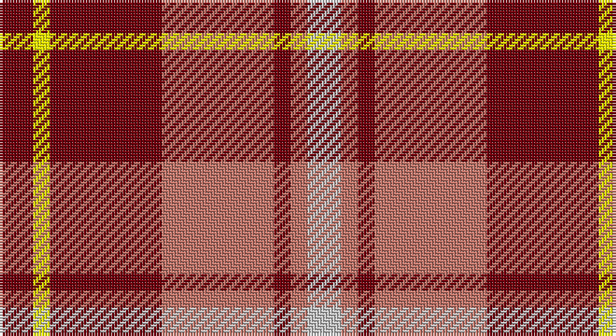

This page is one **sett** — a single exact thread-count. It belongs to the [tartan](/setts/oi6ly3oi20o20oi3o3lb6/)
(the same proportion at any scale), whose colour order is pattern [RYRRRRW](/stripes/ryrrrrw/).

Part of the [Banff](/tartans/banff/) tartan — the named design grouping this sett with its other cloths.

Sourced from register-of-tartans.  It is a [7 stripe tartan](/stripes/stripes7/).

Original link https://www.tartanregister.gov.uk/tartanDetails.aspx?ref=5016

## Also known as

This cloth is also recorded under:

- Banff, White

## Register references

External register numbers recorded for this tartan.

- Scottish Register of Tartans: [5016](https://www.tartanregister.gov.uk/tartanDetails.aspx?ref=5016)
- Scottish Tartans Authority (ITI): 3647

## Thread count
DR/12 Y6 DR40 LT40 DR6 LT6 N/12

One full sett is **220 threads**.

## Palette

Palette: <strong>custom</strong>
<table><thead><tr><th>Colour</th><th>Threads</th><th>Shade</th><th>Base</th><th>OKLCh</th></tr></thead><tbody><tr><td>DR/</td><td style="text-align:right;font-variant-numeric:tabular-nums">12</td><td><code style="background-color:#70000C;">#70000C</code> <small style="color:#888">#70000C</small></td><td>R <code style="background-color:#CC0000;">#CC0000</code></td><td><small style="color:#888">oklch(34.3% 0.139 25.3)</small></td></tr><tr><td>Y</td><td style="text-align:right;font-variant-numeric:tabular-nums">6</td><td><code style="background-color:#FCFC00;">#FCFC00</code> <small style="color:#888">#FCFC00</small></td><td>Y <code style="background-color:#F2BF00;">#F2BF00</code></td><td><small style="color:#888">oklch(95.9% 0.209 109.8)</small></td></tr><tr><td>DR</td><td style="text-align:right;font-variant-numeric:tabular-nums">40</td><td><code style="background-color:#70000C;">#70000C</code> <small style="color:#888">#70000C</small></td><td>R <code style="background-color:#CC0000;">#CC0000</code></td><td><small style="color:#888">oklch(34.3% 0.139 25.3)</small></td></tr><tr><td>LT</td><td style="text-align:right;font-variant-numeric:tabular-nums">40</td><td><code style="background-color:#C07468;">#C07468</code> <small style="color:#888">#C07468</small></td><td>R <code style="background-color:#CC0000;">#CC0000</code></td><td><small style="color:#888">oklch(63.8% 0.098 29.7)</small></td></tr><tr><td>DR</td><td style="text-align:right;font-variant-numeric:tabular-nums">6</td><td><code style="background-color:#70000C;">#70000C</code> <small style="color:#888">#70000C</small></td><td>R <code style="background-color:#CC0000;">#CC0000</code></td><td><small style="color:#888">oklch(34.3% 0.139 25.3)</small></td></tr><tr><td>LT</td><td style="text-align:right;font-variant-numeric:tabular-nums">6</td><td><code style="background-color:#C07468;">#C07468</code> <small style="color:#888">#C07468</small></td><td>R <code style="background-color:#CC0000;">#CC0000</code></td><td><small style="color:#888">oklch(63.8% 0.098 29.7)</small></td></tr><tr><td>N/</td><td style="text-align:right;font-variant-numeric:tabular-nums">12</td><td><code style="background-color:#C4C4C4;">#C4C4C4</code> <small style="color:#888">#C4C4C4</small></td><td>W <code style="background-color:#F7F7F7;">#F7F7F7</code></td><td><small style="color:#888">oklch(82.0% 0.000 89.9)</small></td></tr></tbody></table>

# Sample pattern

## Nearest tartans

The nearest existing variants by ΔTartan distance, with this tartan at the top so the swatches line up against it.

ΔTartan

Tartan

Sett

—

<a href="/ttd/edit/#slug=oi6ly3oi20o20oi3o3lb6~x2">Banff</a> <a class="nn-out" href="/variants/s7/oi6ly3oi20o20oi3o3lb6~x2/" title="open its dictionary page">↗</a>

0.73

<a href="/ttd/edit/#slug=r16o2r11o6k4w2k4o16~x2&amp;base=oi6ly3oi20o20oi3o3lb6~x2">Sidney (Nova Scotia) Canadian Tartan</a> <a class="nn-out" href="/variants/s8/r16o2r11o6k4w2k4o16~x2/" title="open its dictionary page">↗</a>

0.95

<a href="/ttd/edit/#slug=dp2r4g12r3dp6r10w2~x2&amp;base=oi6ly3oi20o20oi3o3lb6~x2">MacKintosh-Geddes (Personal?)</a> <a class="nn-out" href="/variants/s7/dp2r4g12r3dp6r10w2~x2/" title="open its dictionary page">↗</a>

1.15

<a href="/ttd/edit/#slug=r12w2o3w2r3k5r2o18w2~x2&amp;base=oi6ly3oi20o20oi3o3lb6~x2">Ballater</a> <a class="nn-out" href="/variants/s9/r12w2o3w2r3k5r2o18w2~x2/" title="open its dictionary page">↗</a>

1.17

<a href="/ttd/edit/#slug=r20k5dg5r5w5o3dg3~x4&amp;base=oi6ly3oi20o20oi3o3lb6~x2">Mangles, Peter and Annette (Personal</a> <a class="nn-out" href="/variants/s7/r20k5dg5r5w5o3dg3~x4/" title="open its dictionary page">↗</a>

1.20

<a href="/ttd/edit/#slug=r20k5g5r5w5lr3g3~x4&amp;base=oi6ly3oi20o20oi3o3lb6~x2">Mangles, Peter and Annette Family/Personal Tartan</a> <a class="nn-out" href="/variants/s7/r20k5g5r5w5lr3g3~x4/" title="open its dictionary page">↗</a>

1.20

<a href="/ttd/edit/#slug=r12g2r4g4k15t4r4t2r12~x2&amp;base=oi6ly3oi20o20oi3o3lb6~x2">Alexander - 1985 (Name)</a> <a class="nn-out" href="/variants/s9/r12g2r4g4k15t4r4t2r12~x2/" title="open its dictionary page">↗</a>

1.21

<a href="/ttd/edit/#slug=w2r4dg8r16t2r3dg16r4t2r4w2~x2&amp;base=oi6ly3oi20o20oi3o3lb6~x2">MacKinnon #10</a> <a class="nn-out" href="/variants/s11/w2r4dg8r16t2r3dg16r4t2r4w2~x2/" title="open its dictionary page">↗</a>

1.21

<a href="/ttd/edit/#slug=r8ri1dg4ri1dg1t2~x2&amp;base=oi6ly3oi20o20oi3o3lb6~x2">Moray of Abercairney</a> <a class="nn-out" href="/variants/s6/r8ri1dg4ri1dg1t2~x2/" title="open its dictionary page">↗</a>

1.22

<a href="/ttd/edit/#slug=k3y28k3r22k8w3~x2&amp;base=oi6ly3oi20o20oi3o3lb6~x2">Henkel (Corporate)</a> <a class="nn-out" href="/variants/s6/k3y28k3r22k8w3~x2/" title="open its dictionary page">↗</a>

1.22

<a href="/ttd/edit/#slug=y28k3r22k8w3k8r22k3y28k3~x2&amp;base=oi6ly3oi20o20oi3o3lb6~x2">Henkel</a> <a class="nn-out" href="/variants/s10/y28k3r22k8w3k8r22k3y28k3~x2/" title="open its dictionary page">↗</a>

## Neighbour map

Every grey dot is one of 14360 variants placed by the first two principal components of the ΔTartan feature space (44% of its variance). Red is this tartan; blue dots are its nearest — click one to open its page.

<svg viewBox="0 0 640 380" role="img" style="max-width:100%;height:auto;border:1px solid #e0e0e0;border-radius:4px;display:block" xmlns="http://www.w3.org/2000/svg"><image href="/nn/cloud.v1.png" width="640" height="380"/><a href="/variants/s8/r16o2r11o6k4w2k4o16~x2/"><circle cx="235.6" cy="203.4" r="4" fill="#3465a4"><title>Sidney (Nova Scotia) Canadian Tartan</title></circle></a><a href="/variants/s7/dp2r4g12r3dp6r10w2~x2/"><circle cx="200.6" cy="223.5" r="4" fill="#3465a4"><title>MacKintosh-Geddes (Personal?)</title></circle></a><a href="/variants/s9/r12w2o3w2r3k5r2o18w2~x2/"><circle cx="222.1" cy="163.2" r="4" fill="#3465a4"><title>Ballater</title></circle></a><a href="/variants/s7/r20k5dg5r5w5o3dg3~x4/"><circle cx="229.8" cy="176.1" r="4" fill="#3465a4"><title>Mangles, Peter and Annette (Personal</title></circle></a><a href="/variants/s7/r20k5g5r5w5lr3g3~x4/"><circle cx="226.6" cy="172.3" r="4" fill="#3465a4"><title>Mangles, Peter and Annette Family/Personal Tartan</title></circle></a><a href="/variants/s9/r12g2r4g4k15t4r4t2r12~x2/"><circle cx="258.2" cy="201.2" r="4" fill="#3465a4"><title>Alexander - 1985 (Name)</title></circle></a><a href="/variants/s11/w2r4dg8r16t2r3dg16r4t2r4w2~x2/"><circle cx="259.0" cy="174.2" r="4" fill="#3465a4"><title>MacKinnon #10</title></circle></a><a href="/variants/s6/r8ri1dg4ri1dg1t2~x2/"><circle cx="270.7" cy="209.0" r="4" fill="#3465a4"><title>Moray of Abercairney</title></circle></a><a href="/variants/s6/k3y28k3r22k8w3~x2/"><circle cx="222.1" cy="190.4" r="4" fill="#3465a4"><title>Henkel (Corporate)</title></circle></a><a href="/variants/s10/y28k3r22k8w3k8r22k3y28k3~x2/"><circle cx="225.6" cy="181.5" r="4" fill="#3465a4"><title>Henkel</title></circle></a><circle cx="247.2" cy="200.1" r="5" fill="#c00000"/></svg>

ID: /variants/s7/oi6ly3oi20o20oi3o3lb6~x2/
