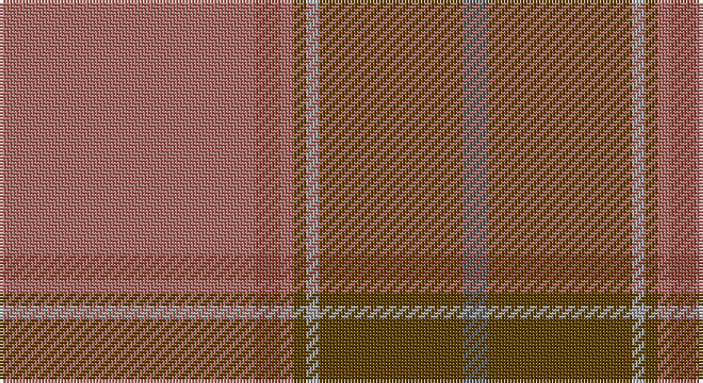

This page is one **sett** — a single exact thread-count. It belongs to the [tartan](/setts/oi80o8oi4dy4lr4dy45n8/)
(the same proportion at any scale), whose colour order is pattern [BGYGRRR](/stripes/bgygrrr/).

Part of the [Isaia](/tartans/isaia/) tartan — the named design grouping this sett with its other cloths.

Sourced from tartans-authority.  It is a [7 stripe tartan](/stripes/stripes7/).

Original link http://www.tartansauthority.com/tartan-ferret/display/10330/

## Register references

External register numbers recorded for this tartan.

- Scottish Register of Tartans: [10330](https://www.tartanregister.gov.uk/tartanDetails?ref=10330)
- Scottish Tartans Authority (ITI): 10330

## Thread count
LTa/80 LT8 LTa4 T4 N4 T45 Na/8

One full sett is **218 threads**.

## Palette

Palette: <strong>Tartan Register</strong> <small style="color:#888">(2 of 5 colours)</small>
<table><thead><tr><th>Colour</th><th>Threads</th><th>Shade</th><th>Base</th><th>OKLCh</th></tr></thead><tbody><tr><td>LTa/</td><td style="text-align:right;font-variant-numeric:tabular-nums">80</td><td><code style="background-color:#AC6C64;">#AC6C64</code> <small style="color:#888">#AC6C64</small></td><td>R <code style="background-color:#CC0000;">#CC0000</code></td><td><small style="color:#888">oklch(59.8% 0.083 27.5)</small></td></tr><tr><td>LT</td><td style="text-align:right;font-variant-numeric:tabular-nums">8</td><td><code style="background-color:#904C40;">#904C40</code> <small style="color:#888">#904C40</small></td><td>R <code style="background-color:#CC0000;">#CC0000</code></td><td><small style="color:#888">oklch(49.6% 0.094 31.2)</small></td></tr><tr><td>LTa</td><td style="text-align:right;font-variant-numeric:tabular-nums">4</td><td><code style="background-color:#AC6C64;">#AC6C64</code> <small style="color:#888">#AC6C64</small></td><td>R <code style="background-color:#CC0000;">#CC0000</code></td><td><small style="color:#888">oklch(59.8% 0.083 27.5)</small></td></tr><tr><td>T</td><td style="text-align:right;font-variant-numeric:tabular-nums">4</td><td><code style="background-color:#604000;">#604000</code> <small style="color:#888">#604000</small></td><td>G <code style="background-color:#006100;">#006100</code></td><td><small style="color:#888">oklch(39.8% 0.083 76.8)</small></td></tr><tr><td>N</td><td style="text-align:right;font-variant-numeric:tabular-nums">4</td><td><code style="background-color:#A0A0A0;">#A0A0A0</code> <small style="color:#888">#A0A0A0</small></td><td>Y <code style="background-color:#F2BF00;">#F2BF00</code></td><td><small style="color:#888">oklch(70.6% 0.000 89.9)</small></td></tr><tr><td>T</td><td style="text-align:right;font-variant-numeric:tabular-nums">45</td><td><code style="background-color:#604000;">#604000</code> <small style="color:#888">#604000</small></td><td>G <code style="background-color:#006100;">#006100</code></td><td><small style="color:#888">oklch(39.8% 0.083 76.8)</small></td></tr><tr><td>Na/</td><td style="text-align:right;font-variant-numeric:tabular-nums">8</td><td><code style="background-color:#5C5C5C;">#5C5C5C</code> <small style="color:#888">#5C5C5C</small></td><td>B <code style="background-color:#2A418A;">#2A418A</code></td><td><small style="color:#888">oklch(47.5% 0.000 89.9)</small></td></tr></tbody></table>

# Sample pattern

## Compared to the master

This cloth is one sett of its design; the master sett (the exemplar the design is anchored on) is below for comparison.

<figure style="margin:0"><figcaption style="color:#888;font-size:smaller">this sett</figcaption></figure>
<figure style="margin:0"><figcaption style="color:#888;font-size:smaller"><a href="/setts/o80dr8o4k4y4k45do8/">master sett →</a></figcaption></figure>

## Nearest tartans

The nearest existing variants by ΔTartan distance, with this tartan at the top so the swatches line up against it.

ΔTartan

Tartan

Sett

—

<a href="/ttd/edit/#slug=oi80o8oi4dy4lr4dy45n8">Isaia (Fashion)</a> <a class="nn-out" href="/variants/s7/oi80o8oi4dy4lr4dy45n8/" title="open its dictionary page">↗</a>

1.68

<a href="/ttd/edit/#slug=y50k1r12lb1yi12r14lb1r2~x4&amp;base=oi80o8oi4dy4lr4dy45n8">MacByrd (Personal)</a> <a class="nn-out" href="/variants/s8/y50k1r12lb1yi12r14lb1r2~x4/" title="open its dictionary page">↗</a>

1.74

<a href="/ttd/edit/#slug=r2b4y18n2y2n41w2~x2&amp;base=oi80o8oi4dy4lr4dy45n8">Haddrell (2013)</a> <a class="nn-out" href="/variants/s7/r2b4y18n2y2n41w2~x2/" title="open its dictionary page">↗</a>

1.76

<a href="/ttd/edit/#slug=o65dr9r11o5t2lo2y5o2lo13~x2&amp;base=oi80o8oi4dy4lr4dy45n8">Down</a> <a class="nn-out" href="/variants/s9/o65dr9r11o5t2lo2y5o2lo13~x2/" title="open its dictionary page">↗</a>

1.78

<a href="/ttd/edit/#slug=o80dr8o4k4y4k45do8&amp;base=oi80o8oi4dy4lr4dy45n8">Isaia</a> <a class="nn-out" href="/variants/s7/o80dr8o4k4y4k45do8/" title="open its dictionary page">↗</a>

1.80

<a href="/ttd/edit/#slug=o50k1r14lb1dg14r14lb1r2~x4&amp;base=oi80o8oi4dy4lr4dy45n8">McBrayer Htg (Personal)</a> <a class="nn-out" href="/variants/s8/o50k1r14lb1dg14r14lb1r2~x4/" title="open its dictionary page">↗</a>

1.82

<a href="/variants/s14/r4o3dy2o38y30dy3y3dy3~x2/">Unidentified Lindley #6</a>

1.84

<a href="/ttd/edit/#slug=g4n4g2lo36n14lo2t4g7r5lo3~x2&amp;base=oi80o8oi4dy4lr4dy45n8">Rikaco Eve (Fashion)</a> <a class="nn-out" href="/variants/s10/g4n4g2lo36n14lo2t4g7r5lo3~x2/" title="open its dictionary page">↗</a>

1.93

<a href="/ttd/edit/#slug=dri39dy4dr6lo2dr2w2dr2dy12dri6dr2dri6lo2~x2&amp;base=oi80o8oi4dy4lr4dy45n8">Glen Clova #2 (Fashion)</a> <a class="nn-out" href="/variants/s12/dri39dy4dr6lo2dr2w2dr2dy12dri6dr2dri6lo2~x2/" title="open its dictionary page">↗</a>

1.95

<a href="/ttd/edit/#slug=y28k2y28k2y2k2dy29k2r2k2~x2&amp;base=oi80o8oi4dy4lr4dy45n8">Ulster (Peat) (District</a> <a class="nn-out" href="/variants/s10/y28k2y28k2y2k2dy29k2r2k2~x2/" title="open its dictionary page">↗</a>

2.00

<a href="/ttd/edit/#slug=dy36k3o6k3do10o5do3lo4k1dy2~x2&amp;base=oi80o8oi4dy4lr4dy45n8">Mead (Tennessee) Hunting (Personal)</a> <a class="nn-out" href="/variants/s10/dy36k3o6k3do10o5do3lo4k1dy2~x2/" title="open its dictionary page">↗</a>

## Neighbour map

Every grey dot is one of 14360 variants placed by the first two principal components of the ΔTartan feature space (44% of its variance). Red is this tartan; blue dots are its nearest — click one to open its page.

<svg viewBox="0 0 640 380" role="img" style="max-width:100%;height:auto;border:1px solid #e0e0e0;border-radius:4px;display:block" xmlns="http://www.w3.org/2000/svg"><image href="/nn/cloud.v1.png" width="640" height="380"/><a href="/variants/s8/y50k1r12lb1yi12r14lb1r2~x4/"><circle cx="450.1" cy="133.7" r="4" fill="#3465a4"><title>MacByrd (Personal)</title></circle></a><a href="/variants/s7/r2b4y18n2y2n41w2~x2/"><circle cx="459.5" cy="181.1" r="4" fill="#3465a4"><title>Haddrell (2013)</title></circle></a><a href="/variants/s9/o65dr9r11o5t2lo2y5o2lo13~x2/"><circle cx="459.1" cy="116.7" r="4" fill="#3465a4"><title>Down</title></circle></a><a href="/variants/s7/o80dr8o4k4y4k45do8/"><circle cx="444.3" cy="189.8" r="4" fill="#3465a4"><title>Isaia</title></circle></a><a href="/variants/s8/o50k1r14lb1dg14r14lb1r2~x4/"><circle cx="459.7" cy="146.0" r="4" fill="#3465a4"><title>McBrayer Htg (Personal)</title></circle></a><a href="/variants/s14/r4o3dy2o38y30dy3y3dy3~x2/"><circle cx="410.5" cy="169.2" r="4" fill="#3465a4"><title>Unidentified Lindley #6</title></circle></a><a href="/variants/s10/g4n4g2lo36n14lo2t4g7r5lo3~x2/"><circle cx="355.7" cy="164.7" r="4" fill="#3465a4"><title>Rikaco Eve (Fashion)</title></circle></a><a href="/variants/s12/dri39dy4dr6lo2dr2w2dr2dy12dri6dr2dri6lo2~x2/"><circle cx="463.0" cy="166.7" r="4" fill="#3465a4"><title>Glen Clova #2 (Fashion)</title></circle></a><a href="/variants/s10/y28k2y28k2y2k2dy29k2r2k2~x2/"><circle cx="480.7" cy="219.8" r="4" fill="#3465a4"><title>Ulster (Peat) (District</title></circle></a><a href="/variants/s10/dy36k3o6k3do10o5do3lo4k1dy2~x2/"><circle cx="412.8" cy="146.6" r="4" fill="#3465a4"><title>Mead (Tennessee) Hunting (Personal)</title></circle></a><circle cx="441.7" cy="184.3" r="5" fill="#c00000"/></svg>

ID: /variants/s7/oi80o8oi4dy4lr4dy45n8/
