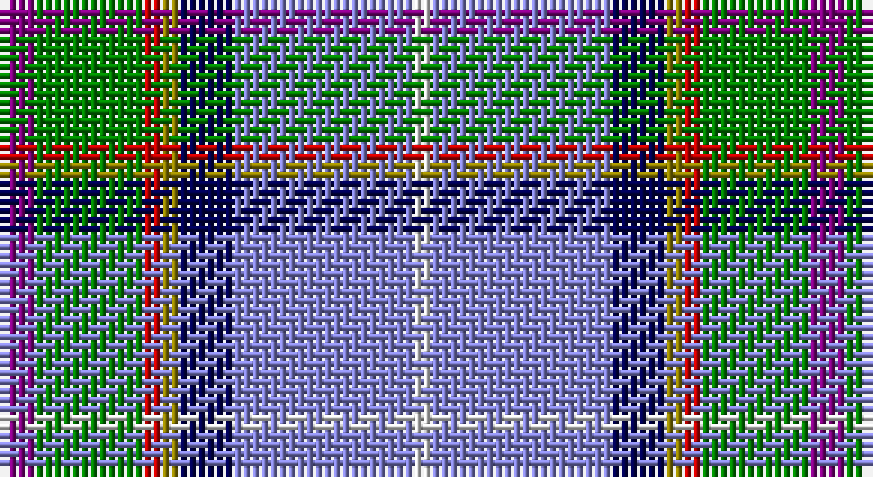

This page is one **sett** — a single exact thread-count. It belongs to the [tartan](/setts/p2g6r1y1db3b10w1/)
(the same proportion at any scale), whose colour order is pattern [BGRGBBW](/stripes/bgrgbbw/).

Part of the [Manx National](/tartans/manx-national/) tartan — the named design grouping this sett with its other cloths.

Sourced from weddslist.  It is a [7 stripe tartan](/stripes/stripes7/).

Original link http://www.weddslist.com/cgi-bin/tartans/pg.pl?source=sts

## Also known as

This cloth is also recorded under:

- Manx National #2

## Thread count
P/4 G12 R2 LG2 DB6 B20 LN/2

One full sett is **90 threads**.

## Palette

Palette: <strong>Tartan Dictionary</strong> <small style="color:#888">(1 of 7 colours)</small>
<table><thead><tr><th>Colour</th><th>Threads</th><th>Shade</th><th>Base</th><th>OKLCh</th></tr></thead><tbody><tr><td>P/</td><td style="text-align:right;font-variant-numeric:tabular-nums">4</td><td><code style="background-color:#800080;">#800080</code> <small style="color:#888">#800080</small></td><td>B <code style="background-color:#2A418A;">#2A418A</code></td><td><small style="color:#888">oklch(42.1% 0.193 328.4)</small></td></tr><tr><td>G</td><td style="text-align:right;font-variant-numeric:tabular-nums">12</td><td><code style="background-color:#008000;">#008000</code> <small style="color:#888">#008000</small></td><td>G <code style="background-color:#006100;">#006100</code></td><td><small style="color:#888">oklch(52.0% 0.177 142.5)</small></td></tr><tr><td>R</td><td style="text-align:right;font-variant-numeric:tabular-nums">2</td><td><code style="background-color:#C00000;">#C00000</code> <small style="color:#888">#C00000</small></td><td>R <code style="background-color:#CC0000;">#CC0000</code></td><td><small style="color:#888">oklch(50.7% 0.208 29.2)</small></td></tr><tr><td>LG</td><td style="text-align:right;font-variant-numeric:tabular-nums">2</td><td><code style="background-color:#908000;">#908000</code> <small style="color:#888">#908000</small></td><td>G <code style="background-color:#006100;">#006100</code></td><td><small style="color:#888">oklch(59.6% 0.124 100.6)</small></td></tr><tr><td>DB</td><td style="text-align:right;font-variant-numeric:tabular-nums">6</td><td><code style="background-color:#000050;">#000050</code> <small style="color:#888">#000050</small></td><td>B <code style="background-color:#2A418A;">#2A418A</code></td><td><small style="color:#888">oklch(19.5% 0.135 264.1)</small></td></tr><tr><td>B</td><td style="text-align:right;font-variant-numeric:tabular-nums">20</td><td><code style="background-color:#8080D0;">#8080D0</code> <small style="color:#888">#8080D0</small></td><td>B <code style="background-color:#2A418A;">#2A418A</code></td><td><small style="color:#888">oklch(63.4% 0.119 282.5)</small></td></tr><tr><td>LN/</td><td style="text-align:right;font-variant-numeric:tabular-nums">2</td><td><code style="background-color:#E0E0E0;">#E0E0E0</code> <small style="color:#888">#E0E0E0</small></td><td>W <code style="background-color:#F7F7F7;">#F7F7F7</code></td><td><small style="color:#888">oklch(90.7% 0.000 89.9)</small></td></tr></tbody></table>

# Sample pattern

## Compared to the master

This cloth is one sett of its design; the master sett (the exemplar the design is anchored on) is below for comparison.

<figure style="margin:0"><figcaption style="color:#888;font-size:smaller">this sett</figcaption></figure>
<figure style="margin:0"><figcaption style="color:#888;font-size:smaller"><a href="/setts/b5dg9o2ly2db6t14w3/">master sett →</a></figcaption></figure>

## Nearest tartans

The nearest existing variants by ΔTartan distance, with this tartan at the top so the swatches line up against it.

ΔTartan

Tartan

Sett

—

<a href="/ttd/edit/#slug=p2g6r1y1db3b10w1~x2">Manx National</a> <a class="nn-out" href="/variants/s7/p2g6r1y1db3b10w1~x2/" title="open its dictionary page">↗</a>

0.68

<a href="/ttd/edit/#slug=dp2g6r1ly1db3t10w1~x2&amp;base=p2g6r1y1db3b10w1~x2">Manx National District Tartan</a> <a class="nn-out" href="/variants/s7/dp2g6r1ly1db3t10w1~x2/" title="open its dictionary page">↗</a>

0.92

<a href="/ttd/edit/#slug=dp2g8r1ly1db6t15w1~x4&amp;base=p2g6r1y1db3b10w1~x2">Manx National District Tartan</a> <a class="nn-out" href="/variants/s7/dp2g8r1ly1db6t15w1~x4/" title="open its dictionary page">↗</a>

1.11

<a href="/ttd/edit/#slug=b32g5lr8db4dr5w5k5o8~x2&amp;base=p2g6r1y1db3b10w1~x2">Fremsaeter, Jenny (Personal)</a> <a class="nn-out" href="/variants/s8/b32g5lr8db4dr5w5k5o8~x2/" title="open its dictionary page">↗</a>

1.14

<a href="/ttd/edit/#slug=p8g31r4y4db17b64w4&amp;base=p2g6r1y1db3b10w1~x2">Manx National</a> <a class="nn-out" href="/variants/s7/p8g31r4y4db17b64w4/" title="open its dictionary page">↗</a>

1.14

<a href="/ttd/edit/#slug=r3dt20dti20g2lr4lri17w3~x2&amp;base=p2g6r1y1db3b10w1~x2">Silversea</a> <a class="nn-out" href="/variants/s7/r3dt20dti20g2lr4lri17w3~x2/" title="open its dictionary page">↗</a>

1.15

<a href="/ttd/edit/#slug=r4b3lr2k2lr12k2db10t25w2~x2&amp;base=p2g6r1y1db3b10w1~x2">O'Reilly (Estimated threadcount)</a> <a class="nn-out" href="/variants/s9/r4b3lr2k2lr12k2db10t25w2~x2/" title="open its dictionary page">↗</a>

1.20

<a href="/ttd/edit/#slug=w1o1dp2o7g1db5ly1~x4&amp;base=p2g6r1y1db3b10w1~x2">Deeside District Tartan</a> <a class="nn-out" href="/variants/s7/w1o1dp2o7g1db5ly1~x4/" title="open its dictionary page">↗</a>

1.23

<a href="/ttd/edit/#slug=lr2y11r2y11k2db6b13k2b3ly2~x4&amp;base=p2g6r1y1db3b10w1~x2">RAF Leuchars</a> <a class="nn-out" href="/variants/s10/lr2y11r2y11k2db6b13k2b3ly2~x4/" title="open its dictionary page">↗</a>

1.26

<a href="/ttd/edit/#slug=k40n15o10ly3t5w5db10t20&amp;base=p2g6r1y1db3b10w1~x2">Julien Pigeut Tartan</a> <a class="nn-out" href="/variants/s8/k40n15o10ly3t5w5db10t20/" title="open its dictionary page">↗</a>

1.26

<a href="/ttd/edit/#slug=db1t9w3ly3db9ly1g1r1~x4&amp;base=p2g6r1y1db3b10w1~x2">Curd (2013)</a> <a class="nn-out" href="/variants/s8/db1t9w3ly3db9ly1g1r1~x4/" title="open its dictionary page">↗</a>

## Neighbour map

Every grey dot is one of 14360 variants placed by the first two principal components of the ΔTartan feature space (44% of its variance). Red is this tartan; blue dots are its nearest — click one to open its page.

<svg viewBox="0 0 640 380" role="img" style="max-width:100%;height:auto;border:1px solid #e0e0e0;border-radius:4px;display:block" xmlns="http://www.w3.org/2000/svg"><image href="/nn/cloud.v1.png" width="640" height="380"/><a href="/variants/s7/dp2g6r1ly1db3t10w1~x2/"><circle cx="145.5" cy="151.8" r="4" fill="#3465a4"><title>Manx National District Tartan</title></circle></a><a href="/variants/s7/dp2g8r1ly1db6t15w1~x4/"><circle cx="185.6" cy="131.4" r="4" fill="#3465a4"><title>Manx National District Tartan</title></circle></a><a href="/variants/s8/b32g5lr8db4dr5w5k5o8~x2/"><circle cx="110.1" cy="124.8" r="4" fill="#3465a4"><title>Fremsaeter, Jenny (Personal)</title></circle></a><a href="/variants/s7/p8g31r4y4db17b64w4/"><circle cx="208.9" cy="116.9" r="4" fill="#3465a4"><title>Manx National</title></circle></a><a href="/variants/s7/r3dt20dti20g2lr4lri17w3~x2/"><circle cx="76.8" cy="152.1" r="4" fill="#3465a4"><title>Silversea</title></circle></a><a href="/variants/s9/r4b3lr2k2lr12k2db10t25w2~x2/"><circle cx="161.1" cy="123.1" r="4" fill="#3465a4"><title>O'Reilly (Estimated threadcount)</title></circle></a><a href="/variants/s7/w1o1dp2o7g1db5ly1~x4/"><circle cx="157.9" cy="170.7" r="4" fill="#3465a4"><title>Deeside District Tartan</title></circle></a><a href="/variants/s10/lr2y11r2y11k2db6b13k2b3ly2~x4/"><circle cx="119.6" cy="161.5" r="4" fill="#3465a4"><title>RAF Leuchars</title></circle></a><a href="/variants/s8/k40n15o10ly3t5w5db10t20/"><circle cx="108.2" cy="136.6" r="4" fill="#3465a4"><title>Julien Pigeut Tartan</title></circle></a><a href="/variants/s8/db1t9w3ly3db9ly1g1r1~x4/"><circle cx="108.8" cy="144.5" r="4" fill="#3465a4"><title>Curd (2013)</title></circle></a><circle cx="137.8" cy="142.4" r="5" fill="#c00000"/></svg>

ID: /variants/s7/p2g6r1y1db3b10w1~x2/
