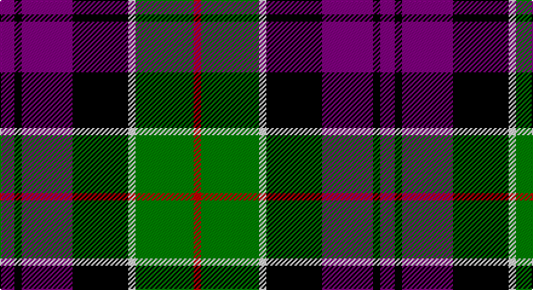

This page is one **sett** — a single exact thread-count. It belongs to the [tartan](/setts/p6k3p21k23w3g24r3/)
(the same proportion at any scale), whose colour order is pattern [BKBKWGR](/stripes/bkbkwgr/).

Part of the [Colquhoun](/tartans/colquhoun/) tartan — the named design grouping this sett with its other cloths.

Sourced from weddslist.  It is a [7 stripe tartan](/stripes/stripes7/).

Original link http://www.weddslist.com/cgi-bin/tartans/pg.pl?source=sts

## Also known as

This cloth is also recorded under:

- Colquhoun #2
- Colquhoun #3

## Thread count
P/12 K6 P42 K46 LN6 G48 R/6

One full sett is **314 threads**.

## Palette

Palette: <strong>Tartan Register</strong> <small style="color:#888">(2 of 5 colours)</small>
<table><thead><tr><th>Colour</th><th>Threads</th><th>Shade</th><th>Base</th><th>OKLCh</th></tr></thead><tbody><tr><td>P/</td><td style="text-align:right;font-variant-numeric:tabular-nums">12</td><td><code style="background-color:#800080;">#800080</code> <small style="color:#888">#800080</small></td><td>B <code style="background-color:#2A418A;">#2A418A</code></td><td><small style="color:#888">oklch(42.1% 0.193 328.4)</small></td></tr><tr><td>K</td><td style="text-align:right;font-variant-numeric:tabular-nums">6</td><td><code style="background-color:#000000;">#000000</code> <small style="color:#888">#000000</small></td><td>K <code style="background-color:#000000;">#000000</code></td><td><small style="color:#888">oklch(0.0% 0.000 0.0)</small></td></tr><tr><td>P</td><td style="text-align:right;font-variant-numeric:tabular-nums">42</td><td><code style="background-color:#800080;">#800080</code> <small style="color:#888">#800080</small></td><td>B <code style="background-color:#2A418A;">#2A418A</code></td><td><small style="color:#888">oklch(42.1% 0.193 328.4)</small></td></tr><tr><td>K</td><td style="text-align:right;font-variant-numeric:tabular-nums">46</td><td><code style="background-color:#000000;">#000000</code> <small style="color:#888">#000000</small></td><td>K <code style="background-color:#000000;">#000000</code></td><td><small style="color:#888">oklch(0.0% 0.000 0.0)</small></td></tr><tr><td>LN</td><td style="text-align:right;font-variant-numeric:tabular-nums">6</td><td><code style="background-color:#E0E0E0;">#E0E0E0</code> <small style="color:#888">#E0E0E0</small></td><td>W <code style="background-color:#F7F7F7;">#F7F7F7</code></td><td><small style="color:#888">oklch(90.7% 0.000 89.9)</small></td></tr><tr><td>G</td><td style="text-align:right;font-variant-numeric:tabular-nums">48</td><td><code style="background-color:#008000;">#008000</code> <small style="color:#888">#008000</small></td><td>G <code style="background-color:#006100;">#006100</code></td><td><small style="color:#888">oklch(52.0% 0.177 142.5)</small></td></tr><tr><td>R/</td><td style="text-align:right;font-variant-numeric:tabular-nums">6</td><td><code style="background-color:#C00000;">#C00000</code> <small style="color:#888">#C00000</small></td><td>R <code style="background-color:#CC0000;">#CC0000</code></td><td><small style="color:#888">oklch(50.7% 0.208 29.2)</small></td></tr></tbody></table>

# Sample pattern

## Compared to the master

This cloth is one sett of its design; the master sett (the exemplar the design is anchored on) is below for comparison.

<figure style="margin:0"><figcaption style="color:#888;font-size:smaller">this sett</figcaption></figure>
<figure style="margin:0"><figcaption style="color:#888;font-size:smaller"><a href="/setts/db4k2db16w1k8dg24r4/">master sett →</a></figcaption></figure>

## Nearest tartans

The nearest existing variants by ΔTartan distance, with this tartan at the top so the swatches line up against it.

ΔTartan

Tartan

Sett

—

<a href="/ttd/edit/#slug=p6k3p21k23w3g24r3~x2">Colquhoun</a> <a class="nn-out" href="/variants/s7/p6k3p21k23w3g24r3~x2/" title="open its dictionary page">↗</a>

0.90

<a href="/ttd/edit/#slug=m5k15lr5n9lr2dp2lr2dp2n9k3~x2&amp;base=p6k3p21k23w3g24r3~x2">Ryukoku University Heian Junior Corporate Tartan</a> <a class="nn-out" href="/variants/s10/m5k15lr5n9lr2dp2lr2dp2n9k3~x2/" title="open its dictionary page">↗</a>

0.93

<a href="/ttd/edit/#slug=r12db3g5dbi16ly2g2~x2&amp;base=p6k3p21k23w3g24r3~x2">Dunbog, Primary School</a> <a class="nn-out" href="/variants/s6/r12db3g5dbi16ly2g2~x2/" title="open its dictionary page">↗</a>

0.98

<a href="/ttd/edit/#slug=lp4k16lr5n8lr2p2lr2p2n8k3~x2&amp;base=p6k3p21k23w3g24r3~x2">Ryukoku University Heian Junior High School</a> <a class="nn-out" href="/variants/s10/lp4k16lr5n8lr2p2lr2p2n8k3~x2/" title="open its dictionary page">↗</a>

1.02

<a href="/ttd/edit/#slug=r2g8w1k8db8k1db1~x4&amp;base=p6k3p21k23w3g24r3~x2">Colquhoun</a> <a class="nn-out" href="/variants/s7/r2g8w1k8db8k1db1~x4/" title="open its dictionary page">↗</a>

1.04

<a href="/ttd/edit/#slug=ly6g3ly3g22k23p23k4~x2&amp;base=p6k3p21k23w3g24r3~x2">Gordon of Esslemont</a> <a class="nn-out" href="/variants/s7/ly6g3ly3g22k23p23k4~x2/" title="open its dictionary page">↗</a>

1.07

<a href="/ttd/edit/#slug=p3k1p8k6g8k1w2~x2&amp;base=p6k3p21k23w3g24r3~x2">Baillie</a> <a class="nn-out" href="/variants/s7/p3k1p8k6g8k1w2~x2/" title="open its dictionary page">↗</a>

1.08

<a href="/ttd/edit/#slug=r6db3r3db32k30g30ly3r3~x2&amp;base=p6k3p21k23w3g24r3~x2">MacDonald of Borrodale (Clan)</a> <a class="nn-out" href="/variants/s8/r6db3r3db32k30g30ly3r3~x2/" title="open its dictionary page">↗</a>

1.09

<a href="/ttd/edit/#slug=r5db3r3db29k29g29w4r4~x2&amp;base=p6k3p21k23w3g24r3~x2">Borrodale</a> <a class="nn-out" href="/variants/s8/r5db3r3db29k29g29w4r4~x2/" title="open its dictionary page">↗</a>

1.09

<a href="/ttd/edit/#slug=k3g17w2k18p17g3~x2&amp;base=p6k3p21k23w3g24r3~x2">Wilson's, No 76</a> <a class="nn-out" href="/variants/s6/k3g17w2k18p17g3~x2/" title="open its dictionary page">↗</a>

1.11

<a href="/ttd/edit/#slug=k3g17ly2k18p17g3~x2&amp;base=p6k3p21k23w3g24r3~x2">Wilson's, No 100</a> <a class="nn-out" href="/variants/s6/k3g17ly2k18p17g3~x2/" title="open its dictionary page">↗</a>

## Neighbour map

Every grey dot is one of 14360 variants placed by the first two principal components of the ΔTartan feature space (44% of its variance). Red is this tartan; blue dots are its nearest — click one to open its page.

<svg viewBox="0 0 640 380" role="img" style="max-width:100%;height:auto;border:1px solid #e0e0e0;border-radius:4px;display:block" xmlns="http://www.w3.org/2000/svg"><image href="/nn/cloud.v1.png" width="640" height="380"/><a href="/variants/s10/m5k15lr5n9lr2dp2lr2dp2n9k3~x2/"><circle cx="98.9" cy="175.9" r="4" fill="#3465a4"><title>Ryukoku University Heian Junior Corporate Tartan</title></circle></a><a href="/variants/s6/r12db3g5dbi16ly2g2~x2/"><circle cx="159.6" cy="194.4" r="4" fill="#3465a4"><title>Dunbog, Primary School</title></circle></a><a href="/variants/s10/lp4k16lr5n8lr2p2lr2p2n8k3~x2/"><circle cx="113.2" cy="167.0" r="4" fill="#3465a4"><title>Ryukoku University Heian Junior High School</title></circle></a><a href="/variants/s7/r2g8w1k8db8k1db1~x4/"><circle cx="110.6" cy="193.4" r="4" fill="#3465a4"><title>Colquhoun</title></circle></a><a href="/variants/s7/ly6g3ly3g22k23p23k4~x2/"><circle cx="122.0" cy="203.0" r="4" fill="#3465a4"><title>Gordon of Esslemont</title></circle></a><a href="/variants/s7/p3k1p8k6g8k1w2~x2/"><circle cx="147.8" cy="208.6" r="4" fill="#3465a4"><title>Baillie</title></circle></a><a href="/variants/s8/r6db3r3db32k30g30ly3r3~x2/"><circle cx="138.3" cy="168.4" r="4" fill="#3465a4"><title>MacDonald of Borrodale (Clan)</title></circle></a><a href="/variants/s8/r5db3r3db29k29g29w4r4~x2/"><circle cx="114.1" cy="169.0" r="4" fill="#3465a4"><title>Borrodale</title></circle></a><a href="/variants/s6/k3g17w2k18p17g3~x2/"><circle cx="154.6" cy="213.6" r="4" fill="#3465a4"><title>Wilson's, No 76</title></circle></a><a href="/variants/s6/k3g17ly2k18p17g3~x2/"><circle cx="155.6" cy="214.0" r="4" fill="#3465a4"><title>Wilson's, No 100</title></circle></a><circle cx="121.2" cy="186.8" r="5" fill="#c00000"/></svg>

ID: /variants/s7/p6k3p21k23w3g24r3~x2/
