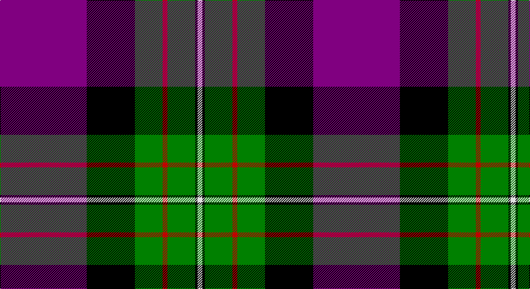

This page is one **sett** — a single exact thread-count. It belongs to the [tartan](/setts/p72k40g23r4g23k2w4/)
(the same proportion at any scale), whose colour order is pattern [BKGRGKW](/stripes/bkgrgkw/).

Sourced from weddslist.  It is a [7 stripe tartan](/stripes/stripes7/).

Original link http://www.weddslist.com/cgi-bin/tartans/pg.pl?source=sts

## Thread count
P/144 K80 G46 R8 G46 K4 LN/8

One full sett is **520 threads**.

## Palette

Palette: <strong>Tartan Register</strong> <small style="color:#888">(2 of 5 colours)</small>
<table><thead><tr><th>Colour</th><th>Threads</th><th>Shade</th><th>Base</th><th>OKLCh</th></tr></thead><tbody><tr><td>P/</td><td style="text-align:right;font-variant-numeric:tabular-nums">144</td><td><code style="background-color:#800080;">#800080</code> <small style="color:#888">#800080</small></td><td>B <code style="background-color:#2A418A;">#2A418A</code></td><td><small style="color:#888">oklch(42.1% 0.193 328.4)</small></td></tr><tr><td>K</td><td style="text-align:right;font-variant-numeric:tabular-nums">80</td><td><code style="background-color:#000000;">#000000</code> <small style="color:#888">#000000</small></td><td>K <code style="background-color:#000000;">#000000</code></td><td><small style="color:#888">oklch(0.0% 0.000 0.0)</small></td></tr><tr><td>G</td><td style="text-align:right;font-variant-numeric:tabular-nums">46</td><td><code style="background-color:#008000;">#008000</code> <small style="color:#888">#008000</small></td><td>G <code style="background-color:#006100;">#006100</code></td><td><small style="color:#888">oklch(52.0% 0.177 142.5)</small></td></tr><tr><td>R</td><td style="text-align:right;font-variant-numeric:tabular-nums">8</td><td><code style="background-color:#C00000;">#C00000</code> <small style="color:#888">#C00000</small></td><td>R <code style="background-color:#CC0000;">#CC0000</code></td><td><small style="color:#888">oklch(50.7% 0.208 29.2)</small></td></tr><tr><td>G</td><td style="text-align:right;font-variant-numeric:tabular-nums">46</td><td><code style="background-color:#008000;">#008000</code> <small style="color:#888">#008000</small></td><td>G <code style="background-color:#006100;">#006100</code></td><td><small style="color:#888">oklch(52.0% 0.177 142.5)</small></td></tr><tr><td>K</td><td style="text-align:right;font-variant-numeric:tabular-nums">4</td><td><code style="background-color:#000000;">#000000</code> <small style="color:#888">#000000</small></td><td>K <code style="background-color:#000000;">#000000</code></td><td><small style="color:#888">oklch(0.0% 0.000 0.0)</small></td></tr><tr><td>LN/</td><td style="text-align:right;font-variant-numeric:tabular-nums">8</td><td><code style="background-color:#E0E0E0;">#E0E0E0</code> <small style="color:#888">#E0E0E0</small></td><td>W <code style="background-color:#F7F7F7;">#F7F7F7</code></td><td><small style="color:#888">oklch(90.7% 0.000 89.9)</small></td></tr></tbody></table>

# Sample pattern

## Nearest tartans

The nearest existing variants by ΔTartan distance, with this tartan at the top so the swatches line up against it.

ΔTartan

Tartan

Sett

—

<a href="/ttd/edit/#slug=p72k40g23r4g23k2w4~x2">Ferguson, Unidentified</a> <a class="nn-out" href="/variants/s7/p72k40g23r4g23k2w4~x2/" title="open its dictionary page">↗</a>

0.85

<a href="/ttd/edit/#slug=k3m2db30m1k18o30m2o3~x2&amp;base=p72k40g23r4g23k2w4~x2">Bannockbane Navy Fashion Tartan</a> <a class="nn-out" href="/variants/s8/k3m2db30m1k18o30m2o3~x2/" title="open its dictionary page">↗</a>

1.28

<a href="/ttd/edit/#slug=k35m2k3dp13g8w4g8dp8~x2&amp;base=p72k40g23r4g23k2w4~x2">Sheboom</a> <a class="nn-out" href="/variants/s8/k35m2k3dp13g8w4g8dp8~x2/" title="open its dictionary page">↗</a>

1.29

<a href="/ttd/edit/#slug=w10db2w1db35dg10lo3dg10r4~x2&amp;base=p72k40g23r4g23k2w4~x2">Sandelin #2 (Personal)</a> <a class="nn-out" href="/variants/s8/w10db2w1db35dg10lo3dg10r4~x2/" title="open its dictionary page">↗</a>

1.31

<a href="/ttd/edit/#slug=p18k7g5r4g7k1ly2~x2&amp;base=p72k40g23r4g23k2w4~x2">Regent</a> <a class="nn-out" href="/variants/s7/p18k7g5r4g7k1ly2~x2/" title="open its dictionary page">↗</a>

1.33

<a href="/ttd/edit/#slug=t4w1k36db2r4w1db14r8w1~x2&amp;base=p72k40g23r4g23k2w4~x2">Midnight Balmoral (Personal)</a> <a class="nn-out" href="/variants/s9/t4w1k36db2r4w1db14r8w1~x2/" title="open its dictionary page">↗</a>

1.35

<a href="/ttd/edit/#slug=k35p2k3dp13g8w4g8dp8~x2&amp;base=p72k40g23r4g23k2w4~x2">SheBoom</a> <a class="nn-out" href="/variants/s8/k35p2k3dp13g8w4g8dp8~x2/" title="open its dictionary page">↗</a>

1.39

<a href="/ttd/edit/#slug=r8lg9dp3ly1dp1ly2dp2k32dp3~x2&amp;base=p72k40g23r4g23k2w4~x2">Gedling, Peter (Personal)</a> <a class="nn-out" href="/variants/s9/r8lg9dp3ly1dp1ly2dp2k32dp3~x2/" title="open its dictionary page">↗</a>

1.41

<a href="/ttd/edit/#slug=dbi4ly1r28db25k10dbi5k3~x2&amp;base=p72k40g23r4g23k2w4~x2">McKnight (Personal)</a> <a class="nn-out" href="/variants/s7/dbi4ly1r28db25k10dbi5k3~x2/" title="open its dictionary page">↗</a>

1.41

<a href="/variants/s8/ni8r11ni28r4k17n1k7r2~x2/">Kilbranan Sound (Personal)</a>

1.42

<a href="/ttd/edit/#slug=w6n8db4n2db31k16ri1k2ri4r3~x2&amp;base=p72k40g23r4g23k2w4~x2">Bell Rock Lighthouse 200th Anniversary, The</a> <a class="nn-out" href="/variants/s10/w6n8db4n2db31k16ri1k2ri4r3~x2/" title="open its dictionary page">↗</a>

## Neighbour map

Every grey dot is one of 14360 variants placed by the first two principal components of the ΔTartan feature space (44% of its variance). Red is this tartan; blue dots are its nearest — click one to open its page.

<svg viewBox="0 0 640 380" role="img" style="max-width:100%;height:auto;border:1px solid #e0e0e0;border-radius:4px;display:block" xmlns="http://www.w3.org/2000/svg"><image href="/nn/cloud.v1.png" width="640" height="380"/><a href="/variants/s8/k3m2db30m1k18o30m2o3~x2/"><circle cx="212.2" cy="117.3" r="4" fill="#3465a4"><title>Bannockbane Navy Fashion Tartan</title></circle></a><a href="/variants/s8/k35m2k3dp13g8w4g8dp8~x2/"><circle cx="239.1" cy="147.6" r="4" fill="#3465a4"><title>Sheboom</title></circle></a><a href="/variants/s8/w10db2w1db35dg10lo3dg10r4~x2/"><circle cx="271.2" cy="114.3" r="4" fill="#3465a4"><title>Sandelin #2 (Personal)</title></circle></a><a href="/variants/s7/p18k7g5r4g7k1ly2~x2/"><circle cx="185.6" cy="151.0" r="4" fill="#3465a4"><title>Regent</title></circle></a><a href="/variants/s9/t4w1k36db2r4w1db14r8w1~x2/"><circle cx="296.5" cy="93.8" r="4" fill="#3465a4"><title>Midnight Balmoral (Personal)</title></circle></a><a href="/variants/s8/k35p2k3dp13g8w4g8dp8~x2/"><circle cx="243.3" cy="149.9" r="4" fill="#3465a4"><title>SheBoom</title></circle></a><a href="/variants/s9/r8lg9dp3ly1dp1ly2dp2k32dp3~x2/"><circle cx="291.0" cy="88.2" r="4" fill="#3465a4"><title>Gedling, Peter (Personal)</title></circle></a><a href="/variants/s7/dbi4ly1r28db25k10dbi5k3~x2/"><circle cx="225.0" cy="136.1" r="4" fill="#3465a4"><title>McKnight (Personal)</title></circle></a><a href="/variants/s8/ni8r11ni28r4k17n1k7r2~x2/"><circle cx="273.9" cy="162.4" r="4" fill="#3465a4"><title>Kilbranan Sound (Personal)</title></circle></a><a href="/variants/s10/w6n8db4n2db31k16ri1k2ri4r3~x2/"><circle cx="217.3" cy="88.8" r="4" fill="#3465a4"><title>Bell Rock Lighthouse 200th Anniversary, The</title></circle></a><circle cx="240.3" cy="119.9" r="5" fill="#c00000"/></svg>

ID: /variants/s7/p72k40g23r4g23k2w4~x2/
