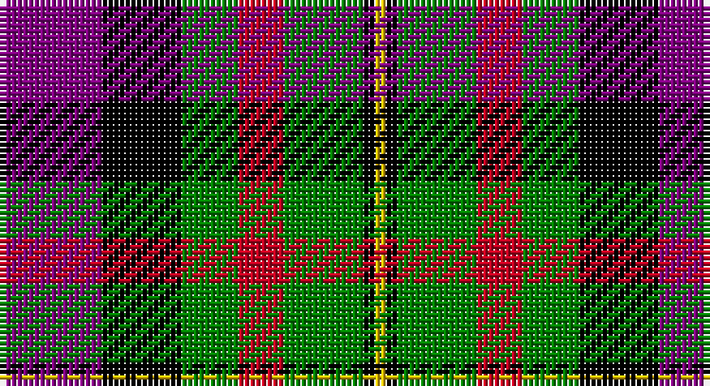

This page is one **sett** — a single exact thread-count. It belongs to the [tartan](/setts/p9k7g5r4g7k1ly1/)
(the same proportion at any scale), whose colour order is pattern [BKGRGKY](/stripes/bkgrgky/).

Part of the [MacLaren](/tartans/maclaren/) tartan — the named design grouping this sett with its other cloths.

Sourced from weddslist.  It is a [7 stripe tartan](/stripes/stripes7/).

Original link http://www.weddslist.com/cgi-bin/tartans/pg.pl?source=sts

## Also known as

This cloth is also recorded under:

- MacLaren #2

## Thread count
P/18 K14 G10 R8 G14 K2 Y/2

One full sett is **116 threads**.

## Palette

Palette: <strong>Ingles Buchan</strong> <small style="color:#888">(1 of 5 colours)</small>
<table><thead><tr><th>Colour</th><th>Threads</th><th>Shade</th><th>Base</th><th>OKLCh</th></tr></thead><tbody><tr><td>P/</td><td style="text-align:right;font-variant-numeric:tabular-nums">18</td><td><code style="background-color:#800080;">#800080</code> <small style="color:#888">#800080</small></td><td>B <code style="background-color:#2A418A;">#2A418A</code></td><td><small style="color:#888">oklch(42.1% 0.193 328.4)</small></td></tr><tr><td>K</td><td style="text-align:right;font-variant-numeric:tabular-nums">14</td><td><code style="background-color:#000000;">#000000</code> <small style="color:#888">#000000</small></td><td>K <code style="background-color:#000000;">#000000</code></td><td><small style="color:#888">oklch(0.0% 0.000 0.0)</small></td></tr><tr><td>G</td><td style="text-align:right;font-variant-numeric:tabular-nums">10</td><td><code style="background-color:#008000;">#008000</code> <small style="color:#888">#008000</small></td><td>G <code style="background-color:#006100;">#006100</code></td><td><small style="color:#888">oklch(52.0% 0.177 142.5)</small></td></tr><tr><td>R</td><td style="text-align:right;font-variant-numeric:tabular-nums">8</td><td><code style="background-color:#C00020;">#C00020</code> <small style="color:#888">#C00020</small></td><td>R <code style="background-color:#CC0000;">#CC0000</code></td><td><small style="color:#888">oklch(50.9% 0.206 24.5)</small></td></tr><tr><td>G</td><td style="text-align:right;font-variant-numeric:tabular-nums">14</td><td><code style="background-color:#008000;">#008000</code> <small style="color:#888">#008000</small></td><td>G <code style="background-color:#006100;">#006100</code></td><td><small style="color:#888">oklch(52.0% 0.177 142.5)</small></td></tr><tr><td>K</td><td style="text-align:right;font-variant-numeric:tabular-nums">2</td><td><code style="background-color:#000000;">#000000</code> <small style="color:#888">#000000</small></td><td>K <code style="background-color:#000000;">#000000</code></td><td><small style="color:#888">oklch(0.0% 0.000 0.0)</small></td></tr><tr><td>Y/</td><td style="text-align:right;font-variant-numeric:tabular-nums">2</td><td><code style="background-color:#F0C000;">#F0C000</code> <small style="color:#888">#F0C000</small></td><td>Y <code style="background-color:#F2BF00;">#F2BF00</code></td><td><small style="color:#888">oklch(82.7% 0.169 90.5)</small></td></tr></tbody></table>

# Sample pattern

## Compared to the master

This cloth is one sett of its design; the master sett (the exemplar the design is anchored on) is below for comparison.

<figure style="margin:0"><figcaption style="color:#888;font-size:smaller">this sett</figcaption></figure>
<figure style="margin:0"><figcaption style="color:#888;font-size:smaller"><a href="/setts/db12k4g4r1g4k1lo1/">master sett →</a></figcaption></figure>

## Nearest tartans

The nearest existing variants by ΔTartan distance, with this tartan at the top so the swatches line up against it.

ΔTartan

Tartan

Sett

—

<a href="/ttd/edit/#slug=p9k7g5r4g7k1ly1~x2">MacLaren</a> <a class="nn-out" href="/variants/s7/p9k7g5r4g7k1ly1~x2/" title="open its dictionary page">↗</a>

0.74

<a href="/ttd/edit/#slug=db9r24g24k24db24ly2db9&amp;base=p9k7g5r4g7k1ly1~x2">Dundas</a> <a class="nn-out" href="/variants/s7/db9r24g24k24db24ly2db9/" title="open its dictionary page">↗</a>

1.06

<a href="/ttd/edit/#slug=r20k14w2k14g9r3g11~x2&amp;base=p9k7g5r4g7k1ly1~x2">Brough</a> <a class="nn-out" href="/variants/s7/r20k14w2k14g9r3g11~x2/" title="open its dictionary page">↗</a>

1.08

<a href="/ttd/edit/#slug=g12k2r12k3y12k16y12k3r6~x2&amp;base=p9k7g5r4g7k1ly1~x2">Borthwick</a> <a class="nn-out" href="/variants/s9/g12k2r12k3y12k16y12k3r6~x2/" title="open its dictionary page">↗</a>

1.09

<a href="/ttd/edit/#slug=r4lb1r4dg10ly1k10lb4k2lb4&amp;base=p9k7g5r4g7k1ly1~x2">Cumming LO</a> <a class="nn-out" href="/variants/s9/r4lb1r4dg10ly1k10lb4k2lb4/" title="open its dictionary page">↗</a>

1.11

<a href="/ttd/edit/#slug=p6k3p21k23w3g24r3~x2&amp;base=p9k7g5r4g7k1ly1~x2">Colquhoun</a> <a class="nn-out" href="/variants/s7/p6k3p21k23w3g24r3~x2/" title="open its dictionary page">↗</a>

1.13

<a href="/ttd/edit/#slug=r10db24r4k30g36dbi5&amp;base=p9k7g5r4g7k1ly1~x2">MacWilliam</a> <a class="nn-out" href="/variants/s6/r10db24r4k30g36dbi5/" title="open its dictionary page">↗</a>

1.14

<a href="/ttd/edit/#slug=r1dy6db2lb4k4lb1~x6&amp;base=p9k7g5r4g7k1ly1~x2">Thompson's Fancy (Fashion)</a> <a class="nn-out" href="/variants/s6/r1dy6db2lb4k4lb1~x6/" title="open its dictionary page">↗</a>

1.14

<a href="/ttd/edit/#slug=k6b2db12g8r5k2g3~x4&amp;base=p9k7g5r4g7k1ly1~x2">Cooke</a> <a class="nn-out" href="/variants/s7/k6b2db12g8r5k2g3~x4/" title="open its dictionary page">↗</a>

1.17

<a href="/ttd/edit/#slug=dg3y12ly2k10o10ly3o2~x2&amp;base=p9k7g5r4g7k1ly1~x2">Rothesay</a> <a class="nn-out" href="/variants/s7/dg3y12ly2k10o10ly3o2~x2/" title="open its dictionary page">↗</a>

1.17

<a href="/ttd/edit/#slug=p11t2k10g10ly2~x2&amp;base=p9k7g5r4g7k1ly1~x2">Wilson's, No 217</a> <a class="nn-out" href="/variants/s5/p11t2k10g10ly2~x2/" title="open its dictionary page">↗</a>

## Neighbour map

Every grey dot is one of 14360 variants placed by the first two principal components of the ΔTartan feature space (44% of its variance). Red is this tartan; blue dots are its nearest — click one to open its page.

<svg viewBox="0 0 640 380" role="img" style="max-width:100%;height:auto;border:1px solid #e0e0e0;border-radius:4px;display:block" xmlns="http://www.w3.org/2000/svg"><image href="/nn/cloud.v1.png" width="640" height="380"/><a href="/variants/s7/db9r24g24k24db24ly2db9/"><circle cx="119.5" cy="203.8" r="4" fill="#3465a4"><title>Dundas</title></circle></a><a href="/variants/s7/r20k14w2k14g9r3g11~x2/"><circle cx="160.8" cy="219.2" r="4" fill="#3465a4"><title>Brough</title></circle></a><a href="/variants/s9/g12k2r12k3y12k16y12k3r6~x2/"><circle cx="99.9" cy="215.3" r="4" fill="#3465a4"><title>Borthwick</title></circle></a><a href="/variants/s9/r4lb1r4dg10ly1k10lb4k2lb4/"><circle cx="80.3" cy="164.3" r="4" fill="#3465a4"><title>Cumming LO</title></circle></a><a href="/variants/s7/p6k3p21k23w3g24r3~x2/"><circle cx="121.2" cy="186.8" r="4" fill="#3465a4"><title>Colquhoun</title></circle></a><a href="/variants/s6/r10db24r4k30g36dbi5/"><circle cx="109.4" cy="207.5" r="4" fill="#3465a4"><title>MacWilliam</title></circle></a><a href="/variants/s6/r1dy6db2lb4k4lb1~x6/"><circle cx="87.4" cy="220.3" r="4" fill="#3465a4"><title>Thompson's Fancy (Fashion)</title></circle></a><a href="/variants/s7/k6b2db12g8r5k2g3~x4/"><circle cx="81.6" cy="220.6" r="4" fill="#3465a4"><title>Cooke</title></circle></a><a href="/variants/s7/dg3y12ly2k10o10ly3o2~x2/"><circle cx="67.5" cy="202.6" r="4" fill="#3465a4"><title>Rothesay</title></circle></a><a href="/variants/s5/p11t2k10g10ly2~x2/"><circle cx="79.7" cy="233.8" r="4" fill="#3465a4"><title>Wilson's, No 217</title></circle></a><circle cx="106.2" cy="201.2" r="5" fill="#c00000"/></svg>

ID: /variants/s7/p9k7g5r4g7k1ly1~x2/
