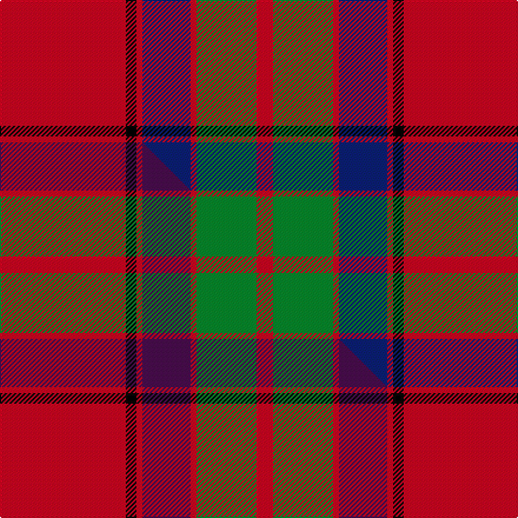

This is one **variant** — a specific cloth: this exact thread count and colourway, with its own
provenance below. It is one weaving of the [sett](/tartans/b/bu/buccleuch-2/) (the scale-free proportion — the
same cloth at any scale or shade), whose colour order is pattern [RGRBRKR](/stripes/rgrbrkr/).

Part of the [Buccleuch](/tartans/b/bu/buccleuch-2/) tartan — the named design grouping this sett with its other cloths.

Sourced from house-of-tartan.  It is a [7 stripe tartan](/stripes/stripes7/).

Original link [http://www.house-of-tartan.scotland.net/house/TartanViewjs.asp?colr=Def&tnam=1505](http://www.house-of-tartan.scotland.net/house/TartanViewjs.asp?colr=Def&tnam=1505)

## Provenance

Earliest known date: c.1840 Reduced 50% proportionally. Described by Wilson as a 'Fancy' pattern, taking inspiration from the works of Sir Walter Scott.

2 attestations — the source records this cloth was collapsed from (oldest owns this page)

<ul>
<li>c.1840 — Buccleuch Family Tartan (house-of-tartan, <a href="http://www.house-of-tartan.scotland.net/house/TartanViewjs.asp?colr=Def&tnam=1505">record</a>) </li>
<li>undated — Buccleuch (weddslist, <a href="http://www.weddslist.com/cgi-bin/tartans/pg.pl?source=sts">record</a>) </li>
</ul>

Dataset <small>— provenance for this record, inherited from the source manifest</small>

<dl class="dataset-prov">
<dt>source</dt><dd><a href="/sources/house-of-tartan/">House of Tartan</a></dd>
<dt>data captured from</dt><dd><a href="https://github.com/thetartan/tartan-database/blob/master/data/house-of-tartan/data.csv">https://github.com/thetartan/tartan-database/blob/master/data/house-of-tartan/data.csv</a></dd>
<dt>data date</dt><dd>c.1840 <small>(this record)</small></dd>
<dt>licence</dt><dd><a href="https://creativecommons.org/licenses/by-nc-nd/4.0/">CC BY-NC-ND 4.0</a></dd>
</dl>

Capture chain <small>— the hands this data passed through, oldest first; each capture carries its own licence</small>

<ol class="capture-chain">
<li><a href="http://www.house-of-tartan.scotland.net/">House of Tartan</a> <small>the weaver/retailer's database — the site is now offline; the URL is kept as the ultimate source's identity</small></li>
<li><a href="https://github.com/thetartan/tartan-database">thetartan/tartan-database</a> <small>2016-2017</small> · <a href="https://creativecommons.org/licenses/by-nc-nd/4.0/">CC BY-NC-ND 4.0</a> <small>Levko Kravets's frozen compilation — the capture we vendored, and where its CC licence text came from</small></li>
<li>this dictionary <small>captured 2026-06-10 · commit 5bf86c7566</small> <small>each re-capture is a git commit to data/sources</small></li>
</ol>

## Thread count
R/107 K9 R5 DB41 R5 G51 R/14

One full sett is **343 threads**.

## Palette
<table><thead><tr><th>Colour</th><th>Shade</th><th>OKLCh</th></tr></thead><tbody><tr><td>DB</td><td><code style="background-color:#082077;">#082077</code> <small style="color:#888">#082077</small></td><td><small style="color:#888">oklch(30.0% 0.149 265.1)</small></td></tr><tr><td>G</td><td><code style="background-color:#008B2A;">#008B2A</code> <small style="color:#888">#008B2A</small></td><td><small style="color:#888">oklch(55.4% 0.170 145.9)</small></td></tr><tr><td>K</td><td><code style="background-color:#000000;">#000000</code> <small style="color:#888">#000000</small></td><td><small style="color:#888">oklch(0.0% 0.000 0.0)</small></td></tr><tr><td>R</td><td><code style="background-color:#D60020;">#D60020</code> <small style="color:#888">#D60020</small></td><td><small style="color:#888">oklch(55.2% 0.224 25.5)</small></td></tr></tbody></table>

# Sample pattern

## Compared to the master

This cloth is one sett of its design; the master sett (the exemplar the design is anchored on) is below for comparison.

Its **ΔTartan distance** from the master is **1.00** — the same measure the nearest-tartans table ranks by (0 is identical; a re-scale of the same cloth is near 0, a recolour or a different proportion further).

<figure class="master-compare" style="margin:0">

this sett
master sett ★

<figcaption style="color:#888;font-size:smaller">One weave of this sett against the <a href="/setts/r107k9r5dp41r5g51r14/">master sett ★</a>, split on the diagonal: a shared proportion runs seamlessly across it with only the shades shifting; a different proportion breaks on it.</figcaption>
</figure>

## Nearest tartan variants

The nearest existing variants by ΔTartan distance, with this cloth at the top so the swatches line up against it.

ΔTartan

Threads

Variant

Sett

—

343

<a href="/variants/s7/r107k9r5db41r5g51r14/">Buccleuch Family Tartan</a>

<a href="/ttd/edit/#slug=r107k9r5dp41r5g51r14&amp;base=r107k9r5db41r5g51r14" title="compare in the TTD">1.00</a>

343

<a href="/variants/s7/r107k9r5dp41r5g51r14/">Buccleuch</a>

<a href="/ttd/edit/#slug=r2db12r2g12r24w1~x2&amp;base=r107k9r5db41r5g51r14" title="compare in the TTD">1.37</a>

206

<a href="/variants/s6/r2db12r2g12r24w1~x2/">Fraser (1745)</a>

<a href="/ttd/edit/#slug=r2db12r2dg12r24w1~x2&amp;base=r107k9r5db41r5g51r14" title="compare in the TTD">1.37</a>

206

<a href="/variants/s6/r2db12r2dg12r24w1~x2/">Fraser</a>

<a href="/ttd/edit/#slug=r3db15r3g8r20k2~x2&amp;base=r107k9r5db41r5g51r14" title="compare in the TTD">1.68</a>

194

<a href="/variants/s6/r3db15r3g8r20k2~x2/">Finnigan (Estimated threadcount)</a>

<a href="/ttd/edit/#slug=r4k2r24k6db6g16r3~x2&amp;base=r107k9r5db41r5g51r14" title="compare in the TTD">2.03</a>

230

<a href="/variants/s7/r4k2r24k6db6g16r3~x2/">MacDuff #4</a>

<a href="/ttd/edit/#slug=r100k15g48db5r7db16~x2&amp;base=r107k9r5db41r5g51r14" title="compare in the TTD">2.11</a>

532

<a href="/variants/s6/r100k15g48db5r7db16~x2/">Plummer (Personal)</a>

<a href="/ttd/edit/#slug=r25k7r3g13lb1k2~x4&amp;base=r107k9r5db41r5g51r14" title="compare in the TTD">2.20</a>

300

<a href="/variants/s6/r25k7r3g13lb1k2~x4/">MacPhail Red Clan Tartan</a>

<a href="/ttd/edit/#slug=r25k7r3g13y1k2~x4&amp;base=r107k9r5db41r5g51r14" title="compare in the TTD">2.23</a>

300

<a href="/variants/s6/r25k7r3g13y1k2~x4/">MacPhail</a>

<a href="/ttd/edit/#slug=r12w2r37db6g3db3r4db3g21r4~x2&amp;base=r107k9r5db41r5g51r14" title="compare in the TTD">2.25</a>

348

<a href="/variants/s10/r12w2r37db6g3db3r4db3g21r4~x2/">Chisholm, The</a>

<a href="/ttd/edit/#slug=r52db16k16g22r16y3r16&amp;base=r107k9r5db41r5g51r14" title="compare in the TTD">2.45</a>

214

<a href="/variants/s7/r52db16k16g22r16y3r16/">Sturrock</a>

## Neighbour map

Every grey dot is one of 13657 variants placed by the first two principal components of the ΔTartan feature space (42% of its variance). Red is this tartan; blue dots are its nearest — click one to open its page. The map is a flat projection of a many-dimensional space — [how to read it](/posts/neighbourhood-maps/).

<svg viewBox="0 0 640 380" role="img" style="max-width:100%;height:auto;border:1px solid #e0e0e0;border-radius:4px;display:block" xmlns="http://www.w3.org/2000/svg"><image href="/nn/cloud.v1.png" width="640" height="380"/><a href="/variants/s7/r107k9r5dp41r5g51r14/"><circle cx="325.2" cy="137.9" r="4" fill="#3465a4"><title>Buccleuch</title></circle></a><a href="/variants/s6/r2db12r2g12r24w1~x2/"><circle cx="321.7" cy="165.0" r="4" fill="#3465a4"><title>Fraser (1745)</title></circle></a><a href="/variants/s6/r2db12r2dg12r24w1~x2/"><circle cx="327.1" cy="164.3" r="4" fill="#3465a4"><title>Fraser</title></circle></a><a href="/variants/s6/r3db15r3g8r20k2~x2/"><circle cx="248.3" cy="189.9" r="4" fill="#3465a4"><title>Finnigan (Estimated threadcount)</title></circle></a><a href="/variants/s7/r4k2r24k6db6g16r3~x2/"><circle cx="233.1" cy="167.4" r="4" fill="#3465a4"><title>MacDuff #4</title></circle></a><a href="/variants/s6/r100k15g48db5r7db16~x2/"><circle cx="305.5" cy="142.6" r="4" fill="#3465a4"><title>Plummer (Personal)</title></circle></a><a href="/variants/s6/r25k7r3g13lb1k2~x4/"><circle cx="290.1" cy="133.6" r="4" fill="#3465a4"><title>MacPhail Red Clan Tartan</title></circle></a><a href="/variants/s6/r25k7r3g13y1k2~x4/"><circle cx="292.0" cy="134.1" r="4" fill="#3465a4"><title>MacPhail</title></circle></a><a href="/variants/s10/r12w2r37db6g3db3r4db3g21r4~x2/"><circle cx="361.3" cy="138.9" r="4" fill="#3465a4"><title>Chisholm, The</title></circle></a><a href="/variants/s7/r52db16k16g22r16y3r16/"><circle cx="271.6" cy="155.6" r="4" fill="#3465a4"><title>Sturrock</title></circle></a><circle cx="312.5" cy="136.3" r="5" fill="#c00000"/><text x="320" y="376" text-anchor="middle" font-size="11" fill="#999">ground</text><text x="11" y="190" text-anchor="middle" font-size="11" fill="#999" transform="rotate(-90 11 190)">complexity</text></svg>

ID: /variants/s7/r107k9r5db41r5g51r14/
