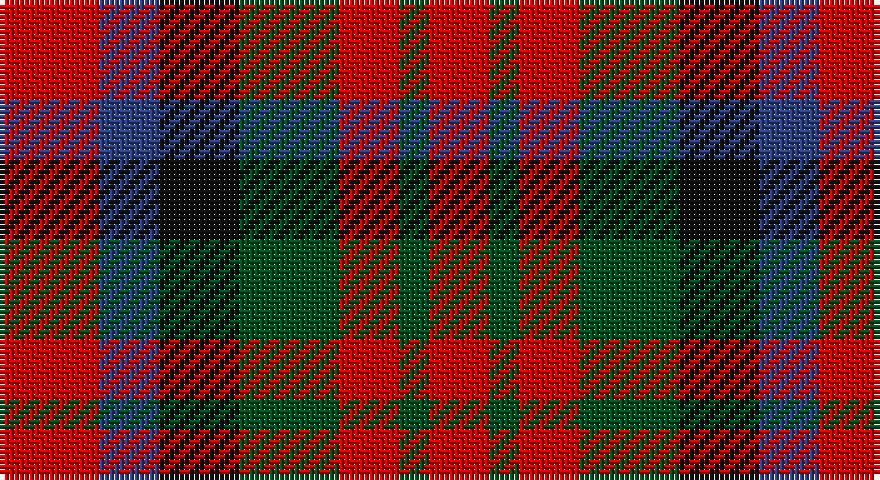

This page is one **sett** — a single exact thread-count. It belongs to the [tartan](/setts/r10db6k8dg10r6dg3r6/)
(the same proportion at any scale), whose colour order is pattern [RBKGRGR](/stripes/rbkgrgr/).

Part of the [MacDuff](/tartans/macduff/) tartan — the named design grouping this sett with its other cloths.

Sourced from register-of-tartans.  It is a [7 stripe tartan](/stripes/stripes7/).

Original link https://www.tartanregister.gov.uk/tartanDetails.aspx?ref=2415

## Also known as

This cloth is also recorded under:

- MacDuff #2
- MacDuff #3
- MacDuff #4
- MacDuff #5
- MacDuff #6
- MacDuff Dress #2

## Register references

External register numbers recorded for this tartan.

- Scottish Register of Tartans: [2415](https://www.tartanregister.gov.uk/tartanDetails.aspx?ref=2415)
- Scottish Tartans World Register: 1351

## Thread count
R/20 B12 K16 G20 R12 G6 R/12

One full sett is **164 threads**.

## Palette

Palette: <strong>Tartan Register</strong>
<table><thead><tr><th>Colour</th><th>Threads</th><th>Shade</th><th>Base</th><th>OKLCh</th></tr></thead><tbody><tr><td>R/</td><td style="text-align:right;font-variant-numeric:tabular-nums">20</td><td><code style="background-color:#DC0000;">#DC0000</code> <small style="color:#888">#DC0000</small></td><td>R <code style="background-color:#CC0000;">#CC0000</code></td><td><small style="color:#888">oklch(56.2% 0.230 29.2)</small></td></tr><tr><td>B</td><td style="text-align:right;font-variant-numeric:tabular-nums">12</td><td><code style="background-color:#2C4084;">#2C4084</code> <small style="color:#888">#2C4084</small></td><td>B <code style="background-color:#2A418A;">#2A418A</code></td><td><small style="color:#888">oklch(39.4% 0.117 268.3)</small></td></tr><tr><td>K</td><td style="text-align:right;font-variant-numeric:tabular-nums">16</td><td><code style="background-color:#101010;">#101010</code> <small style="color:#888">#101010</small></td><td>K <code style="background-color:#000000;">#000000</code></td><td><small style="color:#888">oklch(17.3% 0.000 89.9)</small></td></tr><tr><td>G</td><td style="text-align:right;font-variant-numeric:tabular-nums">20</td><td><code style="background-color:#005020;">#005020</code> <small style="color:#888">#005020</small></td><td>G <code style="background-color:#006100;">#006100</code></td><td><small style="color:#888">oklch(37.7% 0.105 149.6)</small></td></tr><tr><td>R</td><td style="text-align:right;font-variant-numeric:tabular-nums">12</td><td><code style="background-color:#DC0000;">#DC0000</code> <small style="color:#888">#DC0000</small></td><td>R <code style="background-color:#CC0000;">#CC0000</code></td><td><small style="color:#888">oklch(56.2% 0.230 29.2)</small></td></tr><tr><td>G</td><td style="text-align:right;font-variant-numeric:tabular-nums">6</td><td><code style="background-color:#005020;">#005020</code> <small style="color:#888">#005020</small></td><td>G <code style="background-color:#006100;">#006100</code></td><td><small style="color:#888">oklch(37.7% 0.105 149.6)</small></td></tr><tr><td>R/</td><td style="text-align:right;font-variant-numeric:tabular-nums">12</td><td><code style="background-color:#DC0000;">#DC0000</code> <small style="color:#888">#DC0000</small></td><td>R <code style="background-color:#CC0000;">#CC0000</code></td><td><small style="color:#888">oklch(56.2% 0.230 29.2)</small></td></tr></tbody></table>

# Sample pattern

## Nearest tartans

The nearest existing variants by ΔTartan distance, with this tartan at the top so the swatches line up against it.

ΔTartan

Tartan

Sett

—

<a href="/ttd/edit/#slug=r10db6k8dg10r6dg3r6~x2">MacDuff #3</a> <a class="nn-out" href="/variants/s7/r10db6k8dg10r6dg3r6~x2/" title="open its dictionary page">↗</a>

0.83

<a href="/ttd/edit/#slug=r10db6k8g10r6g3r6~x2&amp;base=r10db6k8dg10r6dg3r6~x2">MacDuff</a> <a class="nn-out" href="/variants/s7/r10db6k8g10r6g3r6~x2/" title="open its dictionary page">↗</a>

0.98

<a href="/ttd/edit/#slug=g12r11dp12ri3dp8g8dp8~x2&amp;base=r10db6k8dg10r6dg3r6~x2">Fiddes (Corrected)</a> <a class="nn-out" href="/variants/s7/g12r11dp12ri3dp8g8dp8~x2/" title="open its dictionary page">↗</a>

1.09

<a href="/ttd/edit/#slug=db5r17dg16k10db10r17db5~x2&amp;base=r10db6k8dg10r6dg3r6~x2">MacNaughton (Logan)</a> <a class="nn-out" href="/variants/s7/db5r17dg16k10db10r17db5~x2/" title="open its dictionary page">↗</a>

1.09

<a href="/ttd/edit/#slug=dg14db8dg14r14k3r14~x2&amp;base=r10db6k8dg10r6dg3r6~x2">Tulsa, City of</a> <a class="nn-out" href="/variants/s6/dg14db8dg14r14k3r14~x2/" title="open its dictionary page">↗</a>

1.23

<a href="/ttd/edit/#slug=lo11m6k10lo10k10dy10m4~x2&amp;base=r10db6k8dg10r6dg3r6~x2">Duffus Hose, Lord</a> <a class="nn-out" href="/variants/s7/lo11m6k10lo10k10dy10m4~x2/" title="open its dictionary page">↗</a>

1.36

<a href="/ttd/edit/#slug=r15o9w4k12r15k5~x2&amp;base=r10db6k8dg10r6dg3r6~x2">Eastern Kentucky University</a> <a class="nn-out" href="/variants/s6/r15o9w4k12r15k5~x2/" title="open its dictionary page">↗</a>

1.39

<a href="/ttd/edit/#slug=r14k3r14g13db8g13~x2&amp;base=r10db6k8dg10r6dg3r6~x2">Tulsa</a> <a class="nn-out" href="/variants/s6/r14k3r14g13db8g13~x2/" title="open its dictionary page">↗</a>

1.43

<a href="/ttd/edit/#slug=r6g5k5g5r6t1~x4&amp;base=r10db6k8dg10r6dg3r6~x2">Norwich No.028</a> <a class="nn-out" href="/variants/s6/r6g5k5g5r6t1~x4/" title="open its dictionary page">↗</a>

1.46

<a href="/variants/s8/r4dg4r1db4r4~x12/">Gow</a>

1.50

<a href="/ttd/edit/#slug=r13dt13o5lo2dt13lo13~x2&amp;base=r10db6k8dg10r6dg3r6~x2">Torana</a> <a class="nn-out" href="/variants/s6/r13dt13o5lo2dt13lo13~x2/" title="open its dictionary page">↗</a>

## Neighbour map

Every grey dot is one of 14360 variants placed by the first two principal components of the ΔTartan feature space (44% of its variance). Red is this tartan; blue dots are its nearest — click one to open its page.

<svg viewBox="0 0 640 380" role="img" style="max-width:100%;height:auto;border:1px solid #e0e0e0;border-radius:4px;display:block" xmlns="http://www.w3.org/2000/svg"><image href="/nn/cloud.v1.png" width="640" height="380"/><a href="/variants/s7/r10db6k8g10r6g3r6~x2/"><circle cx="115.2" cy="284.7" r="4" fill="#3465a4"><title>MacDuff</title></circle></a><a href="/variants/s7/g12r11dp12ri3dp8g8dp8~x2/"><circle cx="149.6" cy="282.5" r="4" fill="#3465a4"><title>Fiddes (Corrected)</title></circle></a><a href="/variants/s7/db5r17dg16k10db10r17db5~x2/"><circle cx="130.9" cy="274.8" r="4" fill="#3465a4"><title>MacNaughton (Logan)</title></circle></a><a href="/variants/s6/dg14db8dg14r14k3r14~x2/"><circle cx="182.0" cy="291.5" r="4" fill="#3465a4"><title>Tulsa, City of</title></circle></a><a href="/variants/s7/lo11m6k10lo10k10dy10m4~x2/"><circle cx="62.0" cy="304.4" r="4" fill="#3465a4"><title>Duffus Hose, Lord</title></circle></a><a href="/variants/s6/r15o9w4k12r15k5~x2/"><circle cx="172.8" cy="262.5" r="4" fill="#3465a4"><title>Eastern Kentucky University</title></circle></a><a href="/variants/s6/r14k3r14g13db8g13~x2/"><circle cx="164.7" cy="283.0" r="4" fill="#3465a4"><title>Tulsa</title></circle></a><a href="/variants/s6/r6g5k5g5r6t1~x4/"><circle cx="149.7" cy="267.7" r="4" fill="#3465a4"><title>Norwich No.028</title></circle></a><a href="/variants/s8/r4dg4r1db4r4~x12/"><circle cx="170.5" cy="296.8" r="4" fill="#3465a4"><title>Gow</title></circle></a><a href="/variants/s6/r13dt13o5lo2dt13lo13~x2/"><circle cx="162.9" cy="246.7" r="4" fill="#3465a4"><title>Torana</title></circle></a><circle cx="135.7" cy="290.9" r="5" fill="#c00000"/></svg>

ID: /variants/s7/r10db6k8dg10r6dg3r6~x2/
