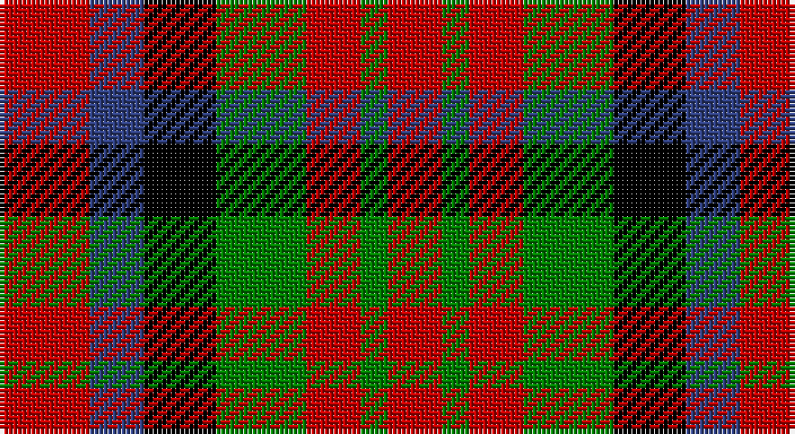

This page is one **sett** — a single exact thread-count. It belongs to the [tartan](/setts/r10db6k8g10r6g3r6/)
(the same proportion at any scale), whose colour order is pattern [RBKGRGR](/stripes/rbkgrgr/).

Part of the [MacDuff](/tartans/macduff/) tartan — the named design grouping this sett with its other cloths.

Sourced from weddslist.  It is a [7 stripe tartan](/stripes/stripes7/).

Original link http://www.weddslist.com/cgi-bin/tartans/pg.pl?source=sts

## Also known as

This cloth is also recorded under:

- MacDuff #2
- MacDuff #3
- MacDuff #4
- MacDuff #5
- MacDuff #6
- MacDuff Dress #2

## Thread count
R/20 B12 K16 G20 R12 G6 R/12

One full sett is **164 threads**.

## Palette

Palette: <strong>Ingles Buchan</strong> <small style="color:#888">(1 of 4 colours)</small>
<table><thead><tr><th>Colour</th><th>Threads</th><th>Shade</th><th>Base</th><th>OKLCh</th></tr></thead><tbody><tr><td>R/</td><td style="text-align:right;font-variant-numeric:tabular-nums">20</td><td><code style="background-color:#C00000;">#C00000</code> <small style="color:#888">#C00000</small></td><td>R <code style="background-color:#CC0000;">#CC0000</code></td><td><small style="color:#888">oklch(50.7% 0.208 29.2)</small></td></tr><tr><td>B</td><td style="text-align:right;font-variant-numeric:tabular-nums">12</td><td><code style="background-color:#304080;">#304080</code> <small style="color:#888">#304080</small></td><td>B <code style="background-color:#2A418A;">#2A418A</code></td><td><small style="color:#888">oklch(39.4% 0.109 270.2)</small></td></tr><tr><td>K</td><td style="text-align:right;font-variant-numeric:tabular-nums">16</td><td><code style="background-color:#000000;">#000000</code> <small style="color:#888">#000000</small></td><td>K <code style="background-color:#000000;">#000000</code></td><td><small style="color:#888">oklch(0.0% 0.000 0.0)</small></td></tr><tr><td>G</td><td style="text-align:right;font-variant-numeric:tabular-nums">20</td><td><code style="background-color:#008000;">#008000</code> <small style="color:#888">#008000</small></td><td>G <code style="background-color:#006100;">#006100</code></td><td><small style="color:#888">oklch(52.0% 0.177 142.5)</small></td></tr><tr><td>R</td><td style="text-align:right;font-variant-numeric:tabular-nums">12</td><td><code style="background-color:#C00000;">#C00000</code> <small style="color:#888">#C00000</small></td><td>R <code style="background-color:#CC0000;">#CC0000</code></td><td><small style="color:#888">oklch(50.7% 0.208 29.2)</small></td></tr><tr><td>G</td><td style="text-align:right;font-variant-numeric:tabular-nums">6</td><td><code style="background-color:#008000;">#008000</code> <small style="color:#888">#008000</small></td><td>G <code style="background-color:#006100;">#006100</code></td><td><small style="color:#888">oklch(52.0% 0.177 142.5)</small></td></tr><tr><td>R/</td><td style="text-align:right;font-variant-numeric:tabular-nums">12</td><td><code style="background-color:#C00000;">#C00000</code> <small style="color:#888">#C00000</small></td><td>R <code style="background-color:#CC0000;">#CC0000</code></td><td><small style="color:#888">oklch(50.7% 0.208 29.2)</small></td></tr></tbody></table>

# Sample pattern

## Compared to the master

This cloth is one sett of its design; the master sett (the exemplar the design is anchored on) is below for comparison.

<figure style="margin:0"><figcaption style="color:#888;font-size:smaller">this sett</figcaption></figure>
<figure style="margin:0"><figcaption style="color:#888;font-size:smaller"><a href="/setts/r10db6k8dg10r6dg3r6/">master sett →</a></figcaption></figure>

## Nearest tartans

The nearest existing variants by ΔTartan distance, with this tartan at the top so the swatches line up against it.

ΔTartan

Tartan

Sett

—

<a href="/ttd/edit/#slug=r10db6k8g10r6g3r6~x2">MacDuff</a> <a class="nn-out" href="/variants/s7/r10db6k8g10r6g3r6~x2/" title="open its dictionary page">↗</a>

0.83

<a href="/ttd/edit/#slug=r10db6k8dg10r6dg3r6~x2&amp;base=r10db6k8g10r6g3r6~x2">MacDuff #3</a> <a class="nn-out" href="/variants/s7/r10db6k8dg10r6dg3r6~x2/" title="open its dictionary page">↗</a>

0.98

<a href="/ttd/edit/#slug=k13dy28lo13dy28k18w18k13~x2&amp;base=r10db6k8g10r6g3r6~x2">Boxer Beauty</a> <a class="nn-out" href="/variants/s7/k13dy28lo13dy28k18w18k13~x2/" title="open its dictionary page">↗</a>

1.05

<a href="/ttd/edit/#slug=r6g5k5g5r6t1~x4&amp;base=r10db6k8g10r6g3r6~x2">Norwich No.028</a> <a class="nn-out" href="/variants/s6/r6g5k5g5r6t1~x4/" title="open its dictionary page">↗</a>

1.07

<a href="/ttd/edit/#slug=lo11m6k10lo10k10dy10m4~x2&amp;base=r10db6k8g10r6g3r6~x2">Duffus Hose, Lord</a> <a class="nn-out" href="/variants/s7/lo11m6k10lo10k10dy10m4~x2/" title="open its dictionary page">↗</a>

1.29

<a href="/ttd/edit/#slug=r14k3r14g13db8g13~x2&amp;base=r10db6k8g10r6g3r6~x2">Tulsa</a> <a class="nn-out" href="/variants/s6/r14k3r14g13db8g13~x2/" title="open its dictionary page">↗</a>

1.31

<a href="/ttd/edit/#slug=db5r17dg16k10db10r17db5~x2&amp;base=r10db6k8g10r6g3r6~x2">MacNaughton (Logan)</a> <a class="nn-out" href="/variants/s7/db5r17dg16k10db10r17db5~x2/" title="open its dictionary page">↗</a>

1.38

<a href="/ttd/edit/#slug=r13dt13o5lo2dt13lo13~x2&amp;base=r10db6k8g10r6g3r6~x2">Torana</a> <a class="nn-out" href="/variants/s6/r13dt13o5lo2dt13lo13~x2/" title="open its dictionary page">↗</a>

1.42

<a href="/ttd/edit/#slug=g12r11dp12ri3dp8g8dp8~x2&amp;base=r10db6k8g10r6g3r6~x2">Fiddes (Corrected)</a> <a class="nn-out" href="/variants/s7/g12r11dp12ri3dp8g8dp8~x2/" title="open its dictionary page">↗</a>

1.46

<a href="/ttd/edit/#slug=g6r4g5r13k13w5k13r13ly6~x2&amp;base=r10db6k8g10r6g3r6~x2">Akins Red Dress</a> <a class="nn-out" href="/variants/s9/g6r4g5r13k13w5k13r13ly6~x2/" title="open its dictionary page">↗</a>

1.48

<a href="/ttd/edit/#slug=r3k10r10g10r3~x4&amp;base=r10db6k8g10r6g3r6~x2">Unidentified (Gow-like)</a> <a class="nn-out" href="/variants/s5/r3k10r10g10r3~x4/" title="open its dictionary page">↗</a>

## Neighbour map

Every grey dot is one of 14360 variants placed by the first two principal components of the ΔTartan feature space (44% of its variance). Red is this tartan; blue dots are its nearest — click one to open its page.

<svg viewBox="0 0 640 380" role="img" style="max-width:100%;height:auto;border:1px solid #e0e0e0;border-radius:4px;display:block" xmlns="http://www.w3.org/2000/svg"><image href="/nn/cloud.v1.png" width="640" height="380"/><a href="/variants/s7/r10db6k8dg10r6dg3r6~x2/"><circle cx="135.7" cy="290.9" r="4" fill="#3465a4"><title>MacDuff #3</title></circle></a><a href="/variants/s7/k13dy28lo13dy28k18w18k13~x2/"><circle cx="83.4" cy="299.3" r="4" fill="#3465a4"><title>Boxer Beauty</title></circle></a><a href="/variants/s6/r6g5k5g5r6t1~x4/"><circle cx="149.7" cy="267.7" r="4" fill="#3465a4"><title>Norwich No.028</title></circle></a><a href="/variants/s7/lo11m6k10lo10k10dy10m4~x2/"><circle cx="62.0" cy="304.4" r="4" fill="#3465a4"><title>Duffus Hose, Lord</title></circle></a><a href="/variants/s6/r14k3r14g13db8g13~x2/"><circle cx="164.7" cy="283.0" r="4" fill="#3465a4"><title>Tulsa</title></circle></a><a href="/variants/s7/db5r17dg16k10db10r17db5~x2/"><circle cx="130.9" cy="274.8" r="4" fill="#3465a4"><title>MacNaughton (Logan)</title></circle></a><a href="/variants/s6/r13dt13o5lo2dt13lo13~x2/"><circle cx="162.9" cy="246.7" r="4" fill="#3465a4"><title>Torana</title></circle></a><a href="/variants/s7/g12r11dp12ri3dp8g8dp8~x2/"><circle cx="149.6" cy="282.5" r="4" fill="#3465a4"><title>Fiddes (Corrected)</title></circle></a><a href="/variants/s9/g6r4g5r13k13w5k13r13ly6~x2/"><circle cx="68.3" cy="232.1" r="4" fill="#3465a4"><title>Akins Red Dress</title></circle></a><a href="/variants/s5/r3k10r10g10r3~x4/"><circle cx="178.3" cy="298.6" r="4" fill="#3465a4"><title>Unidentified (Gow-like)</title></circle></a><circle cx="115.2" cy="284.7" r="5" fill="#c00000"/></svg>

ID: /variants/s7/r10db6k8g10r6g3r6~x2/
