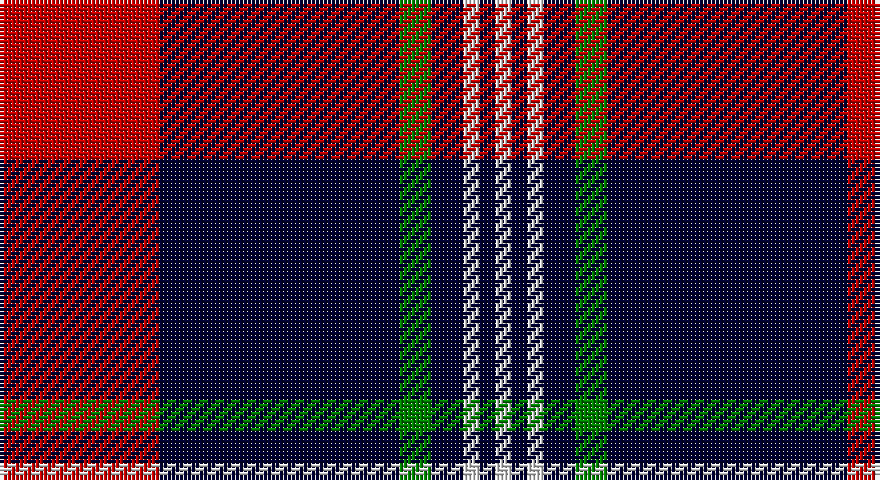

This page is one **sett** — a single exact thread-count. It belongs to the [tartan](/setts/r10k15g2k2w1k1w1/)
(the same proportion at any scale), whose colour order is pattern [RKGKWKW](/stripes/rkgkwkw/).

Sourced from weddslist.  It is a [7 stripe tartan](/stripes/stripes7/).

Original link http://www.weddslist.com/cgi-bin/tartans/pg.pl?source=sts

## Thread count
R/40 DB60 G8 DB8 LN4 DB4 LN/4

One full sett is **212 threads**.

## Palette

Palette: <strong>Tartan Dictionary</strong> <small style="color:#888">(1 of 4 colours)</small>
<table><thead><tr><th>Colour</th><th>Threads</th><th>Shade</th><th>Base</th><th>OKLCh</th></tr></thead><tbody><tr><td>R/</td><td style="text-align:right;font-variant-numeric:tabular-nums">40</td><td><code style="background-color:#C00000;">#C00000</code> <small style="color:#888">#C00000</small></td><td>R <code style="background-color:#CC0000;">#CC0000</code></td><td><small style="color:#888">oklch(50.7% 0.208 29.2)</small></td></tr><tr><td>DB</td><td style="text-align:right;font-variant-numeric:tabular-nums">60</td><td><code style="background-color:#000030;">#000030</code> <small style="color:#888">#000030</small></td><td>K <code style="background-color:#000000;">#000000</code></td><td><small style="color:#888">oklch(14.0% 0.097 264.1)</small></td></tr><tr><td>G</td><td style="text-align:right;font-variant-numeric:tabular-nums">8</td><td><code style="background-color:#008000;">#008000</code> <small style="color:#888">#008000</small></td><td>G <code style="background-color:#006100;">#006100</code></td><td><small style="color:#888">oklch(52.0% 0.177 142.5)</small></td></tr><tr><td>DB</td><td style="text-align:right;font-variant-numeric:tabular-nums">8</td><td><code style="background-color:#000030;">#000030</code> <small style="color:#888">#000030</small></td><td>K <code style="background-color:#000000;">#000000</code></td><td><small style="color:#888">oklch(14.0% 0.097 264.1)</small></td></tr><tr><td>LN</td><td style="text-align:right;font-variant-numeric:tabular-nums">4</td><td><code style="background-color:#E0E0E0;">#E0E0E0</code> <small style="color:#888">#E0E0E0</small></td><td>W <code style="background-color:#F7F7F7;">#F7F7F7</code></td><td><small style="color:#888">oklch(90.7% 0.000 89.9)</small></td></tr><tr><td>DB</td><td style="text-align:right;font-variant-numeric:tabular-nums">4</td><td><code style="background-color:#000030;">#000030</code> <small style="color:#888">#000030</small></td><td>K <code style="background-color:#000000;">#000000</code></td><td><small style="color:#888">oklch(14.0% 0.097 264.1)</small></td></tr><tr><td>LN/</td><td style="text-align:right;font-variant-numeric:tabular-nums">4</td><td><code style="background-color:#E0E0E0;">#E0E0E0</code> <small style="color:#888">#E0E0E0</small></td><td>W <code style="background-color:#F7F7F7;">#F7F7F7</code></td><td><small style="color:#888">oklch(90.7% 0.000 89.9)</small></td></tr></tbody></table>

# Sample pattern

## Nearest tartans

The nearest existing variants by ΔTartan distance, with this tartan at the top so the swatches line up against it.

ΔTartan

Tartan

Sett

—

<a href="/ttd/edit/#slug=r10k15g2k2w1k1w1~x4">Ikelman No 4</a> <a class="nn-out" href="/variants/s7/r10k15g2k2w1k1w1~x4/" title="open its dictionary page">↗</a>

0.91

<a href="/ttd/edit/#slug=w3dr10k38o11dr6k2w3~x2&amp;base=r10k15g2k2w1k1w1~x4">Phantom (Corporate)</a> <a class="nn-out" href="/variants/s7/w3dr10k38o11dr6k2w3~x2/" title="open its dictionary page">↗</a>

1.00

<a href="/ttd/edit/#slug=k38t2m24w2k16m6t2k3t5~x2&amp;base=r10k15g2k2w1k1w1~x4">Universal Scientific Indust (Corp.)</a> <a class="nn-out" href="/variants/s9/k38t2m24w2k16m6t2k3t5~x2/" title="open its dictionary page">↗</a>

1.04

<a href="/ttd/edit/#slug=k43r10w3k3w15db3~x2&amp;base=r10k15g2k2w1k1w1~x4">Bro-Wened</a> <a class="nn-out" href="/variants/s6/k43r10w3k3w15db3~x2/" title="open its dictionary page">↗</a>

1.19

<a href="/ttd/edit/#slug=k11w1k1w1k4o8r1~x8&amp;base=r10k15g2k2w1k1w1~x4">Dunfermline Athletic (2008) (Corp)</a> <a class="nn-out" href="/variants/s7/k11w1k1w1k4o8r1~x8/" title="open its dictionary page">↗</a>

1.20

<a href="/ttd/edit/#slug=o4k48o16r12db3~x2&amp;base=r10k15g2k2w1k1w1~x4">Calgary Firefighters (Corporate)</a> <a class="nn-out" href="/variants/s5/o4k48o16r12db3~x2/" title="open its dictionary page">↗</a>

1.20

<a href="/ttd/edit/#slug=r10k3w1k15ly1w3k3ly1~x4&amp;base=r10k15g2k2w1k1w1~x4">Cunard o' the Clyde</a> <a class="nn-out" href="/variants/s8/r10k3w1k15ly1w3k3ly1~x4/" title="open its dictionary page">↗</a>

1.26

<a href="/ttd/edit/#slug=k3db30k8w8k2r3~x2&amp;base=r10k15g2k2w1k1w1~x4">Hydro-Electric</a> <a class="nn-out" href="/variants/s6/k3db30k8w8k2r3~x2/" title="open its dictionary page">↗</a>

1.27

<a href="/ttd/edit/#slug=r10db15g2db2w1db1w1~x4&amp;base=r10k15g2k2w1k1w1~x4">Ikelman #4 (Personal)</a> <a class="nn-out" href="/variants/s7/r10db15g2db2w1db1w1~x4/" title="open its dictionary page">↗</a>

1.28

<a href="/variants/s7/w3o10k38wi11o6k2w3~x2/">Phantom</a>

1.29

<a href="/ttd/edit/#slug=y4k48y16r12b3~x2&amp;base=r10k15g2k2w1k1w1~x4">Calgary Firefighters</a> <a class="nn-out" href="/variants/s5/y4k48y16r12b3~x2/" title="open its dictionary page">↗</a>

## Neighbour map

Every grey dot is one of 14360 variants placed by the first two principal components of the ΔTartan feature space (44% of its variance). Red is this tartan; blue dots are its nearest — click one to open its page.

<svg viewBox="0 0 640 380" role="img" style="max-width:100%;height:auto;border:1px solid #e0e0e0;border-radius:4px;display:block" xmlns="http://www.w3.org/2000/svg"><image href="/nn/cloud.v1.png" width="640" height="380"/><a href="/variants/s7/w3dr10k38o11dr6k2w3~x2/"><circle cx="314.2" cy="157.6" r="4" fill="#3465a4"><title>Phantom (Corporate)</title></circle></a><a href="/variants/s9/k38t2m24w2k16m6t2k3t5~x2/"><circle cx="338.9" cy="150.8" r="4" fill="#3465a4"><title>Universal Scientific Indust (Corp.)</title></circle></a><a href="/variants/s6/k43r10w3k3w15db3~x2/"><circle cx="316.3" cy="163.0" r="4" fill="#3465a4"><title>Bro-Wened</title></circle></a><a href="/variants/s7/k11w1k1w1k4o8r1~x8/"><circle cx="311.1" cy="183.5" r="4" fill="#3465a4"><title>Dunfermline Athletic (2008) (Corp)</title></circle></a><a href="/variants/s5/o4k48o16r12db3~x2/"><circle cx="335.4" cy="189.7" r="4" fill="#3465a4"><title>Calgary Firefighters (Corporate)</title></circle></a><a href="/variants/s8/r10k3w1k15ly1w3k3ly1~x4/"><circle cx="302.4" cy="152.8" r="4" fill="#3465a4"><title>Cunard o' the Clyde</title></circle></a><a href="/variants/s6/k3db30k8w8k2r3~x2/"><circle cx="291.1" cy="168.8" r="4" fill="#3465a4"><title>Hydro-Electric</title></circle></a><a href="/variants/s7/r10db15g2db2w1db1w1~x4/"><circle cx="339.6" cy="170.6" r="4" fill="#3465a4"><title>Ikelman #4 (Personal)</title></circle></a><a href="/variants/s7/w3o10k38wi11o6k2w3~x2/"><circle cx="285.9" cy="140.9" r="4" fill="#3465a4"><title>Phantom</title></circle></a><a href="/variants/s5/y4k48y16r12b3~x2/"><circle cx="341.8" cy="193.6" r="4" fill="#3465a4"><title>Calgary Firefighters</title></circle></a><circle cx="317.4" cy="159.6" r="5" fill="#c00000"/></svg>

ID: /variants/s7/r10k15g2k2w1k1w1~x4/
