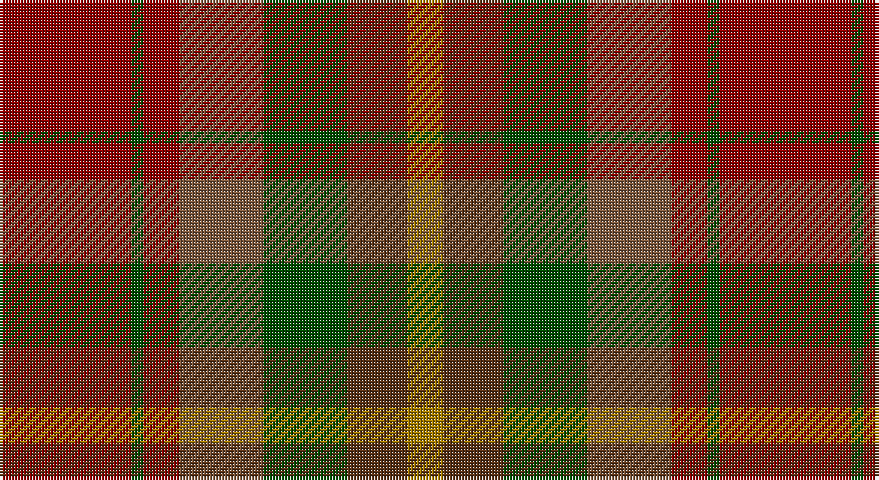

This page is one **sett** — a single exact thread-count. It belongs to the [tartan](/setts/r11dg1r3y7dg7dy5o3/)
(the same proportion at any scale), whose colour order is pattern [RGGGRGR](/stripes/rgggrgr/).

Sourced from tartans-authority.  It is a [7 stripe tartan](/stripes/stripes7/).

Original link http://www.tartansauthority.com/tartan-ferret/display/3782/

2 attestations — the source records this cloth was collapsed from (oldest owns this page)

<ul>
<li>pre 2002 — Caledonian Maple (Fashion) (tartans-authority, <a href="http://www.tartansauthority.com/tartan-ferret/display/3782/">record</a>)</li>
<li>undated — Caledonian Maple (register-of-tartans, <a href="https://www.tartanregister.gov.uk/tartanDetails.aspx?ref=4939">record</a>)</li>
</ul>

## Register references

External register numbers recorded for this tartan.

- Scottish Register of Tartans: [4939](https://www.tartanregister.gov.uk/tartanDetails.aspx?ref=4939)
- Scottish Tartans Authority (ITI): 3782

## Thread count
DR/44 G4 DR12 LT28 G28 T20 DY/12

One full sett is **240 threads**.

## Palette

Palette: <strong>Tartan Register</strong> <small style="color:#888">(1 of 5 colours)</small>
<table><thead><tr><th>Colour</th><th>Threads</th><th>Shade</th><th>Base</th><th>OKLCh</th></tr></thead><tbody><tr><td>DR/</td><td style="text-align:right;font-variant-numeric:tabular-nums">44</td><td><code style="background-color:#8C0000;">#8C0000</code> <small style="color:#888">#8C0000</small></td><td>R <code style="background-color:#CC0000;">#CC0000</code></td><td><small style="color:#888">oklch(40.2% 0.165 29.2)</small></td></tr><tr><td>G</td><td style="text-align:right;font-variant-numeric:tabular-nums">4</td><td><code style="background-color:#004C00;">#004C00</code> <small style="color:#888">#004C00</small></td><td>G <code style="background-color:#006100;">#006100</code></td><td><small style="color:#888">oklch(36.1% 0.123 142.5)</small></td></tr><tr><td>DR</td><td style="text-align:right;font-variant-numeric:tabular-nums">12</td><td><code style="background-color:#8C0000;">#8C0000</code> <small style="color:#888">#8C0000</small></td><td>R <code style="background-color:#CC0000;">#CC0000</code></td><td><small style="color:#888">oklch(40.2% 0.165 29.2)</small></td></tr><tr><td>LT</td><td style="text-align:right;font-variant-numeric:tabular-nums">28</td><td><code style="background-color:#7C583C;">#7C583C</code> <small style="color:#888">#7C583C</small></td><td>G <code style="background-color:#006100;">#006100</code></td><td><small style="color:#888">oklch(49.2% 0.063 58.5)</small></td></tr><tr><td>G</td><td style="text-align:right;font-variant-numeric:tabular-nums">28</td><td><code style="background-color:#004C00;">#004C00</code> <small style="color:#888">#004C00</small></td><td>G <code style="background-color:#006100;">#006100</code></td><td><small style="color:#888">oklch(36.1% 0.123 142.5)</small></td></tr><tr><td>T</td><td style="text-align:right;font-variant-numeric:tabular-nums">20</td><td><code style="background-color:#583014;">#583014</code> <small style="color:#888">#583014</small></td><td>G <code style="background-color:#006100;">#006100</code></td><td><small style="color:#888">oklch(35.4% 0.071 53.1)</small></td></tr><tr><td>DY/</td><td style="text-align:right;font-variant-numeric:tabular-nums">12</td><td><code style="background-color:#A47C00;">#A47C00</code> <small style="color:#888">#A47C00</small></td><td>R <code style="background-color:#CC0000;">#CC0000</code></td><td><small style="color:#888">oklch(60.9% 0.125 85.8)</small></td></tr></tbody></table>

# Sample pattern

## Nearest tartans

The nearest existing variants by ΔTartan distance, with this tartan at the top so the swatches line up against it.

ΔTartan

Tartan

Sett

—

<a href="/ttd/edit/#slug=r11dg1r3y7dg7dy5o3~x4">Caledonian Maple (Fashion)</a> <a class="nn-out" href="/variants/s7/r11dg1r3y7dg7dy5o3~x4/" title="open its dictionary page">↗</a>

1.31

<a href="/ttd/edit/#slug=k3r22dgi5dg10do10dg2~x2&amp;base=r11dg1r3y7dg7dy5o3~x4">Rowardennan</a> <a class="nn-out" href="/variants/s6/k3r22dgi5dg10do10dg2~x2/" title="open its dictionary page">↗</a>

1.48

<a href="/ttd/edit/#slug=dr12dy1dg12dy12ly2dy12dg12dy1dr12t2~x2&amp;base=r11dg1r3y7dg7dy5o3~x4">United Distillers Corporate Tartan</a> <a class="nn-out" href="/variants/s10/dr12dy1dg12dy12ly2dy12dg12dy1dr12t2~x2/" title="open its dictionary page">↗</a>

1.51

<a href="/variants/s8/dyii13ly3dyii13dg23dyi16dy13dyii23r5~x2/">Unidentified #40</a>

1.57

<a href="/ttd/edit/#slug=dr5lo1dr5g9do5dy4dr7r2~x4&amp;base=r11dg1r3y7dg7dy5o3~x4">Leighton (Personal)</a> <a class="nn-out" href="/variants/s8/dr5lo1dr5g9do5dy4dr7r2~x4/" title="open its dictionary page">↗</a>

1.58

<a href="/ttd/edit/#slug=dr9o9n9r1db1o9db1r1~x4&amp;base=r11dg1r3y7dg7dy5o3~x4">Jardine, of Castlemilk</a> <a class="nn-out" href="/variants/s8/dr9o9n9r1db1o9db1r1~x4/" title="open its dictionary page">↗</a>

1.59

<a href="/ttd/edit/#slug=dr20lo4dr20g35do20dy16dr28r8&amp;base=r11dg1r3y7dg7dy5o3~x4">Leighton (Personal)</a> <a class="nn-out" href="/variants/s8/dr20lo4dr20g35do20dy16dr28r8/" title="open its dictionary page">↗</a>

1.72

<a href="/ttd/edit/#slug=g3dy4g2dy22n5r16ly3~x2&amp;base=r11dg1r3y7dg7dy5o3~x4">Pubcrawlers (Corporate)</a> <a class="nn-out" href="/variants/s7/g3dy4g2dy22n5r16ly3~x2/" title="open its dictionary page">↗</a>

1.74

<a href="/ttd/edit/#slug=r15g3r3g19dy6y6o6g19r3g3r15y13~x2&amp;base=r11dg1r3y7dg7dy5o3~x4">Maple Leaf (District)</a> <a class="nn-out" href="/variants/s12/r15g3r3g19dy6y6o6g19r3g3r15y13~x2/" title="open its dictionary page">↗</a>

1.84

<a href="/ttd/edit/#slug=r4dg1yi6y3r2~x8&amp;base=r11dg1r3y7dg7dy5o3~x4">Belladrum Estate</a> <a class="nn-out" href="/variants/s5/r4dg1yi6y3r2~x8/" title="open its dictionary page">↗</a>

1.86

<a href="/ttd/edit/#slug=dt5t2dt11y2dt2y6o17oi9dt1o1~x2&amp;base=r11dg1r3y7dg7dy5o3~x4">Clarks No.1</a> <a class="nn-out" href="/variants/s10/dt5t2dt11y2dt2y6o17oi9dt1o1~x2/" title="open its dictionary page">↗</a>

## Neighbour map

Every grey dot is one of 14360 variants placed by the first two principal components of the ΔTartan feature space (44% of its variance). Red is this tartan; blue dots are its nearest — click one to open its page.

<svg viewBox="0 0 640 380" role="img" style="max-width:100%;height:auto;border:1px solid #e0e0e0;border-radius:4px;display:block" xmlns="http://www.w3.org/2000/svg"><image href="/nn/cloud.v1.png" width="640" height="380"/><a href="/variants/s6/k3r22dgi5dg10do10dg2~x2/"><circle cx="297.1" cy="247.7" r="4" fill="#3465a4"><title>Rowardennan</title></circle></a><a href="/variants/s10/dr12dy1dg12dy12ly2dy12dg12dy1dr12t2~x2/"><circle cx="234.1" cy="227.0" r="4" fill="#3465a4"><title>United Distillers Corporate Tartan</title></circle></a><a href="/variants/s8/dyii13ly3dyii13dg23dyi16dy13dyii23r5~x2/"><circle cx="228.8" cy="260.0" r="4" fill="#3465a4"><title>Unidentified #40</title></circle></a><a href="/variants/s8/dr5lo1dr5g9do5dy4dr7r2~x4/"><circle cx="221.9" cy="241.3" r="4" fill="#3465a4"><title>Leighton (Personal)</title></circle></a><a href="/variants/s8/dr9o9n9r1db1o9db1r1~x4/"><circle cx="291.7" cy="234.2" r="4" fill="#3465a4"><title>Jardine, of Castlemilk</title></circle></a><a href="/variants/s8/dr20lo4dr20g35do20dy16dr28r8/"><circle cx="221.9" cy="243.7" r="4" fill="#3465a4"><title>Leighton (Personal)</title></circle></a><a href="/variants/s7/g3dy4g2dy22n5r16ly3~x2/"><circle cx="316.8" cy="215.8" r="4" fill="#3465a4"><title>Pubcrawlers (Corporate)</title></circle></a><a href="/variants/s12/r15g3r3g19dy6y6o6g19r3g3r15y13~x2/"><circle cx="228.4" cy="239.0" r="4" fill="#3465a4"><title>Maple Leaf (District)</title></circle></a><a href="/variants/s5/r4dg1yi6y3r2~x8/"><circle cx="273.9" cy="315.9" r="4" fill="#3465a4"><title>Belladrum Estate</title></circle></a><a href="/variants/s10/dt5t2dt11y2dt2y6o17oi9dt1o1~x2/"><circle cx="259.6" cy="187.1" r="4" fill="#3465a4"><title>Clarks No.1</title></circle></a><circle cx="241.4" cy="251.1" r="5" fill="#c00000"/></svg>

ID: /variants/s7/r11dg1r3y7dg7dy5o3~x4/
