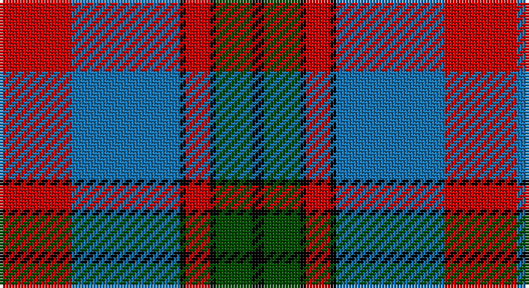

This page is one **sett** — a single exact thread-count. It belongs to the [tartan](/setts/r12b18k1r4k1dg6k2/)
(the same proportion at any scale), whose colour order is pattern [KGKRKBR](/stripes/kgkrkbr/).

Sourced from register-of-tartans.  It is a [7 stripe tartan](/stripes/stripes7/).

Original link https://www.tartanregister.gov.uk/tartanDetails.aspx?ref=728

## Register references

External register numbers recorded for this tartan.

- Scottish Register of Tartans: [728](https://www.tartanregister.gov.uk/tartanDetails.aspx?ref=728)
- Scottish Tartans Authority (ITI): 4565

## Thread count
R/24 B36 K2 R8 K2 G12 K/4

One full sett is **148 threads**.

## Palette

Palette: <strong>Tartan Register</strong> <small style="color:#888">(5 of 6 colours)</small>
<table><thead><tr><th>Colour</th><th>Threads</th><th>Shade</th><th>Base</th><th>OKLCh</th></tr></thead><tbody><tr><td>R/</td><td style="text-align:right;font-variant-numeric:tabular-nums">24</td><td><code style="background-color:#C80000;">#C80000</code> <small style="color:#888">#C80000</small></td><td>R <code style="background-color:#CC0000;">#CC0000</code></td><td><small style="color:#888">oklch(52.3% 0.215 29.2)</small></td></tr><tr><td>B</td><td style="text-align:right;font-variant-numeric:tabular-nums">36</td><td><code style="background-color:#1474B4;">#1474B4</code> <small style="color:#888">#1474B4</small></td><td>B <code style="background-color:#2A418A;">#2A418A</code></td><td><small style="color:#888">oklch(54.0% 0.129 245.1)</small></td></tr><tr><td>K</td><td style="text-align:right;font-variant-numeric:tabular-nums">2</td><td><code style="background-color:#000000;">#000000</code> <small style="color:#888">#000000</small></td><td>K <code style="background-color:#000000;">#000000</code></td><td><small style="color:#888">oklch(0.0% 0.000 0.0)</small></td></tr><tr><td>R</td><td style="text-align:right;font-variant-numeric:tabular-nums">8</td><td><code style="background-color:#C80000;">#C80000</code> <small style="color:#888">#C80000</small></td><td>R <code style="background-color:#CC0000;">#CC0000</code></td><td><small style="color:#888">oklch(52.3% 0.215 29.2)</small></td></tr><tr><td>K</td><td style="text-align:right;font-variant-numeric:tabular-nums">2</td><td><code style="background-color:#000000;">#000000</code> <small style="color:#888">#000000</small></td><td>K <code style="background-color:#000000;">#000000</code></td><td><small style="color:#888">oklch(0.0% 0.000 0.0)</small></td></tr><tr><td>G</td><td style="text-align:right;font-variant-numeric:tabular-nums">12</td><td><code style="background-color:#004C00;">#004C00</code> <small style="color:#888">#004C00</small></td><td>G <code style="background-color:#006100;">#006100</code></td><td><small style="color:#888">oklch(36.1% 0.123 142.5)</small></td></tr><tr><td>K/</td><td style="text-align:right;font-variant-numeric:tabular-nums">4</td><td><code style="background-color:#000000;">#000000</code> <small style="color:#888">#000000</small></td><td>K <code style="background-color:#000000;">#000000</code></td><td><small style="color:#888">oklch(0.0% 0.000 0.0)</small></td></tr></tbody></table>

# Sample pattern

## Nearest tartans

The nearest existing variants by ΔTartan distance, with this tartan at the top so the swatches line up against it.

ΔTartan

Tartan

Sett

—

<a href="/ttd/edit/#slug=r12b18k1r4k1dg6k2~x2">Confederate</a> <a class="nn-out" href="/variants/s7/r12b18k1r4k1dg6k2~x2/" title="open its dictionary page">↗</a>

0.13

<a href="/ttd/edit/#slug=r12b18k1r4k1g6k2~x2&amp;base=r12b18k1r4k1dg6k2~x2">Confederate (Military)</a> <a class="nn-out" href="/variants/s7/r12b18k1r4k1g6k2~x2/" title="open its dictionary page">↗</a>

0.70

<a href="/ttd/edit/#slug=k2lr6r3lr6r3k20y30r2~x2&amp;base=r12b18k1r4k1dg6k2~x2">Hermitage Academy (Corporate)</a> <a class="nn-out" href="/variants/s8/k2lr6r3lr6r3k20y30r2~x2/" title="open its dictionary page">↗</a>

0.92

<a href="/ttd/edit/#slug=lp10dp9o59dp9k59dp9lp5&amp;base=r12b18k1r4k1dg6k2~x2">Central Newcastle School</a> <a class="nn-out" href="/variants/s7/lp10dp9o59dp9k59dp9lp5/" title="open its dictionary page">↗</a>

0.94

<a href="/ttd/edit/#slug=g22k3g1k3g2p8m1p8m16~x2&amp;base=r12b18k1r4k1dg6k2~x2">Queen of Scots</a> <a class="nn-out" href="/variants/s9/g22k3g1k3g2p8m1p8m16~x2/" title="open its dictionary page">↗</a>

0.96

<a href="/ttd/edit/#slug=w4db30g10r25w2~x2&amp;base=r12b18k1r4k1dg6k2~x2">Highland Spring Dress (2004) (Corp)</a> <a class="nn-out" href="/variants/s5/w4db30g10r25w2~x2/" title="open its dictionary page">↗</a>

1.00

<a href="/ttd/edit/#slug=dp9ri4dp1ri4g15r4dp1~x2&amp;base=r12b18k1r4k1dg6k2~x2">Logan Light</a> <a class="nn-out" href="/variants/s7/dp9ri4dp1ri4g15r4dp1~x2/" title="open its dictionary page">↗</a>

1.05

<a href="/ttd/edit/#slug=dp9lr4dp1lr4g15r4dp1~x4&amp;base=r12b18k1r4k1dg6k2~x2">Logan #3</a> <a class="nn-out" href="/variants/s7/dp9lr4dp1lr4g15r4dp1~x4/" title="open its dictionary page">↗</a>

1.11

<a href="/ttd/edit/#slug=w3dg18db22r19dg1r2~x2&amp;base=r12b18k1r4k1dg6k2~x2">Nibley (Personal)</a> <a class="nn-out" href="/variants/s6/w3dg18db22r19dg1r2~x2/" title="open its dictionary page">↗</a>

1.12

<a href="/ttd/edit/#slug=t3o26g4t13k13t2~x2&amp;base=r12b18k1r4k1dg6k2~x2">MacTavish / Thom(p)son, hunting</a> <a class="nn-out" href="/variants/s6/t3o26g4t13k13t2~x2/" title="open its dictionary page">↗</a>

1.14

<a href="/ttd/edit/#slug=db3dr2db18dr1w10o18dr2o3~x2&amp;base=r12b18k1r4k1dg6k2~x2">Bannockbane Silver</a> <a class="nn-out" href="/variants/s8/db3dr2db18dr1w10o18dr2o3~x2/" title="open its dictionary page">↗</a>

## Neighbour map

Every grey dot is one of 14360 variants placed by the first two principal components of the ΔTartan feature space (44% of its variance). Red is this tartan; blue dots are its nearest — click one to open its page.

<svg viewBox="0 0 640 380" role="img" style="max-width:100%;height:auto;border:1px solid #e0e0e0;border-radius:4px;display:block" xmlns="http://www.w3.org/2000/svg"><image href="/nn/cloud.v1.png" width="640" height="380"/><a href="/variants/s7/r12b18k1r4k1g6k2~x2/"><circle cx="237.4" cy="163.4" r="4" fill="#3465a4"><title>Confederate (Military)</title></circle></a><a href="/variants/s8/k2lr6r3lr6r3k20y30r2~x2/"><circle cx="236.5" cy="158.9" r="4" fill="#3465a4"><title>Hermitage Academy (Corporate)</title></circle></a><a href="/variants/s7/lp10dp9o59dp9k59dp9lp5/"><circle cx="204.0" cy="175.1" r="4" fill="#3465a4"><title>Central Newcastle School</title></circle></a><a href="/variants/s9/g22k3g1k3g2p8m1p8m16~x2/"><circle cx="230.8" cy="149.4" r="4" fill="#3465a4"><title>Queen of Scots</title></circle></a><a href="/variants/s5/w4db30g10r25w2~x2/"><circle cx="227.2" cy="195.2" r="4" fill="#3465a4"><title>Highland Spring Dress (2004) (Corp)</title></circle></a><a href="/variants/s7/dp9ri4dp1ri4g15r4dp1~x2/"><circle cx="209.9" cy="173.7" r="4" fill="#3465a4"><title>Logan Light</title></circle></a><a href="/variants/s7/dp9lr4dp1lr4g15r4dp1~x4/"><circle cx="210.4" cy="177.3" r="4" fill="#3465a4"><title>Logan #3</title></circle></a><a href="/variants/s6/w3dg18db22r19dg1r2~x2/"><circle cx="224.2" cy="180.6" r="4" fill="#3465a4"><title>Nibley (Personal)</title></circle></a><a href="/variants/s6/t3o26g4t13k13t2~x2/"><circle cx="214.8" cy="196.5" r="4" fill="#3465a4"><title>MacTavish / Thom(p)son, hunting</title></circle></a><a href="/variants/s8/db3dr2db18dr1w10o18dr2o3~x2/"><circle cx="201.4" cy="153.2" r="4" fill="#3465a4"><title>Bannockbane Silver</title></circle></a><circle cx="238.0" cy="163.7" r="5" fill="#c00000"/></svg>

ID: /variants/s7/r12b18k1r4k1dg6k2~x2/
