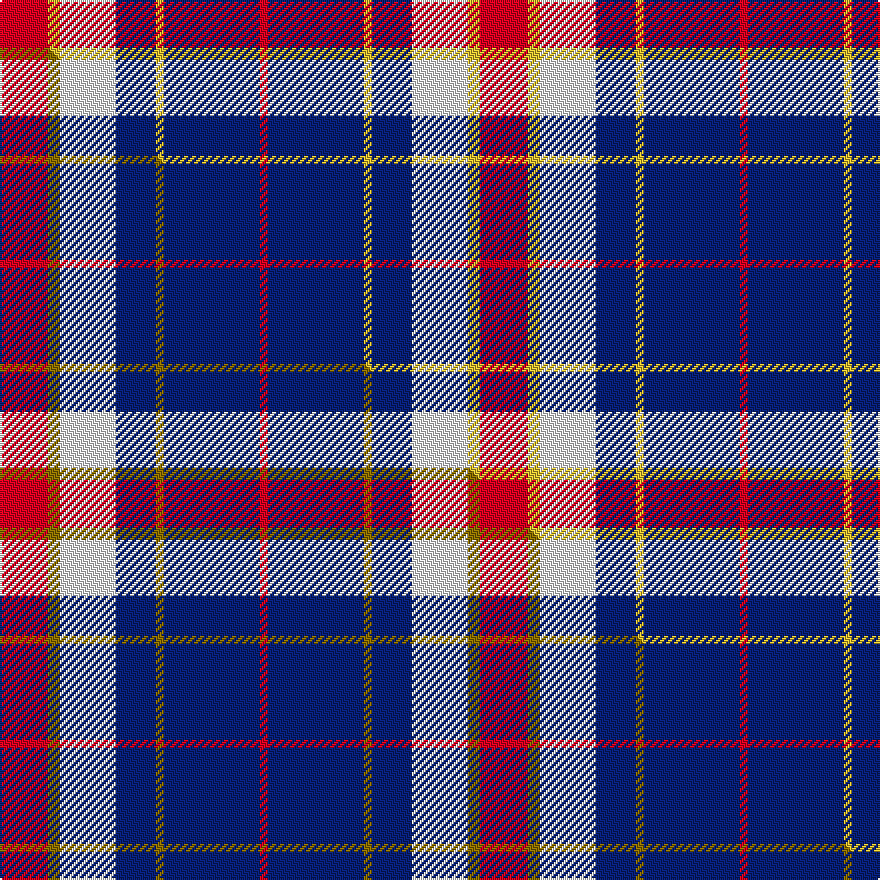

This page is one **sett** — a single exact thread-count. It belongs to the [tartan](/setts/r12ly3w14db10ly2db24r2/)
(the same proportion at any scale), whose colour order is pattern [RBYBWYR](/stripes/rbybwyr/).

Part of the [Yusra](/tartans/yusra/) tartan — the named design grouping this sett with its other cloths.

Sourced from tartans-authority.  It is a [7 stripe tartan](/stripes/stripes7/).

Original link https://www.tartanregister.gov.uk/tartanDetails.aspx?ref=10455

Dataset <small>— provenance for this record, inherited from the source manifest</small>

<dl class="dataset-prov">
<dt>source</dt><dd><a href="/sources/tartans-authority/">Scottish Tartans Authority</a></dd>
<dt>data captured from</dt><dd><a href="https://github.com/thetartan/tartan-database/blob/master/data/tartans-authority/data.csv">https://github.com/thetartan/tartan-database/blob/master/data/tartans-authority/data.csv</a></dd>
<dt>data date</dt><dd>6th April 2011 <small>(this record)</small></dd>
<dt>licence</dt><dd><a href="https://creativecommons.org/licenses/by-nc-nd/4.0/">CC BY-NC-ND 4.0</a></dd>
</dl>

Capture chain <small>— the hands this data passed through, oldest first; each capture carries its own licence</small>

<ol class="capture-chain">
<li><a href="https://www.tartansauthority.com/">Scottish Tartans Authority</a> <small>the heritage body's archive — its tartan-ferret record browser is retired (links repaired to the SRT, above)</small></li>
<li><a href="https://github.com/thetartan/tartan-database">thetartan/tartan-database</a> <small>2016-2017</small> · <a href="https://creativecommons.org/licenses/by-nc-nd/4.0/">CC BY-NC-ND 4.0</a> <small>Levko Kravets's frozen compilation — the capture we vendored, and where its CC licence text came from</small></li>
<li>this dictionary <small>captured 2026-06-10 · commit 5bf86c7566</small> <small>each re-capture is a git commit to data/sources</small></li>
</ol>

## Register references

External register numbers recorded for this tartan.

- Scottish Register of Tartans: [10455](https://www.tartanregister.gov.uk/tartanDetails?ref=10455)
- Scottish Tartans Authority (ITI): 10455

## Thread count
R/24 LY6 W28 DB20 LY4 DB48 R/4

One full sett is **240 threads**.

## Palette
<table><thead><tr><th>Colour</th><th>Shade</th><th>OKLCh</th></tr></thead><tbody><tr><td>DB</td><td><code style="background-color:#082077;">#082077</code> <small style="color:#888">#082077</small></td><td><small style="color:#888">oklch(30.0% 0.149 265.1)</small></td></tr><tr><td>W</td><td><code style="background-color:#F7F7F7;">#F7F7F7</code> <small style="color:#888">#F7F7F7</small></td><td><small style="color:#888">oklch(97.6% 0.000 89.9)</small></td></tr><tr><td>R</td><td><code style="background-color:#D60020;">#D60020</code> <small style="color:#888">#D60020</small></td><td><small style="color:#888">oklch(55.2% 0.224 25.5)</small></td></tr><tr><td>LY</td><td><code style="background-color:#DCBC32;">#DCBC32</code> <small style="color:#888">#DCBC32</small></td><td><small style="color:#888">oklch(80.0% 0.150 95.2)</small></td></tr></tbody></table>

# Sample pattern

## Compared to the master

This cloth is one sett of its design; the master sett (the exemplar the design is anchored on) is below for comparison.

Its **ΔTartan distance** from the master is **0.04** — the same measure the nearest-tartans table ranks by (0 is identical; a re-scale of the same cloth is near 0, a recolour or a different proportion further).

<figure class="master-compare" style="margin:0">

this sett
master sett ★

<figcaption style="color:#888;font-size:smaller">One weave of this sett against the <a href="/setts/r12y3w14db10y2db24r2/">master sett ★</a>, split on the diagonal: a shared proportion runs seamlessly across it with only the shades shifting; a different proportion breaks on it.</figcaption>
</figure>

## Nearest tartan variants

The nearest existing variants by ΔTartan distance, with this cloth at the top so the swatches line up against it.

ΔTartan

Threads

Variant

Sett

—

240

<a href="/variants/s7/r12ly3w14db10ly2db24r2~x2/">Yusra (Personal)</a>

<a href="/ttd/edit/#slug=r12y3w14db10y2db24r2~x2&amp;base=r12ly3w14db10ly2db24r2~x2" title="compare in the TTD">0.04</a>

240

<a href="/variants/s7/r12y3w14db10y2db24r2~x2/">Yusra (Malay) (Personal)</a>

<a href="/ttd/edit/#slug=r12k3w14db10k2db24r2~x2~r2109032&amp;base=r12ly3w14db10ly2db24r2~x2" title="compare in the TTD">1.60</a>

240

<a href="/variants/s7/r12k3w14db10k2db24r2~x2~r2109032/">Yusra Personal Tartan</a>

<a href="/ttd/edit/#slug=dp8db2dp24db5w26k2w8~x2&amp;base=r12ly3w14db10ly2db24r2~x2" title="compare in the TTD">2.09</a>

268

<a href="/variants/s7/dp8db2dp24db5w26k2w8~x2/">Lennox Purple Dress District Tartan</a>

<a href="/ttd/edit/#slug=r15lb98db72ly25db8w15&amp;base=r12ly3w14db10ly2db24r2~x2" title="compare in the TTD">2.27</a>

436

<a href="/variants/s6/r15lb98db72ly25db8w15/">Afternoon Tea / Earl Grey</a>

<a href="/ttd/edit/#slug=r10w5db30lb20r3~x4&amp;base=r12ly3w14db10ly2db24r2~x2" title="compare in the TTD">2.32</a>

492

<a href="/variants/s5/r10w5db30lb20r3~x4/">Lands of Liberty</a>

<a href="/ttd/edit/#slug=w5lb34k24lb4dr24lb4~x2&amp;base=r12ly3w14db10ly2db24r2~x2" title="compare in the TTD">2.35</a>

362

<a href="/variants/s6/w5lb34k24lb4dr24lb4~x2/">Wcwm 759-3</a>

<a href="/ttd/edit/#slug=r15w10db48lb32r6~x2&amp;base=r12ly3w14db10ly2db24r2~x2" title="compare in the TTD">2.35</a>

402

<a href="/variants/s5/r15w10db48lb32r6~x2/">Lands of Liberty (Fashion)</a>

<a href="/ttd/edit/#slug=w2db15r3g3r3db1~x8&amp;base=r12ly3w14db10ly2db24r2~x2" title="compare in the TTD">2.51</a>

408

<a href="/variants/s6/w2db15r3g3r3db1~x8/">Lothian Buses (Corporate?)</a>

<a href="/ttd/edit/#slug=r1lb12k1w2k5r1~x4&amp;base=r12ly3w14db10ly2db24r2~x2" title="compare in the TTD">2.67</a>

168

<a href="/variants/s6/r1lb12k1w2k5r1~x4/">Rui (Personal)</a>

<a href="/ttd/edit/#slug=y2db3w6db15r24db3w2~x2&amp;base=r12ly3w14db10ly2db24r2~x2" title="compare in the TTD">2.76</a>

212

<a href="/variants/s7/y2db3w6db15r24db3w2~x2/">Fazzolettone (Fashion?)</a>

## Neighbour map

Every grey dot is one of 13620 variants placed by the first two principal components of the ΔTartan feature space (42% of its variance). Red is this tartan; blue dots are its nearest — click one to open its page.

<svg viewBox="0 0 640 380" role="img" style="max-width:100%;height:auto;border:1px solid #e0e0e0;border-radius:4px;display:block" xmlns="http://www.w3.org/2000/svg"><image href="/nn/cloud.v1.png" width="640" height="380"/><a href="/variants/s7/r12y3w14db10y2db24r2~x2/"><circle cx="231.0" cy="189.6" r="4" fill="#3465a4"><title>Yusra (Malay) (Personal)</title></circle></a><a href="/variants/s7/r12k3w14db10k2db24r2~x2~r2109032/"><circle cx="204.2" cy="173.8" r="4" fill="#3465a4"><title>Yusra Personal Tartan</title></circle></a><a href="/variants/s7/dp8db2dp24db5w26k2w8~x2/"><circle cx="222.7" cy="172.9" r="4" fill="#3465a4"><title>Lennox Purple Dress District Tartan</title></circle></a><a href="/variants/s6/r15lb98db72ly25db8w15/"><circle cx="208.0" cy="191.5" r="4" fill="#3465a4"><title>Afternoon Tea / Earl Grey</title></circle></a><a href="/variants/s5/r10w5db30lb20r3~x4/"><circle cx="210.3" cy="218.5" r="4" fill="#3465a4"><title>Lands of Liberty</title></circle></a><a href="/variants/s6/w5lb34k24lb4dr24lb4~x2/"><circle cx="175.6" cy="204.8" r="4" fill="#3465a4"><title>Wcwm 759-3</title></circle></a><a href="/variants/s5/r15w10db48lb32r6~x2/"><circle cx="193.7" cy="230.2" r="4" fill="#3465a4"><title>Lands of Liberty (Fashion)</title></circle></a><a href="/variants/s6/w2db15r3g3r3db1~x8/"><circle cx="325.3" cy="171.0" r="4" fill="#3465a4"><title>Lothian Buses (Corporate?)</title></circle></a><a href="/variants/s6/r1lb12k1w2k5r1~x4/"><circle cx="242.1" cy="154.5" r="4" fill="#3465a4"><title>Rui (Personal)</title></circle></a><a href="/variants/s7/y2db3w6db15r24db3w2~x2/"><circle cx="247.1" cy="177.1" r="4" fill="#3465a4"><title>Fazzolettone (Fashion?)</title></circle></a><circle cx="228.4" cy="189.2" r="5" fill="#c00000"/><text x="320" y="376" text-anchor="middle" font-size="11" fill="#999">ground</text><text x="11" y="190" text-anchor="middle" font-size="11" fill="#999" transform="rotate(-90 11 190)">complexity</text></svg>

ID: /variants/s7/r12ly3w14db10ly2db24r2~x2/
