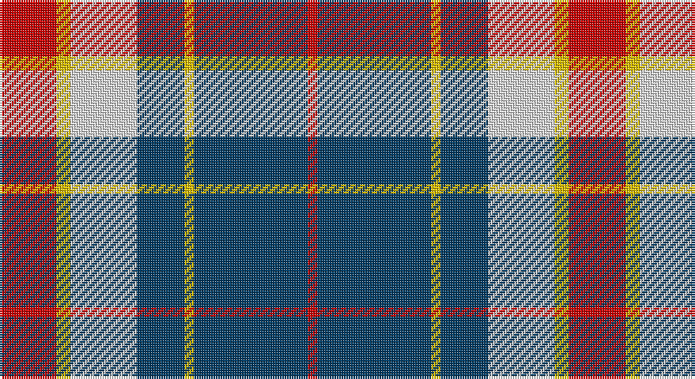

This page is one **sett** — a single exact thread-count. It belongs to the [tartan](/setts/r12ly3w14dt10ly2dt24r2/)
(the same proportion at any scale), whose colour order is pattern [RBYBWYR](/stripes/rbybwyr/).

Part of the [Yusra](/tartans/yusra/) tartan — the named design grouping this sett with its other cloths.

Sourced from register-of-tartans.  It is a [7 stripe tartan](/stripes/stripes7/).

Original link https://www.tartanregister.gov.uk/tartanDetails.aspx?ref=10455

## Also known as

This cloth is also recorded under:

- Yusra Personal

2 attestations — the source records this cloth was collapsed from (oldest owns this page)

<ul>
<li>06/04/2011 — Yusra (Malay) (Personal) (register-of-tartans, <a href="https://www.tartanregister.gov.uk/tartanDetails.aspx?ref=10455">record</a>)</li>
<li>6th April 2011 — Yusra (Personal) (tartans-authority, <a href="http://www.tartansauthority.com/tartan-ferret/display/10455/">record</a>)</li>
</ul>

## Register references

External register numbers recorded for this tartan.

- Scottish Register of Tartans: [10455](https://www.tartanregister.gov.uk/tartanDetails?ref=10455)
- Scottish Tartans Authority (ITI): 10455

## Thread count
R/24 Y6 LN28 DB20 Y4 DB48 R/4

One full sett is **240 threads**.

## Palette

Palette: <strong>Tartan Register</strong>
<table><thead><tr><th>Colour</th><th>Threads</th><th>Shade</th><th>Base</th><th>OKLCh</th></tr></thead><tbody><tr><td>R/</td><td style="text-align:right;font-variant-numeric:tabular-nums">24</td><td><code style="background-color:#C80000;">#C80000</code> <small style="color:#888">#C80000</small></td><td>R <code style="background-color:#CC0000;">#CC0000</code></td><td><small style="color:#888">oklch(52.3% 0.215 29.2)</small></td></tr><tr><td>Y</td><td style="text-align:right;font-variant-numeric:tabular-nums">6</td><td><code style="background-color:#E8C000;">#E8C000</code> <small style="color:#888">#E8C000</small></td><td>Y <code style="background-color:#F2BF00;">#F2BF00</code></td><td><small style="color:#888">oklch(81.9% 0.168 93.7)</small></td></tr><tr><td>LN</td><td style="text-align:right;font-variant-numeric:tabular-nums">28</td><td><code style="background-color:#E0E0E0;">#E0E0E0</code> <small style="color:#888">#E0E0E0</small></td><td>W <code style="background-color:#F7F7F7;">#F7F7F7</code></td><td><small style="color:#888">oklch(90.7% 0.000 89.9)</small></td></tr><tr><td>DB</td><td style="text-align:right;font-variant-numeric:tabular-nums">20</td><td><code style="background-color:#003C64;">#003C64</code> <small style="color:#888">#003C64</small></td><td>B <code style="background-color:#2A418A;">#2A418A</code></td><td><small style="color:#888">oklch(34.5% 0.089 246.0)</small></td></tr><tr><td>Y</td><td style="text-align:right;font-variant-numeric:tabular-nums">4</td><td><code style="background-color:#E8C000;">#E8C000</code> <small style="color:#888">#E8C000</small></td><td>Y <code style="background-color:#F2BF00;">#F2BF00</code></td><td><small style="color:#888">oklch(81.9% 0.168 93.7)</small></td></tr><tr><td>DB</td><td style="text-align:right;font-variant-numeric:tabular-nums">48</td><td><code style="background-color:#003C64;">#003C64</code> <small style="color:#888">#003C64</small></td><td>B <code style="background-color:#2A418A;">#2A418A</code></td><td><small style="color:#888">oklch(34.5% 0.089 246.0)</small></td></tr><tr><td>R/</td><td style="text-align:right;font-variant-numeric:tabular-nums">4</td><td><code style="background-color:#C80000;">#C80000</code> <small style="color:#888">#C80000</small></td><td>R <code style="background-color:#CC0000;">#CC0000</code></td><td><small style="color:#888">oklch(52.3% 0.215 29.2)</small></td></tr></tbody></table>

# Sample pattern

## Nearest tartans

The nearest existing variants by ΔTartan distance, with this tartan at the top so the swatches line up against it.

ΔTartan

Tartan

Sett

—

<a href="/ttd/edit/#slug=r12ly3w14dt10ly2dt24r2~x2">Yusra (Malay) (Personal)</a> <a class="nn-out" href="/variants/s7/r12ly3w14dt10ly2dt24r2~x2/" title="open its dictionary page">↗</a>

0.60

<a href="/ttd/edit/#slug=r12k3w14dt10k2dt24r2~x2&amp;base=r12ly3w14dt10ly2dt24r2~x2">Yusra Personal Tartan</a> <a class="nn-out" href="/variants/s7/r12k3w14dt10k2dt24r2~x2/" title="open its dictionary page">↗</a>

0.75

<a href="/ttd/edit/#slug=r4o41k5w14k18r4~x2&amp;base=r12ly3w14dt10ly2dt24r2~x2">Downside (Corporate)</a> <a class="nn-out" href="/variants/s6/r4o41k5w14k18r4~x2/" title="open its dictionary page">↗</a>

0.85

<a href="/ttd/edit/#slug=r9w5t57k5t9r29k18w9&amp;base=r12ly3w14dt10ly2dt24r2~x2">Yale College of Wrexham (Corporate)</a> <a class="nn-out" href="/variants/s8/r9w5t57k5t9r29k18w9/" title="open its dictionary page">↗</a>

1.02

<a href="/ttd/edit/#slug=r2o20k5w10k10r2~x2&amp;base=r12ly3w14dt10ly2dt24r2~x2">Thompson Grey Family Tartan</a> <a class="nn-out" href="/variants/s6/r2o20k5w10k10r2~x2/" title="open its dictionary page">↗</a>

1.08

<a href="/ttd/edit/#slug=k6m2k12y3k6lb16y3lb16k2~x2&amp;base=r12ly3w14dt10ly2dt24r2~x2">MacMillan</a> <a class="nn-out" href="/variants/s9/k6m2k12y3k6lb16y3lb16k2~x2/" title="open its dictionary page">↗</a>

1.15

<a href="/ttd/edit/#slug=k4lb4k4o15r2~x4&amp;base=r12ly3w14dt10ly2dt24r2~x2">Oban Grey (Fashion)</a> <a class="nn-out" href="/variants/s5/k4lb4k4o15r2~x4/" title="open its dictionary page">↗</a>

1.15

<a href="/ttd/edit/#slug=lb3k3lb3k3o15r1~x4&amp;base=r12ly3w14dt10ly2dt24r2~x2">Tiree Grey</a> <a class="nn-out" href="/variants/s6/lb3k3lb3k3o15r1~x4/" title="open its dictionary page">↗</a>

1.19

<a href="/ttd/edit/#slug=db1ly6db8r1db8g6ly1~x4&amp;base=r12ly3w14dt10ly2dt24r2~x2">Hill of Banchory Primary (School)</a> <a class="nn-out" href="/variants/s7/db1ly6db8r1db8g6ly1~x4/" title="open its dictionary page">↗</a>

1.19

<a href="/ttd/edit/#slug=k5w7k5y20db1~x4&amp;base=r12ly3w14dt10ly2dt24r2~x2">Burberry Grey (Original)</a> <a class="nn-out" href="/variants/s5/k5w7k5y20db1~x4/" title="open its dictionary page">↗</a>

1.21

<a href="/ttd/edit/#slug=r4lo30k6w13k13w3~x2&amp;base=r12ly3w14dt10ly2dt24r2~x2">Thomson Camel</a> <a class="nn-out" href="/variants/s6/r4lo30k6w13k13w3~x2/" title="open its dictionary page">↗</a>

## Neighbour map

Every grey dot is one of 14360 variants placed by the first two principal components of the ΔTartan feature space (44% of its variance). Red is this tartan; blue dots are its nearest — click one to open its page.

<svg viewBox="0 0 640 380" role="img" style="max-width:100%;height:auto;border:1px solid #e0e0e0;border-radius:4px;display:block" xmlns="http://www.w3.org/2000/svg"><image href="/nn/cloud.v1.png" width="640" height="380"/><a href="/variants/s7/r12k3w14dt10k2dt24r2~x2/"><circle cx="227.4" cy="183.8" r="4" fill="#3465a4"><title>Yusra Personal Tartan</title></circle></a><a href="/variants/s6/r4o41k5w14k18r4~x2/"><circle cx="223.5" cy="182.6" r="4" fill="#3465a4"><title>Downside (Corporate)</title></circle></a><a href="/variants/s8/r9w5t57k5t9r29k18w9/"><circle cx="225.3" cy="167.9" r="4" fill="#3465a4"><title>Yale College of Wrexham (Corporate)</title></circle></a><a href="/variants/s6/r2o20k5w10k10r2~x2/"><circle cx="173.9" cy="193.4" r="4" fill="#3465a4"><title>Thompson Grey Family Tartan</title></circle></a><a href="/variants/s9/k6m2k12y3k6lb16y3lb16k2~x2/"><circle cx="207.8" cy="187.8" r="4" fill="#3465a4"><title>MacMillan</title></circle></a><a href="/variants/s5/k4lb4k4o15r2~x4/"><circle cx="241.8" cy="218.9" r="4" fill="#3465a4"><title>Oban Grey (Fashion)</title></circle></a><a href="/variants/s6/lb3k3lb3k3o15r1~x4/"><circle cx="290.6" cy="171.5" r="4" fill="#3465a4"><title>Tiree Grey</title></circle></a><a href="/variants/s7/db1ly6db8r1db8g6ly1~x4/"><circle cx="233.7" cy="213.4" r="4" fill="#3465a4"><title>Hill of Banchory Primary (School)</title></circle></a><a href="/variants/s5/k5w7k5y20db1~x4/"><circle cx="279.8" cy="176.8" r="4" fill="#3465a4"><title>Burberry Grey (Original)</title></circle></a><a href="/variants/s6/r4lo30k6w13k13w3~x2/"><circle cx="189.7" cy="187.9" r="4" fill="#3465a4"><title>Thomson Camel</title></circle></a><circle cx="229.2" cy="181.5" r="5" fill="#c00000"/></svg>

ID: /variants/s7/r12ly3w14dt10ly2dt24r2~x2/
