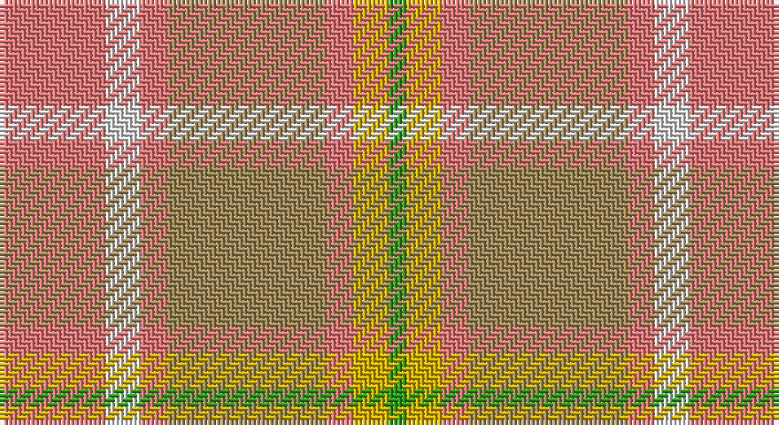

This page is one **sett** — a single exact thread-count. It belongs to the [tartan](/setts/r12w4r3lo18r3ly4g2/)
(the same proportion at any scale), whose colour order is pattern [GYRYRWR](/stripes/gyryrwr/).

Sourced from register-of-tartans.  It is a [7 stripe tartan](/stripes/stripes7/).

Original link https://www.tartanregister.gov.uk/tartanDetails.aspx?ref=1446

2 attestations — the source records this cloth was collapsed from (oldest owns this page)

<ul>
<li>01/01/1972 — Golden Pheasant (register-of-tartans, <a href="https://www.tartanregister.gov.uk/tartanDetails.aspx?ref=1446">record</a>)</li>
<li>pre 1972 — Golden Pheasant (Fashion) (tartans-authority, <a href="http://www.tartansauthority.com/tartan-ferret/display/5052/">record</a>)</li>
</ul>

## Register references

External register numbers recorded for this tartan.

- Scottish Register of Tartans: [1446](https://www.tartanregister.gov.uk/tartanDetails.aspx?ref=1446)
- Scottish Tartans Authority (ITI): 5052

## Thread count
LR/24 LN8 LR6 LT36 LR6 Y8 G/4

One full sett is **156 threads**.

## Palette

Palette: <strong>Tartan Register</strong> <small style="color:#888">(7 of 8 colours)</small>
<table><thead><tr><th>Colour</th><th>Threads</th><th>Shade</th><th>Base</th><th>OKLCh</th></tr></thead><tbody><tr><td>LR/</td><td style="text-align:right;font-variant-numeric:tabular-nums">24</td><td><code style="background-color:#E87878;">#E87878</code> <small style="color:#888">#E87878</small></td><td>R <code style="background-color:#CC0000;">#CC0000</code></td><td><small style="color:#888">oklch(70.0% 0.139 21.2)</small></td></tr><tr><td>LN</td><td style="text-align:right;font-variant-numeric:tabular-nums">8</td><td><code style="background-color:#E0E0E0;">#E0E0E0</code> <small style="color:#888">#E0E0E0</small></td><td>W <code style="background-color:#F7F7F7;">#F7F7F7</code></td><td><small style="color:#888">oklch(90.7% 0.000 89.9)</small></td></tr><tr><td>LR</td><td style="text-align:right;font-variant-numeric:tabular-nums">6</td><td><code style="background-color:#E87878;">#E87878</code> <small style="color:#888">#E87878</small></td><td>R <code style="background-color:#CC0000;">#CC0000</code></td><td><small style="color:#888">oklch(70.0% 0.139 21.2)</small></td></tr><tr><td>LT</td><td style="text-align:right;font-variant-numeric:tabular-nums">36</td><td><code style="background-color:#A08858;">#A08858</code> <small style="color:#888">#A08858</small></td><td>Y <code style="background-color:#F2BF00;">#F2BF00</code></td><td><small style="color:#888">oklch(63.7% 0.071 84.0)</small></td></tr><tr><td>LR</td><td style="text-align:right;font-variant-numeric:tabular-nums">6</td><td><code style="background-color:#E87878;">#E87878</code> <small style="color:#888">#E87878</small></td><td>R <code style="background-color:#CC0000;">#CC0000</code></td><td><small style="color:#888">oklch(70.0% 0.139 21.2)</small></td></tr><tr><td>Y</td><td style="text-align:right;font-variant-numeric:tabular-nums">8</td><td><code style="background-color:#D8B000;">#D8B000</code> <small style="color:#888">#D8B000</small></td><td>Y <code style="background-color:#F2BF00;">#F2BF00</code></td><td><small style="color:#888">oklch(77.1% 0.158 92.3)</small></td></tr><tr><td>G/</td><td style="text-align:right;font-variant-numeric:tabular-nums">4</td><td><code style="background-color:#289C18;">#289C18</code> <small style="color:#888">#289C18</small></td><td>G <code style="background-color:#006100;">#006100</code></td><td><small style="color:#888">oklch(60.6% 0.191 141.6)</small></td></tr></tbody></table>

# Sample pattern

## Nearest tartans

The nearest existing variants by ΔTartan distance, with this tartan at the top so the swatches line up against it.

ΔTartan

Tartan

Sett

—

<a href="/ttd/edit/#slug=r12w4r3lo18r3ly4g2~x2">Golden Pheasant</a> <a class="nn-out" href="/variants/s7/r12w4r3lo18r3ly4g2~x2/" title="open its dictionary page">↗</a>

1.51

<a href="/ttd/edit/#slug=w6lri27dr6o40lr44w8o4&amp;base=r12w4r3lo18r3ly4g2~x2">Susan G Komen 06</a> <a class="nn-out" href="/variants/s7/w6lri27dr6o40lr44w8o4/" title="open its dictionary page">↗</a>

1.61

<a href="/ttd/edit/#slug=o9oi9y9oii1t1oi9t1oii1~x4&amp;base=r12w4r3lo18r3ly4g2~x2">Jardine of Castlemilk Family Tartan</a> <a class="nn-out" href="/variants/s8/o9oi9y9oii1t1oi9t1oii1~x4/" title="open its dictionary page">↗</a>

1.72

<a href="/ttd/edit/#slug=oi24lo8dr2lo8dr2lo8o15g2~x2&amp;base=r12w4r3lo18r3ly4g2~x2">Unidentified from Winnipeg</a> <a class="nn-out" href="/variants/s8/oi24lo8dr2lo8dr2lo8o15g2~x2/" title="open its dictionary page">↗</a>

1.80

<a href="/ttd/edit/#slug=r2ly20o2ly2r3lo3r3loii6loi24ly2~x2&amp;base=r12w4r3lo18r3ly4g2~x2">Golden Heather, The</a> <a class="nn-out" href="/variants/s10/r2ly20o2ly2r3lo3r3loii6loi24ly2~x2/" title="open its dictionary page">↗</a>

1.83

<a href="/ttd/edit/#slug=r5lp2y24lr2y2lr2y6lr8r6lr8ly4~x2&amp;base=r12w4r3lo18r3ly4g2~x2">Tasmanian</a> <a class="nn-out" href="/variants/s11/r5lp2y24lr2y2lr2y6lr8r6lr8ly4~x2/" title="open its dictionary page">↗</a>

1.96

<a href="/ttd/edit/#slug=y10lo5y54lo2lb32loi54b4loi10&amp;base=r12w4r3lo18r3ly4g2~x2">Cladish</a> <a class="nn-out" href="/variants/s8/y10lo5y54lo2lb32loi54b4loi10/" title="open its dictionary page">↗</a>

1.98

<a href="/ttd/edit/#slug=lr2oi1r10o12oi10lr6r10oi1lr2~x2&amp;base=r12w4r3lo18r3ly4g2~x2">Unidentified, Sett</a> <a class="nn-out" href="/variants/s9/lr2oi1r10o12oi10lr6r10oi1lr2~x2/" title="open its dictionary page">↗</a>

2.04

<a href="/ttd/edit/#slug=y25w2t4lo7t4w2loi25w2t4lo7~x2&amp;base=r12w4r3lo18r3ly4g2~x2">O'Monaghan (Personal)</a> <a class="nn-out" href="/variants/s10/y25w2t4lo7t4w2loi25w2t4lo7~x2/" title="open its dictionary page">↗</a>

2.07

<a href="/ttd/edit/#slug=dy4lg11dy14o30r4~x2&amp;base=r12w4r3lo18r3ly4g2~x2">Trinity Bicycles</a> <a class="nn-out" href="/variants/s5/dy4lg11dy14o30r4~x2/" title="open its dictionary page">↗</a>

2.11

<a href="/ttd/edit/#slug=lr2m24lo14lr25lo14lr25ly20lr2~x2&amp;base=r12w4r3lo18r3ly4g2~x2">Froach's Grian</a> <a class="nn-out" href="/variants/s8/lr2m24lo14lr25lo14lr25ly20lr2~x2/" title="open its dictionary page">↗</a>

## Neighbour map

Every grey dot is one of 14360 variants placed by the first two principal components of the ΔTartan feature space (44% of its variance). Red is this tartan; blue dots are its nearest — click one to open its page.

<svg viewBox="0 0 640 380" role="img" style="max-width:100%;height:auto;border:1px solid #e0e0e0;border-radius:4px;display:block" xmlns="http://www.w3.org/2000/svg"><image href="/nn/cloud.v1.png" width="640" height="380"/><a href="/variants/s7/w6lri27dr6o40lr44w8o4/"><circle cx="218.6" cy="196.1" r="4" fill="#3465a4"><title>Susan G Komen 06</title></circle></a><a href="/variants/s8/o9oi9y9oii1t1oi9t1oii1~x4/"><circle cx="315.5" cy="241.3" r="4" fill="#3465a4"><title>Jardine of Castlemilk Family Tartan</title></circle></a><a href="/variants/s8/oi24lo8dr2lo8dr2lo8o15g2~x2/"><circle cx="229.9" cy="188.1" r="4" fill="#3465a4"><title>Unidentified from Winnipeg</title></circle></a><a href="/variants/s10/r2ly20o2ly2r3lo3r3loii6loi24ly2~x2/"><circle cx="252.0" cy="147.0" r="4" fill="#3465a4"><title>Golden Heather, The</title></circle></a><a href="/variants/s11/r5lp2y24lr2y2lr2y6lr8r6lr8ly4~x2/"><circle cx="292.5" cy="176.4" r="4" fill="#3465a4"><title>Tasmanian</title></circle></a><a href="/variants/s8/y10lo5y54lo2lb32loi54b4loi10/"><circle cx="321.2" cy="175.8" r="4" fill="#3465a4"><title>Cladish</title></circle></a><a href="/variants/s9/lr2oi1r10o12oi10lr6r10oi1lr2~x2/"><circle cx="260.4" cy="220.5" r="4" fill="#3465a4"><title>Unidentified, Sett</title></circle></a><a href="/variants/s10/y25w2t4lo7t4w2loi25w2t4lo7~x2/"><circle cx="212.2" cy="171.4" r="4" fill="#3465a4"><title>O'Monaghan (Personal)</title></circle></a><a href="/variants/s5/dy4lg11dy14o30r4~x2/"><circle cx="317.1" cy="270.9" r="4" fill="#3465a4"><title>Trinity Bicycles</title></circle></a><a href="/variants/s8/lr2m24lo14lr25lo14lr25ly20lr2~x2/"><circle cx="267.0" cy="245.3" r="4" fill="#3465a4"><title>Froach's Grian</title></circle></a><circle cx="282.9" cy="219.5" r="5" fill="#c00000"/></svg>

ID: /variants/s7/r12w4r3lo18r3ly4g2~x2/
