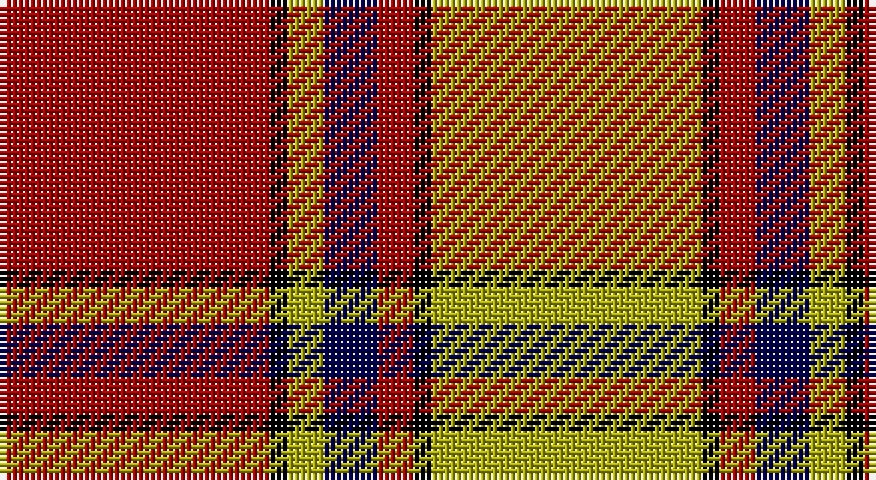

This page is one **sett** — a single exact thread-count. It belongs to the [tartan](/setts/r15k1ly2db3r2k1ly15/)
(the same proportion at any scale), whose colour order is pattern [RKYBRKY](/stripes/rkybrky/).

Part of the [Scrymgeour](/tartans/scrymgeour/) tartan — the named design grouping this sett with its other cloths.

Sourced from weddslist.  It is a [7 stripe tartan](/stripes/stripes7/).

Original link http://www.weddslist.com/cgi-bin/tartans/pg.pl?source=x

## Thread count
DR/45 K3 LG6 DB9 DR6 K3 LG/45

One full sett is **144 threads**.

## Palette

Palette: <strong>Ingles Buchan</strong> <small style="color:#888">(1 of 4 colours)</small>
<table><thead><tr><th>Colour</th><th>Threads</th><th>Shade</th><th>Base</th><th>OKLCh</th></tr></thead><tbody><tr><td>DR/</td><td style="text-align:right;font-variant-numeric:tabular-nums">45</td><td><code style="background-color:#AA0000;">#AA0000</code> <small style="color:#888">#AA0000</small></td><td>R <code style="background-color:#CC0000;">#CC0000</code></td><td><small style="color:#888">oklch(46.3% 0.190 29.2)</small></td></tr><tr><td>K</td><td style="text-align:right;font-variant-numeric:tabular-nums">3</td><td><code style="background-color:#000000;">#000000</code> <small style="color:#888">#000000</small></td><td>K <code style="background-color:#000000;">#000000</code></td><td><small style="color:#888">oklch(0.0% 0.000 0.0)</small></td></tr><tr><td>LG</td><td style="text-align:right;font-variant-numeric:tabular-nums">6</td><td><code style="background-color:#AAAA00;">#AAAA00</code> <small style="color:#888">#AAAA00</small></td><td>Y <code style="background-color:#F2BF00;">#F2BF00</code></td><td><small style="color:#888">oklch(71.4% 0.156 109.8)</small></td></tr><tr><td>DB</td><td style="text-align:right;font-variant-numeric:tabular-nums">9</td><td><code style="background-color:#000052;">#000052</code> <small style="color:#888">#000052</small></td><td>B <code style="background-color:#2A418A;">#2A418A</code></td><td><small style="color:#888">oklch(19.8% 0.137 264.1)</small></td></tr><tr><td>DR</td><td style="text-align:right;font-variant-numeric:tabular-nums">6</td><td><code style="background-color:#AA0000;">#AA0000</code> <small style="color:#888">#AA0000</small></td><td>R <code style="background-color:#CC0000;">#CC0000</code></td><td><small style="color:#888">oklch(46.3% 0.190 29.2)</small></td></tr><tr><td>K</td><td style="text-align:right;font-variant-numeric:tabular-nums">3</td><td><code style="background-color:#000000;">#000000</code> <small style="color:#888">#000000</small></td><td>K <code style="background-color:#000000;">#000000</code></td><td><small style="color:#888">oklch(0.0% 0.000 0.0)</small></td></tr><tr><td>LG/</td><td style="text-align:right;font-variant-numeric:tabular-nums">45</td><td><code style="background-color:#AAAA00;">#AAAA00</code> <small style="color:#888">#AAAA00</small></td><td>Y <code style="background-color:#F2BF00;">#F2BF00</code></td><td><small style="color:#888">oklch(71.4% 0.156 109.8)</small></td></tr></tbody></table>

# Sample pattern

## Compared to the master

This cloth is one sett of its design; the master sett (the exemplar the design is anchored on) is below for comparison.

<figure style="margin:0"><figcaption style="color:#888;font-size:smaller">this sett</figcaption></figure>
<figure style="margin:0"><figcaption style="color:#888;font-size:smaller"><a href="/setts/r15k1lo2g3r2k1lo15/">master sett →</a></figcaption></figure>

## Nearest tartans

The nearest existing variants by ΔTartan distance, with this tartan at the top so the swatches line up against it.

ΔTartan

Tartan

Sett

—

<a href="/ttd/edit/#slug=r15k1ly2db3r2k1ly15~x3">Scrymgeour</a> <a class="nn-out" href="/variants/s7/r15k1ly2db3r2k1ly15~x3/" title="open its dictionary page">↗</a>

0.00

<a href="/ttd/edit/#slug=r15k1ly2db3r2k1ly15~x6&amp;base=r15k1ly2db3r2k1ly15~x3">Scrymgeour</a> <a class="nn-out" href="/variants/s7/r15k1ly2db3r2k1ly15~x6/" title="open its dictionary page">↗</a>

0.67

<a href="/ttd/edit/#slug=o15k1ly2db3o2k1ly15~x4&amp;base=r15k1ly2db3r2k1ly15~x3">Scrymgeour Family Tartan</a> <a class="nn-out" href="/variants/s7/o15k1ly2db3o2k1ly15~x4/" title="open its dictionary page">↗</a>

0.81

<a href="/ttd/edit/#slug=g5ly5g5ly35ri44r3ri3~x2&amp;base=r15k1ly2db3r2k1ly15~x3">Fernandes (Personal)</a> <a class="nn-out" href="/variants/s7/g5ly5g5ly35ri44r3ri3~x2/" title="open its dictionary page">↗</a>

0.91

<a href="/ttd/edit/#slug=g18w3ly1r2ly1r3ly1r10~x4&amp;base=r15k1ly2db3r2k1ly15~x3">Brisbane (Artefact)</a> <a class="nn-out" href="/variants/s8/g18w3ly1r2ly1r3ly1r10~x4/" title="open its dictionary page">↗</a>

0.92

<a href="/ttd/edit/#slug=k2r4w1r10g12r2w2~x4&amp;base=r15k1ly2db3r2k1ly15~x3">Starr (1978) (Name)</a> <a class="nn-out" href="/variants/s7/k2r4w1r10g12r2w2~x4/" title="open its dictionary page">↗</a>

1.05

<a href="/ttd/edit/#slug=k1g6k1g6r16db1~x2&amp;base=r15k1ly2db3r2k1ly15~x3">Denny, hunting</a> <a class="nn-out" href="/variants/s6/k1g6k1g6r16db1~x2/" title="open its dictionary page">↗</a>

1.10

<a href="/ttd/edit/#slug=t1r1lo1k15lo15r1t1lo1~x4&amp;base=r15k1ly2db3r2k1ly15~x3">Pittsburgh St Andrew's Society</a> <a class="nn-out" href="/variants/s8/t1r1lo1k15lo15r1t1lo1~x4/" title="open its dictionary page">↗</a>

1.17

<a href="/ttd/edit/#slug=g18lb3ly1r2ly1r3ly1r10~x4&amp;base=r15k1ly2db3r2k1ly15~x3">Brisbane (Artefact)</a> <a class="nn-out" href="/variants/s8/g18lb3ly1r2ly1r3ly1r10~x4/" title="open its dictionary page">↗</a>

1.25

<a href="/ttd/edit/#slug=r46k3ly6db8r6k3ly46&amp;base=r15k1ly2db3r2k1ly15~x3">Scrymgeour</a> <a class="nn-out" href="/variants/s7/r46k3ly6db8r6k3ly46/" title="open its dictionary page">↗</a>

1.25

<a href="/ttd/edit/#slug=k2r16g6r3g8w1~x2&amp;base=r15k1ly2db3r2k1ly15~x3">MacAulay</a> <a class="nn-out" href="/variants/s6/k2r16g6r3g8w1~x2/" title="open its dictionary page">↗</a>

## Neighbour map

Every grey dot is one of 14360 variants placed by the first two principal components of the ΔTartan feature space (44% of its variance). Red is this tartan; blue dots are its nearest — click one to open its page.

<svg viewBox="0 0 640 380" role="img" style="max-width:100%;height:auto;border:1px solid #e0e0e0;border-radius:4px;display:block" xmlns="http://www.w3.org/2000/svg"><image href="/nn/cloud.v1.png" width="640" height="380"/><a href="/variants/s7/r15k1ly2db3r2k1ly15~x6/"><circle cx="265.9" cy="149.7" r="4" fill="#3465a4"><title>Scrymgeour</title></circle></a><a href="/variants/s7/o15k1ly2db3o2k1ly15~x4/"><circle cx="266.4" cy="146.3" r="4" fill="#3465a4"><title>Scrymgeour Family Tartan</title></circle></a><a href="/variants/s7/g5ly5g5ly35ri44r3ri3~x2/"><circle cx="283.3" cy="143.7" r="4" fill="#3465a4"><title>Fernandes (Personal)</title></circle></a><a href="/variants/s8/g18w3ly1r2ly1r3ly1r10~x4/"><circle cx="281.7" cy="138.5" r="4" fill="#3465a4"><title>Brisbane (Artefact)</title></circle></a><a href="/variants/s7/k2r4w1r10g12r2w2~x4/"><circle cx="263.8" cy="177.8" r="4" fill="#3465a4"><title>Starr (1978) (Name)</title></circle></a><a href="/variants/s6/k1g6k1g6r16db1~x2/"><circle cx="322.6" cy="169.9" r="4" fill="#3465a4"><title>Denny, hunting</title></circle></a><a href="/variants/s8/t1r1lo1k15lo15r1t1lo1~x4/"><circle cx="283.0" cy="129.6" r="4" fill="#3465a4"><title>Pittsburgh St Andrew's Society</title></circle></a><a href="/variants/s8/g18lb3ly1r2ly1r3ly1r10~x4/"><circle cx="296.9" cy="146.6" r="4" fill="#3465a4"><title>Brisbane (Artefact)</title></circle></a><a href="/variants/s7/r46k3ly6db8r6k3ly46/"><circle cx="261.4" cy="130.8" r="4" fill="#3465a4"><title>Scrymgeour</title></circle></a><a href="/variants/s6/k2r16g6r3g8w1~x2/"><circle cx="314.2" cy="181.6" r="4" fill="#3465a4"><title>MacAulay</title></circle></a><circle cx="265.9" cy="149.7" r="5" fill="#c00000"/></svg>

ID: /variants/s7/r15k1ly2db3r2k1ly15~x3/
