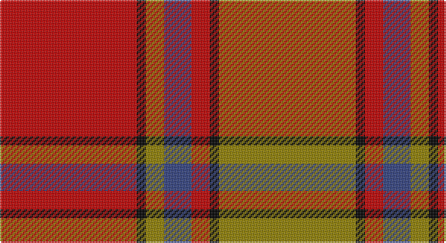

This page is one **sett** — a single exact thread-count. It belongs to the [tartan](/setts/r15k1y2db3r2k1y15/)
(the same proportion at any scale), whose colour order is pattern [GKRBGKR](/stripes/gkrbgkr/).

Sourced from weddslist.  It is a [7 stripe tartan](/stripes/stripes7/).

Original link http://www.weddslist.com/cgi-bin/tartans/pg.pl?source=sts

## Thread count
R/90 K6 LG12 B18 R12 K6 LG/90

One full sett is **288 threads**.

## Palette

Palette: <strong>Ingles Buchan</strong> <small style="color:#888">(1 of 4 colours)</small>
<table><thead><tr><th>Colour</th><th>Threads</th><th>Shade</th><th>Base</th><th>OKLCh</th></tr></thead><tbody><tr><td>R/</td><td style="text-align:right;font-variant-numeric:tabular-nums">90</td><td><code style="background-color:#C00000;">#C00000</code> <small style="color:#888">#C00000</small></td><td>R <code style="background-color:#CC0000;">#CC0000</code></td><td><small style="color:#888">oklch(50.7% 0.208 29.2)</small></td></tr><tr><td>K</td><td style="text-align:right;font-variant-numeric:tabular-nums">6</td><td><code style="background-color:#000000;">#000000</code> <small style="color:#888">#000000</small></td><td>K <code style="background-color:#000000;">#000000</code></td><td><small style="color:#888">oklch(0.0% 0.000 0.0)</small></td></tr><tr><td>LG</td><td style="text-align:right;font-variant-numeric:tabular-nums">12</td><td><code style="background-color:#908000;">#908000</code> <small style="color:#888">#908000</small></td><td>G <code style="background-color:#006100;">#006100</code></td><td><small style="color:#888">oklch(59.6% 0.124 100.6)</small></td></tr><tr><td>B</td><td style="text-align:right;font-variant-numeric:tabular-nums">18</td><td><code style="background-color:#304080;">#304080</code> <small style="color:#888">#304080</small></td><td>B <code style="background-color:#2A418A;">#2A418A</code></td><td><small style="color:#888">oklch(39.4% 0.109 270.2)</small></td></tr><tr><td>R</td><td style="text-align:right;font-variant-numeric:tabular-nums">12</td><td><code style="background-color:#C00000;">#C00000</code> <small style="color:#888">#C00000</small></td><td>R <code style="background-color:#CC0000;">#CC0000</code></td><td><small style="color:#888">oklch(50.7% 0.208 29.2)</small></td></tr><tr><td>K</td><td style="text-align:right;font-variant-numeric:tabular-nums">6</td><td><code style="background-color:#000000;">#000000</code> <small style="color:#888">#000000</small></td><td>K <code style="background-color:#000000;">#000000</code></td><td><small style="color:#888">oklch(0.0% 0.000 0.0)</small></td></tr><tr><td>LG/</td><td style="text-align:right;font-variant-numeric:tabular-nums">90</td><td><code style="background-color:#908000;">#908000</code> <small style="color:#888">#908000</small></td><td>G <code style="background-color:#006100;">#006100</code></td><td><small style="color:#888">oklch(59.6% 0.124 100.6)</small></td></tr></tbody></table>

# Sample pattern

## Nearest tartans

The nearest existing variants by ΔTartan distance, with this tartan at the top so the swatches line up against it.

ΔTartan

Tartan

Sett

—

<a href="/ttd/edit/#slug=r15k1y2db3r2k1y15~x6">Scrymgeour</a> <a class="nn-out" href="/variants/s7/r15k1y2db3r2k1y15~x6/" title="open its dictionary page">↗</a>

0.84

<a href="/ttd/edit/#slug=g28r7m7g14m7r48k4~x2&amp;base=r15k1y2db3r2k1y15~x6">MacNab 6</a> <a class="nn-out" href="/variants/s7/g28r7m7g14m7r48k4~x2/" title="open its dictionary page">↗</a>

0.89

<a href="/ttd/edit/#slug=g6r2ri2g4ri2r12k1~x2&amp;base=r15k1y2db3r2k1y15~x6">MacNab 5</a> <a class="nn-out" href="/variants/s7/g6r2ri2g4ri2r12k1~x2/" title="open its dictionary page">↗</a>

0.89

<a href="/ttd/edit/#slug=dg28r7m7dg14m7r48k4~x2&amp;base=r15k1y2db3r2k1y15~x6">MacNab (Crimson)</a> <a class="nn-out" href="/variants/s7/dg28r7m7dg14m7r48k4~x2/" title="open its dictionary page">↗</a>

0.90

<a href="/ttd/edit/#slug=r15k1lo2g3r2k1lo15~x6&amp;base=r15k1y2db3r2k1y15~x6">Scrymgeour (Clan)</a> <a class="nn-out" href="/variants/s7/r15k1lo2g3r2k1lo15~x6/" title="open its dictionary page">↗</a>

0.96

<a href="/ttd/edit/#slug=r2ri1r10ri2g10lr1g2~x4&amp;base=r15k1y2db3r2k1y15~x6">Lennox</a> <a class="nn-out" href="/variants/s7/r2ri1r10ri2g10lr1g2~x4/" title="open its dictionary page">↗</a>

1.02

<a href="/ttd/edit/#slug=dg6r2ri2dg4ri2r12k1~x2&amp;base=r15k1y2db3r2k1y15~x6">MacNab #3</a> <a class="nn-out" href="/variants/s7/dg6r2ri2dg4ri2r12k1~x2/" title="open its dictionary page">↗</a>

1.09

<a href="/ttd/edit/#slug=r2ri1r10ri2g10w1g2~x2&amp;base=r15k1y2db3r2k1y15~x6">Lennox</a> <a class="nn-out" href="/variants/s7/r2ri1r10ri2g10w1g2~x2/" title="open its dictionary page">↗</a>

1.14

<a href="/ttd/edit/#slug=db1r12g6ly1g6db1~x4&amp;base=r15k1y2db3r2k1y15~x6">Cetoloni (Personal)</a> <a class="nn-out" href="/variants/s6/db1r12g6ly1g6db1~x4/" title="open its dictionary page">↗</a>

1.14

<a href="/ttd/edit/#slug=r3g16r4k6r28g2lo3~x2&amp;base=r15k1y2db3r2k1y15~x6">McInally (Name)</a> <a class="nn-out" href="/variants/s7/r3g16r4k6r28g2lo3~x2/" title="open its dictionary page">↗</a>

1.19

<a href="/ttd/edit/#slug=r32t5g17r4g5w2~x2&amp;base=r15k1y2db3r2k1y15~x6">Wilson's, No 5</a> <a class="nn-out" href="/variants/s6/r32t5g17r4g5w2~x2/" title="open its dictionary page">↗</a>

## Neighbour map

Every grey dot is one of 14360 variants placed by the first two principal components of the ΔTartan feature space (44% of its variance). Red is this tartan; blue dots are its nearest — click one to open its page.

<svg viewBox="0 0 640 380" role="img" style="max-width:100%;height:auto;border:1px solid #e0e0e0;border-radius:4px;display:block" xmlns="http://www.w3.org/2000/svg"><image href="/nn/cloud.v1.png" width="640" height="380"/><a href="/variants/s7/g28r7m7g14m7r48k4~x2/"><circle cx="288.4" cy="187.6" r="4" fill="#3465a4"><title>MacNab 6</title></circle></a><a href="/variants/s7/g6r2ri2g4ri2r12k1~x2/"><circle cx="287.1" cy="191.1" r="4" fill="#3465a4"><title>MacNab 5</title></circle></a><a href="/variants/s7/dg28r7m7dg14m7r48k4~x2/"><circle cx="297.3" cy="188.5" r="4" fill="#3465a4"><title>MacNab (Crimson)</title></circle></a><a href="/variants/s7/r15k1lo2g3r2k1lo15~x6/"><circle cx="309.6" cy="161.7" r="4" fill="#3465a4"><title>Scrymgeour (Clan)</title></circle></a><a href="/variants/s7/r2ri1r10ri2g10lr1g2~x4/"><circle cx="284.3" cy="198.7" r="4" fill="#3465a4"><title>Lennox</title></circle></a><a href="/variants/s7/dg6r2ri2dg4ri2r12k1~x2/"><circle cx="296.9" cy="192.1" r="4" fill="#3465a4"><title>MacNab #3</title></circle></a><a href="/variants/s7/r2ri1r10ri2g10w1g2~x2/"><circle cx="269.2" cy="191.9" r="4" fill="#3465a4"><title>Lennox</title></circle></a><a href="/variants/s6/db1r12g6ly1g6db1~x4/"><circle cx="287.5" cy="198.5" r="4" fill="#3465a4"><title>Cetoloni (Personal)</title></circle></a><a href="/variants/s7/r3g16r4k6r28g2lo3~x2/"><circle cx="344.4" cy="171.9" r="4" fill="#3465a4"><title>McInally (Name)</title></circle></a><a href="/variants/s6/r32t5g17r4g5w2~x2/"><circle cx="351.4" cy="178.2" r="4" fill="#3465a4"><title>Wilson's, No 5</title></circle></a><circle cx="304.7" cy="166.9" r="5" fill="#c00000"/></svg>

ID: /variants/s7/r15k1y2db3r2k1y15~x6/
