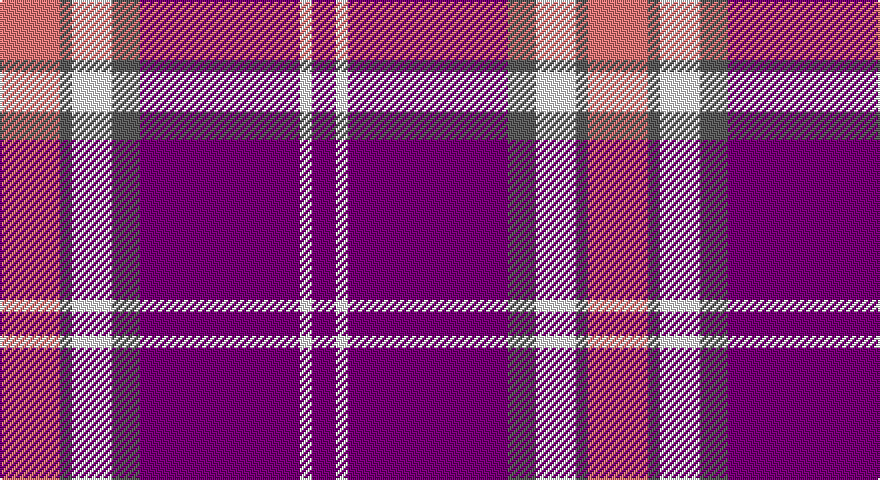

This page is one **sett** — a single exact thread-count. It belongs to the [tartan](/setts/r15n3w10n7dp40w3dp6/)
(the same proportion at any scale), whose colour order is pattern [BWBBWBR](/stripes/bwbbwbr/).

Part of the [Loughborough Sport](/tartans/loughborough-sport/) tartan — the named design grouping this sett with its other cloths.

Sourced from tartans-authority.  It is a [7 stripe tartan](/stripes/stripes7/).

Original link http://www.tartansauthority.com/tartan-ferret/display/11089/

## Register references

External register numbers recorded for this tartan.

- Scottish Register of Tartans: [11089](https://www.tartanregister.gov.uk/tartanDetails?ref=11089)
- Scottish Tartans Authority (ITI): 11089

## Thread count
LR/30 N6 W20 N14 P80 W6 P/12

One full sett is **294 threads**.

## Palette

Palette: <strong>Tartan Register</strong> <small style="color:#888">(3 of 4 colours)</small>
<table><thead><tr><th>Colour</th><th>Threads</th><th>Shade</th><th>Base</th><th>OKLCh</th></tr></thead><tbody><tr><td>LR/</td><td style="text-align:right;font-variant-numeric:tabular-nums">30</td><td><code style="background-color:#E87878;">#E87878</code> <small style="color:#888">#E87878</small></td><td>R <code style="background-color:#CC0000;">#CC0000</code></td><td><small style="color:#888">oklch(70.0% 0.139 21.2)</small></td></tr><tr><td>N</td><td style="text-align:right;font-variant-numeric:tabular-nums">6</td><td><code style="background-color:#5C5C5C;">#5C5C5C</code> <small style="color:#888">#5C5C5C</small></td><td>B <code style="background-color:#2A418A;">#2A418A</code></td><td><small style="color:#888">oklch(47.5% 0.000 89.9)</small></td></tr><tr><td>W</td><td style="text-align:right;font-variant-numeric:tabular-nums">20</td><td><code style="background-color:#FCFCFC;">#FCFCFC</code> <small style="color:#888">#FCFCFC</small></td><td>W <code style="background-color:#F7F7F7;">#F7F7F7</code></td><td><small style="color:#888">oklch(99.1% 0.000 89.9)</small></td></tr><tr><td>N</td><td style="text-align:right;font-variant-numeric:tabular-nums">14</td><td><code style="background-color:#5C5C5C;">#5C5C5C</code> <small style="color:#888">#5C5C5C</small></td><td>B <code style="background-color:#2A418A;">#2A418A</code></td><td><small style="color:#888">oklch(47.5% 0.000 89.9)</small></td></tr><tr><td>P</td><td style="text-align:right;font-variant-numeric:tabular-nums">80</td><td><code style="background-color:#780078;">#780078</code> <small style="color:#888">#780078</small></td><td>B <code style="background-color:#2A418A;">#2A418A</code></td><td><small style="color:#888">oklch(40.2% 0.185 328.4)</small></td></tr><tr><td>W</td><td style="text-align:right;font-variant-numeric:tabular-nums">6</td><td><code style="background-color:#FCFCFC;">#FCFCFC</code> <small style="color:#888">#FCFCFC</small></td><td>W <code style="background-color:#F7F7F7;">#F7F7F7</code></td><td><small style="color:#888">oklch(99.1% 0.000 89.9)</small></td></tr><tr><td>P/</td><td style="text-align:right;font-variant-numeric:tabular-nums">12</td><td><code style="background-color:#780078;">#780078</code> <small style="color:#888">#780078</small></td><td>B <code style="background-color:#2A418A;">#2A418A</code></td><td><small style="color:#888">oklch(40.2% 0.185 328.4)</small></td></tr></tbody></table>

# Sample pattern

## Compared to the master

This cloth is one sett of its design; the master sett (the exemplar the design is anchored on) is below for comparison.

<figure style="margin:0"><figcaption style="color:#888;font-size:smaller">this sett</figcaption></figure>
<figure style="margin:0"><figcaption style="color:#888;font-size:smaller"><a href="/setts/k15n3w10n7dp40w3dp6/">master sett →</a></figcaption></figure>

## Nearest tartans

The nearest existing variants by ΔTartan distance, with this tartan at the top so the swatches line up against it.

ΔTartan

Tartan

Sett

—

<a href="/ttd/edit/#slug=r15n3w10n7dp40w3dp6~x2">Loughborough Sport</a> <a class="nn-out" href="/variants/s7/r15n3w10n7dp40w3dp6~x2/" title="open its dictionary page">↗</a>

1.18

<a href="/ttd/edit/#slug=k4b32r30b2w5k2~x2&amp;base=r15n3w10n7dp40w3dp6~x2">Masai Shuka 17 (Artefact)</a> <a class="nn-out" href="/variants/s6/k4b32r30b2w5k2~x2/" title="open its dictionary page">↗</a>

1.18

<a href="/ttd/edit/#slug=m3dg8m3db8m20w2m2~x4&amp;base=r15n3w10n7dp40w3dp6~x2">Unnamed C21st (Lady's Jacket) (Fash)</a> <a class="nn-out" href="/variants/s7/m3dg8m3db8m20w2m2~x4/" title="open its dictionary page">↗</a>

1.25

<a href="/ttd/edit/#slug=p42db2w2db2p5b12w32p4~x2&amp;base=r15n3w10n7dp40w3dp6~x2">Longniddry, dress</a> <a class="nn-out" href="/variants/s8/p42db2w2db2p5b12w32p4~x2/" title="open its dictionary page">↗</a>

1.28

<a href="/ttd/edit/#slug=dp24k4lb10db3dp3w2~x2&amp;base=r15n3w10n7dp40w3dp6~x2">Cramer (Personal)</a> <a class="nn-out" href="/variants/s6/dp24k4lb10db3dp3w2~x2/" title="open its dictionary page">↗</a>

1.36

<a href="/ttd/edit/#slug=dp42db2w2db2dp5t12w32dp4~x2&amp;base=r15n3w10n7dp40w3dp6~x2">Longniddry Dress District Tartan</a> <a class="nn-out" href="/variants/s8/dp42db2w2db2dp5t12w32dp4~x2/" title="open its dictionary page">↗</a>

1.38

<a href="/ttd/edit/#slug=dp42lb2w2lb2dp5t12w32dp4~x2&amp;base=r15n3w10n7dp40w3dp6~x2">Longniddry Dress (Dance)</a> <a class="nn-out" href="/variants/s8/dp42lb2w2lb2dp5t12w32dp4~x2/" title="open its dictionary page">↗</a>

1.47

<a href="/ttd/edit/#slug=dp8db2dp24db5w26k2w8~x2&amp;base=r15n3w10n7dp40w3dp6~x2">Lennox Purple Dress District Tartan</a> <a class="nn-out" href="/variants/s7/dp8db2dp24db5w26k2w8~x2/" title="open its dictionary page">↗</a>

1.49

<a href="/ttd/edit/#slug=k3r11db3w1db3w1~x4&amp;base=r15n3w10n7dp40w3dp6~x2">Suntan (Masai Shuka) (District?)</a> <a class="nn-out" href="/variants/s6/k3r11db3w1db3w1~x4/" title="open its dictionary page">↗</a>

1.53

<a href="/ttd/edit/#slug=g3r2db22r22db2w3~x2&amp;base=r15n3w10n7dp40w3dp6~x2">Galloway Red</a> <a class="nn-out" href="/variants/s6/g3r2db22r22db2w3~x2/" title="open its dictionary page">↗</a>

1.53

<a href="/ttd/edit/#slug=k2w3dp5lo4w3lo4dp25lo2~x2&amp;base=r15n3w10n7dp40w3dp6~x2">Western Illinois University</a> <a class="nn-out" href="/variants/s8/k2w3dp5lo4w3lo4dp25lo2~x2/" title="open its dictionary page">↗</a>

## Neighbour map

Every grey dot is one of 14360 variants placed by the first two principal components of the ΔTartan feature space (44% of its variance). Red is this tartan; blue dots are its nearest — click one to open its page.

<svg viewBox="0 0 640 380" role="img" style="max-width:100%;height:auto;border:1px solid #e0e0e0;border-radius:4px;display:block" xmlns="http://www.w3.org/2000/svg"><image href="/nn/cloud.v1.png" width="640" height="380"/><a href="/variants/s6/k4b32r30b2w5k2~x2/"><circle cx="284.0" cy="163.1" r="4" fill="#3465a4"><title>Masai Shuka 17 (Artefact)</title></circle></a><a href="/variants/s7/m3dg8m3db8m20w2m2~x4/"><circle cx="333.4" cy="186.0" r="4" fill="#3465a4"><title>Unnamed C21st (Lady's Jacket) (Fash)</title></circle></a><a href="/variants/s8/p42db2w2db2p5b12w32p4~x2/"><circle cx="296.5" cy="122.5" r="4" fill="#3465a4"><title>Longniddry, dress</title></circle></a><a href="/variants/s6/dp24k4lb10db3dp3w2~x2/"><circle cx="298.1" cy="156.8" r="4" fill="#3465a4"><title>Cramer (Personal)</title></circle></a><a href="/variants/s8/dp42db2w2db2dp5t12w32dp4~x2/"><circle cx="291.5" cy="123.1" r="4" fill="#3465a4"><title>Longniddry Dress District Tartan</title></circle></a><a href="/variants/s8/dp42lb2w2lb2dp5t12w32dp4~x2/"><circle cx="291.8" cy="122.4" r="4" fill="#3465a4"><title>Longniddry Dress (Dance)</title></circle></a><a href="/variants/s7/dp8db2dp24db5w26k2w8~x2/"><circle cx="236.7" cy="160.9" r="4" fill="#3465a4"><title>Lennox Purple Dress District Tartan</title></circle></a><a href="/variants/s6/k3r11db3w1db3w1~x4/"><circle cx="264.9" cy="178.8" r="4" fill="#3465a4"><title>Suntan (Masai Shuka) (District?)</title></circle></a><a href="/variants/s6/g3r2db22r22db2w3~x2/"><circle cx="276.5" cy="179.6" r="4" fill="#3465a4"><title>Galloway Red</title></circle></a><a href="/variants/s8/k2w3dp5lo4w3lo4dp25lo2~x2/"><circle cx="335.7" cy="141.4" r="4" fill="#3465a4"><title>Western Illinois University</title></circle></a><circle cx="290.5" cy="155.0" r="5" fill="#c00000"/></svg>

ID: /variants/s7/r15n3w10n7dp40w3dp6~x2/
