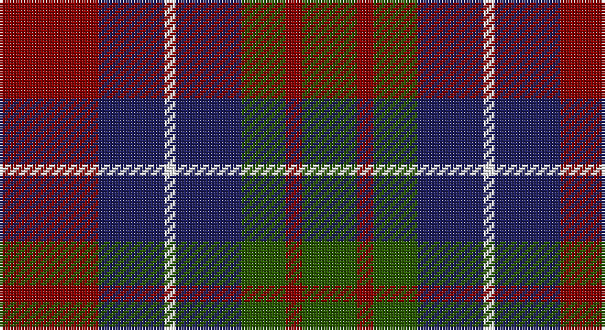

This page is one **sett** — a single exact thread-count. It belongs to the [tartan](/setts/r18db12w2db12dg8r3dg10/)
(the same proportion at any scale), whose colour order is pattern [GRGBWBR](/stripes/grgbwbr/).

Part of the [Brough](/tartans/brough/) tartan — the named design grouping this sett with its other cloths.

Sourced from tartans-authority.  It is a [7 stripe tartan](/stripes/stripes7/).

Original link http://www.tartansauthority.com/tartan-ferret/display/2233/

2 attestations — the source records this cloth was collapsed from (oldest owns this page)

<ul>
<li>pre 1992 — Brough (Name) (tartans-authority, <a href="http://www.tartansauthority.com/tartan-ferret/display/2233/">record</a>)</li>
<li>undated — Brough (Personal) (register-of-tartans, <a href="https://www.tartanregister.gov.uk/tartanDetails.aspx?ref=389">record</a>)</li>
</ul>

## Register references

External register numbers recorded for this tartan.

- Scottish Register of Tartans: [389](https://www.tartanregister.gov.uk/tartanDetails.aspx?ref=389)
- Scottish Tartans Authority (ITI): 2233
- Scottish Tartans World Register: 2233

## Thread count
DR/36 DB24 W4 DB24 G16 DR6 G/20

One full sett is **204 threads**.

## Palette

Palette: <strong>Tartan Register</strong>
<table><thead><tr><th>Colour</th><th>Threads</th><th>Shade</th><th>Base</th><th>OKLCh</th></tr></thead><tbody><tr><td>DR/</td><td style="text-align:right;font-variant-numeric:tabular-nums">36</td><td><code style="background-color:#880000;">#880000</code> <small style="color:#888">#880000</small></td><td>R <code style="background-color:#CC0000;">#CC0000</code></td><td><small style="color:#888">oklch(39.4% 0.162 29.2)</small></td></tr><tr><td>DB</td><td style="text-align:right;font-variant-numeric:tabular-nums">24</td><td><code style="background-color:#202060;">#202060</code> <small style="color:#888">#202060</small></td><td>B <code style="background-color:#2A418A;">#2A418A</code></td><td><small style="color:#888">oklch(28.9% 0.111 276.9)</small></td></tr><tr><td>W</td><td style="text-align:right;font-variant-numeric:tabular-nums">4</td><td><code style="background-color:#FCFCFC;">#FCFCFC</code> <small style="color:#888">#FCFCFC</small></td><td>W <code style="background-color:#F7F7F7;">#F7F7F7</code></td><td><small style="color:#888">oklch(99.1% 0.000 89.9)</small></td></tr><tr><td>DB</td><td style="text-align:right;font-variant-numeric:tabular-nums">24</td><td><code style="background-color:#202060;">#202060</code> <small style="color:#888">#202060</small></td><td>B <code style="background-color:#2A418A;">#2A418A</code></td><td><small style="color:#888">oklch(28.9% 0.111 276.9)</small></td></tr><tr><td>G</td><td style="text-align:right;font-variant-numeric:tabular-nums">16</td><td><code style="background-color:#285800;">#285800</code> <small style="color:#888">#285800</small></td><td>G <code style="background-color:#006100;">#006100</code></td><td><small style="color:#888">oklch(41.0% 0.122 135.8)</small></td></tr><tr><td>DR</td><td style="text-align:right;font-variant-numeric:tabular-nums">6</td><td><code style="background-color:#880000;">#880000</code> <small style="color:#888">#880000</small></td><td>R <code style="background-color:#CC0000;">#CC0000</code></td><td><small style="color:#888">oklch(39.4% 0.162 29.2)</small></td></tr><tr><td>G/</td><td style="text-align:right;font-variant-numeric:tabular-nums">20</td><td><code style="background-color:#285800;">#285800</code> <small style="color:#888">#285800</small></td><td>G <code style="background-color:#006100;">#006100</code></td><td><small style="color:#888">oklch(41.0% 0.122 135.8)</small></td></tr></tbody></table>

# Sample pattern

## Nearest tartans

The nearest existing variants by ΔTartan distance, with this tartan at the top so the swatches line up against it.

ΔTartan

Tartan

Sett

—

<a href="/ttd/edit/#slug=r18db12w2db12dg8r3dg10~x2">Brough (Name)</a> <a class="nn-out" href="/variants/s7/r18db12w2db12dg8r3dg10~x2/" title="open its dictionary page">↗</a>

0.99

<a href="/ttd/edit/#slug=r33dg17db50dg17r11dg17r9k7&amp;base=r18db12w2db12dg8r3dg10~x2">Carnegie #3</a> <a class="nn-out" href="/variants/s8/r33dg17db50dg17r11dg17r9k7/" title="open its dictionary page">↗</a>

1.01

<a href="/ttd/edit/#slug=db7r3g7r1g7r3db7t1~x2&amp;base=r18db12w2db12dg8r3dg10~x2">Hebrides #8</a> <a class="nn-out" href="/variants/s8/db7r3g7r1g7r3db7t1~x2/" title="open its dictionary page">↗</a>

1.14

<a href="/ttd/edit/#slug=dg12k2r12k3o12k16o12k3r6~x2&amp;base=r18db12w2db12dg8r3dg10~x2">Borthwick</a> <a class="nn-out" href="/variants/s9/dg12k2r12k3o12k16o12k3r6~x2/" title="open its dictionary page">↗</a>

1.16

<a href="/ttd/edit/#slug=dp9k7dg5r4dg7k1ly1~x2&amp;base=r18db12w2db12dg8r3dg10~x2">MacLaren #2</a> <a class="nn-out" href="/variants/s7/dp9k7dg5r4dg7k1ly1~x2/" title="open its dictionary page">↗</a>

1.17

<a href="/ttd/edit/#slug=g8t1g1k6dp6k1dp3~x4&amp;base=r18db12w2db12dg8r3dg10~x2">Unnamed 19th Century Plaid</a> <a class="nn-out" href="/variants/s7/g8t1g1k6dp6k1dp3~x4/" title="open its dictionary page">↗</a>

1.18

<a href="/ttd/edit/#slug=dg24k4dg24k24t7r24t7~x2&amp;base=r18db12w2db12dg8r3dg10~x2">Unidentified Pinafore</a> <a class="nn-out" href="/variants/s7/dg24k4dg24k24t7r24t7~x2/" title="open its dictionary page">↗</a>

1.19

<a href="/variants/s10/g19t2g4k13dp12k3~x2/">Wilson's No.150</a>

1.22

<a href="/ttd/edit/#slug=db9r24dg24k24db24ly2db9&amp;base=r18db12w2db12dg8r3dg10~x2">Dundas</a> <a class="nn-out" href="/variants/s7/db9r24dg24k24db24ly2db9/" title="open its dictionary page">↗</a>

1.22

<a href="/ttd/edit/#slug=g12k2m12k3o12k16o12k3m6~x2&amp;base=r18db12w2db12dg8r3dg10~x2">Borthwick Family Tartan</a> <a class="nn-out" href="/variants/s9/g12k2m12k3o12k16o12k3m6~x2/" title="open its dictionary page">↗</a>

1.24

<a href="/ttd/edit/#slug=r2dy8db2t4k4t1~x6&amp;base=r18db12w2db12dg8r3dg10~x2">Thompson's Fancy Personal Tartan</a> <a class="nn-out" href="/variants/s6/r2dy8db2t4k4t1~x6/" title="open its dictionary page">↗</a>

## Neighbour map

Every grey dot is one of 14360 variants placed by the first two principal components of the ΔTartan feature space (44% of its variance). Red is this tartan; blue dots are its nearest — click one to open its page.

<svg viewBox="0 0 640 380" role="img" style="max-width:100%;height:auto;border:1px solid #e0e0e0;border-radius:4px;display:block" xmlns="http://www.w3.org/2000/svg"><image href="/nn/cloud.v1.png" width="640" height="380"/><a href="/variants/s8/r33dg17db50dg17r11dg17r9k7/"><circle cx="171.6" cy="227.1" r="4" fill="#3465a4"><title>Carnegie #3</title></circle></a><a href="/variants/s8/db7r3g7r1g7r3db7t1~x2/"><circle cx="193.5" cy="248.2" r="4" fill="#3465a4"><title>Hebrides #8</title></circle></a><a href="/variants/s9/dg12k2r12k3o12k16o12k3r6~x2/"><circle cx="127.8" cy="226.4" r="4" fill="#3465a4"><title>Borthwick</title></circle></a><a href="/variants/s7/dp9k7dg5r4dg7k1ly1~x2/"><circle cx="143.5" cy="222.2" r="4" fill="#3465a4"><title>MacLaren #2</title></circle></a><a href="/variants/s7/g8t1g1k6dp6k1dp3~x4/"><circle cx="203.2" cy="242.9" r="4" fill="#3465a4"><title>Unnamed 19th Century Plaid</title></circle></a><a href="/variants/s7/dg24k4dg24k24t7r24t7~x2/"><circle cx="192.4" cy="269.9" r="4" fill="#3465a4"><title>Unidentified Pinafore</title></circle></a><a href="/variants/s10/g19t2g4k13dp12k3~x2/"><circle cx="179.4" cy="214.8" r="4" fill="#3465a4"><title>Wilson's No.150</title></circle></a><a href="/variants/s7/db9r24dg24k24db24ly2db9/"><circle cx="148.0" cy="216.1" r="4" fill="#3465a4"><title>Dundas</title></circle></a><a href="/variants/s9/g12k2m12k3o12k16o12k3m6~x2/"><circle cx="124.0" cy="223.8" r="4" fill="#3465a4"><title>Borthwick Family Tartan</title></circle></a><a href="/variants/s6/r2dy8db2t4k4t1~x6/"><circle cx="163.1" cy="226.4" r="4" fill="#3465a4"><title>Thompson's Fancy Personal Tartan</title></circle></a><circle cx="194.9" cy="247.2" r="5" fill="#c00000"/></svg>

ID: /variants/s7/r18db12w2db12dg8r3dg10~x2/
