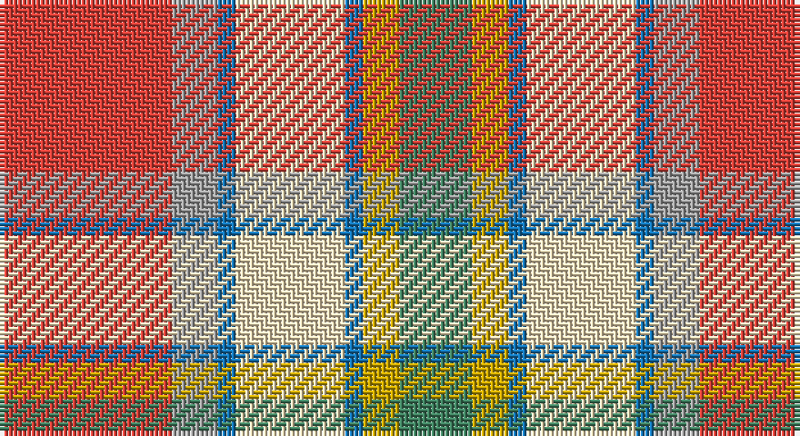

This page is one **sett** — a single exact thread-count. It belongs to the [tartan](/setts/r19lr5b2w12b2ly4g8/)
(the same proportion at any scale), whose colour order is pattern [GYBWBYR](/stripes/gybwbyr/).

Part of the [Northern Ontario](/tartans/northern-ontario/) tartan — the named design grouping this sett with its other cloths.

Sourced from tartans-authority.  It is a [7 stripe tartan](/stripes/stripes7/).

Original link http://www.tartansauthority.com/tartan-ferret/display/956/

## Also known as

This cloth is also recorded under:

- Ontario, Northern

2 attestations — the source records this cloth was collapsed from (oldest owns this page)

<ul>
<li>1959 — Northern Ontario (District) (tartans-authority, <a href="http://www.tartansauthority.com/tartan-ferret/display/956/">record</a>)</li>
<li>01/01/2002 — Ontario, Northern (register-of-tartans, <a href="https://www.tartanregister.gov.uk/tartanDetails.aspx?ref=3255">record</a>)</li>
</ul>

## Register references

External register numbers recorded for this tartan.

- Scottish Register of Tartans: [3255](https://www.tartanregister.gov.uk/tartanDetails.aspx?ref=3255)
- Scottish Tartans Authority (ITI): 956
- Scottish Tartans World Register: 956

## Thread count
R/38 N10 B4 W24 B4 DY8 G/16

One full sett is **154 threads**.

## Palette

Palette: <strong>Tartan Register</strong> <small style="color:#888">(3 of 6 colours)</small>
<table><thead><tr><th>Colour</th><th>Threads</th><th>Shade</th><th>Base</th><th>OKLCh</th></tr></thead><tbody><tr><td>R/</td><td style="text-align:right;font-variant-numeric:tabular-nums">38</td><td><code style="background-color:#DC4038;">#DC4038</code> <small style="color:#888">#DC4038</small></td><td>R <code style="background-color:#CC0000;">#CC0000</code></td><td><small style="color:#888">oklch(60.0% 0.194 27.6)</small></td></tr><tr><td>N</td><td style="text-align:right;font-variant-numeric:tabular-nums">10</td><td><code style="background-color:#A0A0A0;">#A0A0A0</code> <small style="color:#888">#A0A0A0</small></td><td>Y <code style="background-color:#F2BF00;">#F2BF00</code></td><td><small style="color:#888">oklch(70.6% 0.000 89.9)</small></td></tr><tr><td>B</td><td style="text-align:right;font-variant-numeric:tabular-nums">4</td><td><code style="background-color:#1474B4;">#1474B4</code> <small style="color:#888">#1474B4</small></td><td>B <code style="background-color:#2A418A;">#2A418A</code></td><td><small style="color:#888">oklch(54.0% 0.129 245.1)</small></td></tr><tr><td>W</td><td style="text-align:right;font-variant-numeric:tabular-nums">24</td><td><code style="background-color:#F8E4BC;">#F8E4BC</code> <small style="color:#888">#F8E4BC</small></td><td>W <code style="background-color:#F7F7F7;">#F7F7F7</code></td><td><small style="color:#888">oklch(92.5% 0.057 84.5)</small></td></tr><tr><td>B</td><td style="text-align:right;font-variant-numeric:tabular-nums">4</td><td><code style="background-color:#1474B4;">#1474B4</code> <small style="color:#888">#1474B4</small></td><td>B <code style="background-color:#2A418A;">#2A418A</code></td><td><small style="color:#888">oklch(54.0% 0.129 245.1)</small></td></tr><tr><td>DY</td><td style="text-align:right;font-variant-numeric:tabular-nums">8</td><td><code style="background-color:#C8A400;">#C8A400</code> <small style="color:#888">#C8A400</small></td><td>Y <code style="background-color:#F2BF00;">#F2BF00</code></td><td><small style="color:#888">oklch(73.0% 0.149 93.0)</small></td></tr><tr><td>G/</td><td style="text-align:right;font-variant-numeric:tabular-nums">16</td><td><code style="background-color:#408060;">#408060</code> <small style="color:#888">#408060</small></td><td>G <code style="background-color:#006100;">#006100</code></td><td><small style="color:#888">oklch(54.8% 0.084 160.1)</small></td></tr></tbody></table>

# Sample pattern

## Compared to the master

This cloth is one sett of its design; the master sett (the exemplar the design is anchored on) is below for comparison.

<figure style="margin:0"><figcaption style="color:#888;font-size:smaller">this sett</figcaption></figure>
<figure style="margin:0"><figcaption style="color:#888;font-size:smaller"><a href="/setts/dy17g5db2w12db2ly4g7/">master sett →</a></figcaption></figure>

## Nearest tartans

The nearest existing variants by ΔTartan distance, with this tartan at the top so the swatches line up against it.

ΔTartan

Tartan

Sett

—

<a href="/ttd/edit/#slug=r19lr5b2w12b2ly4g8~x2">Northern Ontario (District)</a> <a class="nn-out" href="/variants/s7/r19lr5b2w12b2ly4g8~x2/" title="open its dictionary page">↗</a>

1.13

<a href="/ttd/edit/#slug=r10n3db1lb8db1lo2g5~x4&amp;base=r19lr5b2w12b2ly4g8~x2">Porcupine City of</a> <a class="nn-out" href="/variants/s7/r10n3db1lb8db1lo2g5~x4/" title="open its dictionary page">↗</a>

1.30

<a href="/ttd/edit/#slug=w5r25t18g4k2ly5~x2&amp;base=r19lr5b2w12b2ly4g8~x2">Christie (London) (Personal)</a> <a class="nn-out" href="/variants/s6/w5r25t18g4k2ly5~x2/" title="open its dictionary page">↗</a>

1.40

<a href="/ttd/edit/#slug=o17y5db2w12db2ly4g7~x2&amp;base=r19lr5b2w12b2ly4g8~x2">Ontario, Northern</a> <a class="nn-out" href="/variants/s7/o17y5db2w12db2ly4g7~x2/" title="open its dictionary page">↗</a>

1.42

<a href="/ttd/edit/#slug=lo13b8r5k3w2g1~x4&amp;base=r19lr5b2w12b2ly4g8~x2">Ball</a> <a class="nn-out" href="/variants/s6/lo13b8r5k3w2g1~x4/" title="open its dictionary page">↗</a>

1.48

<a href="/ttd/edit/#slug=o4do2o21db11w2oi20r3~x2&amp;base=r19lr5b2w12b2ly4g8~x2">Barbour Dress</a> <a class="nn-out" href="/variants/s7/o4do2o21db11w2oi20r3~x2/" title="open its dictionary page">↗</a>

1.50

<a href="/ttd/edit/#slug=dy18ly4t10w2r20ly5r2w2dy6~x2&amp;base=r19lr5b2w12b2ly4g8~x2">Satchidananda (Personal)</a> <a class="nn-out" href="/variants/s9/dy18ly4t10w2r20ly5r2w2dy6~x2/" title="open its dictionary page">↗</a>

1.52

<a href="/ttd/edit/#slug=w2ri8o5ly6w5g21w6ri8r4w2&amp;base=r19lr5b2w12b2ly4g8~x2">Jacobite, Silk sash</a> <a class="nn-out" href="/variants/s10/w2ri8o5ly6w5g21w6ri8r4w2/" title="open its dictionary page">↗</a>

1.54

<a href="/ttd/edit/#slug=loi22ly22dr2lb6dr2lo2dr16lg5loi8lb2~x2&amp;base=r19lr5b2w12b2ly4g8~x2">Bruce of Kinnaird (Fashion)</a> <a class="nn-out" href="/variants/s10/loi22ly22dr2lb6dr2lo2dr16lg5loi8lb2~x2/" title="open its dictionary page">↗</a>

1.57

<a href="/ttd/edit/#slug=t4dy27lr8k4lr8k4lr8r11ly3~x2&amp;base=r19lr5b2w12b2ly4g8~x2">Brittany Hunting French Fancy Tartan</a> <a class="nn-out" href="/variants/s9/t4dy27lr8k4lr8k4lr8r11ly3~x2/" title="open its dictionary page">↗</a>

1.58

<a href="/ttd/edit/#slug=r1w12g6r8t3ly1~x4&amp;base=r19lr5b2w12b2ly4g8~x2">MacLean, dress</a> <a class="nn-out" href="/variants/s6/r1w12g6r8t3ly1~x4/" title="open its dictionary page">↗</a>

## Neighbour map

Every grey dot is one of 14360 variants placed by the first two principal components of the ΔTartan feature space (44% of its variance). Red is this tartan; blue dots are its nearest — click one to open its page.

<svg viewBox="0 0 640 380" role="img" style="max-width:100%;height:auto;border:1px solid #e0e0e0;border-radius:4px;display:block" xmlns="http://www.w3.org/2000/svg"><image href="/nn/cloud.v1.png" width="640" height="380"/><a href="/variants/s7/r10n3db1lb8db1lo2g5~x4/"><circle cx="115.9" cy="164.2" r="4" fill="#3465a4"><title>Porcupine City of</title></circle></a><a href="/variants/s6/w5r25t18g4k2ly5~x2/"><circle cx="188.7" cy="148.9" r="4" fill="#3465a4"><title>Christie (London) (Personal)</title></circle></a><a href="/variants/s7/o17y5db2w12db2ly4g7~x2/"><circle cx="104.5" cy="174.6" r="4" fill="#3465a4"><title>Ontario, Northern</title></circle></a><a href="/variants/s6/lo13b8r5k3w2g1~x4/"><circle cx="150.2" cy="152.2" r="4" fill="#3465a4"><title>Ball</title></circle></a><a href="/variants/s7/o4do2o21db11w2oi20r3~x2/"><circle cx="189.2" cy="168.1" r="4" fill="#3465a4"><title>Barbour Dress</title></circle></a><a href="/variants/s9/dy18ly4t10w2r20ly5r2w2dy6~x2/"><circle cx="151.5" cy="154.7" r="4" fill="#3465a4"><title>Satchidananda (Personal)</title></circle></a><a href="/variants/s10/w2ri8o5ly6w5g21w6ri8r4w2/"><circle cx="88.7" cy="138.8" r="4" fill="#3465a4"><title>Jacobite, Silk sash</title></circle></a><a href="/variants/s10/loi22ly22dr2lb6dr2lo2dr16lg5loi8lb2~x2/"><circle cx="131.9" cy="134.8" r="4" fill="#3465a4"><title>Bruce of Kinnaird (Fashion)</title></circle></a><a href="/variants/s9/t4dy27lr8k4lr8k4lr8r11ly3~x2/"><circle cx="118.8" cy="151.3" r="4" fill="#3465a4"><title>Brittany Hunting French Fancy Tartan</title></circle></a><a href="/variants/s6/r1w12g6r8t3ly1~x4/"><circle cx="157.9" cy="165.6" r="4" fill="#3465a4"><title>MacLean, dress</title></circle></a><circle cx="134.7" cy="161.4" r="5" fill="#c00000"/></svg>

ID: /variants/s7/r19lr5b2w12b2ly4g8~x2/
